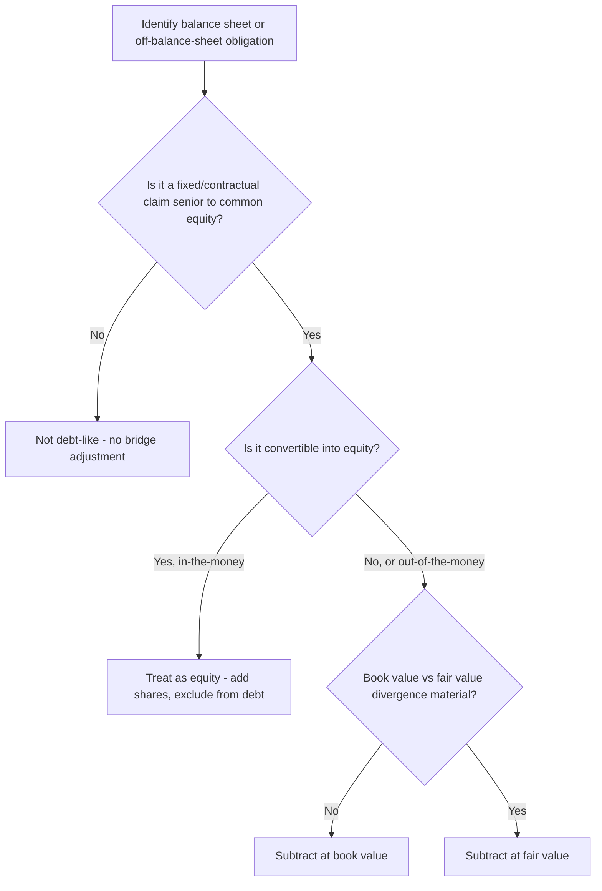

## Treatment of Debt and Debt-Like Items

### Conceptual Foundation

In the enterprise-to-equity bridge, every obligation that ranks senior to common equity — whether formally labeled "debt" or not — must be identified and subtracted from enterprise value before arriving at the value attributable to common shareholders. The label on a balance sheet line item matters far less than its economic substance: if a claim must be satisfied before common equity holders receive anything, it belongs in the debt-like adjustments, regardless of how it is classified under GAAP or IFRS.

**Key Points**

- The governing test: *does this obligation represent a fixed or contractual claim that ranks ahead of common equity in a liquidation or ordinary course of business?* If yes, subtract it.
- Traditional interest-bearing debt is the most obvious category, but modern balance sheets contain numerous "debt-like" items that require the same treatment: leases, pensions, contingent liabilities, and certain hybrid securities.
- Valuation should use **fair value**, not book value, whenever the two diverge materially — though book value is a widely used and often acceptable proxy absent evidence of significant divergence.

### Traditional Interest-Bearing Debt

**Key Points**

- Includes: revolving credit facilities, term loans, senior notes, subordinated notes, capital/finance lease obligations, and commercial paper.
- Should be valued at **current outstanding principal (book value)** in most standard practice, with a **fair value adjustment** applied when:
  - The debt is publicly traded and its market price has diverged meaningfully from par (e.g., due to credit rating changes or interest rate movements).
  - The debt carries a fixed coupon significantly above or below current market rates for similar credit risk, making its economic value diverge from face value.
- Off-balance-sheet or contingently issuable debt (e.g., undrawn revolver commitments) is not included in current net debt but may be relevant context for future capital structure/liquidity assessment.

**Example: Fair Value Adjustment**

A company has $400M face value of fixed-rate senior notes carrying a 5% coupon, with 6 years remaining to maturity. Current market yields for comparable credit risk have risen to 8%.

Approximate fair value using a simplified bond pricing approach:

$$FV = \sum_{t=1}^{6} \dfrac{20}{(1.08)^t} + \dfrac{400}{(1.08)^6}$$

$$FV \approx 92.4 + 252.1 = 344.5$$

The bonds' fair value (~$344.5M) is meaningfully below the $400M book value due to the rise in market yields. In a precise valuation (particularly in distressed or credit-sensitive contexts), the bridge would use $344.5M rather than $400M as the debt subtraction — reducing the debt subtraction and thereby *increasing* implied equity value relative to using book value, since the bondholders would receive less than par in economic terms. In standard corporate DCF practice, however, book value is commonly used unless the divergence is known to be material.

### Operating Leases (Post-ASC 842 / IFRS 16)

**Key Points**

- Under current U.S. GAAP (ASC 842) and IFRS 16, operating leases are capitalized on the balance sheet as a right-of-use asset and corresponding lease liability, making them appear more debt-like in financial statements than under prior standards.
- Whether operating lease liabilities should be treated as debt in the EV bridge depends on **consistency with how EV and EBITDA/EBIT are defined elsewhere in the analysis**:
  - If EBITDA is calculated *before* deducting lease expense (i.e., lease payments treated as a financing cost, added back like D&A), then lease liabilities should be treated as debt-like and subtracted in the bridge — this maintains consistency between the multiple's numerator and denominator.
  - If EBITDA already reflects lease expense as an operating cost (i.e., rent is deducted before EBITDA, consistent with the "old" pre-2019 accounting treatment), lease liabilities should generally **not** be double-subtracted as debt, since the operating cost is already captured in the cash flow projections.
- Comparability with peer companies and industry convention is often the deciding factor, since inconsistent treatment across comps distorts multiple-based analysis. [Inference: market convention on this point continues to vary by industry and by analyst preference, without a single universally adopted standard.]

### Pension and Other Post-Employment Benefit (OPEB) Obligations

**Key Points**

- An **underfunded** defined benefit pension plan (where the projected benefit obligation exceeds plan assets) represents a debt-like claim and should be subtracted at the net underfunded amount (net of any associated deferred tax asset, since pension contributions are often tax-deductible).
- An **overfunded** plan represents a non-operating asset (see prior section) and should be added back.
- OPEB liabilities (e.g., retiree healthcare obligations) follow the same logic as pensions — subtract the net present value of the unfunded obligation.

**Example**: A pension plan has a projected benefit obligation of $350M and plan assets of $280M, for a net underfunding of $70M. Assuming a 25% tax benefit on future funding contributions:

$$\text{Net Debt-Like Liability} = 70 \times (1 - 0.25) = \$52.5M$$

### Contingent Liabilities

**Key Points**

- **Litigation reserves and legal contingencies**: if probable and estimable (meeting the accounting threshold for recognition), the reserve should be treated as a debt-like subtraction. If merely reasonably possible (disclosed but not accrued), analysts may apply a probability-weighted estimate as a supplementary adjustment or address it qualitatively/through a range in the valuation.
- **Environmental remediation obligations**: treated similarly — accrued liabilities are debt-like; unaccrued but disclosed contingencies require judgment on probability-weighting.
- **Guarantees of third-party debt**: if a guarantee is likely to be called, its expected value should be treated as a debt-like obligation.
- **Earnout obligations from prior acquisitions**: contingent consideration payable based on future performance milestones should be valued (often via a probability-weighted or option-pricing approach) and included as a debt-like liability if not yet paid.

### Convertible Debt

**Key Points**

- Convertible debt requires a decision on **as-is (debt) versus as-converted (equity) treatment**, generally following the **if-converted method**:
  - If the conversion value (shares receivable × current share price) exceeds the value of holding the instrument as straight debt, treat it as **converted into equity** — remove it from the debt bridge line and include the resulting shares in the diluted share count instead.
  - If conversion value is lower (out-of-the-money), treat it as **debt** — include face/fair value in the debt subtraction and exclude the underlying shares from the diluted count.
- This determination should be made security-by-security, since a company may have multiple convertible tranches with different strike/conversion prices, some in-the-money and others not.

**Example**

A convertible note has a $100M face value, convertible into 4M shares (implying a $25 conversion price). Current share price is $28.

Conversion value: $4M \times 28 = \$112M$, which exceeds the $100M face value — the note is in-the-money and should be treated as converted: excluded from the debt subtraction, with 4M shares added to the diluted share count instead (net of any treasury stock method offset if applicable under the specific convertible's terms).

### Preferred Stock: Debt-Like vs. Equity-Like Treatment

While preferred stock is addressed distinctly in the standard bridge (as a senior claim to common equity), certain preferred structures are functionally closer to debt than equity:

**Key Points**

- **Mandatorily redeemable preferred** with a fixed redemption date and cumulative dividend behaves economically like debt and should be valued similarly (present value of dividends plus redemption amount, discounted at the instrument's required yield).
- **Perpetual, non-redeemable preferred** is more equity-like but still ranks senior to common equity and should be subtracted at fair or liquidation value.
- Participating or convertible preferred may require an as-converted analysis similar to convertible debt if conversion into common equity is economically favorable to the holder.

### Consolidated Adjustment Table

| Item | Treatment | Valuation Basis |
| --- | --- | --- |
| Term loans / senior notes | Subtract | Book value, or fair value if materially divergent |
| Capital/finance leases | Subtract | Present value of remaining payments |
| Operating lease liabilities | Subtract, if EBITDA excludes lease expense | Present value of remaining lease payments |
| Underfunded pension/OPEB | Subtract | Net underfunding, after-tax |
| Litigation reserves (accrued) | Subtract | Accrued/reserved amount |
| Contingent liabilities (unaccrued) | Subtract (probability-weighted) or disclose qualitatively | Expected value estimate |
| Convertible debt (out-of-the-money) | Subtract as debt | Face or fair value |
| Convertible debt (in-the-money) | Exclude from debt; add shares | As-converted share value |
| Mandatorily redeemable preferred | Subtract | PV of dividends + redemption value |

### Worked Example: Full Debt-Like Adjustment Schedule

| Item | Amount ($M) |
| --- | --- |
| Term Loan B | 350 |
| Senior Notes (book value; no material FV divergence) | 270 |
| Operating Lease Liabilities (EBITDA excludes lease expense; consistent treatment) | 85 |
| Underfunded Pension (net of tax) | 52.5 |
| Litigation Reserve (accrued) | 15 |
| Convertible Note (out-of-the-money; treated as debt) | 60 |
| **Total Debt-Like Obligations** | **832.5** |

This total replaces the simple "Total Debt" line in the standard bridge with a more complete, economically accurate figure.

### Decision Flow

### Common Pitfalls

- Treating operating lease liabilities inconsistently with how EBITDA is calculated, creating a mismatch between the multiple's numerator (EV, adjusted for leases) and denominator (EBITDA, not adjusted, or vice versa).
- Using book value for debt trading materially away from par without acknowledging the resulting distortion, particularly in distressed or high-yield credit situations.
- Failing to identify convertible instruments as in-the-money, leading to an inflated debt subtraction and an understated diluted share count simultaneously — a double error that compounds rather than offsets.
- Omitting contingent liabilities entirely because they are disclosed only in footnotes rather than accrued on the face of the balance sheet.
- Applying pension underfunding subtraction on a pre-tax basis without the tax-deductibility adjustment, overstating the debt-like burden.

### Next Steps

- **The Enterprise-to-Equity Value Bridge** (parent framework)
- **Treatment of Cash and Non-Operating Assets** (complementary bridge component)
- **Valuing Convertible Securities (As-Converted vs. As-Is)**
- **Operating Lease Capitalization: ASC 842 and IFRS 16 Impact on Valuation**
- **Pension Accounting and Its Impact on Enterprise Value**