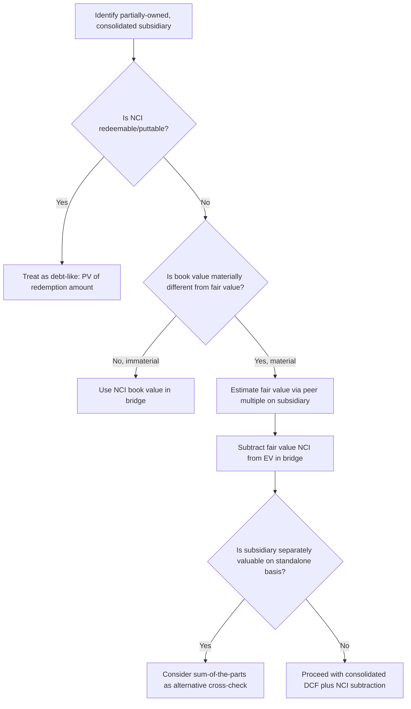

## Treatment of Minority and Noncontrolling Interest

### Conceptual Foundation

When a parent company owns a controlling interest (typically >50% voting control) in a subsidiary but not 100% of its equity, consolidation accounting rules (ASC 810 under U.S. GAAP, IFRS 10 under IFRS) require the parent to consolidate **100% of the subsidiary's assets, liabilities, revenues, expenses, and cash flows** into its financial statements — not merely its proportional ownership share. The portion of the subsidiary's equity value not owned by the parent is recorded as **minority interest** (also called **non-controlling interest, or NCI**).

This creates a direct and important consequence for DCF valuation: since the projected unlevered free cash flows are built from consolidated financials, they include 100% of the subsidiary's cash flows — including the portion economically attributable to minority shareholders. The resulting enterprise value therefore overstates the value belonging to the parent's common shareholders unless the minority's share is subtracted in the bridge to equity value.

**Key Points**

- $$\text{Equity Value (parent)} = EV - \text{Net Debt} - \text{Preferred Stock} - \text{Minority Interest} + \text{Non-Operating Assets}$$
- Minority interest is a **subtraction**, positioned analogously to debt or preferred stock — it represents a claim on enterprise value that does not belong to the parent's common shareholders.
- The core valuation challenge is that **minority interest is almost always carried on the balance sheet at book value**, which frequently understates its true fair value, especially for growing or high-multiple subsidiaries.

### Why Consolidation Creates This Issue

**Example**

A parent company owns 75% of a fast-growing subsidiary. The subsidiary generates $200M of EBITDA and $120M of unlevered FCF annually. Under consolidation accounting, 100% of that $200M EBITDA and $120M FCF flow into the parent's consolidated income statement and cash flow statement — not the 75% economically attributable to the parent.

If the DCF is built on these consolidated cash flows, the resulting enterprise value reflects value creation from the *entire* subsidiary, including the 25% owned by minority shareholders. Without a bridge adjustment, the parent's equity value would be overstated by the value of that 25% stake.

### Valuing Minority Interest: Book Value vs. Fair Value

**Key Points**

- **Book value approach**: use the "Noncontrolling interest" line item directly from the consolidated balance sheet. This is the simplest approach but is frequently a poor proxy for economic value, since NCI book value reflects historical cost accounting (original acquisition-date fair value plus/minus subsequent income allocations and dividends) rather than current market value.
- **Fair value approach (preferred for precision)**: estimate the subsidiary's standalone enterprise value (e.g., by applying a peer trading multiple to the subsidiary's EBITDA), back into its implied equity value, and multiply by the minority ownership percentage.

**Example: Fair Value Approach**

Using the subsidiary above ($200M EBITDA, 25% minority-owned):

Step 1 — Estimate subsidiary standalone EV using a peer multiple (e.g., 9.0x EV/EBITDA for comparable companies in the subsidiary's industry):

$$EV_{sub} = 200 \times 9.0 = 1{,}800$$

Step 2 — Estimate subsidiary net debt (assume $300M):

$$\text{Equity Value}_{sub} = 1{,}800 - 300 = 1{,}500$$

Step 3 — Minority interest fair value (25% ownership by non-controlling shareholders):

$$1{,}500 \times 25\% = \$375M$$

This $375M fair value estimate is compared against the subsidiary's NCI book value (commonly much lower, since book value reflects historical carrying amounts rather than the subsidiary's current growth-adjusted multiple). If book value understates fair value substantially, using book value in the bridge would overstate the parent's equity value.

### When the Discrepancy Is Material

**Key Points**

- The book-vs-fair-value gap is most pronounced when:
  - The subsidiary has grown substantially since the NCI was established (e.g., via a historical joint venture or partial acquisition).
  - The subsidiary operates in a sector experiencing multiple expansion since acquisition.
  - The NCI originated from a "day-one" fair value allocation that has not been remeasured (NCI is generally not marked to market subsequent to initial recognition under either GAAP or IFRS, aside from allocated income/loss and dividends).
- In such cases, a sensitivity analysis showing equity value under both book value and fair value NCI treatment is a useful disclosure practice, since the appropriate figure genuinely depends on judgment about the subsidiary's current standalone value.

### Alternative Approach: Sum-of-the-Parts with Explicit Minority Carve-Out

For companies with a material partially-owned subsidiary, a cleaner and often more defensible approach avoids blending 100% consolidated cash flows into a single DCF altogether:

**Key Points**

- Value the parent's wholly-owned operations and the partially-owned subsidiary **separately** as distinct DCFs (or DCF plus multiple-based valuation for the subsidiary).
- Apply the parent's **actual ownership percentage** directly to the subsidiary's standalone equity value, rather than consolidating 100% and then subtracting minority interest.
- Sum the two pieces to arrive at total parent equity value.

**Example**

- Parent's wholly-owned segment DCF equity value: $1,800M
- Subsidiary standalone equity value (per fair value analysis above): $1,500M
- Parent's ownership: 75%

  $$\text{Parent's share of subsidiary} = 1{,}500 \times 75\% = 1{,}125M$$

  $$\text{Total Parent Equity Value} = 1{,}800 + 1{,}125 = 2{,}925M$$

This sum-of-the-parts method produces the same conceptual answer as the consolidated-DCF-plus-NCI-subtraction method, but makes the minority interest treatment more transparent and avoids relying on the possibly stale NCI book value figure — provided the subsidiary can be reasonably valued on a standalone basis (e.g., if it is separately publicly traded, has distinct comparable companies, or reports separate segment financials).

### Minority Interest in Multiples-Based Cross-Checks

When using the DCF's implied enterprise value to cross-check against trading comparables (EV/EBITDA), consistency requires that the EBITDA used in the multiple be on the same consolidation basis as the EV. If EBITDA is consolidated at 100% (including the minority-owned subsidiary in full), the EV used in the multiple calculation must also reflect the full consolidated EV — the presence of minority interest does not distort the EV/EBITDA multiple itself, since both figures are consolidated at 100%. The distortion only arises specifically in the **bridge from EV to equity value**, not in enterprise-level multiples.

### Noncontrolling Interest in Redeemable/Puttable Form

**Key Points**

- Some minority interests carry **put rights** (the minority holder can require the parent to purchase their stake, often at a formula-based or fair-value price) or are otherwise **mandatorily redeemable**.
- Redeemable NCI is sometimes classified in the "mezzanine" section of the balance sheet (between liabilities and equity) rather than within permanent equity, reflecting its more debt-like character.
- These should generally be valued and treated similarly to a debt-like obligation (present value of the expected redemption amount) rather than a pure equity-like minority stake, given the contractual obligation to eventually settle in cash.

### Worked Example: Full Bridge Impact Comparison

Using the parent from the earlier bridge example (EV = $3,150M, Net Debt = $440M, Preferred = $75M):

| Scenario | Minority Interest Value | Resulting Equity Value |
| --- | --- | --- |
| Using NCI book value ($60M, understated) | 60 | 2,575 |
| Using NCI fair value ($110M, multiple-based) | 110 | 2,525 |

The $50M difference between book and fair value NCI treatment flows directly into equity value and per-share price — on a 100M diluted share base, this represents a $0.50 per share difference, which can be material depending on the stock's trading range.

### Decision Flow

### Visual: Consolidation and Minority Interest Flow

<svg xmlns="http://www.w3.org/2000/svg" viewBox="0 0 700 320" font-family="Arial, sans-serif">
<text x="350" y="25" font-size="16" font-weight="bold" text-anchor="middle">Consolidated Cash Flows and Minority Interest Carve-Out (svg_diagram)</text>
<rect x="50" y="60" width="600" height="80" rx="8" fill="#e8f0fe" stroke="#4a6fa5" stroke-width="1.5" />
<text x="350" y="90" font-size="13" font-weight="bold" text-anchor="middle">Consolidated Subsidiary Cash Flows (100%)</text>
<text x="350" y="112" font-size="11" text-anchor="middle">Fully included in Parent's DCF projections and Enterprise Value</text>
<line x1="200" y1="140" x2="150" y2="190" stroke="#333" stroke-width="1.5" marker-end="url(#arrow2)" />
<line x1="500" y1="140" x2="550" y2="190" stroke="#333" stroke-width="1.5" marker-end="url(#arrow2)" />
<rect x="50" y="195" width="250" height="80" rx="8" fill="#eef7ea" stroke="#5a8a4a" stroke-width="1.5" />
<text x="175" y="222" font-size="12" font-weight="bold" text-anchor="middle">Parent's Share (75%)</text>
<text x="175" y="242" font-size="11" text-anchor="middle">Belongs to common</text>
<text x="175" y="258" font-size="11" text-anchor="middle">equity holders</text>
<rect x="400" y="195" width="250" height="80" rx="8" fill="#fdece8" stroke="#a5624a" stroke-width="1.5" />
<text x="525" y="222" font-size="12" font-weight="bold" text-anchor="middle">Minority Share (25%)</text>
<text x="525" y="242" font-size="11" text-anchor="middle">Subtracted in bridge -</text>
<text x="525" y="258" font-size="11" text-anchor="middle">does not belong to parent</text>
</svg>

### Common Pitfalls

- Forgetting to subtract minority interest entirely when a subsidiary is consolidated — one of the most common and consequential bridge errors, since it can overstate equity value significantly for companies with large partially-owned subsidiaries.
- Using **stale book value** for NCI without checking whether the subsidiary has grown or re-rated substantially since the NCI was established, especially for subsidiaries acquired or partially spun off many years prior.
- Applying the parent's own trading multiple to value the minority-owned subsidiary rather than using multiples from the subsidiary's own peer set, which can be in an entirely different industry.
- Double-counting by both consolidating 100% of the subsidiary in the DCF *and* separately adding the parent's proportional share via a sum-of-the-parts approach without removing the subsidiary from the consolidated forecast.
- Treating redeemable/puttable NCI as ordinary equity-like minority interest rather than recognizing its debt-like redemption obligation.

### Next Steps

- **The Enterprise-to-Equity Value Bridge** (parent framework)
- **Treatment of Debt and Debt-Like Items** (complementary bridge component)
- **Sum-of-the-Parts Valuation Methodology**
- **Valuing Non-Consolidated Equity Method Investments**
- **Consolidation Accounting Basics for Valuation Professionals**