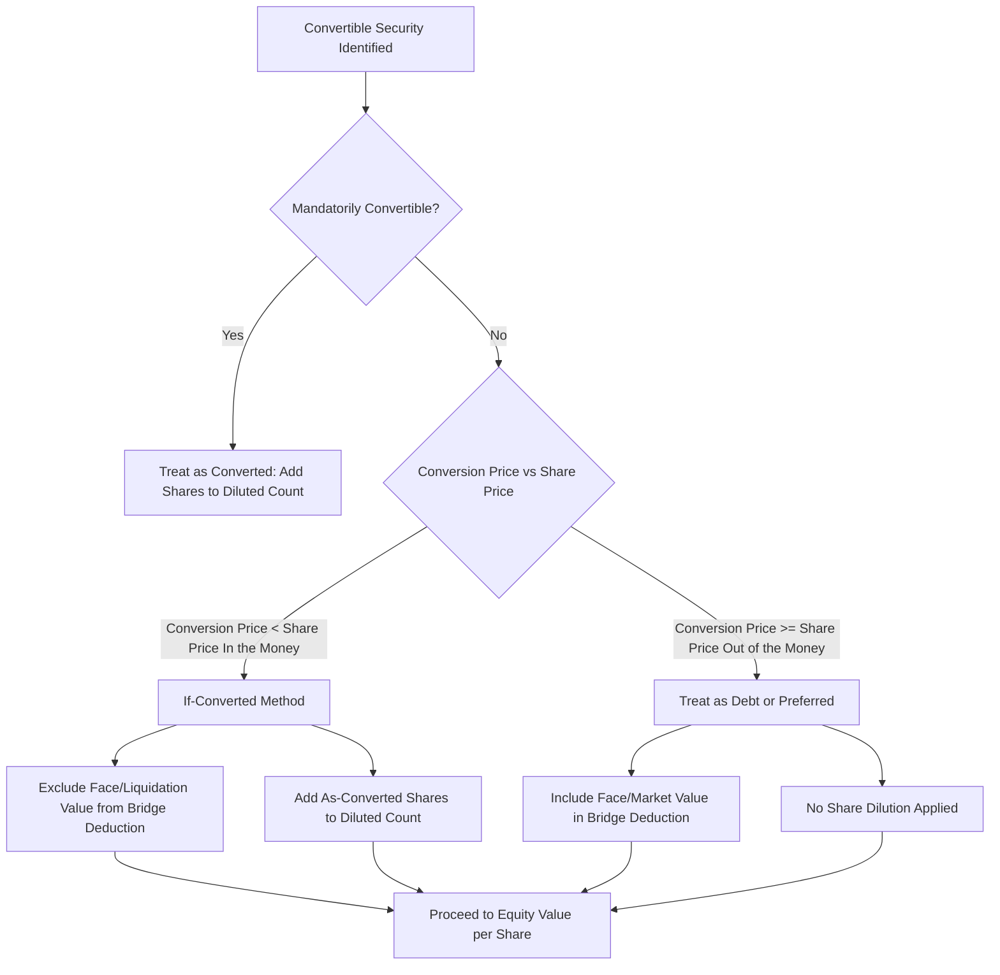

## Treatment of Preferred Stock and Convertible Securities

### Overview

The bridge from Enterprise Value (EV) to Equity Value requires subtracting all non-common-equity claims on the firm from EV. Preferred stock and convertible securities are two of the most analytically challenging bridge items because their treatment depends on their economic characteristics rather than their legal labels. Misclassifying these instruments is one of the most common sources of error in DCF-derived equity valuations.

The general bridge identity is:

$$\text{Equity Value} = \text{Enterprise Value} - \text{Net Debt} - \text{Preferred Stock} - \text{Minority Interest} + \text{Non-Operating Assets}$$

Preferred stock and convertibles complicate this formula because they sit economically between debt and common equity, and convertibles in particular may need to be reclassified entirely depending on moneyness.

---

### Preferred Stock: Classification Framework

Preferred stock is a hybrid security with debt-like and equity-like features. Its treatment in the EV-to-equity bridge depends on classifying it along several dimensions.

#### Key Characteristics to Assess

- **Redeemability**: Is the preferred mandatorily redeemable (debt-like) or perpetual (more equity-like)?
- **Dividend nature**: Cumulative vs. non-cumulative; fixed vs. participating
- **Convertibility**: Convertible into common shares or not
- **Voting rights**: Typically limited, but relevant for control considerations
- **Seniority**: Ranks above common equity but below debt in liquidation

#### Standard Treatment Rule

**Key Points**

- **Straight (non-convertible) preferred stock** is treated as a debt-like claim and **subtracted** from Enterprise Value in the bridge to equity value, at its **fair (market) value**, not book/par value, whenever a market price or reliable estimate is available.
- If preferred stock is **redeemable** or has debt-like covenants, it is functionally similar to debt and should be included in the Net Debt calculation or as a separate line item subtracted at the same step as debt.
- If preferred stock is **perpetual and non-redeemable**, it is still subtracted from EV (since it is not common equity), but it is valued as a **perpetuity** of its dividend stream:

$$V_{preferred} = \frac{D_{pref}}{r_{pref}}$$

where $D_{pref}$ is the annual preferred dividend and $r_{pref}$ is the required yield on comparable preferred securities (a proxy discount rate, distinct from cost of equity or cost of debt).

#### Practical Valuation of Preferred Stock

- **Publicly traded preferred**: use market price × shares outstanding
- **Privately held/non-traded preferred**:
  - Discount the stated dividend stream at a market-derived yield for similar-risk preferred securities
  - If cumulative and dividends are in arrears, add the present value of the arrears to the valuation
- Book value should only be used as a last-resort proxy and flagged as a simplification, since coupon-vs-market yield divergence can create material valuation gaps [Inference: the magnitude of this gap is company- and market-specific and cannot be generalized].

---

### Convertible Securities: The Core Analytical Problem

Convertible securities (convertible preferred stock, convertible bonds/notes) grant the holder the option to convert into a fixed number of common shares. Their treatment hinges on **moneyness** — whether conversion is economically rational at the valuation date.

#### The "If-Converted" Method

**Key Points**

- **Step 1**: Determine the **conversion price** (or conversion ratio) — the effective share price at which the security converts.
- **Step 2**: Compare the conversion price to the **current (or intrinsic/DCF-derived) share price**.
- **Step 3**: Apply one of two treatments:

| Condition | Treatment |
| --- | --- |
| Conversion price < current/intrinsic share price ("in-the-money") | Treat as **already converted**: add the as-converted shares to diluted share count; **exclude** the security's face/liquidation value from the debt/preferred bridge deduction |
| Conversion price ≥ current/intrinsic share price ("out-of-the-money") | Treat as **debt or preferred** (per its stated form): **include** face/liquidation value in the bridge deduction; **do not** add shares to the diluted count |

This is conceptually identical to the treasury stock method used for options and warrants, but applied to the full principal/liquidation value rather than just the strike proceeds.

#### Convertible Bonds Specifically

For a convertible bond:

$$\text{Conversion Price} = \frac{\text{Bond Face Value}}{\text{Conversion Ratio (shares per bond)}}$$

- **If in-the-money**:
  - Remove the bond's face value from total debt (it will not be repaid in cash; it converts to equity)
  - Add the as-converted shares to the diluted share count used to compute equity value per share
  - Some practitioners also remove the after-tax interest expense associated with that tranche from the FCF projection (relevant primarily for per-share EPS/diluted computations rather than the DCF cash flows themselves, since DCF is typically capital-structure-neutral at the unlevered FCF stage)
- **If out-of-the-money**:
  - Keep the bond in total debt at face value (or market value if available)
  - No share dilution is applied

#### Convertible Preferred Stock Specifically

- **If in-the-money**: exclude from the preferred stock deduction; add as-converted shares to diluted count
- **If out-of-the-money**: treat as straight preferred stock per the perpetuity/market-value method above, and subtract from EV as a preferred claim

#### Circularity Consideration

**Key Points**

- Moneyness depends on the **share price**, but in a DCF, the share price is the **output** you are solving for (Equity Value ÷ diluted shares).
- This creates a **circular reference**: you need share price to determine dilution, but you need dilution (share count) to compute share price.
- **Resolution approaches**:
  1. **Iterative solving**: start with an assumed share price (e.g., current market price), apply if-converted logic, compute implied equity value per share, and iterate until convergence.
  2. **Use current market price** as the moneyness test even when computing an intrinsic DCF value, on the argument that conversion decisions are made by holders based on observable market prices, not the analyst's private DCF estimate [Inference: this is a common simplification convention, not a universal rule — treatment varies by practitioner and by whether the goal is intrinsic valuation or transaction pricing].
  3. In spreadsheet models, this is typically handled with a circular reference switch (iterative calculation enabled) or a manual goal-seek.

---

### Worked Example

**Example**

Assume:

- Enterprise Value (from DCF) = $2,000 million
- Net Debt = $400 million
- Straight perpetual preferred stock: $50 million par, 6% dividend, market yield for comparable preferred = 8%
- Convertible bond: $100 million face value, conversion ratio = 20 shares per $1,000 bond (i.e., conversion price = $50/share)
- Basic diluted shares outstanding (excluding convertible) = 90 million
- Current/assumed share price for moneyness test = $60

**Step 1 — Value the straight preferred:**

$$V_{preferred} = \frac{0.06 \times 50}{0.08} = \frac{3}{0.08} = \$37.5 \text{ million}$$

(Note: this is below par because the market yield exceeds the coupon rate — the preferred is valued at a discount to par.)

**Step 2 — Test convertible bond moneyness:**

Conversion price ($50) < current share price ($60) → **in-the-money** → treat as converted.

- As-converted shares = ($100 million / $1,000) × 20 shares = 2,000,000 shares = 2 million shares
- Exclude the $100 million bond face value from the debt deduction
- Add 2 million shares to the diluted share count

**Step 3 — Build the bridge:**

$$\text{Equity Value} = 2{,}000 - 400 - 37.5 = \$1{,}562.5 \text{ million}$$

(The convertible bond's $100 million is excluded from Net Debt because it converts rather than being repaid.)

**Step 4 — Diluted share count:**

$$90 + 2 = 92 \text{ million shares}$$

**Step 5 — Equity value per share:**

$$\frac{1{,}562.5}{92} = \$16.98 \text{ per share}$$

**Step 6 — Circularity check:** the computed $16.98 is far below the $60 assumed for the moneyness test, which is expected — the $60 was the *current market price* used as the moneyness trigger, not the DCF output; the DCF intrinsic value and market price need not match, and moneyness should generally still be tested against the security holder's actual decision-relevant price (typically market price) rather than re-iterated against the DCF output unless the analyst has deliberately chosen the iterative-circular convention.

---

### Contingent and Participating Features

**Key Points**

- **Participating preferred**: entitled to preferred dividends *and* a share of common dividends/proceeds (common in venture capital and private equity structures). Requires modeling both the preferred claim and the participation right — often via a **liquidation waterfall** rather than a simple perpetuity.
- **Mandatorily convertible securities**: convert automatically at a future date or trigger event regardless of price; treat these as **already converted** for share-count purposes in a long-run DCF, since conversion is not optional.
- **PIK (payment-in-kind) preferred**: dividends accrue as additional preferred shares/principal rather than cash; the outstanding balance grows over the projection period and must be modeled as a compounding liability before applying the bridge deduction.

---

### Diagram: Decision Flow for Convertible Treatment

---

### Common Pitfalls

**Key Points**

- Subtracting preferred stock at **book/par value** instead of fair value when a market price or reasonable yield-based estimate exists
- Double-counting: subtracting a convertible's face value from debt **and** adding its as-converted shares (only one treatment applies, never both)
- Ignoring the **circularity** between share price and moneyness, leading to inconsistent iteration
- Failing to model **PIK accrual** or **cumulative dividend arrears**, understating the true preferred claim
- Treating all preferred stock as equity (ignoring its senior, debt-like claim) or as pure debt (ignoring perpetual, non-redeemable features) without examining the actual instrument terms

---

**Related Topics**

- Treasury Stock Method for Options and Warrants (Diluted Share Count)
- Net Debt Calculation and Debt-Like Item Adjustments
- Minority Interest (Non-Controlling Interest) Treatment in the EV Bridge
- Liquidation Preference Waterfalls in Venture-Backed Companies
- Weighted Average Cost of Capital (WACC) — Cost of Preferred Stock Component
- Diluted EPS and Fully Diluted Share Count Mechanics
- Circular Reference Resolution Techniques in Financial Modeling