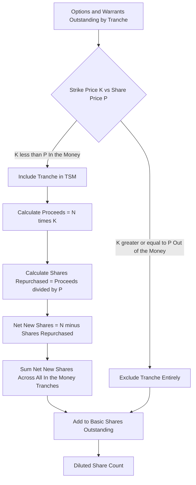

## Diluted Share Count and the Treasury Stock Method

### Overview

The final step in converting Equity Value into a per-share valuation requires dividing by the correct **diluted share count**, not the basic (currently outstanding) share count. Using basic shares systematically overstates value per share whenever a company has outstanding options, warrants, or other dilutive securities that are economically "in-the-money." The **Treasury Stock Method (TSM)** is the standard convention for converting basic shares into diluted shares for options and warrants.

$$\text{Equity Value per Share} = \frac{\text{Equity Value}}{\text{Diluted Shares Outstanding}}$$

Getting the denominator wrong is one of the most common and easily avoidable errors in equity valuation.

---

### Why Basic Shares Are Insufficient

- **Basic shares outstanding**: the number of common shares currently issued and held by shareholders, as reported on the balance sheet/10-K cover page.
- Basic shares **ignore** the dilutive effect of instruments that could become common shares: employee stock options (ESOs), warrants, convertible securities, and restricted stock units (RSUs).
- If any of these instruments are "in-the-money" (economically rational to exercise/convert), ignoring them **understates** the effective share count and **overstates** per-share value.

---

### The Treasury Stock Method (TSM): Core Mechanics

**Key Points**

- TSM assumes that **all in-the-money options and warrants are exercised**, and the **cash proceeds received by the company** from that exercise are used to **repurchase shares at the current market price**.
- The **net new shares added** to the share count is the difference between shares issued upon exercise and shares hypothetically repurchased with the proceeds.

#### Formula

$$\text{Net New Shares} = N - \frac{N \times K}{P}$$

Where:

- $N$ = number of options/warrants outstanding (in-the-money only)
- $K$ = weighted-average exercise (strike) price
- $P$ = current market price of the common share

This simplifies to:

$$\text{Net New Shares} = N \times \left(1 - \frac{K}{P}\right)$$

#### Step-by-Step Process

1. **Identify in-the-money instruments**: only options/warrants with $K < P$ are included. Out-of-the-money instruments are excluded entirely (they would not be rationally exercised).
2. **Calculate gross proceeds**: $\text{Proceeds} = N \times K$
3. **Calculate shares repurchased**: $\text{Shares Repurchased} = \frac{\text{Proceeds}}{P}$
4. **Calculate net dilutive shares**: $\text{Net New Shares} = N - \text{Shares Repurchased}$
5. **Add to basic share count**: $\text{Diluted Shares} = \text{Basic Shares} + \text{Net New Shares (summed across all tranches)}$

---

### Worked Example

**Example**

Assume:

- Basic shares outstanding = 100 million
- Current share price ($P$) = $40
- Options outstanding: 10 million, weighted-average strike ($K$) = $25
- Warrants outstanding: 5 million, weighted-average strike ($K$) = $50

**Step 1 — Test moneyness:**

- Options: $25 < $40 → in-the-money → include
- Warrants: $50 > $40 → out-of-the-money → exclude entirely

**Step 2 — Apply TSM to the options tranche:**

$$\text{Proceeds} = 10 \text{ million} \times \$25 = \$250 \text{ million}$$

$$\text{Shares Repurchased} = \frac{\$250 \text{ million}}{\$40} = 6.25 \text{ million}$$

$$\text{Net New Shares} = 10 - 6.25 = 3.75 \text{ million}$$

**Step 3 — Compute diluted share count:**

$$\text{Diluted Shares} = 100 + 3.75 = 103.75 \text{ million}$$

The warrants contribute **zero** additional shares because they are out-of-the-money and excluded under TSM.

---

### Tranche-by-Tranche Application

**Key Points**

- Companies typically disclose options/warrants in **multiple tranches** with different strike prices (e.g., in 10-K stock compensation footnotes).
- TSM should be applied **separately to each tranche**, since only tranches with $K < P$ are dilutive, and the degree of dilution differs by tranche.
- Simply using a single "weighted-average strike price" across all tranches can be a reasonable approximation but may misstate dilution if strikes are widely dispersed relative to the current price — some tranches may be in-the-money while a blended average appears out-of-the-money, or vice versa [Inference: the magnitude of this distortion depends on the dispersion of strikes in the specific instrument portfolio and cannot be generalized].
- Best practice: build a tranche schedule (strike price, number of options, expiration) and apply TSM line-by-line, then sum net new shares.

---

### Treatment of Restricted Stock Units (RSUs) and Restricted Stock Awards (RSAs)

- RSUs typically have **no exercise price** (or a nominal one), so the TSM "repurchase" mechanic is not economically meaningful in the same way.
- Standard convention: add the **full number of unvested/outstanding RSUs** expected to vest directly to the diluted share count (no proceeds offset), since there is no cash inflow to the company upon vesting.
- Some models apply a **forfeiture-adjusted** RSU count (net of expected forfeitures) rather than the gross granted amount — treatment varies by the level of precision the analyst requires [Inference: whether to apply a forfeiture haircut is a modeling choice rather than a universal standard].

---

### Interaction with Convertible Securities

- **Options and warrants** → diluted via the **Treasury Stock Method** (this topic)
- **Convertible bonds and convertible preferred stock** → diluted via the **If-Converted Method** (moneyness test on conversion price vs. share price; see prior chapter item on preferred stock and convertibles)
- These two methods are **applied independently and then summed** — they are not interchangeable, because convertibles do not generate cash proceeds to the company upon conversion (unlike option exercise), so the treasury-stock buyback mechanic does not apply to them.

$$\text{Total Diluted Shares} = \text{Basic Shares} + \text{TSM Net New Shares (options/warrants)} + \text{As-Converted Shares (convertibles)} + \text{RSUs Expected to Vest}$$

---

### The Circularity Problem

**Key Points**

- TSM requires the **current share price** ($P$) as an input, but in an intrinsic DCF valuation, the analyst is trying to **solve for** the per-share value.
- This creates the same type of circular reference discussed for convertible securities: share price determines dilution, and dilution affects the share count used to compute share price.
- **Standard resolutions**:
  1. Use the **current market share price** as $P$ for the TSM moneyness test and repurchase calculation, even when the ultimate output is an intrinsic DCF value — the rationale being that option holders make exercise decisions based on the observable market price, not the analyst's private estimate.
  2. **Iterative/circular calculation**: assume an initial $P$, compute diluted shares, derive implied equity value per share, and re-run TSM using the new implied price until the value converges. This requires enabling iterative calculation in the spreadsheet model or using a solver/goal-seek function.
  3. For **private companies or transactions without an observable market price**, the analyst must use the DCF-implied price and iterate to convergence, since no external market reference is available.

---

### Diagram: Treasury Stock Method Decision Flow

---

### Common Pitfalls

**Key Points**

- Including **out-of-the-money** options/warrants in the dilution calculation (they should be excluded entirely, not included at a reduced weight)
- Applying a single blended weighted-average strike price across widely dispersed tranches, masking tranches that are actually in- or out-of-the-money
- Confusing the **Treasury Stock Method** (for options/warrants) with the **If-Converted Method** (for convertible securities) — they are not interchangeable
- Adding RSUs using the TSM proceeds-offset mechanic when there is no exercise price to generate proceeds
- Ignoring the circularity between share price and diluted share count, leading to an internally inconsistent valuation where the price used for dilution doesn't match the price implied by the final output
- Using a stale share count (e.g., from an outdated 10-K) instead of the most recent disclosed basic shares plus current option/warrant tranche data

---

**Related Topics**

- If-Converted Method for Convertible Bonds and Convertible Preferred Stock
- Fully Diluted Equity Value and Per-Share Valuation Mechanics
- Employee Stock Option (ESO) Valuation and Black-Scholes Adjustments
- Circular Reference Resolution Techniques in Financial Modeling
- Diluted EPS under U.S. GAAP (ASC 260) vs. IFRS (IAS 33)
- Treatment of Preferred Stock and Convertible Securities
- Share Count Adjustments in Merger and Acquisition Pro Forma Models