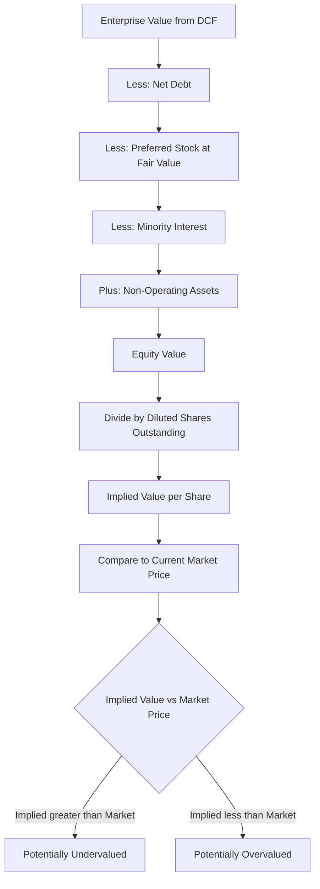

## Deriving Implied Value Per Share

### Overview

Deriving the implied value per share is the final synthesis step of a DCF analysis, converting the abstract output of a valuation model (Enterprise Value or Equity Value) into an actionable, comparable metric: a **price per share**. This figure is what gets directly compared to the current trading price to assess whether a stock is over- or undervalued. Every upstream assumption — WACC, terminal value, net debt, preferred stock treatment, dilution — compounds into this single number, making it the point where modeling errors are most visible and most consequential.

$$\text{Implied Value per Share} = \frac{\text{Equity Value}}{\text{Diluted Shares Outstanding}}$$

---

### The Full Waterfall: From Enterprise Value to Per-Share Value

**Key Points**

The complete derivation chain, in sequence:

1. **Enterprise Value (EV)** — the sum of PV of explicit-period unlevered free cash flows and PV of terminal value, discounted at WACC
2. **Less: Net Debt** — total debt (and debt-like items) minus cash and cash equivalents (and marketable securities)
3. **Less: Preferred Stock** — at fair value, per the classification framework (redeemable/perpetual, convertible/non-convertible)
4. **Less: Minority Interest (Non-Controlling Interest)** — the portion of consolidated subsidiary value attributable to outside shareholders
5. **Plus: Non-Operating Assets** — investments in unconsolidated affiliates, excess real estate, or other assets not captured in projected operating cash flows
6. **= Equity Value**
7. **Divide by: Diluted Shares Outstanding** — basic shares plus TSM-derived option/warrant dilution plus as-converted convertible securities plus RSUs
8. **= Implied Value per Share**

$$\text{Equity Value} = EV - \text{Net Debt} - \text{Preferred Stock} - \text{Minority Interest} + \text{Non-Operating Assets}$$

$$\text{Implied Value per Share} = \frac{\text{Equity Value}}{\text{Diluted Shares}}$$

---

### Worked Example: Full Waterfall

**Example**

Assume the following DCF outputs and balance sheet items:

| Line Item | Value ($ millions) |
| --- | --- |
| Enterprise Value (DCF output) | 5,000 |
| Total Debt | 1,200 |
| Cash & Equivalents | 300 |
| Preferred Stock (fair value) | 100 |
| Minority Interest | 150 |
| Non-Operating Assets (equity investments) | 80 |
| Basic Shares Outstanding | 200 million |
| Net New Shares from TSM (options) | 5 million |
| As-Converted Shares (convertible bond) | 10 million |

**Step 1 — Net Debt:**

$$\text{Net Debt} = 1{,}200 - 300 = \$900 \text{ million}$$

**Step 2 — Equity Value:**

$$\text{Equity Value} = 5{,}000 - 900 - 100 - 150 + 80 = \$3{,}930 \text{ million}$$

**Step 3 — Diluted Shares:**

$$\text{Diluted Shares} = 200 + 5 + 10 = 215 \text{ million}$$

**Step 4 — Implied Value per Share:**

$$\frac{3{,}930}{215} = \$18.28 \text{ per share}$$

This $18.28 is the figure compared against the current market trading price to form an investment view (undervalued if market price < $18.28; overvalued if market price > $18.28, holding model assumptions as given).

---

### Sensitivity of the Per-Share Output

**Key Points**

Because per-share value is the product of a long assumption chain, it is highly sensitive to changes in upstream drivers. The most common sensitivity axes examined:

- **WACC**: small changes in discount rate materially move both the PV of explicit FCFs and, especially, the PV of terminal value
- **Terminal growth rate** (if using Gordon Growth for terminal value) or **exit multiple** (if using the multiples method)
- **Net debt / cash assumptions**, particularly for companies with large or volatile cash balances
- **Share count**, particularly when a company has significant option overhang, actively issues convertible debt, or has a high stock-based compensation run rate that dilutes shares over time

Standard practice is to present a **sensitivity table** (data table) of implied value per share across a grid of WACC and terminal growth rate (or exit multiple) combinations, rather than a single point estimate, since terminal value assumptions are inherently uncertain [Inference: the appropriate sensitivity range depends on the specific company's risk profile and cannot be generalized].

---

### Football Field / Valuation Range Presentation

**Key Points**

- A single DCF produces one implied value per share, but professional practice rarely relies on a single point estimate.
- The **"football field" chart** overlays the DCF-implied range against other valuation methodologies:
  - Comparable company trading multiples (e.g., EV/EBITDA-implied share price range)
  - Precedent transaction multiples
  - 52-week trading range
  - Analyst price targets
- The DCF range itself is typically presented as a **band**, not a point, generated by flexing WACC and terminal growth/exit multiple assumptions across a reasonable range (e.g., WACC ± 100bps, terminal growth ± 50bps).
- This triangulation approach mitigates the risk of over-relying on any single method's point estimate, given how sensitive DCF outputs are to terminal value assumptions.

---

### Per-Share Value vs. Market Price: Interpretation Caveats

**Key Points**

- A computed implied value per share is a **model output conditional on its assumptions**, not a guaranteed prediction of future trading price; market prices reflect additional factors (liquidity, sentiment, technical trading flows, information asymmetries) that a fundamental DCF does not capture.
- Divergence between implied value and market price may indicate:
  - Genuine mispricing (the basis for a valuation-driven investment thesis), **or**
  - The model's assumptions differ from the market's implicit assumptions (e.g., the market is pricing in a different growth trajectory, risk premium, or terminal outcome)
- Best practice is to **reverse-engineer the market price**: back out the WACC, growth rate, or margin assumptions that would be required to justify the current market price, and assess whether those implied assumptions are reasonable. This reframes the DCF as a diagnostic tool rather than a black-box "correct answer."

---

### Treasury Stock Method / Convertible Circularity Recap in This Context

- Since diluted shares depend on share price (via TSM and if-converted moneyness tests), and the implied value per share is itself the output being solved for, models frequently use **iterative calculation** or a **circularity switch** to converge share price and dilution simultaneously.
- A simpler, widely used convention: use the **current market price** for moneyness/dilution tests, and treat the DCF's implied value per share as a separate, independent output for comparison purposes — avoiding the need to iterate the dilution calculation against the DCF's own result.

---

### Diagram: Enterprise Value to Implied Share Price Waterfall

---

### Common Pitfalls

**Key Points**

- Dividing by **basic** shares instead of **diluted** shares, systematically overstating per-share value
- Presenting a single point estimate without a sensitivity range, implying false precision in a figure that is highly sensitive to WACC and terminal value assumptions
- Failing to subtract **all** relevant bridge items (preferred stock, minority interest) — a common omission is minority interest when valuing a parent with partially-owned consolidated subsidiaries
- Treating the DCF-implied value as an objectively "correct" price rather than a conditional output of the model's specific assumptions
- Inconsistent treatment of the valuation date — mixing a mid-year DCF valuation date with an end-of-period balance sheet snapshot for net debt without reconciling the timing

---

**Related Topics**

- Sensitivity Analysis and Data Tables in DCF Models
- Football Field Charts and Valuation Triangulation
- Treatment of Preferred Stock and Convertible Securities
- Diluted Share Count and the Treasury Stock Method
- Terminal Value: Gordon Growth Method vs. Exit Multiple Method
- Reverse DCF and Market-Implied Assumption Analysis
- Minority Interest (Non-Controlling Interest) in Consolidated Valuations