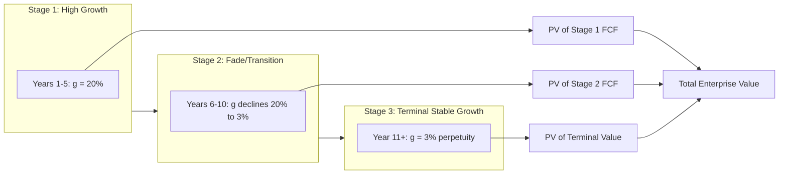

## Multi-Stage Growth Models

### Overview

Multi-stage growth models extend the standard two-stage DCF (explicit forecast period + single terminal value) into three or more distinct growth phases, each reflecting a different stage of a company's competitive lifecycle. They are used when a company's growth trajectory cannot be reasonably captured by a single explicit-period growth rate followed immediately by a stable long-run terminal growth rate — particularly for high-growth companies, cyclical businesses, or firms in industries with long, structurally-driven fade periods (e.g., pharmaceuticals with patent cliffs, resource extraction with depleting reserves).

The core insight: assuming a company jumps directly from high growth (e.g., 25% per year) to terminal growth (e.g., 2-3% per year) in a single step is often unrealistic. Multi-stage models insert one or more **transition/fade periods** to model a more gradual, economically plausible convergence.

---

### Why Two-Stage Models Can Be Insufficient

**Key Points**

- A standard two-stage DCF assumes: (1) an explicit forecast period (typically 5-10 years) with company-specific growth assumptions, followed immediately by (2) a terminal value assuming perpetual stable growth.
- This creates an implicit **growth discontinuity** at the boundary — a company growing at 20% in year 10 suddenly growing at 3% in year 11 — which does not reflect how real businesses typically decelerate (competitive forces, market saturation, and reinvestment needs erode excess returns gradually, not instantaneously).
- The shorter the explicit forecast period relative to the company's actual runway of above-average growth, the more terminal value dominates total valuation, and the more the growth discontinuity problem distorts the result.
- Industries with genuinely long growth/decline cycles (e.g., biotech before patent expiry, mining before reserve depletion, subscription businesses before market saturation) are particularly poorly served by an abrupt two-stage structure.

---

### Standard Multi-Stage Structures

#### Three-Stage Model

The most common extension, dividing the forecast into:

1. **Stage 1 — High Growth**: explicit, company-specific growth rate (e.g., years 1-5), typically derived from bottom-up operational drivers (unit growth, pricing, market share gains)
2. **Stage 2 — Transition/Fade**: growth rate declines linearly (or via another specified function) from the Stage 1 rate toward the Stage 3 terminal rate (e.g., years 6-10)
3. **Stage 3 — Terminal/Stable Growth**: perpetual growth at a rate consistent with long-run macroeconomic constraints (typically ≤ long-run GDP growth or inflation), valued via Gordon Growth in the terminal year

$$V_0 = \sum_{t=1}^{n_1} \frac{FCF_t}{(1+r)^t} + \sum_{t=n_1+1}^{n_2} \frac{FCF_t}{(1+r)^t} + \frac{TV_{n_2}}{(1+r)^{n_2}}$$

where $TV_{n_2} = \frac{FCF_{n_2+1}}{r - g_{terminal}}$

#### N-Stage / H-Model Variants

- The **H-Model** is a specific mathematical simplification of a linear fade, allowing a closed-form formula rather than year-by-year explicit projection of the fade period:

$$V_0 = \frac{FCF_0 \times (1 + g_n)}{r - g_n} + \frac{FCF_0 \times H \times (g_0 - g_n)}{r - g_n}$$

where:

- $g_0$ = initial (high) growth rate
- $g_n$ = terminal (normalized) growth rate
- $H$ = half-life of the fade period (half the number of years over which growth declines linearly from $g_0$ to $g_n$)
- $r$ = discount rate (WACC or cost of equity, depending on FCFF/FCFE framework)

The H-Model is a useful analytical shortcut but is less precise than explicit year-by-year modeling because it assumes a strictly linear fade and a constant discount rate throughout; explicit multi-stage modeling is preferred when precision matters more than modeling speed [Inference: the materiality of this precision gap depends on how far the linear-fade assumption deviates from the analyst's true expected growth path].

- More granular models can use **four or more stages**, particularly for industries with genuinely distinct lifecycle phases (e.g., a biotech company: R&D/pre-revenue stage → post-launch high growth → competitive erosion → mature stable stage).

---

### Worked Example: Three-Stage Model

**Example**

Assume:

- Current FCF ($FCF_0$) = $100 million
- Stage 1 (Years 1-5): growth = 20% per year
- Stage 2 (Years 6-10): growth declines linearly from 20% to 3%
- Stage 3 (Year 11+): terminal growth = 3%
- Discount rate ($r$) = 10%

**Stage 1 — Explicit high growth (Years 1-5):**

| Year | Growth | FCF ($M) | PV Factor (10%) | PV ($M) |
| --- | --- | --- | --- | --- |
| 1 | 20% | 120.0 | 0.9091 | 109.09 |
| 2 | 20% | 144.0 | 0.8264 | 119.01 |
| 3 | 20% | 172.8 | 0.7513 | 129.82 |
| 4 | 20% | 207.4 | 0.6830 | 141.63 |
| 5 | 20% | 248.8 | 0.6209 | 154.54 |

Sum of Stage 1 PVs ≈ $654.09 million

**Stage 2 — Linear fade (Years 6-10):** growth declines by (20% − 3%) / 5 ≈ 3.4 percentage points per year: 16.6%, 13.2%, 9.8%, 6.4%, 3.0%

| Year | Growth | FCF ($M) | PV Factor (10%) | PV ($M) |
| --- | --- | --- | --- | --- |
| 6 | 16.6% | 290.1 | 0.5645 | 163.79 |
| 7 | 13.2% | 328.4 | 0.5132 | 168.54 |
| 8 | 9.8% | 360.5 | 0.4665 | 168.18 |
| 9 | 6.4% | 383.6 | 0.4241 | 162.71 |
| 10 | 3.0% | 395.1 | 0.3855 | 152.33 |

Sum of Stage 2 PVs ≈ $815.55 million

**Stage 3 — Terminal value at end of Year 10:**

$$TV_{10} = \frac{395.1 \times (1.03)}{0.10 - 0.03} = \frac{407.0}{0.07} = \$5{,}814.3 \text{ million}$$

$$PV(TV_{10}) = 5{,}814.3 \times 0.3855 = \$2{,}241.5 \text{ million}$$

**Total Enterprise Value:**

$$EV = 654.09 + 815.55 + 2{,}241.5 = \$3{,}711.1 \text{ million}$$

Note that even with the fade period, the terminal value component still represents roughly 60% of total value ($2,241.5 / 3,711.1$) — a common feature of growth-stage valuations, underscoring the importance of a defensible terminal growth assumption.

---

### Selecting Stage Lengths and Fade Patterns

**Key Points**

- **Stage 1 length**: should correspond to the period over which the analyst has genuine visibility into company-specific competitive advantages (patents, network effects, market position) that justify above-market growth.
- **Fade period length and shape**:
  - Linear fade is the most common and simplest to implement
  - Some models use a **declining-percentage fade** (growth rate declines by a constant percentage of the prior rate, producing a convex rather than linear path) when the analyst believes deceleration will be front-loaded or back-loaded
  - Fade period length should reflect the industry's actual competitive dynamics — industries with strong barriers to entry may justify longer fade periods; commoditized industries may fade faster
- **Terminal growth rate**: must be consistent with long-run macro constraints (nominal GDP growth, inflation) regardless of how high Stage 1 growth was — a company cannot grow faster than the economy forever without eventually representing an implausibly large share of it.
- Reinvestment and margin assumptions should also transition across stages, not just revenue growth — return on invested capital (ROIC) typically converges toward the cost of capital as competitive advantages erode, which has direct implications for the reinvestment rate needed to sustain each stage's growth.

---

### Linking Growth Stages to Reinvestment and ROIC

**Key Points**

- Growth is mechanically linked to reinvestment via: $g = \text{Reinvestment Rate} \times ROIC$
- In Stage 1, high growth is often supported by high ROIC (competitive advantage period) and/or high reinvestment rates
- In the fade period, declining ROIC (as competition erodes excess returns) combined with a declining reinvestment rate produces the declining growth rate — modeling this explicitly (rather than just asserting a growth rate) provides internal consistency and a check on plausibility
- In Stage 3 (terminal), it is standard to assume $ROIC \to WACC$ for firms with no sustainable competitive advantage (in which case growth becomes value-neutral, since returns exactly cover the cost of capital), or to retain $ROIC > WACC$ only if the analyst can defend a durable, permanent competitive moat [Inference: whether a specific company retains excess returns into perpetuity is a company-specific judgment call, not a modeling default].

---

### Diagram: Three-Stage Growth Model Structure

---

### Common Pitfalls

**Key Points**

- Using an unrealistically short Stage 1 period followed by an abrupt drop to terminal growth, reintroducing the exact discontinuity problem multi-stage models are meant to solve
- Setting a terminal growth rate above long-run nominal GDP growth or the risk-free rate, which is generally considered internally inconsistent for a mature, going-concern business
- Failing to transition **margins and ROIC** alongside the growth rate — modeling a linear growth fade while holding margins constant at Stage 1 levels throughout the fade period, which is often analytically inconsistent since decelerating growth is usually caused by the same competitive forces that compress margins
- Applying a single constant discount rate across all stages when the company's risk profile plausibly changes as it matures (e.g., higher WACC during the high-growth/high-risk stage, lower WACC as the business stabilizes) — a refinement some models incorporate but which adds complexity and potential circularity
- Using the H-Model's linear-fade simplification when the actual expected growth trajectory is genuinely non-linear, without checking the approximation against an explicit year-by-year build

---

**Next Steps**

- Terminal Value: Gordon Growth Method vs. Exit Multiple Method
- Linking Reinvestment Rate, ROIC, and Sustainable Growth Rate
- Fade Period Modeling: Linear vs. Declining-Percentage Approaches
- Sensitivity Analysis Across Multi-Stage Assumptions
- Sector-Specific Applications: Patent Cliffs, Resource Depletion, and Subscription Saturation Models
- Stage-Varying Discount Rates and Risk Profile Evolution
- Deriving Implied Value Per Share