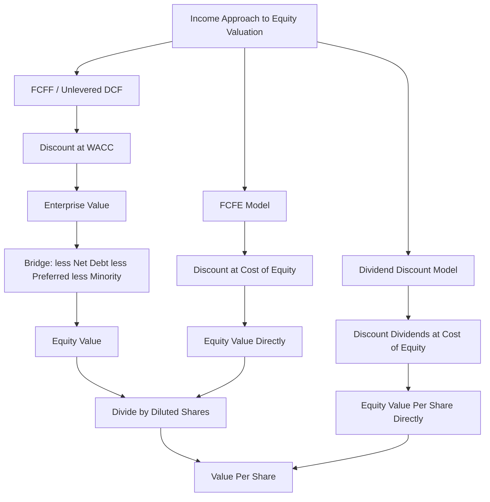

## Dividend Discount Model as an Alternative Income Approach

### Overview

The Dividend Discount Model (DDM) values equity directly by discounting expected future dividend payments to their present value, rather than discounting free cash flows and bridging from enterprise value to equity value. It is conceptually the oldest formal equity valuation framework and remains the theoretically "purest" income approach for equity, since dividends are the only cash flows that equity holders actually and directly receive from the firm (as distinct from FCFE, which represents cash flow *available* for distribution, not necessarily cash flow *paid out*).

$$V_0 = \sum_{t=1}^{\infty} \frac{D_t}{(1+r_e)^t}$$

where $D_t$ is the expected dividend per share in period $t$ and $r_e$ is the cost of equity (not WACC, since dividends accrue solely to equity holders).

---

### DDM vs. FCFE vs. FCFF: Positioning Within the Income Approach Family

**Key Points**

| Model | Cash Flow Discounted | Discount Rate | Best Suited For |
| --- | --- | --- | --- |
| DDM | Actual dividends paid | Cost of equity ($r_e$) | Mature, stable dividend payers (utilities, financials, consumer staples) |
| FCFE | Free cash flow to equity (available, not necessarily paid) | Cost of equity ($r_e$) | Companies with a stated payout policy that doesn't track free cash flow |
| FCFF (unlevered DCF) | Free cash flow to firm | WACC | General purpose; companies with complex/changing capital structure |

- DDM is a **special case** of the broader equity valuation problem: if a company paid out 100% of its FCFE as dividends every period, DDM and FCFE models would produce identical values.
- In practice, most companies do **not** pay out all available FCFE — they retain cash for reinvestment, debt paydown, buybacks, or accumulate cash on the balance sheet — which causes DDM and FCFE to diverge for the same company.
- **DDM systematically undervalues** companies that retain significant cash or return capital primarily via buybacks rather than dividends, since it captures none of the value created by retained/reinvested cash flow unless that value eventually surfaces as higher future dividends.

---

### When DDM Is the Preferred Approach

**Key Points**

DDM is most defensible when:

- The company has a **long, stable dividend history** and a clear, consistent payout policy (common in regulated utilities, mature banks, insurance companies, and REITs)
- Dividends are a good proxy for the cash flow ultimately available to shareholders (i.e., the company is not accumulating large unexplained cash reserves or relying heavily on buybacks instead of dividends)
- The analyst is valuing a **minority equity stake** where the investor has no influence over payout policy or capital allocation decisions (DDM reflects only the cash flows a minority holder can actually expect to receive, as opposed to FCFE/FCFF which assume control-level access to all available cash flow)
- The industry is regulated in a way that ties payouts closely to earnings (e.g., utility rate-of-return regulation)

DDM is generally **less appropriate** for:

- High-growth companies that pay no or minimal dividends (early-stage tech, biotech)
- Companies with active, variable share buyback programs, where capital return is substituted between dividends and repurchases
- Control-oriented valuations (M&A, LBOs) where the acquirer would have full discretion over the target's capital allocation post-transaction, making dividend history irrelevant to the value the acquirer could realize

---

### Gordon Growth (Single-Stage) DDM

The simplest form, assuming dividends grow at a constant rate in perpetuity:

$$V_0 = \frac{D_1}{r_e - g}$$

where $D_1 = D_0 \times (1+g)$ is next year's expected dividend, $r_e$ is the cost of equity, and $g$ is the constant perpetual dividend growth rate.

**Key constraint**: $g$ must be strictly less than $r_e$, and for a mature, going-concern company, $g$ should not exceed long-run nominal GDP growth, consistent with the terminal growth constraint applied in FCFF/FCFE models.

**Example**

Assume:

- Current annual dividend ($D_0$) = $2.00 per share
- Expected constant growth rate ($g$) = 4%
- Cost of equity ($r_e$) = 9%

$$D_1 = 2.00 \times 1.04 = \$2.08$$

$$V_0 = \frac{2.08}{0.09 - 0.04} = \frac{2.08}{0.05} = \$41.60 \text{ per share}$$

---

### Multi-Stage DDM

Analogous to multi-stage FCFF/FCFE models, multi-stage DDM applies distinct dividend growth assumptions across phases:

$$V_0 = \sum_{t=1}^{n} \frac{D_t}{(1+r_e)^t} + \frac{D_{n+1}}{(r_e - g_{terminal}) \times (1+r_e)^n}$$

- **Two-stage**: explicit dividend growth for years 1 through $n$, then a Gordon Growth terminal value at the terminal growth rate
- **Three-stage / H-Model**: high initial dividend growth, a fade/transition period, then stable terminal growth — mechanically identical in structure to the multi-stage FCFF/FCFE frameworks, but applied to dividends rather than free cash flow

**Example (Two-Stage)**

Assume:

- $D_0 = \$1.50$
- Years 1-5: dividend growth = 8% per year
- Year 6 onward: terminal growth = 3%
- Cost of equity = 8.5%

| Year | Dividend ($) | PV Factor (8.5%) | PV ($) |
| --- | --- | --- | --- |
| 1 | 1.62 | 0.9217 | 1.4932 |
| 2 | 1.75 | 0.8495 | 1.4867 |
| 3 | 1.89 | 0.7829 | 1.4797 |
| 4 | 2.04 | 0.7216 | 1.4721 |
| 5 | 2.20 | 0.6650 | 1.4633 |

Sum of PV (Years 1-5) ≈ $7.395

Terminal value at end of Year 5:

$$TV_5 = \frac{2.20 \times 1.03}{0.085 - 0.03} = \frac{2.266}{0.055} = \$41.20$$

$$PV(TV_5) = 41.20 \times 0.6650 = \$27.40$$

$$V_0 = 7.395 + 27.40 = \$34.80 \text{ per share}$$

---

### Key Structural Differences from FCFF/FCFE DCF

**Key Points**

- **No enterprise-value-to-equity-value bridge is needed** — DDM outputs equity value per share directly, since it discounts a per-share cash flow at the cost of equity from the outset. There is no separate step to subtract net debt, preferred stock, or minority interest.
- **Discount rate is always cost of equity ($r_e$)**, typically derived via CAPM:

$$r_e = r_f + \beta \times (r_m - r_f)$$

never WACC, since dividends flow exclusively to common equity holders.

- **Share count and dilution** are handled differently: because DDM already works on a per-share basis, dilution from options/convertibles must be reflected either by adjusting the dividend-per-share projection for expected share count growth, or by first computing an aggregate equity value (dividends × total basic + expected new shares) and then dividing — the treasury stock method's proceeds-and-repurchase mechanic doesn't translate cleanly into a pure per-share dividend framework and requires this adaptation.
- **Sensitivity to payout policy assumptions**: DDM requires an explicit, separate forecast of the **payout ratio** (dividends as a percentage of earnings or FCFE), which is an additional assumption layer not required in FCFF models (which do not need to distinguish between cash retained and cash distributed).

---

### Diagram: DDM vs. FCFF/FCFE Approach Comparison

---

### Common Pitfalls

**Key Points**

- Applying DDM to companies that pay **no dividends or minimal token dividends** relative to their actual cash flow capacity, producing a severely understated valuation
- Using **WACC instead of cost of equity** as the discount rate — a fundamental methodological error, since DDM values only the equity claim
- Ignoring **share buybacks** as an alternative capital return channel — a company that returns significant capital via repurchases rather than dividends will appear far less valuable under pure DDM than it actually is, since buybacks are economically similar to dividends (both return cash to shareholders) but are excluded from the dividend stream
- Assuming a constant, static payout ratio when a company's payout policy is realistically expected to change (e.g., a maturing growth company beginning to initiate or increase dividends over the forecast horizon)
- Setting terminal dividend growth above sustainable long-run economic growth, the same constraint that applies to FCFF/FCFE terminal value assumptions

---

**Related Topics**

- Free Cash Flow to Equity (FCFE) as an Alternative to FCFF
- Cost of Equity Estimation via CAPM
- Multi-Stage Growth Models
- Payout Ratio and Capital Allocation Policy Forecasting
- Share Buybacks as a Substitute for Dividends in Shareholder Return Analysis
- Terminal Value: Gordon Growth Method vs. Exit Multiple Method
- Deriving Implied Value Per Share