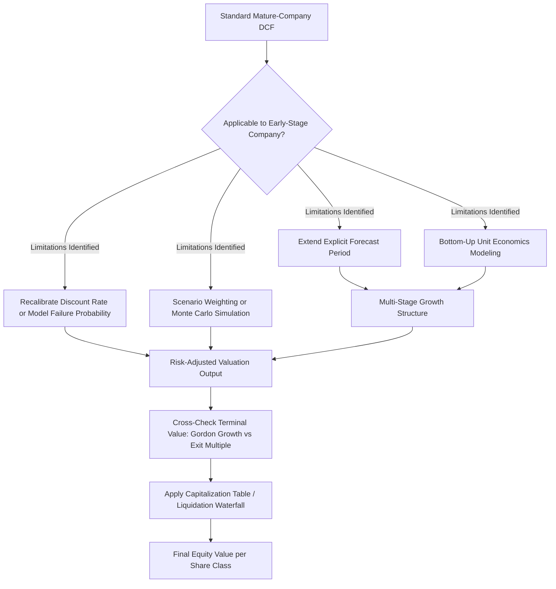

## DCF for High-Growth and Early-Stage Companies

### Overview

Applying DCF to high-growth and early-stage companies (pre-revenue or early-revenue startups, hypergrowth SaaS businesses, early-stage biotech, technology platforms pre-monetization) requires significant methodological adaptation relative to standard DCF applied to mature companies. The core challenges are structural: negative or highly volatile free cash flows, no meaningful historical track record to anchor projections, extreme sensitivity to terminal value assumptions, high failure/mortality risk, and capital structures that frequently change (multiple funding rounds, convertible instruments, option pools). Standard single-path DCF, applied naively, tends to produce unreliable or wildly divergent valuations for these companies.

---

### Core Challenges Specific to High-Growth/Early-Stage Valuation

**Key Points**

- **Negative near-term FCF**: many high-growth companies burn cash for years while scaling (customer acquisition, R&D, infrastructure build-out), making early-period free cash flow negative — the standard DCF mechanics still apply, but early-period PV contributions are negative, shifting nearly all value into the terminal period.
- **No stable historical base year**: mature-company DCF typically anchors projections to a normalized recent-year financial base; early-stage companies often lack a representative base year, since current-year financials may not resemble the company's eventual steady-state economics at all.
- **Extreme terminal value sensitivity**: because explicit-period cash flows are small or negative, terminal value often represents an even larger share of total value than in mature-company DCFs — sometimes exceeding 100% of enterprise value (i.e., the explicit period alone destroys value on a PV basis).
- **High company-specific failure risk**: unlike mature companies where going-concern is a reasonable assumption, early-stage companies face material risk of failure, requiring either explicit probability-of-failure adjustments or careful discount rate calibration (see below).
- **Rapidly evolving capital structure**: successive funding rounds, SAFEs, convertible notes, and expanding option pools mean the EV-to-equity bridge and diluted share count are moving targets, often requiring separate modeling of a capitalization table alongside the DCF.

---

### Adaptation 1: Extended and Explicit Multi-Stage Forecast Periods

**Key Points**

- Given the challenges of anchoring terminal value when the near-term business bears little resemblance to its eventual mature state, best practice extends the **explicit forecast period** well beyond the standard 5 years — often 10-15 years — to allow the business to reach a genuinely normalized, steady-state operating profile before terminal value is calculated.
- This is typically structured as a **multi-stage model** (see prior topic on Multi-Stage Growth Models):
  1. **Hypergrowth stage**: very high revenue growth, negative or thin margins, heavy reinvestment
  2. **Scaling stage**: growth moderates, margins expand as the business achieves operating leverage
  3. **Maturity stage**: growth converges to terminal/GDP-like rates, margins and ROIC stabilize
- Modeling operating leverage explicitly (fixed vs. variable cost structure) is often more informative than a top-down margin assumption, since margin expansion in scaling businesses is frequently driven by fixed costs being spread over a rapidly growing revenue base rather than by pricing power or unit economics changes.

---

### Adaptation 2: Revenue-Driven, Bottom-Up Modeling

- Because historical financial trends are often not predictive, projections are typically built from **operational/unit economics drivers** rather than top-down revenue growth extrapolation:
  - SaaS: new customer additions, average revenue per user (ARPU), churn/retention rate, net revenue retention (NRR)
  - Marketplaces: gross merchandise value (GMV), take rate
  - Biotech: probability-of-success-weighted revenue by drug candidate and indication, patent life, addressable patient population
  - Consumer platforms: monthly/daily active users (MAU/DAU), monetization rate per user
- Building from unit economics allows the analyst to sanity-check growth assumptions against realistic constraints (e.g., total addressable market size, achievable market share, customer acquisition cost payback periods) rather than simply extrapolating a growth rate.

---

### Adaptation 3: Discount Rate Calibration

**Key Points**

- Standard CAPM-derived costs of equity/WACC, built from public-company beta comparables, often understate the true risk of early-stage companies, since public comparables (even in the same sector) have generally survived past the highest-risk early stage.
- Common adjustments:
  - **Venture capital-style discount rates**: some early-stage valuations (particularly for pre-revenue or early-revenue companies) use higher discount rates (commonly cited in a broad 20-40%+ range in venture practice) that implicitly bundle company-specific failure risk into the discount rate rather than modeling failure probability separately — this is a simplification convention, not a rigorously derived CAPM output [Speculation: the specific rate used varies enormously by stage, sector, and investor, and there is no single authoritative standard rate].
  - **Explicit failure-probability adjustment**: alternatively, project cash flows on a "success case" basis and separately multiply by an estimated probability of survival/success at each stage (common in biotech, where probability of clinical trial/regulatory success by phase is often separately estimated), rather than burying that risk inside an inflated discount rate. This is generally considered more analytically rigorous because it separates *systematic risk* (compensated via the discount rate) from *company-specific/diversifiable risk* (better handled via probability weighting or scenario analysis), which is closer to correct financial theory than inflating the discount rate to capture idiosyncratic failure risk.
- **Discount rate should decline over the forecast horizon** in some frameworks, reflecting declining risk as the company survives successive stages and de-risking milestones (e.g., achieving product-market fit, reaching profitability) — though this introduces additional modeling complexity and potential circularity if not handled carefully.

---

### Adaptation 4: Scenario and Probability-Weighted Valuation

**Key Points**

Given the wide dispersion of plausible outcomes for early-stage companies (compared to the relatively narrow outcome distribution typical of mature companies), single-path DCF is often supplemented or replaced by:

- **Scenario analysis**: constructing distinct bull/base/bear cases (or more granular scenario sets) with different assumptions for market size capture, competitive dynamics, and execution success, each producing a separate DCF output, then probability-weighting the scenarios:

$$V_0 = \sum_{i} p_i \times V_i$$

where $p_i$ is the estimated probability of scenario $i$ and $V_i$ is that scenario's DCF-derived value.

- **Monte Carlo simulation**: treating key uncertain inputs (growth rate, margin trajectory, terminal multiple) as probability distributions rather than point estimates, and simulating thousands of paths to generate a distribution of possible valuations rather than a single number — providing a sense of the valuation's dispersion, not just its central tendency.
- **Real options framing**: for certain early-stage investments (particularly platform businesses or R&D-stage biotech/pharma), the value of future optionality (the ability to expand, pivot, or abandon based on how uncertainty resolves) can be material and is not well captured by static DCF, which assumes a fixed, committed path. Real options analysis (adapting option-pricing frameworks like Black-Scholes to real investment decisions) is sometimes layered on top of or used alongside DCF in these cases.

---

### Adaptation 5: Terminal Value Method Selection

- **Exit multiple method** is often preferred over Gordon Growth for early-stage companies reaching a projected "mature" endpoint, since it anchors to observable comparable company multiples rather than requiring the analyst to independently estimate a terminal growth rate and long-run ROIC for a business whose eventual competitive position is highly uncertain.
- However, exit multiples themselves carry risk: applying a **current** comparable multiple to a **future** projected financial metric implicitly assumes the multiple (and market sentiment/risk appetite) remains stable over the entire forecast horizon, which is a strong and sometimes fragile assumption, particularly in sectors prone to multiple compression cycles (e.g., high-growth tech during rate-driven repricing events) [Inference: the degree of multiple stability risk is sector- and cycle-dependent and cannot be generalized].
- Best practice: triangulate using **both** methods (Gordon Growth and exit multiple) and cross-check that the implied terminal growth rate from the exit multiple approach is internally consistent with the implied perpetuity growth rate from Gordon Growth.

---

### Capitalization Table Interaction

**Key Points**

- Early-stage companies typically have layered capital structures: common stock, multiple series of preferred stock (often with distinct liquidation preferences, participation rights, and anti-dilution provisions), convertible notes/SAFEs, and expanding employee option pools.
- The standard EV-to-equity bridge (subtracting preferred stock, adding back non-operating assets, applying TSM/if-converted dilution) becomes materially more complex, frequently requiring a **liquidation waterfall** analysis rather than a simple pro-rata equity split, since different preferred share classes may have different payout priorities and terms in various exit scenarios (IPO, acquisition, liquidation).
- SAFEs (Simple Agreements for Future Equity) in particular do not have a fixed conversion price until a triggering event (typically a priced equity round), requiring scenario-based treatment rather than a straightforward if-converted moneyness test.

---

### Diagram: High-Growth DCF Adaptation Framework

---

### Common Pitfalls

**Key Points**

- Applying a standard 5-year explicit period and a single terminal growth rate to a business nowhere near a normalized steady state, effectively baking almost all valuation uncertainty into an unexamined terminal value
- Using a public-market-derived WACC/CAPM discount rate that fails to capture company-specific survival risk, systematically overvaluing high-mortality-risk early-stage companies
- Ignoring the complexity of the capitalization table and applying a simple pro-rata equity split when a liquidation preference waterfall would materially change the value allocated to common shareholders
- Relying on a single-scenario point estimate when the underlying business genuinely has a wide, bimodal-or-worse distribution of plausible outcomes (e.g., binary regulatory approval outcomes in biotech), where a probability-weighted or scenario-based approach is more informative
- Double-counting risk by both inflating the discount rate for failure risk **and** separately applying a probability-of-success haircut to cash flows — these are alternative treatments of the same risk and should not both be applied simultaneously without careful reconciliation

---

**Related Topics**

- Multi-Stage Growth Models
- Terminal Value: Gordon Growth Method vs. Exit Multiple Method
- Real Options Valuation in Corporate Finance
- Liquidation Preference Waterfalls in Venture-Backed Companies
- Treatment of Preferred Stock and Convertible Securities
- Monte Carlo Simulation in Financial Modeling
- Cost of Capital Estimation for Private and Early-Stage Companies