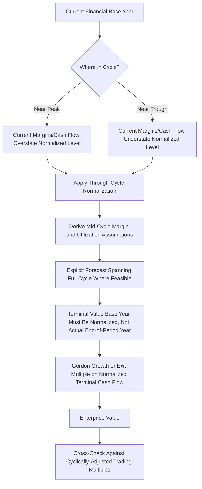

## DCF for Cyclical Companies

### Overview

Cyclical companies — those whose revenues and profitability fluctuate materially with macroeconomic or industry-specific cycles (commodities, industrials, homebuilders, autos, semiconductors, shipping, airlines) — present a distinct challenge for standard DCF methodology. The core problem: **any single base year is likely unrepresentative** of the company's normalized long-run earning power, since it will inevitably sit somewhere within a cycle (peak, trough, or transition). Anchoring a DCF to an unadjusted current-year financial base risks systematically over- or under-valuing the company depending on where in the cycle that base year falls.

---

### The Core Problem: Base-Year Distortion

**Key Points**

- Standard DCF practice extrapolates near-term projections from a recent historical/current base year, then assumes some path toward long-run stable growth.
- For a cyclical company, this is problematic in both directions:
  - **Valuing at a cyclical peak**: current margins, revenue, and cash flow are elevated above sustainable long-run levels; naive extrapolation overstates future cash flows and produces an inflated valuation, precisely at the point in the cycle where the business is most likely to *decline*.
  - **Valuing at a cyclical trough**: current margins and cash flow are depressed, sometimes even negative; naive extrapolation understates long-run earning power and produces a deflated valuation, precisely at the point in the cycle where the business is most likely to *recover*.
- This creates a **pro-cyclical bias** in naive DCF applications to cyclical businesses — the model tends to generate its most optimistic valuations near peaks and most pessimistic valuations near troughs, which is the opposite of what a robust valuation framework should do.

---

### Adaptation 1: Mid-Cycle / Normalized Earnings Approach

**Key Points**

The standard and most widely used adaptation is to **normalize** the base year rather than using the most recent reported figures directly.

- **Through-the-cycle averaging**: use average margins, revenue growth, or return metrics over a full historical cycle (commonly 5-10 years, ideally spanning at least one full peak-to-trough-to-peak cycle) as the normalized base, rather than the latest single-year figures.
- **Mid-cycle margin assumption**: rather than projecting the current elevated or depressed margin forward, project toward an explicitly estimated **mid-cycle (normalized) margin**, derived from historical average margins adjusted for any structural changes (cost structure shifts, capacity additions, competitive dynamics) that might shift the normalized level going forward.
- **Capacity utilization normalization**: for capital-intensive cyclicals (steel, chemicals, semiconductors), normalize revenue based on a mid-cycle **capacity utilization rate** rather than the current utilization rate, since utilization — and the operating leverage effects that come with it — is often the primary driver of cyclical margin swings.

**Example**

Assume a commodity chemicals producer with the following historical EBITDA margins over a full cycle:

| Year | Margin | Cycle Position |
| --- | --- | --- |
| Year -4 | 22% | Peak |
| Year -3 | 15% | Declining |
| Year -2 | 8% | Trough |
| Year -1 | 13% | Recovering |
| Year 0 (current) | 24% | Peak (again) |

A naive DCF anchored to the current 24% margin would extrapolate an unsustainably high margin forward. A normalized approach would instead compute a **through-cycle average** (here, approximately 16.4%) and use that as the anchor for the explicit forecast's steady-state assumption, with an explicit path showing margins reverting from the current peak toward that normalized level over the near-term forecast years before stabilizing.

---

### Adaptation 2: Explicit Cycle Modeling

**Key Points**

Rather than smoothing over the cycle with an average, a more granular approach explicitly models the cycle's phases within the projection period:

- Project **revenue, volume, and pricing** using an explicit assumption about where the company currently sits in its cycle and how it is expected to evolve (e.g., "currently near peak, expect moderate decline over the next 2-3 years, followed by trough, followed by recovery").
- This requires industry-specific cyclical drivers as inputs:
  - **Commodities**: supply/demand balance, inventory levels, capacity additions/retirements industry-wide, commodity price forecasts (often sourced from futures curves or independent commodity research rather than modeled bottom-up)
  - **Autos/industrials**: replacement cycle dynamics, order backlogs, capacity utilization trends
  - **Financials**: credit cycle position, loan loss provisioning normalization
- The explicit forecast period should ideally span at least one **full cycle** (peak-to-trough-to-peak, or trough-to-peak-to-trough) so that the terminal value calculation begins from a point that itself reflects a normalized, mid-cycle level rather than another arbitrary point within a cycle.

---

### Adaptation 3: Terminal Value Timing and Placement

**Key Points**

- The single most important technical safeguard in cyclical DCF: **ensure the terminal value's base year cash flow is a normalized, mid-cycle figure**, not the actual projected cash flow of whatever year happens to fall at the end of the explicit forecast period.
- If the explicit forecast period happens to end during a cyclical trough or peak, applying Gordon Growth directly to that year's cash flow will carry the same base-year distortion problem into the terminal value — and since terminal value often represents the majority of total DCF value, this error can dominate the entire valuation.
- Common technique: **calculate terminal value using a separately normalized "mid-cycle" cash flow figure**, distinct from whatever the actual final explicit-period year's projected cash flow happens to be, even if this requires a one-time adjustment/reconciliation between the last explicit year and the terminal value base.

---

### Adaptation 4: Discount Rate and Beta Considerations

- Cyclical companies typically exhibit **higher equity betas** than non-cyclical companies, reflecting their greater sensitivity to broad economic conditions — this is a standard, appropriately reflected input into CAPM-derived cost of equity, not an adjustment layered on top of the DCF mechanics.
- Some practitioners debate whether beta itself should be measured using a **full-cycle historical window** (to avoid the estimated beta itself being distorted by the specific market conditions prevalent during a shorter, potentially unrepresentative measurement window) — this is a live methodological consideration rather than a settled convention [Inference: practice varies by analyst and data availability; there is no universally agreed-upon minimum beta measurement window for cyclical companies].
- Leverage effects compound cyclicality: highly levered cyclical companies (e.g., leveraged industrials, shipping) exhibit amplified equity-level cash flow volatility relative to their unlevered operating cash flow volatility, which should be reflected in both the unlevering/relevering of comparable company betas and in careful attention to covenant/refinancing risk during modeled trough periods.

---

### Adaptation 5: Scenario Analysis as a Complement to Normalization

**Key Points**

Given that any single normalized-earnings path is still an approximation of an inherently uncertain and irregular cycle, cyclical DCF is often supplemented with:

- **Peak/trough/mid-cycle scenario analysis**: running the DCF under distinct assumptions for where the company sits in its cycle at the valuation date and how the cycle evolves, producing a range rather than a single point estimate.
- **Sensitivity to cycle timing and amplitude**: flexing both the *length* of the current cycle phase and the *depth/height* of upcoming trough/peak phases, since both dimensions materially affect near-term cash flows and, by extension, enterprise value.
- Cross-checking the DCF-derived valuation against **cyclically-adjusted trading multiples** (e.g., EV/mid-cycle EBITDA rather than EV/current EBITDA) as an independent sanity check, since public market cyclical valuations often already implicitly price in some degree of cycle normalization.

---

### Diagram: Cyclical DCF Normalization Process

---

### Common Pitfalls

**Key Points**

- Anchoring the entire DCF to the most recent reported year's margins/cash flow without checking where that year sits within the company's historical cycle
- Allowing an unrepresentative peak or trough year to flow directly into the terminal value calculation, which — given terminal value's typical share of total DCF value — can dominate and distort the entire output
- Using a beta estimated over a short window that happens to coincide with unusually calm or volatile market conditions, mischaracterizing the company's true systematic risk
- Ignoring covenant and refinancing risk during modeled cyclical troughs for highly levered cyclical companies, understating the probability and cost of financial distress at the bottom of the cycle
- Treating a single "normalized" scenario as sufficient, rather than supplementing with peak/trough sensitivity or scenario analysis to capture the genuine width of plausible outcomes inherent to cyclical businesses

---

**Related Topics**

- Multi-Stage Growth Models
- Terminal Value: Gordon Growth Method vs. Exit Multiple Method
- Beta Estimation and Unlevering/Relevering Across Comparable Companies
- Capital Structure and Leverage Effects on Equity Risk
- Commodity Price Forecasting and Futures Curve Applications in Valuation
- Sensitivity Analysis and Scenario Modeling in DCF
- Cyclically-Adjusted Trading Multiples (e.g., EV/Mid-Cycle EBITDA)