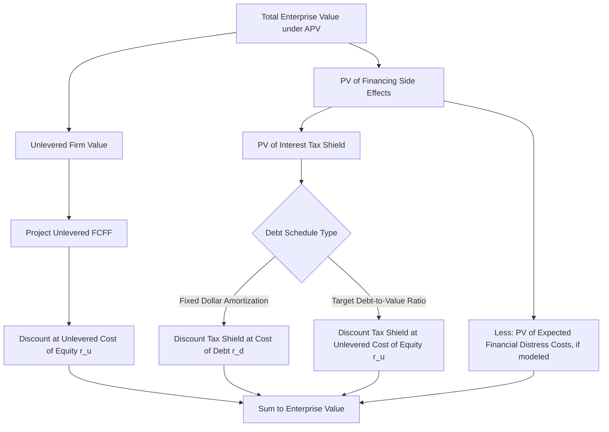

## Adjusted Present Value (APV) Method

### Overview

The Adjusted Present Value (APV) method values a company by decomposing enterprise value into two separately calculated components: (1) the value of the firm as if it were **entirely equity-financed** (the "unlevered" or "all-equity" value), and (2) the incremental value contributed by the **financing side effects** of debt, primarily the tax shield from interest deductibility. This decomposition stands in contrast to the standard WACC-based DCF, which bundles the effect of debt financing directly into a single blended discount rate.

$$APV = V_{unlevered} + PV(\text{Financing Side Effects})$$

$$APV = V_{unlevered} + PV(\text{Interest Tax Shield}) - PV(\text{Financial Distress Costs}) + PV(\text{Other Financing Effects})$$

APV was developed (Myers, 1974) specifically to address situations where a company's capital structure is **expected to change significantly** over the projection period, a scenario where the standard WACC method's assumption of a constant target capital structure becomes analytically strained.

---

### Why APV Instead of Standard WACC-Based DCF

**Key Points**

- The standard WACC method assumes a **stable, constant target capital structure (debt/equity mix)** throughout the projection and into perpetuity, since WACC itself is a blended rate that embeds a specific debt weighting.
- Many real-world scenarios feature **capital structures that change materially and predictably over time**:
  - **Leveraged buyouts (LBOs)**: debt is raised at high levels at transaction close and is systematically paid down over the holding period, meaning the debt/equity mix — and therefore the "correct" WACC — changes every year
  - **Companies undergoing recapitalization or deleveraging plans**: post-distress restructuring, post-spinoff capital structure normalization
  - **Project finance**: debt is amortized on a fixed schedule tied to project cash flows
- In these cases, using a single constant WACC throughout the projection period is technically inconsistent with the actual capital structure trajectory, since WACC would need to be recalculated every period to reflect the changing debt weighting — which is cumbersome and introduces circularity (capital structure weights are typically based on market values, which depend on the valuation being solved for).
- **APV avoids this problem** by discounting unlevered cash flows at a **constant unlevered cost of equity** ($r_u$, unaffected by capital structure), and handling the debt-related value effects as a **separate, explicitly modeled add-on** based on the actual (changing) debt schedule — no re-levering of the discount rate is required period-to-period.

---

### Step-by-Step APV Methodology

#### Step 1 — Calculate Unlevered Firm Value

- Project **unlevered free cash flows (FCFF)** exactly as in a standard DCF — free cash flow available to all capital providers, before any financing effects.
- Discount these cash flows at the **unlevered cost of equity** ($r_u$), also called the **asset cost of capital** — the return required by equity holders if the firm had **no debt** at all.

$$r_u = r_f + \beta_{unlevered} \times (r_m - r_f)$$

- $\beta_{unlevered}$ is the **asset beta**, derived by unlevering the equity betas of comparable companies (removing the leverage effect from each comparable's observed equity beta) using the Hamada equation or an equivalent unlevering formula:

$$\beta_{unlevered} = \frac{\beta_{levered}}{1 + (1-t) \times \frac{D}{E}}$$

$$V_{unlevered} = \sum_{t=1}^{n} \frac{FCFF_t}{(1+r_u)^t} + \frac{TV_n}{(1+r_u)^n}$$

#### Step 2 — Calculate the Present Value of the Interest Tax Shield

- Debt financing creates value because interest expense is **tax-deductible**, reducing the firm's tax liability relative to an equivalent all-equity-financed firm.
- Annual tax shield in each period:

$$\text{Tax Shield}_t = \text{Interest Expense}_t \times \text{Tax Rate}_t$$

- Discount the projected tax shield stream. The choice of discount rate for the tax shield is a **genuinely debated methodological question**:
  - **Discount at the cost of debt ($r_d$)**: reflects the view that the tax shield's risk is tied to the risk of the debt itself (i.e., the tax shield is only realized if interest is actually paid, which is roughly as certain as the debt payments themselves) — this was the original Myers approach and remains widely used, particularly appropriate when debt levels are fixed in dollar terms (as in LBOs with a fixed amortization schedule).
  - **Discount at the unlevered cost of equity ($r_u$)**: reflects the view (associated with Miles-Ezzell and Harris-Pringle variants) that if the debt level is expected to track firm value (i.e., a constant target debt-to-value ratio rather than a fixed dollar amount), the tax shield's risk is more comparable to the risk of the underlying business than to the risk of debt.
  - The correct choice depends on **how the debt schedule is expected to behave**: fixed, pre-determined dollar amounts of debt (LBO amortization schedules) generally support discounting at $r_d$; debt that is expected to scale with firm value over time generally supports discounting at $r_u$ [Inference: this remains an area of some disagreement in valuation practice even among specialists, and the practical difference in output is often modest for moderate leverage levels].

$$PV(\text{Tax Shield}) = \sum_{t=1}^{n} \frac{\text{Interest}_t \times t_{tax}}{(1+r_{shield})^t}$$

#### Step 3 — (Optional) Adjust for Expected Costs of Financial Distress

- At high leverage levels, the benefit of the tax shield is partially offset by the increased probability and expected cost of financial distress (direct costs: legal/administrative bankruptcy costs; indirect costs: lost customers, supplier terms deterioration, management distraction, underinvestment).
- In practice, explicit quantification of distress costs is **rare** in standard APV applications outside of highly leveraged or distressed-company contexts, since reliable estimation of distress probability and cost magnitude is difficult; many practical APV applications omit this term or treat it qualitatively rather than as an explicit deduction [Inference: whether to model this explicitly is a judgment call that depends heavily on how close the modeled leverage is to a level where distress risk becomes material].

#### Step 4 — Sum to Enterprise Value

$$EV_{APV} = V_{unlevered} + PV(\text{Tax Shield}) - PV(\text{Distress Costs, if modeled})$$

From this point, the same EV-to-equity bridge mechanics apply as in standard DCF (subtract net debt, preferred stock, minority interest; add non-operating assets; divide by diluted shares).

---

### Worked Example

**Example**

Assume:

- Unlevered FCFF, Years 1-5: $50M, $55M, $60M, $65M, $70M
- Terminal value (Year 5, Gordon Growth, $g$ = 3%): computed using unlevered FCFF and $r_u$
- Unlevered cost of equity ($r_u$) = 10%
- Debt schedule: $400M at close, amortizing $50M/year; interest rate = 6%; tax rate = 25%
- Tax shield discounted at cost of debt ($r_d$) = 6% (fixed amortization schedule → Myers approach)

**Step 1 — PV of unlevered FCFF (Years 1-5):**

| Year | FCFF ($M) | PV Factor (10%) | PV ($M) |
| --- | --- | --- | --- |
| 1 | 50 | 0.9091 | 45.46 |
| 2 | 55 | 0.8264 | 45.45 |
| 3 | 60 | 0.7513 | 45.08 |
| 4 | 65 | 0.6830 | 44.40 |
| 5 | 70 | 0.6209 | 43.46 |

Sum ≈ $223.85M

Terminal Value (Year 5): $TV_5 = \frac{70 \times 1.03}{0.10-0.03} = \frac{72.1}{0.07} = \$1{,}030M$; $PV(TV_5) = 1{,}030 \times 0.6209 = \$639.5M$

$$V_{unlevered} = 223.85 + 639.5 = \$863.35M$$

**Step 2 — PV of interest tax shield:**

| Year | Debt Balance ($M) | Interest (6%) | Tax Shield (25%) | PV Factor (6%) | PV ($M) |
| --- | --- | --- | --- | --- | --- |
| 1 | 400 | 24.0 | 6.0 | 0.9434 | 5.66 |
| 2 | 350 | 21.0 | 5.25 | 0.8900 | 4.67 |
| 3 | 300 | 18.0 | 4.5 | 0.8396 | 3.78 |
| 4 | 250 | 15.0 | 3.75 | 0.7921 | 2.97 |
| 5 | 200 | 12.0 | 3.0 | 0.7473 | 2.24 |

Sum ≈ $19.32M (excluding any terminal tax shield value beyond Year 5, which would require an additional assumption about post-Year-5 debt policy)

**Step 3 — APV:**

$$APV = 863.35 + 19.32 = \$882.67M \text{ (Enterprise Value)}$$

---

### APV vs. WACC Method: When Results Converge and Diverge

**Key Points**

- When capital structure is **stable and constant** throughout the projection period, APV and the standard WACC method should produce approximately the same enterprise value — they are mathematically reconcilable frameworks, differing only in *how* the value of debt financing is incorporated (bundled into the discount rate vs. isolated as a separate additive term).
- The two methods **diverge in practical convenience** — not in underlying theoretical validity — specifically when leverage changes substantially over time (LBOs being the canonical case), because WACC would need to be recalculated every period to stay consistent with the actual debt/equity mix, while APV's unlevered discount rate remains constant regardless of the debt schedule.
- APV is particularly favored in **LBO analysis** for exactly this reason: LBO capital structures are, by design, highly levered at close and systematically deleveraged over the holding period, making the constant-WACC assumption a poor fit and APV a more natural framework.

---

### Diagram: APV Decomposition Structure

---

### Common Pitfalls

**Key Points**

- Using a **levered beta** (from raw comparable company data) directly in the unlevered cost of equity calculation without first unlevering it — this is a fundamental error that reintroduces the capital structure effect APV is designed to isolate
- Mismatching the tax shield discount rate to the actual debt schedule behavior (e.g., discounting a fixed-dollar LBO amortization schedule's tax shield at $r_u$ when $r_d$ is more theoretically appropriate for that debt structure, or vice versa)
- Omitting a terminal value for the tax shield beyond the explicit forecast period when the company is expected to maintain some level of debt in perpetuity, understating total APV
- Applying APV mechanically without also applying the standard WACC method as a cross-check when capital structure is actually stable — the two should reconcile closely in that case, and a large unexplained discrepancy signals a modeling error somewhere in one of the two builds
- Ignoring financial distress costs entirely in situations of genuinely high leverage where distress risk is material, potentially overstating the net benefit of the tax shield

---

**Related Topics**

- Weighted Average Cost of Capital (WACC) Method and Its Assumptions
- Unlevering and Relevering Beta (Hamada Equation)
- Leveraged Buyout (LBO) Modeling and Capital Structure Dynamics
- Interest Tax Shield Valuation Debates (Myers vs. Miles-Ezzell vs. Harris-Pringle)
- Cost of Debt Estimation and Credit Spread Analysis
- Financial Distress Costs and Optimal Capital Structure Theory
- Terminal Value: Gordon Growth Method vs. Exit Multiple Method