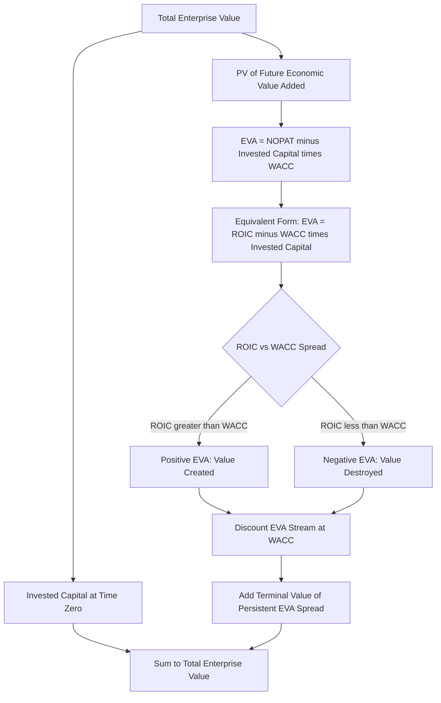

## Economic Value Added and Residual Income Models

### Overview

Economic Value Added (EVA) and Residual Income (RI) models represent an alternative valuation framework that reframes value creation around **excess returns above the cost of capital**, rather than discounting absolute free cash flows or dividends. The central insight: a firm creates value only when it generates returns on invested capital that exceed what capital providers require; simply growing earnings or cash flow is not, by itself, evidence of value creation if that growth is achieved at returns below the cost of capital. EVA and RI models make this excess-return logic the explicit unit of analysis rather than leaving it implicit within a standard FCFF/FCFE build.

---

### Core Concept: Value Creation as Excess Return

**Key Points**

- Traditional DCF (FCFF/FCFE) is mathematically equivalent to EVA/RI-based valuation when applied consistently — they are **reconcilable frameworks**, not competing theories of value. The difference is one of **decomposition and presentation**, not a different answer to "what is the company worth."
- The RI/EVA framework separates total firm value into two components:

$$\text{Total Value} = \text{Capital Invested Today} + \text{PV of Future Excess Returns (EVA/RI)}$$

- This decomposition makes explicit what standard DCF leaves implicit: a company can have growing revenue and growing absolute profit while **destroying** value, if that growth requires capital investment at a rate of return below the cost of that capital. Conversely, a company with modest growth but returns well above its cost of capital can be creating substantial value per unit of capital deployed.

---

### Economic Value Added (EVA) — Corporate Finance Formulation

**Key Points**

EVA (a specific, trademarked implementation popularized by Stern Stewart & Co., though the underlying concept — economic profit — predates the branded methodology) is calculated as:

$$EVA_t = NOPAT_t - (\text{Invested Capital}_{t-1} \times WACC)$$

Where:

- $NOPAT$ = Net Operating Profit After Tax (essentially EBIT × (1 − tax rate), the same operating profit measure used as the starting point for unlevered FCFF)
- $\text{Invested Capital}$ = total capital employed in operations (typically net working capital + net fixed assets + capitalized operating leases, sometimes adjusted for certain accounting distortions)
- $WACC$ = weighted average cost of capital, the same rate used in standard EV-based DCF

An equivalent, often more intuitive formulation:

$$EVA_t = (\text{ROIC}_t - WACC) \times \text{Invested Capital}_{t-1}$$

This form makes the excess-return logic explicit: EVA is positive only when Return on Invested Capital (ROIC) exceeds WACC, and the magnitude of value creation scales with both the **spread** (ROIC − WACC) and the **amount of capital** deployed at that spread.

#### Valuation Using EVA

$$EV = \text{Invested Capital}_0 + \sum_{t=1}^{n} \frac{EVA_t}{(1+WACC)^t} + \frac{TV_{EVA,n}}{(1+WACC)^n}$$

The terminal value of the EVA stream, if excess returns are assumed to fade to zero in perpetuity (ROIC converges to WACC), is simply zero beyond the explicit forecast — the terminal value in the EVA framework reflects only the value of any **persistent excess-return spread** the analyst believes the company retains, not the total future cash flow stream itself.

---

### Residual Income (RI) — Equity Valuation Formulation

**Key Points**

Residual Income is the equity-level analog of EVA, using accounting net income and book value of equity rather than NOPAT and invested capital, and the cost of equity rather than WACC:

$$RI_t = NI_t - (r_e \times BVE_{t-1})$$

Where:

- $NI_t$ = net income in period $t$
- $r_e$ = cost of equity
- $BVE_{t-1}$ = book value of equity at the start of period $t$

#### Valuation Using RI

$$\text{Equity Value} = BVE_0 + \sum_{t=1}^{n} \frac{RI_t}{(1+r_e)^t} + \frac{TV_{RI,n}}{(1+r_e)^n}$$

RI models are particularly common in **equity research for financial institutions** (banks, insurers), where book value of equity is a more stable and meaningful anchor than free cash flow (which is difficult to define meaningfully for a bank, given that "capital expenditure" and "working capital" do not map cleanly onto a financial institution's balance sheet).

---

### Worked Example: EVA-Based Valuation

**Example**

Assume:

- Invested Capital (Year 0) = $500M
- WACC = 9%
- NOPAT projections and Invested Capital growth, Years 1-5:

| Year | Invested Capital (Beginning, $M) | NOPAT ($M) | ROIC | EVA = NOPAT − (IC × WACC) |
| --- | --- | --- | --- | --- |
| 1 | 500 | 65 | 13.0% | 65 − (500×0.09) = 65 − 45 = 20 |
| 2 | 540 | 70 | 13.0% | 70 − (540×0.09) = 70 − 48.6 = 21.4 |
| 3 | 580 | 75 | 12.9% | 75 − (580×0.09) = 75 − 52.2 = 22.8 |
| 4 | 620 | 80 | 12.9% | 80 − (620×0.09) = 80 − 55.8 = 24.2 |
| 5 | 660 | 85 | 12.9% | 85 − (660×0.09) = 85 − 59.4 = 25.6 |

**Step 1 — PV of explicit EVA stream (discounted at 9%):**

| Year | EVA ($M) | PV Factor (9%) | PV ($M) |
| --- | --- | --- | --- |
| 1 | 20.0 | 0.9174 | 18.35 |
| 2 | 21.4 | 0.8417 | 18.01 |
| 3 | 22.8 | 0.7722 | 17.61 |
| 4 | 24.2 | 0.7084 | 17.14 |
| 5 | 25.6 | 0.6499 | 16.64 |

Sum ≈ $87.75M

**Step 2 — Terminal value of EVA:** assume the ROIC-WACC spread persists at Year 5's level (12.9% − 9% = 3.9pp) into perpetuity with 2% growth in invested capital:

$$EVA_6 = 25.6 \times 1.02 = 26.1$$

$$TV_{EVA,5} = \frac{26.1}{0.09 - 0.02} = \$372.9M$$

$$PV(TV_{EVA,5}) = 372.9 \times 0.6499 = \$242.4M$$

**Step 3 — Enterprise Value:**

$$EV = \text{Invested Capital}_0 + PV(\text{Explicit EVA}) + PV(TV_{EVA})$$

$$EV = 500 + 87.75 + 242.4 = \$830.15M$$

This can be cross-checked against a standard FCFF DCF using the same underlying NOPAT, capex, and working capital assumptions — a correctly constructed EVA model and a correctly constructed FCFF DCF using consistent assumptions should converge to approximately the same enterprise value, since $FCFF_t = NOPAT_t - \Delta \text{Invested Capital}_t$ and the EVA decomposition is simply an algebraic rearrangement of the same cash flow identity.

---

### Why Use EVA/RI Instead of Standard DCF

**Key Points**

- **Diagnostic value**: EVA/RI makes visible, period by period, whether the company is creating or destroying value — a standard FCFF build can show growing free cash flow even while ROIC is declining toward or below WACC, a signal that is easy to miss when looking only at aggregate cash flow but immediately apparent when looking at the EVA spread directly.
- **Useful for performance measurement and incentive design**: because EVA ties value creation to a per-period metric (rather than a multi-year discounted cash flow stream), it is widely used as an **internal management performance metric** and incentive compensation basis, distinct from its use as an external valuation tool — many companies (and Stern Stewart's original commercial application) use EVA primarily for this purpose rather than for equity research valuation.
- **Faster convergence to "true" value in early years**: because a large portion of total value (Invested Capital₀) is recognized immediately rather than discounted, EVA-based models sometimes place proportionally less total value in the terminal period than FCFF models, which can reduce (though not eliminate) terminal value sensitivity — this is a presentational/proportional effect, not evidence that EVA is inherently "more accurate" than a correctly constructed FCFF model, since both should reconcile to the same total value.
- **Better suited to capital-intensive and financial-institution valuation**, where book value of invested capital or equity is a meaningful, stable anchor and free cash flow definitions are ambiguous or not economically meaningful (particularly for banks and insurers, where RI is the dominant income-approach framework).

---

### Accounting Distortions and Required Adjustments

**Key Points**

A well-known practical challenge with EVA/RI models: **NOPAT and Invested Capital, as reported under standard accounting, can be distorted by accounting conventions** that do not reflect true economic capital deployed or economic profit generated. Common adjustments (associated with the original Stern Stewart EVA methodology, though the specific list of adjustments varies by practitioner):

- **Capitalizing R&D and marketing/advertising spend** that GAAP/IFRS accounting expenses immediately, on the argument that such spend often creates a long-lived intangible asset (brand value, technology) analogous to capital expenditure
- **Adding back the LIFO reserve** (for LIFO inventory accounting) to better reflect current replacement-cost capital employed
- **Capitalizing operating leases** onto the balance sheet as both an asset and a liability (a treatment now largely mandated by ASC 842 / IFRS 16 lease accounting standards for many lease types, reducing the need for this specific manual adjustment relative to pre-2019 practice, though judgment may still be needed for the treatment of specific lease categories)
- **Removing the effect of goodwill amortization/impairment** on invested capital and NOPAT, since goodwill write-downs are frequently non-cash, backward-looking accounting adjustments not reflective of current economic capital or operating performance
- **Adjusting for deferred taxes** to better approximate cash taxes actually paid rather than book tax expense

These adjustments aim to convert accounting-based NOPAT and Invested Capital into figures that more closely approximate true **economic profit and economic capital**, since the entire EVA/RI framework's validity depends on ROIC and WACC being measured on a genuinely comparable, economically meaningful basis [Inference: the number and choice of specific adjustments applied varies significantly by practitioner and by how material the underlying accounting distortion is judged to be for the specific company].

---

### Diagram: EVA Valuation Framework

---

### Common Pitfalls

**Key Points**

- Using **unadjusted accounting NOPAT and Invested Capital** without considering whether material distortions (capitalized R&D, goodwill impairments, lease accounting nuances) are meaningfully skewing the ROIC-WACC spread
- Assuming a **positive terminal EVA spread persists in perpetuity** without a defensible competitive-advantage justification — under a fully competitive equilibrium assumption, ROIC should converge to WACC over the long run, implying terminal EVA should approach zero absent a durable moat
- Treating EVA/RI valuation as producing a **fundamentally different** answer than a correctly built FCFF DCF, rather than recognizing them as algebraically reconcilable decompositions of the same underlying cash flow economics
- Confusing EVA's use as an **internal performance/incentive metric** (where period-by-period EVA is used to measure and reward managers) with its use as an **external valuation methodology** (where the full discounted EVA stream is needed) — these are related but distinct applications
- Failing to reconcile Invested Capital definitions consistently between the beginning-of-period balance used in the EVA formula and the capital expenditure/working capital changes used elsewhere in the model, which can silently break the algebraic equivalence with FCFF

---

**Related Topics**

- Return on Invested Capital (ROIC) and Its Drivers
- Reconciling FCFF DCF and Economic Profit-Based Valuation
- Terminal Value: Gordon Growth Method vs. Exit Multiple Method
- Valuation of Financial Institutions (Banks and Insurers)
- Accounting Adjustments for Economic Profit Measurement (R&D Capitalization, Lease Accounting)
- Weighted Average Cost of Capital (WACC) Estimation
- Competitive Advantage Period and Fade of Excess Returns