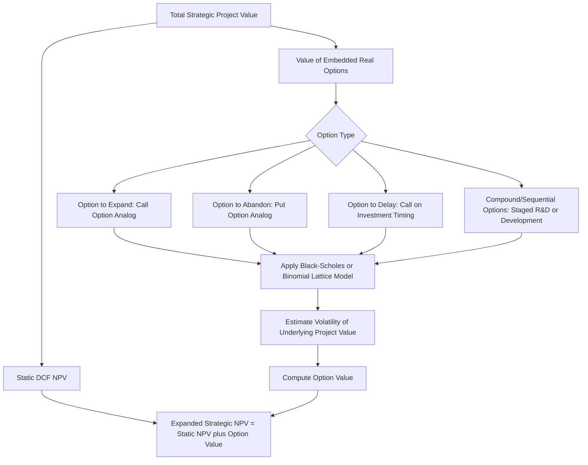

## Real Options in Corporate Valuation

### Overview

Real options valuation applies option-pricing theory — originally developed for financial derivatives — to **real (non-financial) investment decisions**, capturing a source of value that standard static DCF systematically overlooks: managerial **flexibility** to adapt decisions as uncertainty resolves over time. Standard DCF assumes a single, fixed, pre-committed path of future cash flows discounted at a single point in time. Real options theory recognizes that management can often expand, delay, abandon, or otherwise alter a project or investment in response to how new information unfolds, and that this flexibility itself has economic value that a static, single-path DCF does not capture.

---

### The Core Limitation of Static DCF That Real Options Addresses

**Key Points**

- Standard NPV/DCF analysis implicitly assumes a company makes an **irrevocable, all-or-nothing commitment** at the valuation date, with no ability to adjust course as uncertainty resolves.
- In reality, many investment decisions are **sequential and conditional**: a company can invest a small amount now to preserve the *option* to invest more later if conditions turn favorable, or abandon further investment if conditions turn unfavorable — asymmetrically capturing upside while limiting downside.
- This asymmetry (limited downside, retained upside) is precisely the payoff structure of a **financial call option**, which is why option-pricing frameworks (rather than standard discounted cash flow) are the appropriate tool for valuing this flexibility.
- Static DCF, when applied to a project with significant embedded flexibility, will systematically **undervalue** that project, because it prices only the expected value of a single committed path and ignores the value of being able to avoid the downside path or double down on the upside path.

---

### Types of Real Options

**Key Points**

The most commonly analyzed real option categories in corporate valuation:

| Option Type | Description | Financial Option Analog | Typical Application |
| --- | --- | --- | --- |
| **Option to Expand** | Right to scale up investment if conditions are favorable | Call option | Entering a new market at small scale, with the right to expand |
| **Option to Abandon** | Right to exit/liquidate a project if conditions are unfavorable | Put option | Terminating a project and recovering salvage value |
| **Option to Delay** | Right to postpone investment until more information is available | Call option (on the investment decision itself) | Natural resource extraction (wait for favorable commodity prices), R&D commercialization |
| **Option to Switch/Flex** | Right to switch inputs, outputs, or operating modes | Portfolio of options | Flexible manufacturing that can switch between products; power plants that can switch fuel sources |
| **Compound/Sequential Options** | An option whose exercise creates a further option (a "stage-gate" structure) | Option on an option | Multi-phase R&D, pharmaceutical drug development, staged capital projects |

---

### Analogy Between Real Options and Financial Options

**Key Points**

| Financial Option Parameter | Real Option Analog |
| --- | --- |
| Current stock price ($S$) | Present value of expected cash flows from the underlying project/asset |
| Strike price ($K$) | Investment cost required to exercise the option (e.g., cost to expand, cost to abandon-and-recover) |
| Time to expiration ($T$) | Time period during which the option to invest/abandon/expand remains available |
| Volatility ($\sigma$) | Volatility of the underlying project's value (often proxied using volatility of comparable publicly traded companies' returns, or of the relevant commodity/output price) |
| Risk-free rate ($r_f$) | Risk-free rate |

This mapping allows adaptation of standard option-pricing models — most commonly the **Black-Scholes model** (for simple, European-style options with a single exercise date) or a **binomial/lattice model** (for options with multiple decision points, early exercise features, or path-dependent payoffs) — to value the real option.

---

### Black-Scholes Application to a Real Option (Illustrative)

**Example**

Consider a company evaluating whether to invest in a follow-on expansion of a project, where the expansion decision can be delayed up to 3 years to observe how demand develops.

Assume:

- $S$ (PV of expected cash flows from expansion, if undertaken today) = $80M
- $K$ (cost to build out the expansion) = $100M
- $T$ (time until the expansion decision must be made) = 3 years
- $\sigma$ (volatility of project value, proxied from comparable company equity volatility) = 35%
- $r_f$ (risk-free rate) = 4%

Using the Black-Scholes formula for a call option:

$$d_1 = \frac{\ln(S/K) + (r_f + \sigma^2/2) \times T}{\sigma\sqrt{T}}$$

$$d_2 = d_1 - \sigma\sqrt{T}$$

$$C = S \times N(d_1) - K \times e^{-r_f T} \times N(d_2)$$

Calculating:

$$d_1 = \frac{\ln(80/100) + (0.04 + 0.35^2/2) \times 3}{0.35\sqrt{3}} = \frac{-0.2231 + 0.3038}{0.6062} = \frac{0.0807}{0.6062} \approx 0.1332$$

$$d_2 = 0.1332 - 0.6062 \approx -0.4730$$

Using standard normal CDF values: $N(d_1) \approx 0.5530$, $N(d_2) \approx 0.3182$

$$C = 80 \times 0.5530 - 100 \times e^{-0.04 \times 3} \times 0.3182$$

$$C = 44.24 - 100 \times 0.8869 \times 0.3182$$

$$C = 44.24 - 28.22 = \$16.02M$$

**Interpretation**: even though the expansion opportunity has a **negative static NPV** today ($S - K = 80 - 100 = -\$20M$), the option to delay and only proceed if conditions improve has a positive value of approximately $16.02M. A static DCF that simply computed NPV at today's expected values and rejected the project (since $-\$20M < 0$) would have discarded this $16.02M of embedded flexibility value entirely.

---

### Total Value Under Real Options Framework

$$\text{Expanded (Strategic) NPV} = \text{Static NPV} + \text{Value of Embedded Real Options}$$

This is the central practical output of real options analysis: it does not replace standard DCF, but **supplements** it by adding back the value of managerial flexibility that a static, single-path DCF cannot capture.

---

### When Real Options Analysis Is Most Valuable

**Key Points**

Real options analysis adds the most incremental insight (relative to standard DCF) when:

- **Uncertainty is high**: the greater the volatility of the underlying project value, the more valuable optionality becomes (mirroring the vega sensitivity of financial options) — real options are least useful for low-uncertainty, mature, predictable businesses, where static DCF is already a good approximation.
- **Management has genuine, credible flexibility**: the option must be real and exercisable — a theoretical ability to abandon a project that management has no practical intention or capability of exercising provides little actual value.
- **Decisions are staged/sequential** rather than all-or-nothing: R&D pipelines, natural resource development (wait for price recovery), phased real estate development, and platform investments with embedded expansion rights are canonical examples.
- **Common application domains**: pharmaceutical/biotech R&D (staged clinical trial investment, where each phase is effectively a compound option on subsequent phases), natural resource extraction (option to develop reserves based on commodity price movements), technology platform investments (option to scale), and patent valuation (a patent is itself effectively a call option on future commercialization).

---

### Practical Limitations and Criticisms

**Key Points**

- **Volatility estimation is difficult and consequential**: unlike financial options, where volatility can often be observed or implied from liquid markets, real project volatility must typically be proxied (from comparable public company equity volatility, historical project-level variability, or Monte Carlo simulation of underlying cash flow drivers) — and option value is highly sensitive to this input, making it a significant source of estimation uncertainty [Inference: the appropriate proxy and the resulting sensitivity vary substantially by project type and data availability].
- **Market completeness assumption**: standard option-pricing models (Black-Scholes in particular) assume the underlying asset is traded in a complete, frictionless market allowing continuous replication/hedging — an assumption that holds reasonably well for traded financial assets but often does not hold for illiquid real assets or projects, raising theoretical questions about whether risk-neutral valuation is strictly applicable without modification.
- **Risk of overstatement/gaming**: because real options analysis can justify proceeding with projects that appear negative-NPV under standard DCF (by appealing to embedded optionality), there is a practical risk of the framework being used to rationalize marginal or poor investment decisions rather than rigorously applied — analysts should be able to point to genuine, credible, and material flexibility, not merely assert its existence.
- **Complexity vs. benefit trade-off**: for many corporate investment decisions, the incremental precision gained from formal option-pricing mathematics may not justify the added modeling complexity relative to simpler tools like scenario analysis or decision-tree analysis, which can capture much of the same qualitative insight (the value of flexibility) with more transparent, easier-to-communicate mechanics.

---

### Relationship to Scenario Analysis and Decision Trees

**Key Points**

- **Decision tree analysis** is a related, often more accessible alternative: explicitly mapping out sequential decision points, associated probabilities, and payoffs, then folding back the tree to a present value — capturing much of the same "flexibility has value" insight without requiring option-pricing mathematics or volatility estimation.
- Real options (via Black-Scholes/binomial models) and decision trees are **not mutually exclusive** — a binomial lattice model is, in fact, mathematically a specific, structured form of decision tree, converging to the Black-Scholes result as the number of time steps increases.
- For most non-specialist corporate finance applications, decision tree analysis is often the more practical and communicable tool, with formal option-pricing models reserved for situations (large capital commitments, natural resource/commodity-linked projects, pharmaceutical portfolio valuation) where the additional precision and rigor are judged to justify the complexity.

---

### Diagram: Real Options Value Decomposition

---

### Common Pitfalls

**Key Points**

- Applying real options analysis to justify proceeding with a negative-NPV project without a genuine, credible, and material source of managerial flexibility — using the framework to rationalize rather than rigorously analyze
- Using an unreliable or poorly justified volatility estimate, given how sensitive option value is to this single input
- Double-counting: separately adding real option value on top of a DCF that has already implicitly incorporated some flexibility (e.g., via scenario-weighted cash flows) without carefully reconciling what has and has not already been captured
- Applying standard Black-Scholes assumptions (constant volatility, single exercise date, frictionless replication) to real options with materially different characteristics (multiple exercise opportunities, changing volatility over time, illiquid underlying) without appropriate model adaptation (e.g., moving to a binomial/lattice framework)
- Overcomplicating a decision that could be adequately and more transparently analyzed with a simpler decision-tree or scenario-weighted approach, adding modeling complexity without proportionate analytical benefit

---

**Related Topics**

- Decision Tree Analysis and Sequential Investment Decisions
- DCF for High-Growth and Early-Stage Companies
- Monte Carlo Simulation in Financial Modeling
- Black-Scholes Option Pricing Model Mechanics
- Binomial and Lattice Models for Option Valuation
- Patent and Intellectual Property Valuation
- Scenario and Probability-Weighted Valuation Approaches