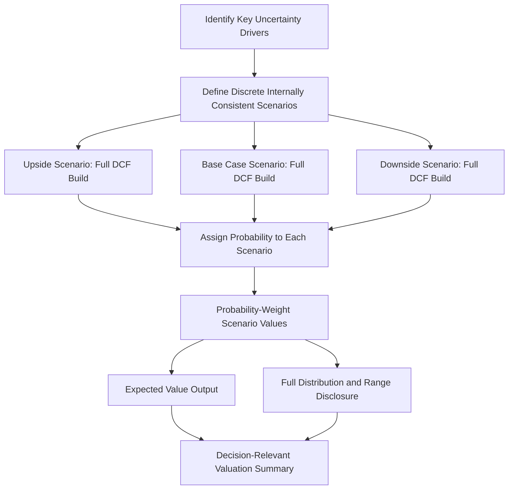

## Probability-Weighted and Scenario-Based DCF

### Overview

Probability-weighted and scenario-based DCF replace the single-path, point-estimate projection of standard DCF with an explicit set of **discrete alternative outcomes**, each assigned a probability, whose values are combined into a probability-weighted (expected) valuation. This approach directly addresses a structural weakness of single-path DCF: it forces the analyst to confront and quantify the genuine range of plausible futures rather than collapsing all uncertainty into a single "most likely" projection, which can understate both the upside and downside tails of the true outcome distribution.

$$V_{expected} = \sum_{i=1}^{n} p_i \times V_i$$

where $p_i$ is the estimated probability of scenario $i$, $V_i$ is the DCF-derived value under scenario $i$, and $\sum p_i = 1$.

---

### Why Scenario-Based DCF Is Needed

**Key Points**

- A single-path DCF necessarily represents **one specific combination** of assumptions across every driver (revenue growth, margins, capex, terminal growth, discount rate) — even when each individual assumption is a defensible "base case," the joint combination of all base-case assumptions simultaneously is only one of many plausible joint outcomes.
- Single-path DCF is particularly poorly suited to situations with:
  - **Binary or discrete outcomes**: regulatory approval/rejection (pharma), litigation outcomes, contract win/loss, M&A deal completion/break
  - **Structurally distinct future paths**: a company facing a strategic fork (e.g., successful platform expansion vs. competitive displacement) where the "average" of the two paths does not resemble either actual possible future
  - **Macro/cyclical uncertainty**: recession vs. expansion scenarios materially changing near-term cash flow trajectories
- Averaging inputs and running a single DCF on those averaged inputs is **not equivalent** to averaging the DCF outputs of distinct scenarios — because DCF is a non-linear function of its inputs (particularly through the discount rate and terminal value mechanics), $DCF(\text{average inputs}) \neq \text{average}(DCF(\text{scenario inputs}))$ in general. This is a direct consequence of Jensen's inequality when the value function is convex or concave in the relevant inputs, and is a primary technical justification for running scenarios separately rather than simply blending assumptions into a single "expected case" model.

---

### Building a Scenario-Based DCF: Step-by-Step Process

#### Step 1 — Identify Key Uncertainty Drivers

- Determine the **small number of drivers** that most materially affect valuation and around which genuine, structurally distinct outcomes exist (typically 1-3 primary drivers; modeling too many independent scenario dimensions leads to a combinatorial explosion of cases that becomes unwieldy to interpret).
- Common driver categories: regulatory/legal outcomes, competitive dynamics (market share retention vs. erosion), macroeconomic conditions, key customer/contract retention, technology adoption rates.

#### Step 2 — Define Discrete Scenarios

- Construct **internally consistent** scenarios — each scenario should represent a coherent narrative where all assumptions (revenue growth, margin trajectory, capex intensity, terminal growth) are mutually consistent with that scenario's underlying story, not simply a mechanical "high/low" flex of each line item independently.
- Standard structure: **Base Case, Upside/Bull Case, Downside/Bear Case** (three scenarios is the most common minimum), though situations with genuinely discrete binary outcomes (e.g., "drug approved" vs. "drug rejected") may warrant a different structure entirely.

#### Step 3 — Assign Probabilities

- Probabilities should be **explicitly justified and documented**, not arbitrarily assigned — sources include historical base rates (e.g., historical Phase III clinical trial success rates by therapeutic area), analyst judgment calibrated against comparable situations, or, where available, market-implied probabilities (e.g., prediction markets, or option-implied probabilities backed out of traded securities).
- Probabilities across all scenarios must **sum to 1.0**.
- Sensitivity to the probability assignments themselves should generally be tested — since the probability weights are themselves uncertain, a robust output typically includes some sensitivity of the final expected value to reasonable variation in the assigned probabilities [Inference: how much probability-weight sensitivity to disclose is a judgment call depending on the audience and decision context].

#### Step 4 — Run Full DCF Under Each Scenario

- Each scenario requires its **own complete DCF build** — explicit period projections, terminal value, and (where relevant) its own discount rate, if the systematic risk profile plausibly differs meaningfully by scenario (though using a constant discount rate across scenarios and letting cash flow assumptions carry the scenario differentiation is also common and often simpler to defend).

#### Step 5 — Probability-Weight the Outputs

$$V_{expected} = \sum_{i} p_i \times V_i$$

- The output can be presented as a single expected value, but is often more informative when presented alongside the **full distribution** (the individual scenario values and their probabilities), since two very different distributions (e.g., a wide bimodal spread vs. a narrow single-peaked distribution) can produce the same expected value while representing very different risk profiles.

---

### Worked Example

**Example**

Assume a company facing a material regulatory decision that will determine its future growth trajectory.

**Scenario definitions:**

| Scenario | Probability | Key Assumption | DCF-Derived Enterprise Value ($M) |
| --- | --- | --- | --- |
| Upside (Approval + Strong Uptake) | 30% | 25% revenue CAGR (Years 1-5), 22% terminal EBITDA margin | 4,200 |
| Base Case (Approval + Moderate Uptake) | 45% | 15% revenue CAGR (Years 1-5), 18% terminal EBITDA margin | 2,600 |
| Downside (Regulatory Rejection) | 25% | Existing business only, no new product revenue | 900 |

**Probability-weighted expected enterprise value:**

$$V_{expected} = (0.30 \times 4{,}200) + (0.45 \times 2{,}600) + (0.25 \times 900)$$

$$V_{expected} = 1{,}260 + 1{,}170 + 225 = \$2{,}655M$$

**Interpretation**: the probability-weighted value of $2,655M does not correspond to any single scenario's actual outcome — no version of reality produces exactly $2,655M; the company will end up at approximately $4,200M, $2,600M, or $900M, not at the blended figure. The expected value is useful for portfolio-level decision-making, risk-neutral comparison across alternatives, or as a single summary statistic, but the **full distribution** (not just its mean) should generally be presented alongside it, since the range ($900M to $4,200M) reveals a risk profile the single $2,655M figure alone does not communicate.

---

### Scenario-Based DCF vs. Monte Carlo Simulation

**Key Points**

| Approach | Structure | Best Suited For |
| --- | --- | --- |
| **Discrete Scenario Analysis** | Small number (typically 3-5) of distinct, named, internally consistent scenarios, each fully modeled | Situations with genuinely discrete/binary drivers (regulatory outcomes, M&A completion, distinct strategic paths) |
| **Monte Carlo Simulation** | Continuous probability distributions assigned to individual input variables (growth rate, margin, WACC), simulated thousands of times to generate an output distribution | Situations with continuous uncertainty across many interacting variables, where the goal is to characterize the full shape of the output distribution rather than a small number of discrete named outcomes |

- The two approaches are complementary rather than mutually exclusive — some models combine both, using discrete scenarios for the most structurally significant binary drivers (e.g., regulatory approval) while applying Monte Carlo simulation to continuous operational assumptions (margin variability, growth rate uncertainty) *within* each discrete scenario.

---

### Relationship to Real Options Analysis

- Probability-weighted scenario DCF and real options analysis both address the limitations of single-path DCF, but from different angles: scenario analysis captures **exogenous uncertainty** (outcomes the company does not control, like regulatory decisions or macro conditions) by weighting alternative fixed paths, while real options analysis captures **endogenous flexibility** (management's ability to actively respond and adapt as uncertainty resolves) by valuing the option-like payoff structure of sequential decisions.
- In practice, a decision-tree structure that combines probability-weighted branches **with** embedded management decision points at each branch (continue, expand, abandon) merges both concepts, and is a common practical middle ground between full option-pricing mathematics and simple static scenario weighting.

---

### Diagram: Scenario-Based DCF Structure

---

### Common Pitfalls

**Key Points**

- **Averaging inputs first, then running a single DCF**, rather than running separate full DCFs per scenario and averaging the resulting *outputs* — these produce different (and generally non-equivalent) results due to the non-linearity of DCF mechanics.
- Constructing scenarios that are **not internally consistent** — e.g., a "bull case" that assumes both aggressive revenue growth and simultaneously conservative margin/capex assumptions inherited from the base case, rather than a coherent narrative where all assumptions move together plausibly.
- Assigning probabilities without clear justification or an auditable basis, undermining the credibility of the final probability-weighted output.
- Presenting only the single probability-weighted expected value without disclosing the underlying scenario range, obscuring the actual risk/dispersion embedded in the analysis — particularly problematic when scenario outcomes are widely dispersed or bimodal.
- Using an excessive number of scenario dimensions or combinations, producing an unwieldy analysis that is difficult to interpret or communicate, when a smaller, well-chosen set of 3-5 scenarios would convey most of the same decision-relevant information.

---

**Related Topics**

- Monte Carlo Simulation in Financial Modeling
- Real Options in Corporate Valuation
- Decision Tree Analysis and Sequential Investment Decisions
- DCF for High-Growth and Early-Stage Companies
- Sensitivity Analysis and Data Tables in DCF Models
- Football Field Charts and Valuation Triangulation
- Multi-Stage Growth Models