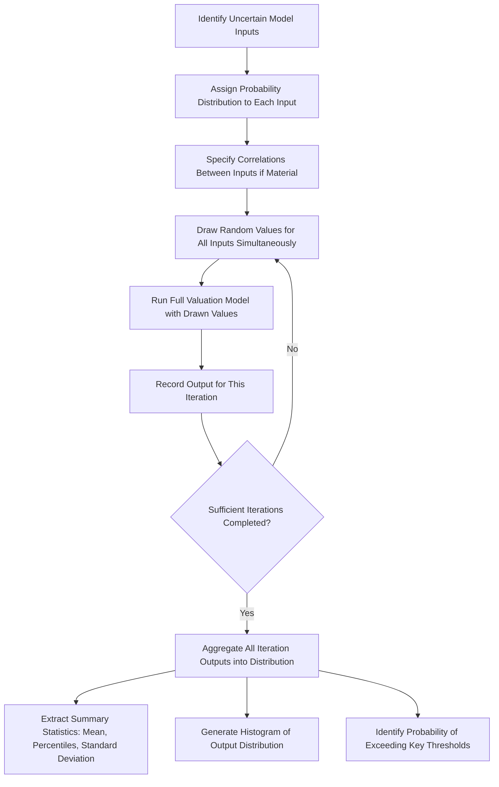

## Principles of Monte Carlo Simulation in Valuation

### Overview

Monte Carlo simulation is a quantitative technique that replaces single-point or discrete-scenario input assumptions with explicit **probability distributions**, then generates a valuation output not as a single number but as a **full distribution of possible outcomes** by repeatedly sampling from those input distributions and recalculating the model thousands of times. Where scenario-based DCF captures uncertainty through a small number of discrete named cases, Monte Carlo simulation captures uncertainty as a continuous range across one or more inputs simultaneously, producing a much richer characterization of the valuation's risk profile.

---

### Core Mechanics

**Key Points**

The Monte Carlo process, applied to a DCF or any valuation model, follows a consistent structure:

1. **Identify uncertain inputs**: select the model variables (revenue growth, margin, terminal growth rate, WACC, capex intensity, churn rate, etc.) that will be treated as random variables rather than fixed point estimates.
2. **Assign a probability distribution to each uncertain input**: specify the distribution type (normal, triangular, uniform, lognormal, etc.) and its parameters (mean, standard deviation, min/max, most-likely value) based on historical data, analyst judgment, or comparable company variability.
3. **Specify correlations between inputs** (where relevant): many inputs are not independent — for example, revenue growth and margin may be positively or negatively correlated depending on the business's operating leverage characteristics; ignoring correlation when it is material can meaningfully distort the simulated output distribution.
4. **Run the simulation**: draw a random value for each uncertain input (respecting specified correlations) according to its assigned distribution, run the full valuation model using that specific combination of drawn values, and record the resulting output (e.g., enterprise value or value per share). Repeat this process a large number of times (typically 1,000 to 100,000+ iterations, depending on the desired precision and the complexity of the model).
5. **Analyze the resulting output distribution**: rather than a single value, the result is a full distribution of possible valuation outcomes, from which summary statistics (mean, median, standard deviation, percentiles, probability of exceeding/falling below a threshold) can be extracted.

---

### Choosing Probability Distributions for Inputs

**Key Points**

The choice of distribution shape for each uncertain input materially affects the simulation output and should reflect the actual nature of the underlying uncertainty:

| Distribution | Typical Use Case | Key Characteristics |
| --- | --- | --- |
| **Normal** | Variables with symmetric uncertainty around a central estimate (e.g., near-term margin variability) | Symmetric, unbounded tails (can technically generate implausible extreme values without truncation) |
| **Triangular** | Variables where a most-likely value plus explicit min/max bounds are known or estimable (common when historical data is limited and the analyst relies on judgment) | Simple to parameterize (min, most likely, max); bounded, asymmetric if the most-likely value is not centered |
| **Uniform** | Variables where any value within a range is considered equally likely, and there is no basis to favor a central estimate | Bounded, no central tendency assumed |
| **Lognormal** | Variables that cannot be negative and may have a long right tail (e.g., revenue growth rates, commodity prices, terminal multiples) | Skewed right, bounded at zero, commonly used for multiplicative processes |
| **PERT (a modified Beta distribution)** | Similar use case to triangular but with a smoother, less extreme peak around the most-likely value | Bounded, less weight in the tails than a simple triangular distribution |

Selecting an inappropriate distribution shape — for example, using a normal distribution (with unbounded tails) for a variable that has a hard physical or economic floor, like a margin that cannot go below zero — can generate a meaningful share of simulated iterations that are economically nonsensical, distorting summary statistics if not addressed (e.g., via truncation or a more appropriate bounded distribution choice).

---

### The Role of Correlation

**Key Points**

- Treating all uncertain inputs as **independent** when they are, in reality, correlated is one of the most common and consequential errors in Monte Carlo model construction.
- Common correlation patterns in valuation models:
  - **Revenue growth and margin**: often positively correlated in businesses with high operating leverage (stronger growth drives better fixed-cost absorption and higher margins), though the direction and strength of this relationship is company- and industry-specific.
  - **WACC and terminal growth**: some practitioners argue these should be correlated (e.g., higher macro growth environments correlating with somewhat higher risk-free rates), though this remains an area of some practitioner disagreement, and many models simplify by treating them independently [Inference: the appropriate correlation structure, if any, between WACC and terminal growth is not a settled convention and depends on the specific macro framework the analyst adopts].
  - **Multiple revenue line items** within a single company (e.g., different product segments) may share common macro or competitive drivers, warranting explicit correlation rather than independent simulation.
- Correlation is typically implemented using a **correlation matrix** combined with a technique such as **Cholesky decomposition** to generate correlated random draws from otherwise independently-specified marginal distributions.
- Ignoring material positive correlations tends to **understate** the true dispersion (variance) of the output distribution, since independent draws are more likely to partially offset each other (some inputs randomly landing high, others randomly landing low) than correlated draws, which tend to move together and produce more extreme joint outcomes.

---

### Interpreting Monte Carlo Output

**Key Points**

The primary output is typically visualized and summarized as:

- **Histogram/probability distribution** of the output metric (e.g., enterprise value or value per share) across all simulation iterations
- **Summary statistics**: mean, median, standard deviation, skewness
- **Percentile ranges**: e.g., "the 10th-to-90th percentile range of implied value per share is $X to $Y" — often more decision-useful than a single point estimate, since it directly communicates the width of plausible outcomes
- **Probability of specific thresholds**: e.g., "there is a 65% probability the intrinsic value exceeds the current market price," which can be extracted directly from the simulated distribution and is often more actionable for investment decision-making than a single expected value
- **Sensitivity/tornado analysis derived from the simulation**: identifying which input variables' uncertainty contributes most to the output distribution's total variance, helping prioritize which assumptions warrant the most additional research or scrutiny

---

### Illustrative Simplified Example

**Example**

Assume a simplified single-period valuation where Enterprise Value depends on next-year EBITDA and an exit multiple, both treated as uncertain:

- EBITDA: triangular distribution (min = $80M, most likely = $100M, max = $130M)
- Exit multiple: normal distribution (mean = 8.0x, standard deviation = 1.0x, truncated at a minimum of 4.0x to avoid economically implausible low multiples)

**Simulation process (conceptual, illustrating the logic rather than reproducing actual random draws):**

1. Draw a random EBITDA value from the triangular distribution (e.g., one iteration might draw $95M, another $112M, another $83M)
2. Draw a random exit multiple from the truncated normal distribution (e.g., 7.2x, 8.9x, 6.5x respectively)
3. Compute Enterprise Value = EBITDA × Multiple for that iteration (e.g., $95M × 7.2x = $684M; $112M × 8.9x = $997M; $83M × 6.5x = $540M)
4. Repeat for 10,000+ iterations, then examine the resulting distribution of Enterprise Values

The resulting output might show, for illustration: a mean Enterprise Value of approximately $800M, a 10th percentile of $620M, and a 90th percentile of $1,010M — providing a much richer picture of the valuation's uncertainty than a single-point estimate of "$800M" alone would convey, since a decision-maker can now see both the central tendency and the width of the plausible range.

---

### Monte Carlo vs. Discrete Scenario Analysis: When to Use Each

**Key Points**

- **Monte Carlo** is best suited to situations with **continuous uncertainty across many interacting variables** where the goal is to characterize the shape and width of the full output distribution (e.g., understanding the range of plausible valuations for a mature company with moderately uncertain but continuously-varying growth and margin assumptions).
- **Discrete scenario analysis** is best suited to situations with a **small number of structurally distinct, discrete outcomes** (e.g., a binary regulatory approval decision), where the underlying uncertainty does not naturally take a continuous form.
- The two are **complementary**: a common hybrid approach applies discrete scenarios to capture the most significant binary/structural uncertainties (e.g., "regulatory approval" vs. "rejection") while running a full Monte Carlo simulation *within* each discrete scenario to capture the continuous operational uncertainty (margin, growth rate variability) conditional on that scenario.

---

### Practical Implementation Considerations

**Key Points**

- **Number of iterations**: too few iterations produce an unstable, noisy output distribution that changes materially each time the simulation is re-run; a sufficiently large number of iterations (commonly tens of thousands for spreadsheet-based tools) is needed for the output distribution to stabilize and converge to a reliable representation of the underlying assumed distributions.
- **Software tools**: dedicated Monte Carlo add-ins for spreadsheet software (e.g., @RISK, Crystal Ball) are commonly used in professional practice, though native random-number-generation functions combined with data tables or macros can also implement basic Monte Carlo simulation directly in a spreadsheet, and dedicated statistical/programming environments (Python, R) offer more flexibility for complex correlation structures and larger iteration counts.
- **Model run-time**: because Monte Carlo requires re-running the full valuation model thousands of times, computationally complex models (e.g., detailed 3-statement models with extensive circularity) can become slow to simulate; simplifying the core valuation logic used within the simulation (while preserving its essential economics) is a common practical trade-off.
- **Communicating results to non-technical audiences**: because Monte Carlo output is inherently probabilistic and can be unfamiliar to audiences accustomed to single-point DCF outputs, careful framing (percentile ranges, clear visualizations, plain-language interpretation of probability statements) is important to avoid the results being over-interpreted as false precision or under-interpreted as unhelpfully vague.

---

### Diagram: Monte Carlo Simulation Process Flow

---

### Common Pitfalls

**Key Points**

- Treating all uncertain inputs as **independent** when meaningful correlations exist, understating the true dispersion of the output distribution
- Using an **inappropriate distribution shape** for a given input (e.g., an unbounded normal distribution for a variable with a hard economic floor), generating implausible simulated values that distort output statistics
- Running **too few iterations**, producing an unstable output distribution that would materially change if the simulation were re-run
- Presenting only a single mean/expected value output from the simulation without disclosing the percentile range or distribution shape, discarding the primary informational advantage Monte Carlo offers over point-estimate DCF
- Building an excessively complex simulation (too many correlated variables, overly granular distributions) that adds computational burden without proportionate improvement in decision-relevant insight, when a simpler scenario-based approach might communicate the same essential risk picture more transparently

---

**Related Topics**

- Probability-Weighted and Scenario-Based DCF
- Sensitivity Analysis and Data Tables in DCF Models
- Correlation Modeling and Cholesky Decomposition
- Real Options in Corporate Valuation
- DCF for High-Growth and Early-Stage Companies
- Statistical Distributions in Financial Modeling
- Tornado Charts and Variance Decomposition Analysis