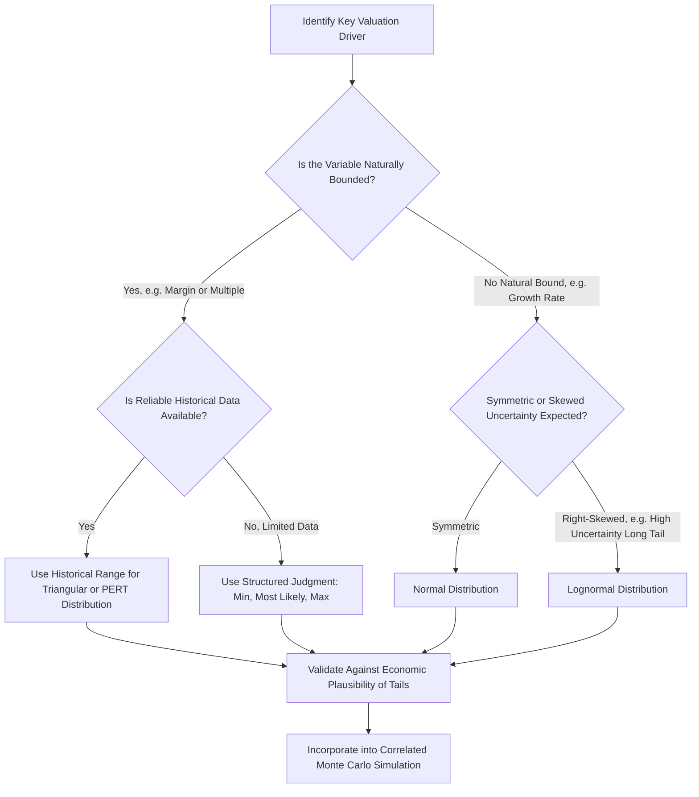

## Defining Probability Distributions for Key Drivers

### Overview

Defining appropriate probability distributions for key valuation drivers is the foundational input-design step that determines the reliability of any Monte Carlo simulation. The quality of a simulation's output is entirely bounded by the quality of its input distribution assumptions — a technically sophisticated simulation engine run on poorly specified distributions will still produce an unreliable output distribution. This topic focuses on the practical process of selecting distribution shapes, estimating their parameters, and validating them for the specific drivers most commonly modeled in corporate valuation: revenue growth, margins, terminal growth/multiples, and the discount rate.

---

### General Framework for Distribution Selection

**Key Points**

For each uncertain driver, the analyst must answer three sequential questions:

1. **What is the underlying economic/statistical nature of this variable?** Is it naturally bounded (e.g., a margin cannot exceed 100%, a churn rate cannot be negative)? Is it naturally skewed (e.g., growth rates or multiples, which are multiplicative and bounded at zero, tend to be right-skewed rather than symmetric)? Is it a rate/ratio or an absolute dollar amount?
2. **What data or judgment is available to parameterize the distribution?** Historical time series (own-company or comparable companies), analyst judgment calibrated against a small number of reference points (min/most likely/max), or externally observable market data (e.g., implied volatility from traded options, futures curves for commodities)?
3. **Does the distribution shape match the answer to (1), given the data available in (2)?** A distribution should not be selected purely for mathematical convenience (e.g., defaulting to normal because it's the most familiar) if the underlying variable's true behavior is better represented by a different shape.

---

### Driver-by-Driver Distribution Guidance

#### Revenue Growth Rate

**Key Points**

- Revenue growth is commonly modeled with a **normal** or **triangular** distribution for near-term periods where historical volatility provides a reasonable basis for a symmetric range around a central estimate.
- For longer-horizon or higher-uncertainty growth (early-stage companies, new product launches), a **lognormal** distribution is often more appropriate, since growth outcomes are naturally bounded below (a company cannot shrink by more than 100% in a single period, i.e., growth cannot go below −100%) but can extend to a long right tail if a product or market unexpectedly takes off — a symmetric normal distribution would incorrectly assign equal probability mass to an equally extreme negative outcome, which is often not economically plausible.
- **Parameterization approach**: historical revenue growth volatility (standard deviation of historical year-over-year growth rates) for the company itself, or for closely comparable companies if company-specific history is limited or unrepresentative, provides a starting point for the standard deviation input; analyst judgment should adjust this baseline for any known structural changes (new product cycles, competitive entries, macro regime shifts) not reflected in historical data.

#### Operating Margin

**Key Points**

- Margins are **bounded** (cannot exceed 100%, and in practice rarely approach that theoretical bound for most industries) and often exhibit **mean-reverting** behavior over time (competitive dynamics tend to compress unusually high margins and improve unusually low margins over a multi-year horizon) — a **triangular** or **PERT distribution** bounded by economically plausible min/max values is often preferred over an unbounded normal distribution for this reason.
- When historical margin data spans a full business cycle, the **historical margin range** (min, max, and average) over that cycle provides a natural basis for triangular/PERT parameterization, particularly for cyclical businesses (see the related topic on DCF for Cyclical Companies).
- Margin uncertainty is frequently **correlated with revenue growth uncertainty** (see the correlation discussion in the parent topic on Monte Carlo principles) — for businesses with material operating leverage, higher simulated growth outcomes should generally be paired with higher simulated margin outcomes in a correlated simulation, not drawn entirely independently.

#### Terminal Growth Rate

**Key Points**

- Terminal growth is one of the most sensitive inputs to the overall valuation and one of the most difficult to parameterize with genuine statistical rigor, since it represents an assumption about the very long run (perpetuity), for which little direct historical analog exists at the company level.
- Common practice: a **triangular or uniform distribution bounded by macro constraints** — the maximum bound should not exceed long-run nominal GDP growth or inflation expectations (consistent with the standard terminal growth constraint applied even in deterministic DCF), and the minimum bound is often set at or near zero or a modest positive rate, reflecting the view that a going-concern business is unlikely to be modeled as permanently shrinking in nominal terms.
- Given how much total valuation typically rests on this single assumption (via its effect on terminal value), some practitioners deliberately keep the terminal growth distribution relatively **narrow** (tight bounds) precisely because they want the simulation's output dispersion to reflect genuine operational/competitive uncertainty rather than being dominated by an arbitrarily wide terminal growth range that could overwhelm all other sources of modeled uncertainty [Inference: how narrow to set this range is a modeling choice that depends on how much weight the analyst wants terminal assumption uncertainty to carry in the total output dispersion, and is not a settled numerical convention].

#### Discount Rate (WACC / Cost of Equity)

**Key Points**

- WACC uncertainty is often driven primarily by uncertainty in the **equity risk premium** and **beta** estimates (both of which vary depending on the measurement window, methodology, and comparable set chosen) rather than the risk-free rate, which is typically the most directly observable component.
- A **normal distribution** centered on the point-estimate WACC, with a standard deviation informed by the range of WACC estimates produced under different reasonable beta/ERP methodological choices, is a common approach.
- Some practitioners choose to **hold WACC fixed** (not simulated) while allowing operational drivers (growth, margin) to vary, on the grounds that mixing discount rate uncertainty with cash flow uncertainty in the same simulation can make the output harder to interpret and attribute — this is a legitimate simplification choice, not a requirement, and the decision should be made deliberately and disclosed rather than defaulted into [Inference: whether to simulate WACC alongside operational drivers versus holding it fixed is a genuine practitioner choice without a single dominant convention].

#### Exit Multiple (if used for terminal value)

- Exit multiples are frequently modeled as **normal** or **lognormal**, parameterized from the historical range and volatility of trading multiples for the relevant comparable company set, since multiples are bounded at zero and often exhibit right-skew (extreme high multiples are more plausible in bull markets than correspondingly extreme low or negative-adjacent multiples in bear markets).
- Truncating the lower bound (e.g., preventing simulated draws below a floor multiple that would be economically implausible for the specific industry) is a common practical safeguard against generating nonsensical low-tail outcomes.

---

### Parameter Estimation Techniques

**Key Points**

- **Historical time-series analysis**: computing mean and standard deviation (or min/max/most-likely for triangular distributions) directly from historical company or comparable-company data — the most rigorous approach when sufficient, relevant historical data exists.
- **Expert elicitation / structured judgment**: when historical data is insufficient (new products, structurally changed business, early-stage companies), analysts often use structured elicitation techniques — asking for a "most likely," "reasonably pessimistic (e.g., 10th percentile)," and "reasonably optimistic (e.g., 90th percentile)" estimate for each driver, which can then be used to back into distribution parameters (this is a standard approach for parameterizing triangular or PERT distributions in the absence of hard data).
- **Comparable company cross-sectional analysis**: using the *cross-sectional* dispersion of a metric across a set of comparable companies (rather than one company's own time series) as a proxy for the range of plausible future outcomes for the subject company — useful when the subject company itself has limited own history but operates in an industry with several comparable, more established peers.
- **Market-implied estimates**: where available, extracting probability information directly from market prices — for example, using option-implied volatility on a comparable public company's equity as a proxy for the volatility of an operational driver, or using prediction-market/derivatives pricing for macro or commodity-linked variables — provides an externally validated, forward-looking estimate rather than a purely backward-looking or judgment-based one.

---

### Worked Example: Parameterizing a Triangular Distribution from Structured Judgment

**Example**

Assume an analyst is estimating the distribution for a company's Year 1 revenue growth rate, where limited historical data exists (recent product launch) and the analyst instead uses structured judgment:

- Analyst's "reasonably pessimistic" estimate (management underperforms, weak market reception): 5% growth
- Analyst's "most likely" estimate (management executes as planned): 15% growth
- Analyst's "reasonably optimistic" estimate (strong market reception, upside execution): 30% growth

This maps directly to a **triangular distribution** with parameters: min = 5%, most likely (mode) = 15%, max = 30%.

The mean of a triangular distribution is:

$$\text{Mean} = \frac{\text{min} + \text{mode} + \text{max}}{3} = \frac{5 + 15 + 30}{3} = \frac{50}{3} \approx 16.67\%$$

Note that the mean (16.67%) is **not** the same as the mode/most-likely value (15%) whenever the distribution is asymmetric (here, the distance from mode to max (15 points) exceeds the distance from min to mode (10 points)) — this distinction matters because using the "most likely" value alone as a single-point DCF input, without recognizing that the *probability-weighted expected value* is actually somewhat higher (or lower, depending on skew direction), is a subtle but common source of inconsistency between single-point DCF and its Monte Carlo counterpart.

---

### Validation and Sanity-Checking Distribution Choices

**Key Points**

- **Check the extremes**: examine the values at the tails of the specified distribution (e.g., the 1st and 99th percentile) and confirm they represent economically plausible, if unlikely, outcomes — not impossible or absurd values that reveal a poorly specified distribution.
- **Cross-check against realized historical extremes**: where available, compare the simulation's tail outcomes against the most extreme values actually observed historically for the company or close comparables, as a reasonableness check (while recognizing that future extremes are not strictly bounded by historical extremes).
- **Review correlation assumptions jointly with individual distributions**: a set of individually reasonable marginal distributions can still produce an unreasonable joint output if correlations are misspecified or omitted (see the parent topic's discussion of correlation).
- **Backtest against the deterministic base case**: confirm that the mode (or a reasonable central percentile) of each simulated input distribution is consistent with the point estimate used in the company's standard single-path DCF, so the Monte Carlo simulation is understood as an extension of the base case analysis rather than an unrelated, disconnected exercise.

---

### Diagram: Driver-Specific Distribution Selection Logic

---

### Common Pitfalls

**Key Points**

- Defaulting to a **normal distribution** for every uncertain input purely out of familiarity, without checking whether the variable's true economic behavior (bounded, skewed) is better represented by an alternative distribution shape
- Parameterizing distributions from **insufficient or unrepresentative historical data** (e.g., using only the last 2-3 years of a highly cyclical company's margin history, capturing only one phase of the cycle) without adjusting for known limitations in the data window
- Setting an overly wide terminal growth distribution that ends up dominating the entire simulation's output dispersion, obscuring genuine operational uncertainty in the reported results
- Ignoring the **mean-vs-mode distinction** for skewed distributions (triangular, lognormal), leading to inconsistency between the single-point "most likely" DCF and the probability-weighted Monte Carlo mean
- Failing to validate simulated tail outcomes for economic plausibility, allowing the simulation to generate and report statistics influenced by a meaningful share of nonsensical extreme draws

---

**Related Topics**

- Principles of Monte Carlo Simulation in Valuation
- Correlation Modeling and Cholesky Decomposition
- DCF for Cyclical Companies
- DCF for High-Growth and Early-Stage Companies
- Terminal Value: Gordon Growth Method vs. Exit Multiple Method
- Beta Estimation and the Equity Risk Premium
- Expert Elicitation Techniques in Financial Forecasting