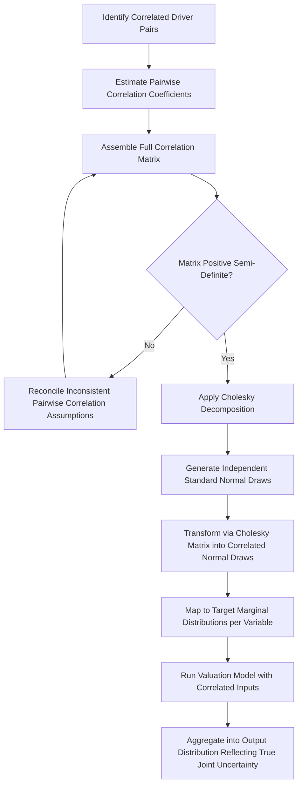

## Correlation Between Simulated Variables

### Overview

Correlation between simulated variables addresses a critical technical requirement in Monte Carlo simulation: many of the uncertain drivers in a valuation model are not statistically independent of one another, and treating them as independent when they are not systematically **understates** the true dispersion of the output distribution. This topic covers the mechanics of identifying, quantifying, and implementing correlation structures in a Monte Carlo simulation — a step that is technically more involved than specifying individual marginal distributions, but essential for producing a realistic risk picture.

---

### Why Independence Is the Wrong Default Assumption

**Key Points**

- The simplest way to build a Monte Carlo simulation is to draw each uncertain input **independently** from its own distribution. This is mathematically convenient but is frequently an **incorrect representation of reality**, since many valuation drivers move together in response to shared underlying economic forces.
- When inputs are positively correlated but modeled as independent, the simulation allows draws where one variable is randomly high while a genuinely correlated variable is randomly low — a combination that would rarely or never occur in the real underlying economics. Because independent draws allow these "offsetting" combinations, the resulting output distribution appears **less dispersed (lower variance)** than the true underlying uncertainty, since extreme joint outcomes (all correlated variables moving unfavorably or favorably together) are undersampled relative to their true likelihood.
- This means that **ignoring positive correlation between key drivers generally leads to understating both tail risk and tail upside** in the simulated output distribution — a materially misleading result for risk assessment purposes, since the very scenarios of greatest concern (or greatest opportunity) are the ones where multiple risk factors move adversely (or favorably) together.

---

### Common Sources of Correlation in Valuation Models

**Key Points**

- **Revenue growth and operating margin**: in businesses with meaningful operating leverage (a largely fixed cost base), stronger revenue growth drives better fixed-cost absorption and higher margins, and vice versa — this is typically a **positive** correlation, though the strength varies by the proportion of fixed vs. variable costs in the business.
- **Revenue growth across business segments or product lines**: multiple segments of the same company are often exposed to shared macroeconomic conditions, common customer bases, or overlapping competitive dynamics, warranting positive correlation between their individual growth simulations rather than treating each segment as an independent draw.
- **WACC components (risk-free rate, equity risk premium, beta)**: macro regime shifts can move multiple WACC inputs together (e.g., a "flight to quality" episode might simultaneously lower risk-free rates and raise the equity risk premium, partially offsetting in their net effect on WACC, or reinforcing depending on the specific relationship assumed).
- **Terminal growth rate and long-run margin/ROIC**: a company's terminal competitive position (reflected in sustained excess returns above WACC, i.e., a persistent EVA spread) is often correlated with its terminal growth rate, since both reflect a shared underlying view about the durability of the company's competitive moat.
- **Commodity prices and input costs**: for companies with significant commodity exposure (either as a revenue driver, like miners, or a cost driver, like manufacturers), a single underlying commodity price variable often drives correlated movement across multiple line items simultaneously (revenue, COGS, capex for producers).
- **Macro-driven correlation across unrelated companies/segments**: in a broader portfolio or multi-business valuation context, segments or subsidiaries operating in different industries may still share correlation through common exposure to GDP growth, interest rates, or currency movements.

---

### Quantifying Correlation: Correlation Coefficients

**Key Points**

- Correlation between two variables is most commonly quantified using the **Pearson correlation coefficient** ($\rho$), ranging from −1 (perfect negative correlation) to +1 (perfect positive correlation), with 0 indicating no linear relationship.

$$\rho_{X,Y} = \frac{\text{Cov}(X,Y)}{\sigma_X \times \sigma_Y}$$

- **Estimating correlation coefficients**:
  - **Historical data**: where sufficient historical time series exist for both variables (e.g., historical revenue growth and margin for the company or comparable companies), the sample correlation coefficient can be computed directly.
  - **Cross-sectional comparable analysis**: examining the correlation between two metrics across a panel of comparable companies at a point in time, as a proxy when the subject company's own time series is too short.
  - **Analyst judgment**: when neither historical nor cross-sectional data is available or reliable, analysts may assign a qualitative correlation assumption (e.g., "moderately positive," translated to a numerical value such as $\rho \approx 0.4$–$0.6$) based on economic reasoning about the underlying business relationship — this is inherently more subjective than data-derived estimates and should be flagged as such [Inference: the appropriate numerical translation of a qualitative correlation judgment varies by analyst and is not a standardized convention].

---

### Implementing Correlated Random Draws: The Correlation Matrix and Cholesky Decomposition

**Key Points**

- When more than two variables are correlated with each other, the full set of pairwise correlation relationships is organized into a **correlation matrix** — a square, symmetric matrix where each cell $(i,j)$ contains the correlation coefficient between variable $i$ and variable $j$ (with 1.0 on the diagonal, representing each variable's correlation with itself).

$$R = \begin{pmatrix}
1 & \rho_{12} & \rho_{13} \\
\rho_{21} & 1 & \rho_{23} \\
\rho_{31} & \rho_{32} & 1
\end{pmatrix}$$

- To generate random draws that respect a specified correlation matrix (rather than drawing each variable's random values completely independently), the standard technique is **Cholesky decomposition**:
  1. Decompose the correlation matrix $R$ into a lower triangular matrix $L$ such that $L \times L^T = R$
  2. Generate a vector of independent standard normal random draws
  3. Multiply this independent vector by $L$ to produce a new vector of correlated standard normal values, which preserve the specified correlation structure
  4. Transform these correlated standard normal values into the desired marginal distributions for each variable (e.g., via the inverse cumulative distribution function of the target distribution — normal, triangular, lognormal, etc.) — this transformation step (going from a correlated normal to a correlated variable with an arbitrary target marginal distribution) is technically referred to as constructing a **copula**, with the Gaussian copula (based on the correlated normal draws) being the most commonly used approach in practice due to its relative simplicity and the availability of the Cholesky technique.
- **Requirement**: the correlation matrix must be **positive semi-definite** for Cholesky decomposition to succeed — an internally inconsistent set of pairwise correlations (e.g., specifying that A and B are highly positively correlated, B and C are highly positively correlated, but A and C are highly negatively correlated) can produce a matrix that fails this mathematical requirement, requiring the analyst to revisit and reconcile the individual pairwise correlation assumptions.

---

### Worked Illustrative Example: Two Correlated Variables

**Example**

Assume the analyst wants to simulate revenue growth and operating margin with a specified positive correlation of $\rho = 0.6$, where:

- Revenue growth: normal distribution, mean = 12%, standard deviation = 5%
- Operating margin: normal distribution, mean = 20%, standard deviation = 3%

**Conceptual process** (illustrating the logic rather than executing the full numerical simulation):

1. Generate two independent standard normal random variables, $Z_1$ and $Z_2$
2. Apply the Cholesky transformation for a 2-variable case with correlation $\rho$:
   - $X_1 = Z_1$
   - $X_2 = \rho \times Z_1 + \sqrt{1-\rho^2} \times Z_2$This produces $X_1$ and $X_2$ as correlated standard normal variables with correlation $\rho = 0.6$.
3. Scale and shift $X_1$ and $X_2$ to the target distributions:
   - Simulated Revenue Growth $= 12\% + 5\% \times X_1$
   - Simulated Operating Margin $= 20\% + 3\% \times X_2$
4. Because $X_2$ is now partly a function of $X_1$ (via the $\rho \times Z_1$ term), a high simulated draw for revenue growth ($X_1$ high) will tend to be paired with a higher-than-average simulated margin ($X_2$ tends to be higher too, due to the shared $Z_1$ component), consistent with the intended positive correlation — whereas fully independent draws would show no such systematic pairing.

This structure ensures that when the simulation happens to draw an unusually strong growth outcome, the paired margin outcome is also more likely to be unusually strong (and vice versa for weak outcomes), rather than the two being drawn as though from entirely unrelated processes.

---

### Practical Simplifications When Full Correlation Modeling Is Impractical

**Key Points**

- **Reduce the number of independently-modeled variables**: rather than simulating many granular line items independently, model a smaller number of "driver" variables that are allowed to vary, with dependent line items calculated as a formula/relationship off those drivers (e.g., modeling margin as a formula-driven function of revenue growth via an assumed operating leverage relationship, rather than as a separately and independently simulated variable) — this implicitly builds in correlation through the model's structure rather than requiring an explicit correlation matrix and Cholesky decomposition.
- **Use a single macro/systematic factor**: introduce one shared random "macro" variable that feeds into multiple otherwise-independent line items (e.g., a single simulated GDP growth factor that partially drives revenue growth across multiple segments), which is a simpler and more transparent way of inducing realistic co-movement than a full multivariate correlation matrix, particularly useful when the primary correlation driver really is a shared macro exposure.
- **Scenario-conditional simulation**: as discussed in the parent Monte Carlo topic, running Monte Carlo simulation separately *within* each of a small number of discrete scenarios (rather than across the full unconditional space) is another practical way of capturing correlation, since all variables within a given scenario are, by construction, drawn consistent with that scenario's underlying narrative.

---

### Diagram: Correlated Simulation Process

---

### Common Pitfalls

**Key Points**

- **Defaulting to independence** across all simulated inputs without explicitly considering whether material correlations exist, systematically understating output dispersion and tail risk
- Specifying an **internally inconsistent correlation matrix** (pairwise correlations that cannot jointly hold, failing the positive semi-definite requirement) without checking or reconciling before attempting Cholesky decomposition
- Assigning correlation coefficients based on **vague intuition without economic justification**, producing a false sense of rigor around what is ultimately still a subjective assumption
- Over-engineering the correlation structure (attempting to specify and justify pairwise correlations across a very large number of variables) when a simpler shared-macro-factor or formula-driven dependency structure would capture most of the same practical benefit with far less complexity
- Failing to validate that the correlated simulation's output actually behaves as expected (e.g., checking that simulated iterations with unusually high growth do, in fact, show a statistical tendency toward higher margins when a positive correlation was specified) — a basic sanity check that catches implementation errors in the correlation logic

---

**Related Topics**

- Principles of Monte Carlo Simulation in Valuation
- Defining Probability Distributions for Key Drivers
- Copula Methods in Quantitative Finance
- DCF for Cyclical Companies
- Economic Value Added and Residual Income Models
- Probability-Weighted and Scenario-Based DCF
- Beta Estimation and the Equity Risk Premium