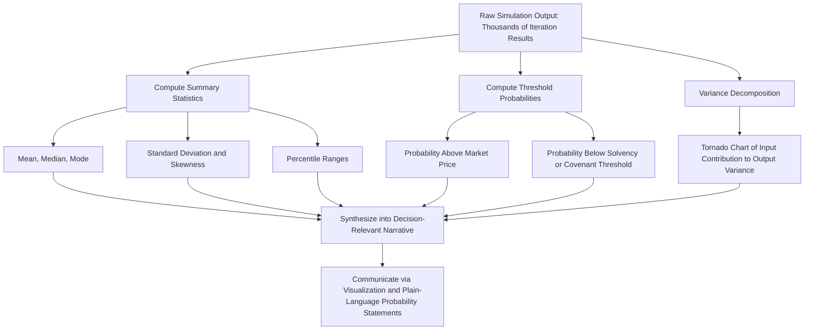

## Interpreting Simulation Output Distributions

### Overview

Interpreting simulation output distributions is the final and, in many respects, most consequential step of a Monte Carlo valuation exercise: converting thousands of raw simulated iterations into decision-relevant insight. A Monte Carlo simulation is only as useful as the analyst's ability to correctly read, summarize, and communicate what its output distribution actually shows — a poorly interpreted simulation can mislead a decision-maker just as easily as a poorly constructed one, even when the underlying inputs and correlation structure were built correctly.

---

###核心 Summary Statistics and What Each One Communicates

**Key Points**

- **Mean (expected value)**: the probability-weighted average of all simulated outcomes. This is the appropriate summary statistic for risk-neutral decision contexts (e.g., portfolio-level capital allocation across many independent bets, where the law of large numbers means the average outcome across many decisions converges toward the expected value). It is **not** necessarily the single most likely individual outcome, particularly for skewed distributions.
- **Median**: the 50th percentile outcome — the value such that half of simulated iterations fall above it and half below. For skewed distributions (common in valuation outputs, which are frequently right-skewed due to bounded downside and unbounded upside), the median is often a more representative "typical outcome" than the mean, since the mean can be pulled upward by a relatively small number of extreme high-value iterations.
- **Mode**: the most frequently occurring value (or range) in the simulated distribution — for a valuation output, this often corresponds most closely to what a single-point deterministic DCF would have produced using "most likely" input assumptions.
- **Standard deviation**: a measure of the overall dispersion/width of the output distribution — a direct, single-number proxy for the total uncertainty/risk embedded in the valuation, useful for comparing the relative riskiness of different valuation scenarios or different companies on a like-for-like basis.
- **Skewness**: measures the asymmetry of the distribution. Positive (right) skew — common in valuation outputs — indicates a longer tail of high-value outcomes relative to low-value outcomes, meaning the mean will sit above the median.
- **Kurtosis**: measures the "fatness" of the tails relative to a normal distribution — higher kurtosis indicates a greater-than-normal probability of extreme outcomes (both high and low) relative to what a normal distribution would predict, which is relevant for understanding true tail risk beyond what standard deviation alone conveys.

**Relationship for right-skewed distributions**: $\text{Mode} < \text{Median} < \text{Mean}$ — recognizing this ordering helps an analyst quickly sanity-check whether a reported distribution is behaving as expected given the underlying economics (e.g., a valuation model with bounded downside — a floor near zero or liquidation value — and open-ended upside should generally show this right-skew pattern).

---

### Percentile Ranges: The Most Decision-Useful Output

**Key Points**

- Rather than relying on a single summary statistic, percentile ranges directly communicate the **width of plausible outcomes** in intuitive terms: "there is an 80% probability the value per share falls between $X and $Y" (the 10th-to-90th percentile range) is typically more useful for decision-making than a single point estimate, because it makes the genuine uncertainty explicit rather than implying false precision.
- Common percentile ranges reported: 10th/90th percentile (an 80% confidence interval), 25th/75th percentile (interquartile range, more robust to extreme tail outliers), and 5th/95th percentile (a wider 90% confidence interval, useful for understanding more extreme tail scenarios).
- **Box plots** are a standard visualization for communicating percentile information compactly: displaying the median, interquartile range (25th-75th percentile box), and whisker extensions to a defined outer percentile or to 1.5× the interquartile range, with points beyond that threshold flagged as statistical outliers.

---

### Probability of Threshold Events

**Key Points**

One of Monte Carlo simulation's most practically useful outputs is the ability to directly compute the **probability that the outcome exceeds (or falls below) a specific decision-relevant threshold** — a question a single-point DCF cannot answer at all.

- **Probability of exceeding current market price**: "in $X\%$ of simulated iterations, the intrinsic value per share exceeds the current trading price" — directly informative for an investment decision, translating the simulation into an actionable buy/hold/avoid signal framed in probabilistic rather than binary terms.
- **Probability of value falling below a covenant or solvency threshold**: relevant in credit analysis or highly leveraged situations, where the question of interest may be "what is the probability that enterprise value falls below total debt outstanding" (implying equity value would be at or near zero, or debt would be impaired).
- **Probability of achieving a specific return hurdle**: common in private equity/LBO contexts, where the relevant question may be "what is the probability the investment achieves at least a 20% IRR," directly computable as the share of simulated iterations exceeding that return threshold.

Extracting these probabilities requires simply counting the share of simulated iterations that satisfy the condition of interest, divided by the total number of iterations — a straightforward calculation, but one that is only possible because the simulation preserved the full distribution rather than collapsing to a single point estimate.

---

### Illustrative Example: Reading a Simulation Output

**Example**

Assume a completed Monte Carlo simulation of implied value per share produces the following summary output (illustrative figures):

| Statistic | Value |
| --- | --- |
| Mean | $42.50 |
| Median | $40.10 |
| Mode (approximate) | $37.00 |
| Standard Deviation | $11.20 |
| 10th Percentile | $28.30 |
| 25th Percentile | $33.80 |
| 75th Percentile | $48.60 |
| 90th Percentile | $58.90 |
| Current Market Price | $38.00 |
| % of Iterations Above Market Price | 61% |

**Interpretation**:

- The ordering $\text{Mode} (\$37.00) < \text{Median} (\$40.10) < \text{Mean} (\$42.50)$ confirms the output distribution is right-skewed, consistent with the typical bounded-downside/open-upside shape of an equity valuation.
- The 80% confidence interval (10th to 90th percentile) spans $28.30 to $58.90 — a wide range relative to the current market price of $38.00, indicating substantial modeled uncertainty.
- The statement "the model implies a 61% probability that intrinsic value exceeds the current market price" is a directly actionable, probabilistically-honest way to frame the investment thesis — meaningfully different in character from a single-point DCF simply stating "intrinsic value is $42.50, therefore the stock is undervalued," which implies a false precision the underlying analysis does not actually support.
- Because $38.00 (current price) sits between the 25th and median percentiles, it is worth explicitly noting that the market price is **not** an extreme outlier relative to the simulated distribution — it sits within a plausible, moderately-likely-to-somewhat-below-median range of the model's own output, which is a useful reasonableness check on whether the model's assumptions are wildly out of step with market pricing or reasonably consistent with it.

---

### Sensitivity/Variance Decomposition: Which Inputs Drive the Output Distribution

**Key Points**

- Beyond summarizing the output distribution itself, a valuable extension of Monte Carlo analysis is **variance decomposition (sensitivity analysis on the simulation)**: identifying which individual input variables contribute most to the total variance of the output.
- **Tornado charts** derived from simulation output are a standard visualization: ranking each input variable by the magnitude of its correlation (or a more formal contribution-to-variance metric) with the output, displayed as horizontal bars of varying length, with the most influential variable at the top.
- This decomposition directly informs where additional analytical or research effort would be most valuable — if a single input (e.g., terminal growth rate) is found to explain a disproportionate share of total output variance, that signals it deserves the most scrutiny, refinement, and possibly additional real-world data-gathering, relative to inputs contributing comparatively little to the output's overall uncertainty.
- This also serves as a useful check on distribution specification: if an input the analyst intuitively expects to be important (e.g., near-term revenue growth) shows surprisingly low contribution to output variance relative to a less-obviously-important input, this discrepancy warrants investigation — it may reflect either a genuine and informative insight about the model's structure, or a specification error (e.g., an unintentionally narrow distribution assigned to the variable that should matter more).

---

### Communicating Simulation Results to Non-Technical Audiences

**Key Points**

- **Avoid false precision in either direction**: a common failure mode is either (a) reporting only the mean and implicitly treating it with the same false precision a single-point DCF might convey, discarding the primary informational value of having run a simulation at all, or (b) presenting the full raw distribution without sufficient summarization, overwhelming a non-technical audience with more statistical detail than is useful for their decision.
- **Lead with the decision-relevant probability or range**, not the full technical distribution: for most business audiences, "there's roughly a 60% chance the value exceeds the current price, with a plausible range of $28 to $59" is more useful framing than presenting the raw histogram, standard deviation, skewness, and kurtosis together without translation.
- **Visualize rather than tabulate** where possible: histograms and box plots communicate distributional shape far more intuitively than a table of percentile figures alone, particularly for audiences unfamiliar with statistical notation.
- **Anchor to the familiar deterministic base case**: explicitly showing where the standard single-point DCF output falls within the simulated distribution (e.g., "the base-case DCF value of $40 corresponds to approximately the 48th percentile of the simulation") helps bridge the gap between an audience's existing intuition (built on point-estimate DCF) and the richer probabilistic framing the simulation provides.

---

### Diagram: From Raw Simulation Output to Decision-Relevant Interpretation

---

### Common Pitfalls

**Key Points**

- Reporting **only the mean** of the simulation output, discarding the distributional information that is the primary reason for running a simulation rather than a standard point-estimate DCF
- Confusing the **mean and the mode** for skewed output distributions, leading to a mismatch between the simulation's "expected value" and what most individual iterations actually produced
- Presenting raw statistical output (skewness, kurtosis, full histograms) to audiences without translating it into plain-language, decision-relevant statements
- Treating the **probability of exceeding a threshold** as a certainty statement rather than a probabilistic one — e.g., interpreting "61% probability of exceeding market price" as equivalent to "the stock is definitely undervalued," when it more accurately reflects meaningful uncertainty in either direction
- Failing to connect the simulation output back to the familiar deterministic base case, leaving an audience without a clear bridge between the point-estimate framing they are used to and the new probabilistic framing the simulation provides
- Ignoring variance decomposition entirely, missing the opportunity to identify which specific input assumptions most warrant additional scrutiny or refinement

---

**Related Topics**

- Principles of Monte Carlo Simulation in Valuation
- Defining Probability Distributions for Key Drivers
- Correlation Between Simulated Variables
- Tornado Charts and Variance Decomposition Analysis
- Sensitivity Analysis and Data Tables in DCF Models
- Probability-Weighted and Scenario-Based DCF
- Deriving Implied Value Per Share