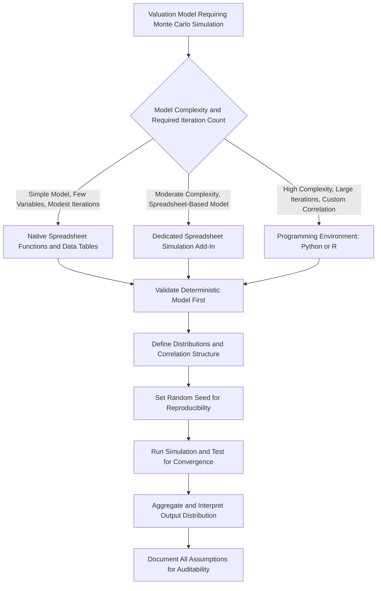

## Simulation Tools and Implementation Approaches

### Overview

Implementing Monte Carlo simulation for corporate valuation requires selecting a technical platform capable of generating random draws from specified distributions, respecting correlation structures, iterating the full valuation model thousands of times, and aggregating the results into an interpretable output. The right tool depends on the complexity of the model, the required iteration count, the sophistication of the correlation structure, and the technical background of the team maintaining the model. This topic surveys the standard implementation approaches, from spreadsheet-native techniques to dedicated add-ins to full programming environments.

---

### Implementation Approach 1: Native Spreadsheet Functions and Data Tables

**Key Points**

- The most accessible approach uses a spreadsheet's built-in random number generation functions (e.g., `RAND()` and `RANDBETWEEN()` in common spreadsheet software) combined with inverse cumulative distribution transformations to generate draws from a specified distribution shape.
- For a normal distribution, a random draw can be generated using the inverse normal CDF function applied to a uniform random number: `NORM.INV(RAND(), mean, standard_deviation)` (or the equivalent function name in the specific spreadsheet software being used).
- For a triangular distribution, no single built-in function typically exists, requiring a manual formula implementing the triangular distribution's inverse CDF piecewise (based on whether the random uniform draw falls below or above the proportion corresponding to the mode).
- **Data tables** (a spreadsheet feature that recalculates a formula across a grid of input values) can be repurposed to generate many iterations: setting up a data table where each row represents one simulation iteration, with the row's random inputs feeding into the valuation model, and the model's output value captured for each row.
- **Limitations**: native spreadsheet methods are workable for a modest number of iterations (hundreds to a few thousand) and a small number of uncorrelated or simply-correlated variables, but become cumbersome, slow, and difficult to maintain for larger iteration counts, complex correlation structures (implementing Cholesky decomposition manually in spreadsheet formulas is possible but unwieldy), or models with substantial internal complexity (e.g., full three-statement models with circularity).

---

### Implementation Approach 2: Dedicated Spreadsheet Add-Ins

**Key Points**

- Purpose-built Monte Carlo simulation add-ins for spreadsheet software are the most common professional-practice tool for corporate valuation and financial modeling applications, because they integrate directly with an existing spreadsheet-based model (avoiding the need to rebuild the valuation logic in a separate environment) while providing a much more robust and user-friendly interface for defining distributions, correlations, and running large numbers of iterations.
- Typical add-in capabilities include: a library of pre-built distribution types (normal, triangular, lognormal, PERT, uniform, and many others) that can be assigned to specific cells via a graphical interface rather than manual formula construction; built-in correlation matrix specification and Cholesky decomposition handled automatically behind the scenes; automated iteration and results aggregation (running the simulation thousands of times without manual data table setup); and built-in output visualization (histograms, percentile tables, tornado/sensitivity charts) generated automatically from the simulation results.
- These tools are widely used in corporate finance, project finance, and risk management practice specifically because they preserve the familiar spreadsheet modeling environment that most valuation models are already built in, lowering the barrier to adoption relative to migrating a model to a programming environment.
- **Limitations**: add-ins typically require a paid license; very large iteration counts or highly complex models can still encounter spreadsheet software performance constraints (calculation speed, memory) regardless of the add-in's own efficiency; and version control/collaboration on spreadsheet-based simulation models can be more cumbersome than code-based approaches for larger teams.

---

### Implementation Approach 3: Programming Environments (Python, R)

**Key Points**

- For more complex simulations — very large iteration counts, sophisticated correlation structures, integration with external data sources, or scenario-conditional simulation logic — dedicated programming environments offer substantially more flexibility than spreadsheet-based approaches.
- **Python**: widely used for Monte Carlo simulation in finance, leveraging libraries such as `numpy` (efficient random number generation and array operations, enabling vectorized simulation of many iterations simultaneously rather than looping), `scipy.stats` (a comprehensive library of probability distributions with built-in random variate generation and inverse CDF functions), and `pandas` (data handling and results aggregation). Correlation structures can be implemented via `numpy.linalg.cholesky` for Cholesky decomposition, and results visualization via libraries such as `matplotlib` or `seaborn`.
- **R**: a strong native fit for statistical simulation given R's origins as a statistical computing language, with built-in distribution functions (e.g., `rnorm()`, `rtriangle()` from relevant packages, `rlnorm()`) and strong native support for statistical summary and visualization of simulation output.
- **Key advantages of a programming approach**: essentially unlimited iteration counts (constrained mainly by computation time rather than software licensing or spreadsheet performance limits), full flexibility to implement arbitrary correlation structures, custom distribution shapes, and scenario-conditional simulation logic, and better suitability for reproducible, version-controlled, and auditable analysis (code can be reviewed, tested, and re-run deterministically given a fixed random seed).
- **Trade-off**: requires the model itself (the valuation logic, not just the simulation wrapper) to either be rebuilt in the programming environment, or for the programming environment to interface with an existing spreadsheet model (e.g., via a library that can drive spreadsheet recalculation programmatically) — the latter approach can partially preserve the familiar spreadsheet-based model while gaining programmatic simulation control, though this introduces its own integration complexity.

---

### Implementation Approach 4: Vectorized vs. Iterative Simulation Design

**Key Points**

- When implementing simulation in a programming environment, a key design choice is between a **vectorized** approach (generating all random draws for all iterations at once as arrays/matrices, then computing the valuation formula across the entire array simultaneously) versus an **iterative/looped** approach (running the full valuation calculation one iteration at a time in an explicit loop).
- Vectorized implementations are generally **substantially faster** in most programming environments (particularly Python with `numpy`), since array-based operations are optimized at a lower level than equivalent explicit loops — this becomes especially important as iteration counts scale into the tens of thousands or more.
- However, vectorization can be more difficult to implement for valuation models with genuine path-dependency or complex conditional logic (e.g., a model where a covenant breach in one period changes the capital structure/cash flow assumptions in subsequent periods) — such models may require an iterative, period-by-period simulation structure that is harder to fully vectorize, representing a genuine trade-off between computational speed and modeling flexibility [Inference: the specific trade-off point depends on the model's particular structure and cannot be generalized].

---

### Selecting the Right Tool: A Decision Framework

**Key Points**

| Consideration | Favors Spreadsheet Native/Add-In | Favors Programming Environment |
| --- | --- | --- |
| Existing model format | Already built in spreadsheet software | Model can be or already is code-based |
| Team technical background | Primarily spreadsheet-proficient, limited coding experience | Team has programming/quantitative background |
| Required iteration count | Hundreds to tens of thousands | Tens of thousands to millions |
| Correlation complexity | Simple, few correlated pairs | Complex multivariate correlation structures |
| Need for reproducibility/audit trail | Moderate (spreadsheet version history) | High (code review, version control, deterministic re-runs) |
| Integration with external/live data | Limited without additional tooling | Straightforward via APIs and data libraries |
| One-off vs. recurring analysis | One-off or infrequent analysis | Recurring, production-grade simulation pipeline |

---

### Practical Implementation Considerations Regardless of Tool

**Key Points**

- **Random seed management**: for reproducibility (particularly important in professional/audit contexts), the random number generator's seed should be explicitly set and documented, allowing the exact same simulation results to be regenerated later if needed for verification or review.
- **Convergence testing**: regardless of the tool used, it is good practice to verify that the chosen number of iterations is sufficient for the output statistics to stabilize — running the simulation at increasing iteration counts (e.g., 1,000, 10,000, 100,000) and confirming that key summary statistics (mean, key percentiles) do not materially change beyond a certain iteration count provides confidence that the reported results are not an artifact of insufficient sampling.
- **Model validation before simulation**: the underlying deterministic valuation model (before any randomness is introduced) should be fully validated and error-checked first — running Monte Carlo simulation on top of an underlying model that contains a formula error will simply produce a large, statistically-dressed-up version of the same underlying error, and errors are often harder to spot once obscured within thousands of simulated iterations.
- **Documentation of distribution and correlation assumptions**: because the credibility of the simulation's output is entirely dependent on the input assumptions (see prior topics on distribution selection and correlation), clear documentation of what distributions were chosen, how they were parameterized, and what correlation assumptions were applied (and why) is essential for the analysis to be auditable, defensible, and revisable as new information emerges.

---

### Diagram: Tool Selection and Implementation Workflow

---

### Common Pitfalls

**Key Points**

- Running Monte Carlo simulation on top of an **unvalidated underlying deterministic model**, obscuring pre-existing formula errors within the simulated output rather than catching them beforehand
- Using an **insufficient iteration count** without testing for convergence, producing an output distribution that would materially change if the simulation were simply re-run
- Choosing a tool primarily based on team familiarity rather than genuine fit for the model's complexity, leading to either an over-engineered programming solution for a simple problem or an unwieldy, hard-to-maintain spreadsheet-native implementation for a genuinely complex correlation structure
- Failing to set and document a **random seed**, making it impossible to exactly reproduce or audit a specific simulation run's results later
- Neglecting to document distribution and correlation assumptions clearly, leaving the simulation's credibility difficult to assess or defend to a reviewer or audience unfamiliar with how the inputs were derived

---

**Related Topics**

- Principles of Monte Carlo Simulation in Valuation
- Defining Probability Distributions for Key Drivers
- Correlation Between Simulated Variables
- Interpreting Simulation Output Distributions
- Version Control and Model Auditability in Financial Modeling
- Vectorization and Computational Efficiency in Quantitative Finance
- Reproducibility Standards in Financial Analysis