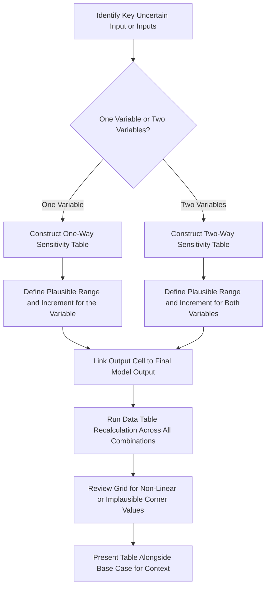

## One-Way and Two-Way Sensitivity Tables

### Overview

Sensitivity tables (often called "data tables" in common spreadsheet software) systematically vary one or two key input assumptions across a defined range and recalculate a specified output metric for every combination, producing a grid that shows exactly how the valuation output responds to changes in the underlying drivers. They are the most widely used and most accessible tool for communicating a DCF's assumption-dependency, standing as a simpler and more universally understood alternative to full Monte Carlo simulation for most day-to-day valuation communication purposes.

---

### One-Way Sensitivity Tables

**Key Points**

- A **one-way sensitivity table** varies a **single input variable** across a range of values while holding all other assumptions constant, recalculating the output metric (typically enterprise value, equity value, or value per share) at each point in the range.
- Structure: one column lists the range of values for the varied input; an adjacent column shows the corresponding output value at each input level.
- **Common one-way sensitivity applications in DCF**:
  - Value per share as a function of WACC (holding growth and margin assumptions fixed)
  - Value per share as a function of terminal growth rate
  - Enterprise value as a function of a specific operational driver (e.g., a key customer's retention rate, a specific product line's growth rate)
- One-way tables are useful for quickly identifying **which single assumption the output is most sensitive to** — comparing the output range across several one-way tables (each varying a different single input over a similarly-scaled range) provides a quick, informal ranking of relative sensitivity, serving a similar diagnostic purpose to (though less rigorous than) the formal variance decomposition used in Monte Carlo analysis.

**Example**

Assume a base-case DCF produces an equity value per share of $45.00 at a WACC of 9.0% and terminal growth of 3.0%. A one-way sensitivity table varying WACC alone (holding terminal growth fixed at 3.0%):

| WACC | Value per Share |
| --- | --- |
| 7.5% | $62.40 |
| 8.0% | $56.10 |
| 8.5% | $50.30 |
| 9.0% (base case) | $45.00 |
| 9.5% | $40.60 |
| 10.0% | $36.90 |
| 10.5% | $33.70 |

This table immediately communicates the **magnitude of sensitivity**: a 300-basis-point range in WACC (7.5% to 10.5%) produces a value-per-share range of roughly $33.70 to $62.40 — nearly a 2x spread — illustrating how much of the final valuation output is contingent on a single, inherently uncertain input.

---

### Two-Way Sensitivity Tables

**Key Points**

- A **two-way sensitivity table** varies **two input variables simultaneously**, with one variable's range typically listed across the table's rows and the other's range across the columns, producing a full grid/matrix of output values for every combination of the two inputs.
- This is the most common and most information-dense sensitivity presentation in professional DCF work, because it captures the **joint effect** of two variables at once — critically important because the effect of one variable (e.g., terminal growth) is not independent of the other (e.g., WACC); the same absolute change in terminal growth has a larger effect on value when the WACC-minus-growth spread is already narrow.
- **Most common two-way sensitivity pairing**: WACC (rows or columns) against terminal growth rate (the other axis), since these two inputs together drive the terminal value calculation (which, as established in prior topics, typically represents the majority of total DCF value) and are both subject to genuine analytical uncertainty and judgment.

**Example**

Continuing the prior example, a two-way sensitivity table of value per share, varying both WACC (rows) and terminal growth rate (columns):

| WACC \ Terminal Growth | 2.0% | 2.5% | 3.0% | 3.5% | 4.0% |
| --- | --- | --- | --- | --- | --- |
| **8.0%** | $48.90 | $52.20 | $56.10 | $60.80 | $66.60 |
| **8.5%** | $44.10 | $46.90 | $50.30 | $54.20 | $58.90 |
| **9.0%** | $40.10 | $42.40 | $45.00 | $48.10 | $51.70 |
| **9.5%** | $36.70 | $38.60 | $40.60 | $43.10 | $46.00 |
| **10.0%** | $33.80 | $35.40 | $36.90 | $38.90 | $41.20 |

**Interpretation**: this grid immediately shows that the base case ($45.00, at 9.0% WACC / 3.0% terminal growth, highlighted at the intersection) sits within a much wider plausible range once both key terminal-value drivers are allowed to vary jointly — from roughly $33.80 (high WACC, low growth corner) to $66.60 (low WACC, high growth corner), nearly a 2x range across the full grid. This is a more complete and more honest representation of valuation uncertainty than either one-way table alone, since it captures the compounding effect of both variables moving unfavorably (or favorably) together.

---

### Technical Implementation in Spreadsheet Software

**Key Points**

- Most spreadsheet software implements sensitivity tables via a **"data table"** feature (often under a "what-if analysis" menu), which requires: a single output cell reference (linked to the model's final calculated output, e.g., value per share), a row-input cell and/or column-input cell (the specific input cells in the model that correspond to the variables being varied), and the range of values to test for each varied input, arranged along the table's row and/or column headers.
- The data table feature recalculates the **entire underlying model** once for each combination of input values (in a two-way table, once per cell in the grid), then populates the corresponding output value — this can become computationally slow for very large models or very fine-grained sensitivity ranges, since it does not use any statistical shortcut and genuinely re-runs the full model each time.
- **Practical tip**: when building the data table structure, the output cell reference is placed at the top-left corner of the table range (the intersection of the row and column headers), a specific structural requirement of how most spreadsheet software's data table feature is designed to read the table's layout.

---

### Choosing the Range and Increment for Sensitivity Variables

**Key Points**

- **Range selection**: the tested range for each variable should span a **plausible, defensible band** around the base case — commonly informed by the historical volatility of the variable (for empirically observable inputs like margins or growth rates) or by the range of reasonable methodological outputs (for inputs like WACC, where different reasonable beta/ERP choices produce a defensible range).
- **Increment/granularity**: the step size between tested values should be fine enough to reveal the shape of the sensitivity (e.g., whether the output responds roughly linearly or exhibits accelerating sensitivity as WACC approaches the terminal growth rate) without being so granular that the table becomes visually cluttered or the increments imply a level of precision the underlying inputs don't actually support.
- **Centering on the base case**: the base-case value for each variable should typically fall within the tested range (often at or near the center), allowing the table to show both favorable and unfavorable deviations from the base case symmetrically, rather than only exploring one direction.

---

### Interpreting the WACC-Terminal Growth Convergence Effect

**Key Points**

- A well-known feature of two-way WACC/terminal-growth sensitivity tables: as WACC approaches the terminal growth rate, the denominator of the Gordon Growth terminal value formula ($WACC - g$) approaches zero, causing the output value to **increase disproportionately** (in the limit, approaching infinity as $WACC \to g$).
- This means the sensitivity table's cells in the **bottom-left region** (low WACC combined with high terminal growth) will show values that increase much more steeply than a simple visual scan of the grid's edges might suggest, and analysts should be alert to this non-linear behavior rather than assuming the sensitivity is roughly uniform across the grid.
- Best practice: ensure the tested range never allows terminal growth to approach or exceed WACC (which would produce a mathematically undefined or negative terminal value, a clear modeling error), and be prepared to flag or exclude any corner of the grid where this convergence effect produces an economically implausible output value.

---

### Multi-Variable Sensitivity Beyond Two-Way Tables

**Key Points**

- Standard sensitivity tables are limited to **two variables at a time**, since visual/tabular presentation of three or more simultaneously varying dimensions becomes difficult to construct and interpret directly.
- When sensitivity across **more than two variables** is needed, common alternatives include: **multiple two-way tables**, each holding a third variable fixed at different levels (e.g., a series of WACC/terminal-growth tables, one for each of several possible margin assumptions), allowing comparison across the series; **tornado charts** (typically derived from a broader Monte Carlo or structured one-way sensitivity exercise across many variables, ranking each variable's individual impact on the output — see the related Monte Carlo topics); or **full Monte Carlo simulation** (see the parent chapter on Monte Carlo methods), which is the natural extension when the analyst wants to understand the combined effect of many simultaneously uncertain variables rather than a small number examined two at a time.

---

### Diagram: Sensitivity Table Construction Process

---

### Common Pitfalls

**Key Points**

- Setting a tested range for terminal growth that approaches or exceeds the tested WACC range, producing mathematically undefined or economically implausible output values in a corner of the grid
- Choosing a range so narrow that the table fails to reveal genuine sensitivity, or so wide that it includes implausible combinations of assumptions, undermining the table's credibility
- Presenting a two-way sensitivity table without also presenting or referencing the base case explicitly, making it harder for the audience to locate the "most likely" scenario within the broader grid
- Treating a two-way table's grid as if it were a complete picture of total valuation uncertainty, when in reality many other assumptions (margin trajectory, capex intensity, working capital dynamics) are held fixed and not captured in that specific two-variable table
- Failing to account for the non-linear behavior near the WACC-terminal-growth convergence point, leading to a misleading visual impression that sensitivity is roughly uniform across the entire grid when it is, in fact, sharply asymmetric

---

**Related Topics**

- Terminal Value: Gordon Growth Method vs. Exit Multiple Method
- Principles of Monte Carlo Simulation in Valuation
- Tornado Charts and Variance Decomposition Analysis
- Football Field Charts and Valuation Triangulation
- Probability-Weighted and Scenario-Based DCF
- Deriving Implied Value Per Share
- Weighted Average Cost of Capital (WACC) Estimation