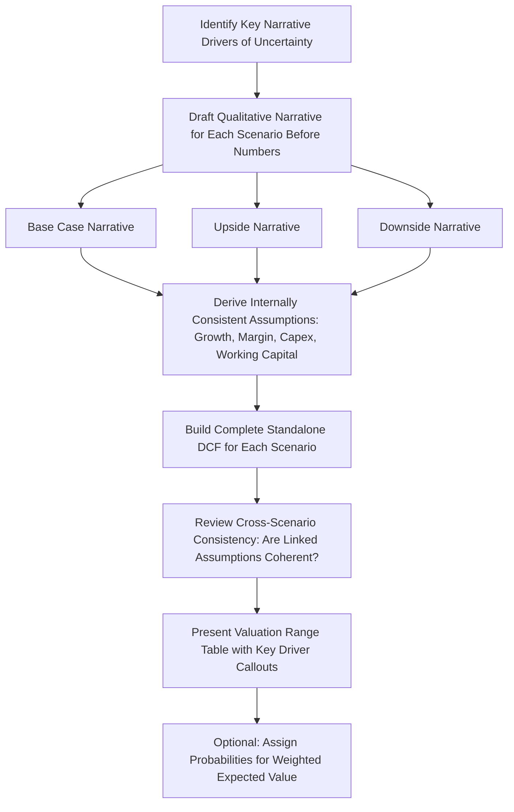

## Base, Upside, and Downside Scenario Construction

### Overview

Constructing base, upside, and downside scenarios is the standard practical framework for presenting a range of valuation outcomes without requiring the full apparatus of Monte Carlo simulation. Rather than varying one or two isolated inputs mechanically (as in a sensitivity table), scenario construction builds three (or more) **internally consistent narratives**, each representing a coherent view of how the company's business might actually unfold, with every assumption in each scenario chosen to be mutually consistent with that scenario's underlying story. This topic focuses specifically on the practical discipline of building well-constructed scenarios, as distinct from the probability-weighting mechanics covered in the related topic on probability-weighted DCF.

---

### The Core Principle: Internal Consistency Over Mechanical Flexing

**Key Points**

- The single most important discipline in scenario construction is that **every assumption within a given scenario must be consistent with that scenario's underlying narrative** — a scenario is not simply "the base case with each line item independently nudged up or down by some percentage."
- A poorly constructed upside scenario might take the base case and simply increase revenue growth by 5 percentage points while leaving margin, capex intensity, and working capital assumptions unchanged from the base case — this is **mechanical flexing**, not scenario construction, and it often produces an internally inconsistent picture (e.g., materially faster growth typically requires more working capital investment and more capex to support capacity expansion, not the same capital intensity as the base case).
- A well-constructed upside scenario instead starts from a **narrative**: "the company successfully launches its new product line, captures share faster than expected, and benefits from operating leverage as fixed costs are spread over higher volume" — and then derives revenue growth, margin trajectory, capex, and working capital assumptions that are all mutually consistent with that specific narrative.

---

### Step-by-Step Scenario Construction Process

#### Step 1 — Identify the Key Value Drivers and Uncertainty Axes

- Determine which handful of underlying business drivers most materially affect the valuation and around which genuine, structurally distinct narratives exist (market share trajectory, competitive response, regulatory outcome, macro environment, execution risk on a specific strategic initiative).
- Avoid attempting to build scenarios around every conceivable uncertain input simultaneously — effective scenario construction typically centers on 1-3 primary narrative drivers, with secondary assumptions derived logically from those primary drivers rather than treated as independent scenario axes.

#### Step 2 — Write the Narrative Before Building the Numbers

- For each scenario, draft a short qualitative narrative describing **what specifically happens** in that scenario — the competitive dynamics, customer behavior, execution outcomes, and market conditions that define it — before translating any of it into numerical assumptions.
- This ordering (narrative first, numbers second) is a deliberate discipline against the common failure mode of starting from a desired output range and reverse-engineering assumptions to hit it, which produces internally inconsistent and analytically unpersuasive scenarios.

#### Step 3 — Derive Consistent Assumptions Across All Line Items

- Once the narrative is defined, systematically work through each major driver and ask "what does this narrative imply for this specific assumption": revenue growth (by segment/product line if relevant), gross margin, operating margin, capital expenditure intensity, working capital requirements, and — where materially different by scenario — the appropriate discount rate.
- **Common linked relationships to check for internal consistency**:
  - Faster revenue growth often implies higher working capital investment (more inventory, receivables) unless a specific narrative reason (e.g., improved collections technology) justifies otherwise
  - Margin expansion in a growth scenario should be explainable by a specific mechanism (operating leverage, pricing power, mix shift) rather than simply asserted
  - A downside scenario driven by competitive pressure should generally show both slower growth **and** margin compression (since competitive pressure typically manifests as both share loss and pricing pressure simultaneously), not just one in isolation

#### Step 4 — Build the Full DCF for Each Scenario

- Each scenario requires a genuinely complete, standalone DCF build — explicit period projections through terminal value — not merely a scaled version of the base case's final output.
- Consider whether the **discount rate** should differ by scenario: if the scenarios reflect meaningfully different systematic risk profiles (e.g., a scenario involving a fundamentally different, riskier growth strategy), a differentiated discount rate may be warranted; many practitioners, however, hold the discount rate constant across scenarios and let the cash flow assumptions carry the full scenario differentiation, on the grounds that discount rate should reflect the systematic risk of the underlying business/industry rather than scenario-specific outcomes.

---

### Worked Example: Narrative-Driven Scenario Construction

**Example**

Assume a mid-sized software company facing a strategic decision about international expansion. Rather than mechanically flexing growth rates, the analyst constructs three narrative-driven scenarios:

**Base Case Narrative**: "International expansion proceeds on the announced timeline with moderate success — the company captures a reasonable but not dominant share in 2 of its 3 target markets, consistent with typical software company international expansion outcomes."

| Assumption | Base Case |
| --- | --- |
| Domestic revenue growth | 8% CAGR |
| International revenue (Year 5) | $45M |
| Operating margin trajectory | 18% → 22% (gradual operating leverage) |
| Capex intensity | 4% of revenue |

**Upside Narrative**: "International expansion significantly outperforms, aided by an unexpected competitor exit from the company's largest target market, allowing faster-than-planned share capture and pricing power."

| Assumption | Upside Case | Narrative Linkage |
| --- | --- | --- |
| Domestic revenue growth | 8% CAGR (unchanged — competitor exit is specific to the international market) | Consistent: domestic business unaffected by this narrative |
| International revenue (Year 5) | $85M | Reflects faster share capture from competitor exit |
| Operating margin trajectory | 18% → 26% | Higher than base case: incremental revenue captured at high margin due to reduced competitive pricing pressure |
| Capex intensity | 5% of revenue | Higher than base case: faster growth requires accelerated infrastructure investment to support scale |

**Downside Narrative**: "International expansion faces regulatory delays in the largest target market and encounters stronger-than-expected local competition, forcing a pricing retreat."

| Assumption | Downside Case | Narrative Linkage |
| --- | --- | --- |
| Domestic revenue growth | 6% CAGR | Slightly reduced: management attention diverted to addressing international challenges |
| International revenue (Year 5) | $15M | Reflects regulatory delay and competitive pressure |
| Operating margin trajectory | 18% → 16% | Margin compression: pricing retreat to defend share against local competition |
| Capex intensity | 4% of revenue | Held at base case level: capex already committed regardless of revenue outcome (a sunk/committed cost consideration specific to this narrative) |

Note how each scenario's capex intensity assumption is **derived from its specific narrative** rather than mechanically scaled — the upside case increases capex to support faster growth, while the downside case holds capex at the base level because the underlying narrative (regulatory delay, not a capacity decision) doesn't imply the company would scale back already-committed infrastructure investment.

---

### Calibrating the Width of the Scenario Range

**Key Points**

- Scenarios that are **too narrow** (upside and downside cases differing only marginally from the base case) fail to communicate genuine uncertainty and provide little additional insight beyond the base case alone.
- Scenarios that are **too extreme** (representing implausible tail outcomes rather than genuinely plausible alternative paths) can undermine the credibility of the entire analysis and may cause a reader to dismiss the scenario framework rather than engage with it seriously.
- A useful calibration heuristic: the upside and downside scenarios should represent outcomes the analyst genuinely believes have a **meaningful, non-trivial probability of occurring** (commonly, though not universally, framed as representing something in the vicinity of a 15th-to-25th percentile downside and 75th-to-85th percentile upside, if the analyst were to think in probabilistic terms), rather than best-case/worst-case extremes that would only occur under highly improbable conditions [Inference: the specific percentile framing is a common heuristic, not a rigid rule, and different practitioners and firms may define scenario width somewhat differently].

---

### Presenting Scenario Output

**Key Points**

- Scenario results are commonly presented as a **valuation range table**, showing the key output metric (enterprise value or value per share) alongside the key differentiating assumptions for each scenario, allowing a reader to see both the output range and the underlying drivers responsible for that range at a glance.
- Where a probability-weighted expected value is also desired (see the related topic on probability-weighted DCF), scenario construction is typically the necessary precursor step — a probability weighting is only as good as the quality and internal consistency of the underlying scenarios being weighted.
- Scenario ranges are frequently incorporated into a broader **football field** valuation summary chart, appearing alongside comparable company and precedent transaction ranges as one input into a triangulated valuation view (see the related topic on football field charts).

---

### Diagram: Scenario Construction Workflow

---

### Common Pitfalls

**Key Points**

- **Mechanical flexing** — adjusting only revenue growth (or only one line item) up or down while holding all other assumptions at base-case levels, producing internally inconsistent scenarios that don't reflect how the underlying business would actually behave under that narrative
- Building the numbers **before** articulating the narrative, leading to scenarios that appear to be reverse-engineered to hit a predetermined output range rather than genuinely reflecting distinct plausible futures
- Constructing scenarios that are **too narrow** to communicate meaningful uncertainty, or **too extreme** to be taken seriously as plausible alternatives
- Failing to check for **linked-assumption consistency** — for example, an upside scenario with dramatically higher growth but unchanged working capital or capex intensity, when the underlying narrative would clearly imply increased capital intensity to support that growth
- Treating the discount rate as automatically fixed across all scenarios without considering whether a scenario's narrative genuinely implies a different systematic risk profile warranting a different rate
- Presenting scenario outputs without also disclosing the specific narrative and key differentiating assumptions behind each one, reducing the analysis to an unexplained range of numbers rather than a transparent, defensible framework

---

**Related Topics**

- Probability-Weighted and Scenario-Based DCF
- One-Way and Two-Way Sensitivity Tables
- Football Field Charts and Valuation Triangulation
- Multi-Stage Growth Models
- DCF for Cyclical Companies
- Principles of Monte Carlo Simulation in Valuation
- Operating Leverage and Margin Trajectory Modeling