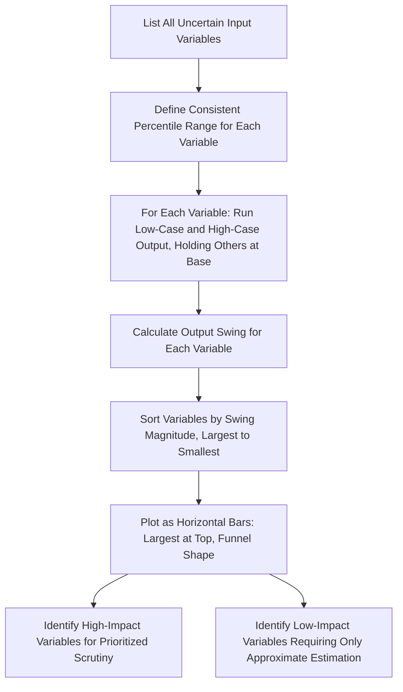

## Tornado Charts and Key Value Driver Identification

### Overview

Tornado charts provide a visual ranking of which input assumptions have the greatest impact on a valuation output, addressing a practical question that one-way and two-way sensitivity tables alone answer only partially: **across the full set of a model's uncertain inputs, which ones actually matter most?** The chart derives its name from its characteristic shape — horizontal bars sorted from longest (most impactful) at the top to shortest (least impactful) at the bottom, resembling a tornado's funnel profile. This topic covers the construction, interpretation, and practical use of tornado charts as a driver-identification tool, distinct from (though related to) the variance decomposition performed within a full Monte Carlo simulation.

---

### Purpose: Prioritizing Analytical Effort

**Key Points**

- A DCF model typically contains dozens of individual input assumptions (revenue growth by segment, multiple margin line items, capex intensity, working capital ratios, WACC components, terminal growth), but not all of them meaningfully affect the final output — some inputs, even with wide plausible ranges, contribute relatively little to output variability, while others, even with seemingly modest uncertainty, drive a disproportionate share of the total valuation range.
- Tornado charts answer the practical question: **where should the analyst focus additional research, due diligence, or scrutiny?** An input identified as having a large impact on the output deserves more rigorous estimation (more data-gathering, more careful comparable analysis, more explicit narrative justification) than an input shown to have minimal impact, where a reasonable approximation is sufficient.
- This makes tornado charts primarily a **diagnostic and prioritization tool**, distinct from sensitivity tables (which communicate the *range* of possible outputs) and scenario analysis (which communicates *coherent alternative narratives*) — tornado charts specifically answer "which single-variable uncertainty matters most."

---

### Construction Methodology

**Key Points**

#### Step 1 — Select the Set of Input Variables to Test

- Identify the full list of uncertain inputs worth testing — typically the same set of drivers that would otherwise be candidates for one-way sensitivity tables or Monte Carlo distribution assignment (revenue growth rate(s), margin assumptions, WACC, terminal growth, capex intensity, working capital assumptions, and any other material driver specific to the business).

#### Step 2 — Define a Consistent Range for Each Variable

- For each input variable, define a **low** and **high** value representing a plausible range — commonly a fixed percentile range (e.g., each variable's 10th and 90th percentile plausible values) applied consistently across all variables, so that the resulting comparison of impacts is measuring genuinely comparable degrees of uncertainty rather than an inconsistent mix of narrow ranges for some variables and wide ranges for others.
- **This consistency requirement is critical**: if one variable's tested range represents its 5th-to-95th percentile plausible values while another's represents only its 25th-to-75th percentile range, the resulting tornado chart will not be comparing genuine relative importance — it will partly reflect the arbitrary choice of how wide a range was tested for each variable, undermining the chart's core purpose.

#### Step 3 — Run a One-Way Sensitivity for Each Variable, Holding All Others at Base Case

- For each input variable individually, recalculate the model's output once using the variable's low value (holding all other inputs at their base-case level) and once using its high value, producing a low-output and high-output figure for that variable.
- This step is mechanically identical to constructing a series of one-way sensitivity tables (see the related topic), one per variable, but only the **range of the output** (high output minus low output) for each variable is retained for the tornado chart, rather than the full table of intermediate values.

#### Step 4 — Sort and Visualize

- Calculate the **output range/swing** for each variable (the absolute difference between the high-case output and the low-case output).
- Sort all variables by the magnitude of their output swing, from largest to smallest.
- Plot each variable as a horizontal bar, with the bar's length representing the output swing, and the bars stacked with the largest at the top — the base-case output value is typically marked with a vertical reference line, and each bar extends left (toward the low-input-value output) and right (toward the high-input-value output) from that reference line.

---

### Worked Example

**Example**

Assume a base-case DCF produces an enterprise value of $1,000M. The analyst tests five key variables individually, each varied across its defined 10th-90th percentile plausible range while holding all others at base case:

| Variable | Low-Case Output ($M) | High-Case Output ($M) | Output Swing ($M) |
| --- | --- | --- | --- |
| Terminal Growth Rate | 850 | 1,220 | 370 |
| WACC | 880 | 1,150 | 270 |
| Year 1-5 Revenue Growth | 920 | 1,110 | 190 |
| Operating Margin (Terminal) | 940 | 1,090 | 150 |
| Capex Intensity | 970 | 1,040 | 70 |

Sorted by output swing (largest to smallest), this produces the tornado chart ranking: **Terminal Growth Rate** (largest swing, $370M) at the top, followed by **WACC** ($270M), **Year 1-5 Revenue Growth** ($190M), **Operating Margin** ($150M), and **Capex Intensity** (smallest swing, $70M) at the bottom.

**Interpretation**: this immediately tells the analyst that terminal growth rate and WACC — both terminal-value-related assumptions — together drive far more of the total output uncertainty than the explicit-period operational assumptions (revenue growth, margin, capex), even though the latter set might intuitively feel like "the business" while the former might feel like abstract financial-modeling parameters. This is a common and important finding in DCF tornado analysis: because terminal value typically represents the majority of total enterprise value, the terminal-value assumptions frequently dominate a tornado chart's top rankings, which is itself a useful and sometimes underappreciated insight to communicate to stakeholders who may intuitively focus scrutiny on near-term operational forecasts instead.

---

### Illustration: Text-Based Tornado Chart Representation

Since tornado charts are inherently visual, a text-based approximation of the bar lengths (using the example above, with the base case reference point at $1,000M):



```
Terminal Growth Rate     |----------------------●----------------------------|   ($850M to $1,220M)
WACC                     |---------------●-------------------------|          ($880M to $1,150M)
Revenue Growth (Y1-5)    |------------●-----------------|                     ($920M to $1,110M)
Operating Margin         |----------●---------------|                        ($940M to $1,090M)
Capex Intensity          |-------●----------|                                ($970M to $1,040M)
                                  ^
                            Base Case ($1,000M)
```

The visual funnel shape (widest bar at top, narrowing toward the bottom) is what gives the tornado chart its name, and the immediate visual impression — even before reading any numbers — correctly conveys the relative importance ranking of the tested variables.

---

### Tornado Charts vs. Monte Carlo Variance Decomposition

**Key Points**

| Aspect | Tornado Chart (One-Variable-at-a-Time) | Monte Carlo Variance Decomposition |
| --- | --- | --- |
| **Methodology** | Vary one input at a time across a fixed range, holding all others at base case | Vary all inputs simultaneously according to their assigned probability distributions, then statistically attribute output variance to each input |
| **Captures interaction effects** | No — each variable is tested in isolation | Yes — the simultaneous variation captures how variables interact and combine |
| **Requires full distributions** | No — only requires a low/high range per variable | Yes — requires a fully specified probability distribution for every variable |
| **Computational requirement** | Low — a small number of additional model runs (2 per variable) | High — thousands of iterations |
| **Best suited for** | Quick, accessible prioritization exercise; communicating to non-technical audiences | Rigorous quantification of output uncertainty, especially when interaction/correlation effects are material |

- Tornado charts are best understood as a simpler, more accessible **approximation** of the same underlying question that Monte Carlo variance decomposition answers more rigorously — appropriate as a first-pass diagnostic tool or for audiences where full Monte Carlo simulation would be disproportionate to the decision at hand, while Monte Carlo-based variance decomposition is preferred when correlation and interaction effects between variables are believed to be material to the true ranking of driver importance.

---

### Using Tornado Chart Results to Guide Further Analysis

**Key Points**

- Variables identified as **high-impact** on the tornado chart warrant the most additional analytical investment: deeper comparable company research (for WACC/beta inputs), more rigorous historical trend analysis or industry expert input (for terminal growth or long-run margin assumptions), and more careful narrative justification in any written valuation summary.
- Variables identified as **low-impact** can generally be estimated with a reasonable, well-documented approximation without extensive additional research, since further refining their precision would not meaningfully change the overall valuation output.
- Tornado chart results are also useful for structuring **management due diligence questions** in a transaction context — prioritizing which operational assumptions to probe most rigorously with management based on which ones the tornado chart reveals as most consequential to the ultimate valuation.
- Because terminal-value-related variables (WACC, terminal growth) frequently dominate tornado rankings for mature companies with long terminal periods, this result often reinforces the broader lesson (echoed throughout DCF methodology) that disproportionate analytical rigor should be applied to terminal value assumptions specifically, relative to the attention sometimes paid to granular near-term operational line items.

---

### Diagram: Tornado Chart Construction Process



---

### Common Pitfalls

**Key Points**

- Using **inconsistent range widths** across different variables (e.g., a wide range for one variable and a narrow range for another without a principled reason), which distorts the resulting ranking and undermines the chart's core comparative purpose
- Treating tornado chart results as capturing **interaction effects** between variables, when the one-at-a-time methodology by construction ignores how variables might move together or amplify each other's effects (a limitation addressed by full Monte Carlo variance decomposition instead)
- Testing an incomplete or arbitrarily selected set of variables, omitting a potentially high-impact driver simply because it wasn't initially considered, leading to a misleadingly reassuring picture of which assumptions matter most
- Failing to act on the tornado chart's findings — identifying that terminal growth and WACC dominate the output range but then not applying correspondingly greater analytical rigor to those specific assumptions in the underlying model
- Presenting the tornado chart without the underlying base case reference point clearly marked, making it harder for a reader to understand the direction and starting point of each bar's swing

---

**Related Topics**

- One-Way and Two-Way Sensitivity Tables
- Principles of Monte Carlo Simulation in Valuation
- Interpreting Simulation Output Distributions
- Terminal Value: Gordon Growth Method vs. Exit Multiple Method
- Weighted Average Cost of Capital (WACC) Estimation
- Base, Upside, and Downside Scenario Construction
- Correlation Between Simulated Variables