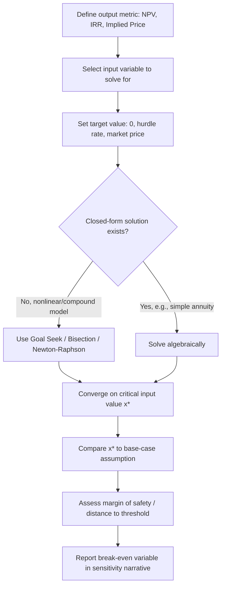

## Break-Even and Threshold Analysis

### Definition and Purpose

Break-even and threshold analysis identifies the critical value of an input variable at which a target output metric equals a specified reference value — most commonly zero (for profitability break-even) or a hurdle value (for investment decision thresholds). In corporate valuation and DCF contexts, this technique answers questions of the form: "How far can this assumption move before the investment decision flips?"

Unlike standard sensitivity analysis, which asks "what happens to value if the input changes by X%," threshold analysis inverts the question: "what input value makes the output equal a specific target?" This reframing is often more decision-relevant because stakeholders care less about a table of outcomes and more about the distance between the current assumption and the point of failure.

**Key Points**

- Break-even analysis solves for the input level where a metric (profit, NPV, IRR) crosses zero or a decision threshold
- Threshold analysis generalizes this to any target value, not just zero (e.g., the growth rate needed for NPV to equal a competitor's valuation)
- Both techniques are single-variable "goal seek" operations layered onto the DCF model
- The output is a critical value, not a range — this is the core distinction from tornado/spider sensitivity charts

### Core Mathematical Framework

For a DCF model, let $V$ represent the valuation output (e.g., NPV or enterprise value) as a function of an input variable $x$ (e.g., revenue growth rate, WACC, terminal growth rate):

$$V(x) = \sum_{t=1}^{n} \frac{CF_t(x)}{(1+r)^t} + \frac{TV_n(x)}{(1+r)^n}$$

Break-even analysis solves for $x^*$ such that:

$$V(x^*) = 0$$

Threshold analysis generalizes this to solve for $x^*$ such that:

$$V(x^*) = T$$

where $T$ is any target value (a hurdle NPV, a minimum acceptable IRR, a competitor's implied valuation, etc.).

Because most DCF outputs are nonlinear functions of inputs (particularly WACC, terminal growth, and any input compounding across multiple periods), $x^*$ generally cannot be solved algebraically in closed form and requires iterative numerical methods.

### Common Break-Even Variables in DCF Models

| Variable | Break-Even Question | Typical Target |
| --- | --- | --- |
| Revenue growth rate | What growth rate makes NPV = 0? | NPV = 0 |
| WACC / discount rate | At what discount rate does NPV = 0? (This is the IRR) | NPV = 0 |
| Terminal growth rate ($g$) | What $g$ justifies the current share price? | Implied share price = market price |
| Unit sales volume | How many units must be sold to cover fixed + variable costs? | Operating profit = 0 |
| Selling price | What price floor still yields NPV ≥ 0? | NPV = 0 |
| Cost of goods sold (%) | What COGS ratio erodes all project value? | NPV = 0 |
| Terminal EV/EBITDA multiple | What exit multiple is needed to hit target IRR? | IRR = hurdle rate |
| Synergy realization (%) | What % of projected synergies must materialize to justify a premium? | NPV = 0 (net of premium) |

### Relationship to IRR

The discount-rate break-even is mathematically identical to the Internal Rate of Return. Solving:

$$\sum_{t=0}^{n} \frac{CF_t}{(1+IRR)^t} = 0$$

is the same operation as finding the WACC at which NPV = 0. This is why IRR is often described as "the break-even cost of capital" — it represents the maximum discount rate a project can absorb before destroying value. This reframing is useful pedagogically: every IRR calculation is a break-even analysis, and every discount-rate break-even is an IRR calculation.

### Classic Break-Even Point (Unit Economics)

At the operating level, before layering in time-value-of-money effects, the traditional break-even point in units is:

$$Q_{BE} = \frac{FC}{P - VC}$$

where $FC$ = fixed costs, $P$ = price per unit, $VC$ = variable cost per unit, and $(P - VC)$ is the contribution margin per unit.

**Example**

A company evaluating a new product line has:

- Fixed costs: $2,400,000 per year
- Price per unit: $60
- Variable cost per unit: $36

$$Q_{BE} = \frac{2{,}400{,}000}{60 - 36} = \frac{2{,}400{,}000}{24} = 100{,}000 \text{ units}$$

This is the operating break-even. For a capital budgeting decision, this must be extended to a **financial break-even** — the unit volume at which the NPV of the project (not just accounting profit) equals zero, incorporating the initial investment, tax effects, depreciation, and the time value of money across the full holding period. Financial break-even volume is typically higher than accounting break-even volume because it must also cover the opportunity cost of capital tied up in the investment.

### Financial (NPV) Break-Even — Worked Example

Consider a project with:

- Initial investment: $5,000,000
- Project life: 5 years
- WACC: 10%
- Annual fixed costs: $800,000
- Price per unit: $50
- Variable cost per unit: $30
- Tax rate: 25%
- Straight-line depreciation over 5 years: $1,000,000/year

Annuity factor at 10% for 5 years:

$$AF = \frac{1 - (1+0.10)^{-5}}{0.10} = 3.7908$$

For the project to break even on NPV, the present value of after-tax operating cash flows must equal the initial investment:

$$5{,}000{,}000 = OCF \times 3.7908 \implies OCF = 1{,}319{,}000 \text{ (approx.)}$$

Operating cash flow (using the tax-shield approach):

$$OCF = (Sales - VC - FC)(1 - T) + (Depreciation \times T)$$

Solving backward for the required contribution margin (and therefore required unit volume $Q^*$) that generates this OCF is the financial break-even quantity. This requires isolating $Q$:

$$OCF = [(P - VC)Q - FC](1-T) + D \times T$$

$$1{,}319{,}000 = (20)Q - 800{,}000 + 250{,}000$$

$$1{,}069{,}000 = 15Q - 600{,}000$$

$$Q^* = \frac{1{,}669{,}000}{15} \approx 111{,}267 \text{ units}$$

This financial break-even volume (≈111,267 units) exceeds the accounting break-even volume (calculated without discounting or the investment recovery requirement, which would be lower), illustrating why relying on accounting break-even alone understates the true hurdle for value-creating decisions.

### Goal Seek and Iterative Solving Methods

Because DCF value functions are typically nonlinear in key drivers (compounding growth, discounting, terminal value multiples), closed-form solutions for $x^*$ are rare beyond simple annuity cases. Three standard numerical approaches are used:

**1. Goal Seek (single-variable, spreadsheet-native)**

Excel/Google Sheets "Goal Seek" iteratively adjusts one input cell until a target cell hits a specified value, using a variant of the secant method internally. This is the most common tool in practice for break-even/threshold work in valuation models.

**2. Bisection Method**

For manual or programmatic solving when Goal Seek is unavailable:

$$x_{mid} = \frac{x_{low} + x_{high}}{2}$$

Evaluate $V(x_{mid})$, then replace whichever bound has the same sign as $V(x_{mid})$, narrowing the interval until $|V(x_{mid}) - T| < \epsilon$. This method is slower than Newton-Raphson but guaranteed to converge if the function is continuous and a sign change exists in the bracket.

**3. Newton-Raphson Method**

Faster convergence using the derivative (or numerical approximation of it):

$$x_{n+1} = x_n - \frac{V(x_n) - T}{V'(x_n)}$$

This is the method underlying most IRR solvers in financial calculators and Excel's `IRR()` function.

### Break-Even in Terminal Value Assumptions

A particularly important application is solving for the **implied terminal growth rate** that reconciles a DCF-derived valuation with an observed market price — a "reverse DCF." Given:

$$EV = \sum_{t=1}^{n} \frac{FCF_t}{(1+WACC)^t} + \frac{FCF_n(1+g)}{(WACC - g)(1+WACC)^n}$$

Solving for $g$ given a target $EV$ (current enterprise value) reveals the market's implied growth expectations — a threshold analysis that is standard practice in equity research to sanity-check whether current pricing embeds unrealistic assumptions.

**Example**

If a reverse DCF shows the market is pricing in a 6% perpetual terminal growth rate against a WACC of 8%, and the industry's long-run nominal GDP growth ceiling is roughly 3–4%, the gap flags the stock as priced for unsustainable growth — a threshold breach relative to a reasonable macro ceiling.

### Multi-Variable Threshold Analysis (Break-Even Curves)

When two variables jointly determine the outcome, a single break-even *point* becomes a break-even *curve* — the locus of all combinations of two inputs that produce the same target output. A common example is the combination of terminal growth rate and WACC that holds implied value constant, or the combination of price and volume that holds NPV at zero.

This is typically visualized as an isoquant-style curve on a two-axis grid, distinct from a data table (which shows discrete combinations) because it explicitly traces the boundary between "value-creating" and "value-destroying" regions.

### Margin of Safety Interpretation

The output of a break-even analysis is only useful once contextualized against the base-case assumption. The **margin of safety** is expressed as the percentage or absolute distance between the current assumption and the break-even value:

$$\text{Margin of Safety} = \frac{x_{base} - x^*}{x_{base}}$$

**Example**

If base-case volume is 150,000 units and financial break-even is 111,267 units:

$$\text{Margin of Safety} = \frac{150{,}000 - 111{,}267}{150{,}000} \approx 25.8\%$$

This means sales volume could fall by roughly 25.8% before the project destroys value — a materially different (and more decision-useful) statement than "NPV is $X at 150,000 units."

### Break-Even in Leveraged and Credit Contexts

Threshold analysis extends beyond equity valuation into credit and leverage contexts:

- **Interest coverage break-even**: the minimum EBITDA level at which $EBITDA / Interest = 1.0×$
- **Debt covenant headroom**: the % decline in EBITDA before a leverage covenant (e.g., Net Debt/EBITDA ≤ 4.5×) is breached
- **DSCR break-even**: the minimum cash flow at which Debt Service Coverage Ratio = 1.0×

These follow the identical solve-for-$x^*$ logic but apply it to credit metrics rather than equity value, and are heavily used in LBO and project finance modeling.

### Common Pitfalls

- **Confusing accounting break-even with financial (NPV) break-even**: ignoring the time value of money and cost of capital understates the true hurdle.
- **Treating break-even as a static point in a dynamic model**: if other variables are correlated with the one being solved (e.g., price and volume move together), a single-variable break-even can be misleading. [Inference] In practice this is usually addressed by pairing break-even analysis with scenario or Monte Carlo methods rather than relying on it in isolation.
- **Ignoring convergence failure**: Newton-Raphson and Goal Seek can fail to converge or converge to a spurious root when the value function is highly non-monotonic (e.g., unconventional cash flow patterns producing multiple IRRs). In such cases, MIRR (Modified IRR) or bounded bisection is preferred.
- **Reporting break-even without a margin-of-safety frame**: a break-even value on its own is not decision-useful without stating the distance from the base case.

### Break-Even Chart (Conceptual)

<svg xmlns="http://www.w3.org/2000/svg" viewBox="0 0 640 400">
<title>Break-Even Chart: Cost, Revenue vs. Volume (svg_diagram)</title>
<rect width="640" height="400" fill="#ffffff" />
<line x1="70" y1="30" x2="70" y2="350" stroke="#333" stroke-width="2" />
<line x1="70" y1="350" x2="600" y2="350" stroke="#333" stroke-width="2" />
<text x="30" y="20" font-size="13" fill="#333">$ Value</text>
<text x="560" y="375" font-size="13" fill="#333">Units (Q)</text>
<line x1="70" y1="300" x2="600" y2="300" stroke="#999" stroke-width="1.5" stroke-dasharray="4,3" />
<text x="75" y="295" font-size="12" fill="#666">Fixed Costs (FC)</text>
<line x1="70" y1="300" x2="600" y2="90" stroke="#c0392b" stroke-width="2" />
<text x="480" y="120" font-size="12" fill="#c0392b">Total Cost Line (FC + VC×Q)</text>
<line x1="70" y1="350" x2="600" y2="60" stroke="#27ae60" stroke-width="2" />
<text x="480" y="70" font-size="12" fill="#27ae60">Total Revenue Line (P×Q)</text>
<circle cx="340" cy="187" r="6" fill="#2c3e50" />
<text x="350" y="180" font-size="12" font-weight="bold" fill="#2c3e50">Break-Even Point (Q_BE)</text>
<line x1="340" y1="187" x2="340" y2="350" stroke="#2c3e50" stroke-width="1" stroke-dasharray="3,3" />
<text x="320" y="368" font-size="12" fill="#2c3e50">Q*</text>
</svg>

### Software and Tooling Notes

- **Excel/Google Sheets**: Goal Seek (Data → What-If Analysis → Goal Seek) is the standard tool; Data Tables can pre-compute a range around the suspected break-even for visual confirmation.
- **Python**: `scipy.optimize.brentq` or `scipy.optimize.newton` are standard for programmatic break-even solving in model automation; `numpy_financial.irr` handles the discount-rate break-even case directly.
- **R**: `uniroot()` performs bisection-based root finding, commonly used in academic and quant finance workflows.
- Behavior of these solvers (convergence tolerance, iteration limits, handling of multiple roots) is implementation-specific and may vary by version. [Unverified for any specific software version not confirmed at time of writing]

### Next Steps

- **Scenario Analysis and Case-Based Modeling** (bear/base/bull framework built around break-even anchors)
- **Tornado and Spider Charts** (multi-variable sensitivity ranking distinguished from single-point break-even)
- **Monte Carlo Simulation in DCF** (probabilistic extension when correlated break-even variables are in play)
- **Reverse DCF and Market-Implied Assumptions**
- **Covenant Headroom and Credit Threshold Modeling**
- **IRR, MIRR, and Multiple-IRR Problem**
- **Data Tables vs. Goal Seek vs. Solver in Excel-Based Valuation Models**