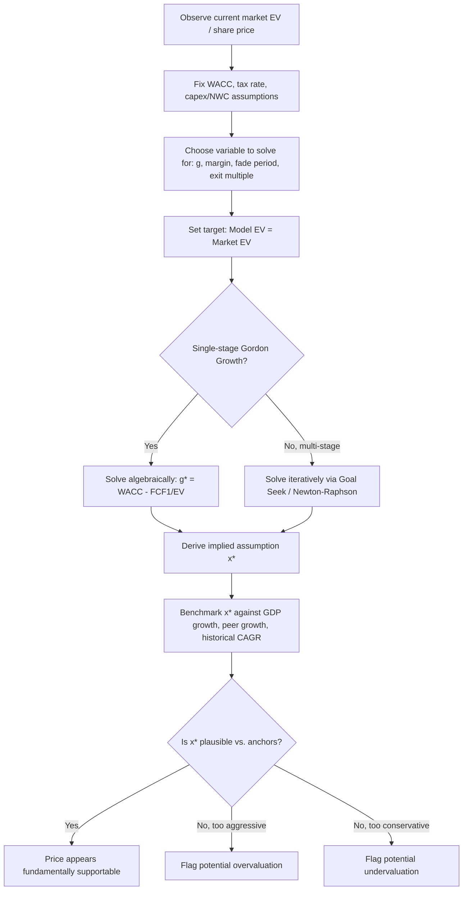

## Reverse DCF and Market-Implied Expectations Analysis

### Definition and Purpose

A reverse DCF (also called an "implied expectations" analysis) inverts the standard discounted cash flow process. Instead of forecasting cash flows and discounting them to derive a fair value, the analyst takes the current market price (or enterprise value) as a given input and solves backward for the operating assumptions — growth rate, margin trajectory, or terminal value — that the market must be pricing in to justify that value. It answers: "What does the market have to believe about this company for the current price to be fair?"

This technique shifts the analytical question from "is this the right value?" to "is this the right assumption?" — which is often a more tractable and more falsifiable question, since operating assumptions can be benchmarked against history, peers, and industry structural limits, whereas a single-point valuation cannot.

**Key Points**

- Standard DCF: assumptions → cash flows → discounting → intrinsic value
- Reverse DCF: market price → discounting (held constant) → solve backward for implied assumptions
- The output is a growth rate, margin path, or fade period — not a dollar value
- Primarily used to test the *reasonableness* of market pricing, not to generate a price target

### Conceptual Framework

Standard DCF solves forward:

$$EV = \sum_{t=1}^{n} \frac{FCF_t(g, margin, ...)}{(1+WACC)^t} + \frac{TV_n}{(1+WACC)^n}$$

Reverse DCF fixes $EV$ at the observed market value and solves for the unknown driver, most commonly the terminal growth rate $g$ or the explicit-period growth rate $g_{explicit}$:

$$g^* : EV_{market} = \sum_{t=1}^{n} \frac{FCF_t(g_{explicit})}{(1+WACC)^t} + \frac{FCF_n(1+g^*)}{(WACC - g^*)(1+WACC)^n}$$

This is a special case of the break-even/threshold analysis framework applied specifically to terminal value or growth assumptions, using the current traded price as the target rather than zero or a hurdle rate.

### Step-by-Step Methodology

**1. Establish current market enterprise value**

$$EV_{market} = \text{Market Cap} + \text{Total Debt} + \text{Minority Interest} + \text{Preferred Equity} - \text{Cash \& Equivalents}$$

**2. Fix all assumptions except the target variable**

Hold WACC, tax rate, reinvestment/capex assumptions, and working capital relationships at reasonable, defensible levels (typically peer-benchmarked or historical averages), so that the solved variable captures the market's growth/margin expectation rather than an artifact of arbitrary discounting choices.

**3. Select the variable to solve for**

Most commonly the perpetual terminal growth rate $g$, but can also be:

- The explicit forecast period growth rate (holding terminal growth fixed at a "normal" GDP-linked rate)
- The number of years of excess-return growth (fade period length)
- The steady-state operating margin
- The terminal EV/EBITDA exit multiple

**4. Solve iteratively (Goal Seek / Newton-Raphson / bisection)**

Because the terminal value formula is nonlinear in $g$, closed-form isolation is only possible in the single-stage Gordon Growth case; multi-stage models require numerical solving as described under Break-Even and Threshold Analysis.

**5. Benchmark the implied value against reasonableness anchors**

Compare $g^*$ to long-run nominal GDP growth, industry growth ceilings, historical company growth, and peer-implied growth rates from the same exercise applied across comparables.

### Single-Stage (Gordon Growth) Closed-Form Case

When cash flows are assumed to grow at a constant perpetual rate from year 1 onward, the reverse solve has an algebraic solution:

$$EV_{market} = \frac{FCF_1}{WACC - g}$$

Solving for $g^*$:

$$g^* = WACC - \frac{FCF_1}{EV_{market}}$$

**Example**

A company has:

- Enterprise value (market): $40,000,000,000
- Next-twelve-months FCF: $1,600,000,000
- WACC: 8.5%

$$g^* = 0.085 - \frac{1{,}600{,}000{,}000}{40{,}000{,}000{,}000} = 0.085 - 0.04 = 0.045 = 4.5\%$$

The market is implicitly pricing in 4.5% perpetual FCF growth. If long-run nominal GDP growth for the relevant economy is estimated at 4%, this implied rate is close to a reasonable macro ceiling — suggesting the stock is priced for slightly-above-GDP perpetual growth, which is plausible but leaves little room for error.

### Multi-Stage Reverse DCF — Worked Example

Multi-stage models are more realistic because few companies transition instantly to a stable state. Consider:

- Current EV: $25,000,000,000
- Year 1 FCF: $900,000,000
- Explicit period: 5 years
- WACC: 9%
- Terminal growth rate to solve for: $g^*$

Assume explicit-period FCF grows at a declining rate from 12% (Year 1–2) fading to 6% (Year 5), a common "fade" pattern reflecting competitive erosion of excess returns. The present value of the explicit period cash flows is computed conventionally (approximately $3.8B in this illustration), leaving:

$$25{,}000{,}000{,}000 - 3{,}800{,}000{,}000 = 21{,}200{,}000{,}000 = PV(TV)$$

$$TV_5 = 21{,}200{,}000{,}000 \times (1.09)^5 \approx 32{,}613{,}000{,}000$$

Using Year 5 FCF (approximately $1,270,000,000 after the fade path) in the Gordon Growth terminal formula:

$$32{,}613{,}000{,}000 = \frac{1{,}270{,}000{,}000 \times (1+g^*)}{0.09 - g^*}$$

Solving iteratively for $g^*$ converges to approximately 5.3–5.5% (exact value depends on precise fade-path cash flows; this is illustrative of method, not a precision output). [Inference] The exact converged value is sensitive to the specific fade-path shape assumed for the explicit period, so results should be treated as directionally illustrative rather than exact without a fully specified model.

### Benchmarking the Implied Growth Rate

Once $g^*$ is derived, it must be interpreted against external anchors rather than in isolation:

| Anchor | Typical Range | Interpretation if $g^*$ Exceeds It |
| --- | --- | --- |
| Long-run nominal GDP growth (developed markets) | 2–4% | Market assumes the firm permanently outgrows the overall economy |
| Long-run nominal GDP growth (emerging markets) | 4–7% | Higher ceiling, but still bounded by macro reality |
| Industry TAM growth (mature industries) | 1–3% | Implies indefinite share gains or margin expansion |
| Industry TAM growth (secular growth industries) | 5–15% | May be reasonable if durable competitive moat exists |
| Historical 10-year company CAGR | Company-specific | A useful sanity check but not a ceiling on its own |

A terminal growth rate above the discount rate is mathematically invalid (produces a negative or undefined terminal value) and above long-run nominal GDP growth in perpetuity is generally considered aggressive, since no firm can outgrow the economy indefinitely without eventually representing an implausibly large share of it. [Inference] Practitioners commonly treat "growth rate approaching or exceeding WACC" and "perpetual growth meaningfully above long-run GDP" as red flags requiring justification, though there is no universal rule threshold.

### Reverse DCF on Margin Assumptions

Growth is not the only variable that can be reverse-solved. An alternative formulation holds growth constant (e.g., at consensus analyst estimates) and instead solves for the **implied steady-state operating margin** required to justify the current price:

$$EV_{market} = \sum_{t=1}^{n} \frac{Rev_t \times m^* \times (1-T) + D\&A_t - Capex_t - \Delta NWC_t}{(1+WACC)^t} + TV_n(m^*)$$

Solving for $m^*$ reveals whether the market is pricing in margin expansion beyond historical peaks, current best-in-class peer margins, or theoretical maximums — a common diagnostic in mature, competitive, or regulated industries where growth is naturally capped but margin narratives can still justify premium valuations.

### Reverse DCF for Relative Comparisons Across a Peer Set

Applying the identical reverse-solve methodology across every company in a peer group, using consistent WACC methodology and consistent forecasting conventions, produces a **cross-sectional implied growth ranking**. This is a standard institutional equity research technique to identify:

- Stocks priced for unrealistically high growth relative to peers with similar fundamentals (potential overvaluation flags)
- Stocks priced for low or negative growth despite comparable or superior fundamentals (potential undervaluation flags)
- Sector-wide growth expectation shifts around catalysts (earnings, macro data, regulatory changes)

### Sensitivity of Implied Growth to WACC Assumption

Because $g^*$ is solved conditional on an assumed WACC, and WACC itself carries estimation uncertainty (particularly the equity risk premium and beta), it is standard practice to present implied growth as a small table across a WACC range rather than a single point estimate:

| WACC | Implied Perpetual Growth $g^*$ |
| --- | --- |
| 7.5% | 3.5% |
| 8.0% | 4.0% |
| 8.5% (base case) | 4.5% |
| 9.0% | 5.0% |
| 9.5% | 5.5% |

This table format directly shows how sensitive the "story the market is telling" is to the discount rate chosen — a 200 bps swing in WACC can shift implied growth by an equivalent 200 bps, since in the single-stage formula $\frac{\partial g^*}{\partial WACC} = 1$.

### Common Applications in Practice

- **Equity research sanity checks**: cross-checking whether a price target's implied growth assumption is internally consistent with the analyst's own explicit forecast.
- **M&A premium justification**: solving for the synergy growth or margin uplift an acquirer must realize to justify a takeover premium over the standalone reverse-DCF-implied value.
- **Index or sector-level expectations analysis**: applying the technique to a market index (e.g., S&P 500 aggregate cash flows) to assess whether the broad market is pricing in historically typical or atypical long-run growth.
- **Activist investor and short-seller theses**: framing an investment thesis around "the market is pricing in X% growth, which is unachievable given Y structural constraint" rather than a standalone target price.
- **Fairness opinions and litigation support**: demonstrating whether a transaction price is supportable under reasonable growth assumptions, used in valuation disputes.

### Common Pitfalls

- **Circularity in WACC**: using a WACC derived partly from the current market price (via market-value capital weights) while simultaneously treating market price as the unknown being explained — this is a modeling inconsistency that should be addressed by using a stable target capital structure for WACC rather than current spot weights.
- **Over-precision**: presenting $g^*$ to two decimal places implies false precision given the compounding uncertainty in every other model assumption; ranges or bands are more defensible than point estimates.
- **Ignoring the interaction between growth and margin**: solving for growth alone while holding margins at potentially unrealistic levels (or vice versa) can produce a misleading implied assumption; a joint or scenario-based reverse solve is more robust.
- **Treating "market is wrong" as the default conclusion**: an aggressive implied growth rate is a prompt for further investigation (checking TAM, competitive dynamics, optionality not captured in the base model), not automatic proof of mispricing.
- **Neglecting non-operating items**: failing to properly back out net debt, minority interest, and non-operating assets when converting between equity value and enterprise value distorts the implied growth solve.

### Reverse DCF vs. Related Techniques

| Technique | Direction | Solves For | Primary Use |
| --- | --- | --- | --- |
| Standard DCF | Assumptions → Value | Fair value / price target | Investment decision, valuation |
| Break-even/threshold analysis | Assumptions → Value = target | Critical input level | Risk/downside assessment |
| Reverse DCF | Market price → Assumptions | Implied growth/margin | Reasonableness check on market pricing |
| Comparable company analysis | Peer multiples → Value | Relative value | Cross-check vs. DCF |

### Next Steps

- **Break-Even and Threshold Analysis** (the general framework reverse DCF specializes)
- **Terminal Value Methodologies: Gordon Growth vs. Exit Multiple**
- **WACC Estimation and Circularity Issues in Market-Value Weighting**
- **Fade Period Modeling and Competitive Advantage Period (CAP) Analysis**
- **Cross-Sectional Peer Implied Growth Screening**
- **Scenario Analysis and Case-Based Modeling**
- **Equity Research Price Target Construction and Consistency Checks**