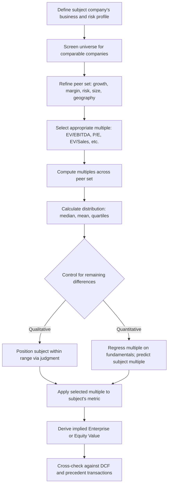

## Principles of Relative Valuation

### Definition and Core Concept

Relative valuation (also called "comparables" or "multiples-based" valuation) estimates the value of an asset by comparing it to the market-observed prices of similar assets, rather than by discounting the asset's own expected cash flows. The underlying premise is the **law of one price**: similar assets should trade at similar prices relative to a common fundamental driver (earnings, revenue, book value, cash flow), and deviations from peer pricing represent either mispricing or a fundamental difference that must be explained.

Where intrinsic valuation (DCF) asks "what is this asset worth based on its own future cash flows," relative valuation asks "what is the market currently paying for similar assets, and does that pricing logic apply here." It is fundamentally a market-based, not a fundamentals-based, valuation philosophy — though the two are deeply complementary in practice.

**Key Points**

- Relative valuation infers value from current market pricing of comparable assets, not from discounting the subject's own cash flows
- It answers "what is the market paying for similar businesses" rather than "what is this business intrinsically worth"
- Requires three elements: a scaling variable (denominator), a set of comparable assets, and a method to control for differences between them
- Widely used because it is fast, transparent, and reflects current market sentiment — but is only as reliable as the comparability of the peer set

### The Three Steps of Relative Valuation

**1. Identify comparable assets**

Select a peer group that shares the fundamental value drivers of the subject company: growth prospects, risk profile, capital structure, margin structure, and capital intensity. Comparability is a matter of degree, not a binary — no two companies are perfectly identical, so judgment about "close enough" comparability is unavoidable.

**2. Standardize prices into multiples**

Raw prices cannot be compared across companies of different sizes; prices must be scaled by a common financial metric (earnings, revenue, book value, EBITDA) to create a multiple that is comparable across the peer set.

**3. Control for differences across the peer set**

Even within a reasonably comparable peer group, differences in growth, risk, and margins persist. Analysts control for these either qualitatively (subjective premium/discount judgment) or quantitatively (regression of the multiple against the fundamental driver across a broader universe).

### Why Multiples Work: The Algebraic Link to DCF

Every standard multiple can be derived from the Gordon Growth DCF model, which is what gives multiples their theoretical grounding rather than treating them as arbitrary heuristics. For the Price/Earnings ratio, starting from the dividend discount model:

$$P_0 = \frac{D_1}{r - g} = \frac{E_1 \times payout}{r-g}$$

Dividing both sides by $E_1$:

$$\frac{P_0}{E_1} = \frac{payout}{r - g}$$

This shows that the P/E multiple is fundamentally a function of the payout ratio, the required return (risk), and the growth rate — meaning any two companies with identical payout, risk, and growth *should* trade at the same P/E, regardless of their absolute size or share price. Deviation from this relationship, holding these drivers constant, is the signal relative valuation seeks to detect.

The same derivation applies to EV/EBITDA, EV/Sales, and Price/Book, each linked back to the same three underlying drivers (growth, risk, and the relevant margin or return metric) through algebraic manipulation of the DCF/DDM framework.

### Choosing the Scaling Variable (Denominator)

The denominator selected for a multiple should be consistent with the numerator in terms of the capital claims it reflects — a rule often summarized as matching **equity-to-equity** and **firm-to-firm** metrics:

| Numerator (Value Measure) | Appropriate Denominator | Multiple |
| --- | --- | --- |
| Equity value (market cap) | Net income | P/E |
| Equity value (market cap) | Book value of equity | P/B |
| Equity value (market cap) | Revenue (equity claim only valid for single-business, unlevered comparisons) | P/S |
| Enterprise value | EBITDA | EV/EBITDA |
| Enterprise value | EBIT | EV/EBIT |
| Enterprise value | Revenue | EV/Sales |
| Enterprise value | Unlevered free cash flow | EV/FCF |

Mismatching equity-value numerators with firm-level denominators (e.g., dividing market cap by EBITDA, which belongs to both debt and equity holders) is a common and consequential analytical error, since it fails to control for differences in leverage across the peer set.

### Multiple Selection Criteria

The choice of which multiple to lead with depends on the industry and the reliability of the underlying accounting metric:

- **EV/EBITDA**: preferred when comparing companies with different capital structures or depreciation policies (capital-intensive industries, industrials, telecom) because it is capital-structure-neutral and less distorted by non-cash accounting choices.
- **P/E**: widely used and intuitive, but distorted by leverage differences, one-time items, and differing tax rates across jurisdictions.
- **EV/Sales**: used when earnings are negative or highly volatile (early-stage growth companies, cyclical troughs), since revenue is rarely negative and less subject to accounting manipulation.
- **P/B**: relevant for asset-heavy, balance-sheet-driven businesses where book value approximates economic value (banks, insurers, REITs).
- **Industry-specific multiples**: EV/Subscriber (telecom, media), EV/Reserves or EV/Production (energy, mining), EV/Bed (healthcare), Price/AUM (asset managers) — used when standard financial multiples fail to capture the operative value driver of the business model.

### Defining Comparability

Comparability rests on similarity across three dimensions, all of which trace back to the drivers embedded in the multiple's DCF derivation:

**Growth**: Companies with materially different growth rates should not trade at the same multiple without adjustment, since higher growth mechanically supports a higher multiple in the underlying formula.

**Risk**: Differences in business risk (cyclicality, customer concentration) and financial risk (leverage) justify differing discount rates and therefore differing multiples even at identical growth rates.

**Cash flow generation / margin structure**: Two companies with the same revenue growth but different margin or reinvestment profiles will generate different free cash flow per dollar of the scaling metric, warranting different multiples.

In practice, comparability is most often approximated by industry classification (GICS/SIC codes) as a starting screen, refined by size, geography, growth stage, and business-model similarity — industry membership alone is a necessary but not sufficient condition for true comparability.

### Controlling for Differences: Qualitative vs. Quantitative Approaches

**Qualitative (subjective) approach**: The analyst selects a peer group, computes the multiple range, and applies judgment to position the subject company within that range (e.g., "above median due to superior margins, below the highest-growth peer due to smaller scale").

**Quantitative (regression) approach**: Across a broader universe (not just a tight peer group), the multiple is regressed against its fundamental drivers:

$$\frac{EV}{EBITDA} = \alpha + \beta_1(\text{Growth}) + \beta_2(\text{Margin}) + \beta_3(\text{Leverage}) + \epsilon$$

The subject company's fundamentals are then plugged into the fitted regression to derive a "predicted" multiple, and the residual (actual peer multiples versus predicted) indicates over- or under-valuation relative to the broader market's pricing of those same fundamentals. This approach scales better across large universes than manual peer-group judgment but requires a statistically meaningful sample size and stable relationships over the estimation period. [Inference] Regression-based multiple approaches are more common in academic and quantitative equity research contexts than in typical sell-side or banking comparable company analyses, which more often rely on the qualitative peer-group approach.

### Distribution Statistics for Peer Multiples

Once a peer set and multiple are established, standard summary statistics frame the valuation range:

- **Mean**: sensitive to outliers, often skewed upward by high-growth or high-multiple outlier peers
- **Median**: preferred as the central tendency measure precisely because it is robust to outliers common in multiples data
- **Quartiles (25th/75th percentile)**: used to define a defensible valuation range rather than a single point estimate
- **Harmonic mean**: sometimes used for averaging multiples themselves (as opposed to averaging the underlying ratios' components) because multiples are ratios and the harmonic mean reduces the distortion caused by extreme high values compared to the arithmetic mean

### Worked Example

A subject company (Company X) has EBITDA of $150,000,000. The following peer set has been selected and screened for comparability:

| Peer | EV/EBITDA | Revenue Growth | EBITDA Margin |
| --- | --- | --- | --- |
| Peer A | 8.5x | 6% | 22% |
| Peer B | 10.2x | 9% | 25% |
| Peer C | 7.8x | 4% | 19% |
| Peer D | 11.0x | 11% | 27% |
| Peer E | 9.1x | 7% | 23% |

Median EV/EBITDA = 9.1x; Mean = 9.32x.

Company X has 8% revenue growth and a 24% EBITDA margin — placing it above the peer median on both growth and margin, closer to Peer B and Peer E's profile. A qualitative adjustment might justify a multiple modestly above the peer median, e.g., 9.5x:

$$EV_X = 150{,}000{,}000 \times 9.5 = 1{,}425{,}000{,}000$$

To convert to implied equity value, net debt and minority interest must be subtracted:

$$Equity Value_X = EV_X - Net Debt - Minority Interest + Cash$$

### Relative Valuation Workflow

### Strengths of Relative Valuation

- **Speed and simplicity**: requires far fewer explicit assumptions than a full DCF, making it fast to build and easy to communicate to stakeholders.
- **Market-grounded**: reflects current market sentiment and risk appetite, which a DCF's long-run assumptions may not immediately capture.
- **Difficult to manipulate at the aggregate level**: while a single DCF can be steered toward almost any value through assumption choices, a well-selected peer median is harder to justify manipulating.
- **Useful cross-check**: even when DCF is the primary valuation method, relative valuation output serves as a critical sanity check on the DCF's terminal value and growth assumptions (see Reverse DCF).

### Weaknesses and Limitations

- **Assumes market is correctly pricing the peer set**: if the entire sector or market is in a bubble or a trough, relative valuation will propagate that mispricing into the subject company's valuation rather than identifying it.
- **Comparability is always imperfect**: no peer set perfectly matches the subject company's growth, risk, and margin profile simultaneously; judgment calls introduce subjectivity that can be reverse-engineered to support a predetermined conclusion.
- **Point-in-time snapshot**: multiples reflect current market conditions and can be volatile, particularly around earnings releases, macro shocks, or sector rotations.
- **Ignores company-specific catalysts and idiosyncratic risk**: unlike a DCF, which can explicitly model company-specific events (planned expansion, restructuring, litigation), a peer multiple approach implicitly assumes the subject behaves like an "average" peer unless manually adjusted.
- **Accounting distortions**: differences in accounting policy (lease treatment, R&D capitalization, one-time items) across peers, especially across jurisdictions, can distort multiples if not normalized.

### Relative Valuation vs. Intrinsic Valuation: Complementary Roles

| Dimension | DCF (Intrinsic) | Relative Valuation |
| --- | --- | --- |
| Basis | Subject company's own projected cash flows | Market pricing of comparable assets |
| Assumption burden | High (growth, margin, WACC, terminal value) | Lower (peer selection, multiple choice) |
| Sensitivity to market sentiment | Low (in theory) | High (by design) |
| Best used for | Long-term fundamental value estimate | Market check, fairness opinions, quick screens |
| Common failure mode | Garbage-in-garbage-out from assumptions | Propagates sector-wide mispricing |

In professional practice (banking, private equity, equity research), relative valuation and DCF are almost always presented together in a **football field chart**, triangulating a valuation range rather than relying on either method in isolation.

### Common Pitfalls

- **Mixing equity and enterprise value metrics**: using market cap in the numerator against an enterprise-level denominator (or vice versa) without adjustment.
- **Ignoring capital structure differences when using P/E**: a highly levered company will show an inflated P/E relative to an unlevered peer with identical operating performance, purely due to financial leverage amplifying EPS.
- **Cherry-picking peers to justify a predetermined valuation**: selecting only high-multiple or only low-multiple comparables undermines the objectivity that gives relative valuation its credibility.
- **Applying trailing multiples to forward metrics (or vice versa) inconsistently across the peer set**: multiples must be computed on a consistent time basis (e.g., all LTM or all NTM) across every peer and the subject company.
- **Ignoring one-time and non-recurring items**: failing to normalize EBITDA or EPS for unusual items distorts both the peer multiples and the subject's own metric.

### Next Steps

- **Selecting and Screening Comparable Companies**
- **EV/EBITDA, P/E, and EV/Sales: Mechanics and Adjustments**
- **Precedent Transaction Analysis vs. Trading Comparables**
- **Football Field Valuation Charts and Triangulation**
- **Normalizing Financial Statements for Comparability (Non-Recurring Items, Lease Accounting)**
- **Regression-Based Multiple Analysis**
- **Reverse DCF and Market-Implied Expectations Analysis**