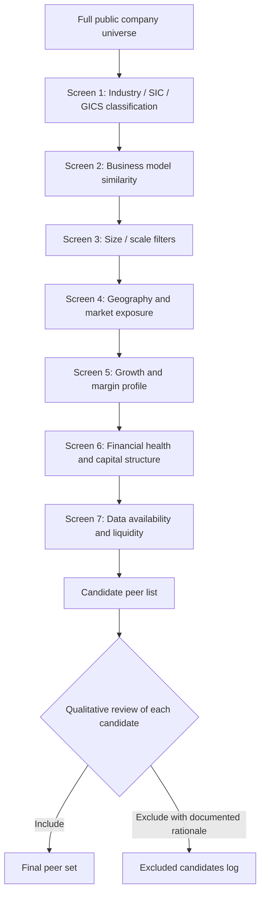

## Selecting a Comparable Company Peer Set

### Definition and Purpose

Peer set selection is the process of identifying a defensible group of publicly traded companies whose valuation multiples can reasonably be applied to a subject company. It is the single most consequential judgment in relative valuation: because the entire output of a comparable company analysis is a function of which companies are included, the credibility of the valuation rests almost entirely on the rigor and transparency of the screening process, not on the mechanical multiple calculation that follows it.

A well-constructed peer set is not simply "companies in the same industry" — it requires systematic screening across business model, financial profile, and market characteristics, followed by explicit justification for inclusion or exclusion of borderline candidates.

**Key Points**

- Peer selection quality determines the reliability of the entire relative valuation output
- Industry classification is a starting screen, not a sufficient comparability criterion on its own
- The process should be systematic and documented, not an ad hoc list assembled to fit a predetermined conclusion
- Trade-offs exist between peer set size (statistical robustness) and peer set precision (true comparability)

### The Screening Funnel

Peer selection is typically conducted as a progressive narrowing funnel, moving from a broad universe to a final defensible set:

### Screen 1: Industry Classification

The starting point is almost always a standardized industry classification system:

- **GICS (Global Industry Classification Standard)**: developed by MSCI and S&P, organized into 11 sectors, 25 industry groups, 74 industries, and 163 sub-industries — the most widely used system in equity research and investment banking.
- **SIC (Standard Industrial Classification)**: an older US government classification system, still used in some regulatory filings (SEC EDGAR) but largely superseded by GICS in practitioner use.
- **NAICS (North American Industry Classification System)**: the successor to SIC for US government statistical purposes, more granular than SIC but less commonly used in valuation practice than GICS.
- **ICB (Industry Classification Benchmark)**: used more commonly in European and UK markets, maintained by FTSE Russell.

Industry classification is a **necessary but insufficient** condition for comparability — companies in the same GICS sub-industry can still have materially different growth rates, margin structures, and risk profiles. It should be treated purely as the initial candidate list, not a validated peer set.

### Screen 2: Business Model Similarity

Beyond industry code, the analyst must assess whether companies actually compete for the same customers, use similar cost structures, and monetize similarly:

- **Revenue model**: subscription/recurring vs. transactional/one-time; direct-to-consumer vs. wholesale/distribution
- **Customer base**: enterprise vs. consumer; concentrated vs. diversified
- **Value chain position**: upstream/raw materials vs. midstream/manufacturing vs. downstream/retail
- **Asset intensity**: asset-heavy (owns manufacturing, real estate) vs. asset-light (licensing, platform models)

Two companies can share a GICS code (e.g., "Software") while having fundamentally different business models (enterprise SaaS vs. consumer mobile apps vs. on-premise licensed software), each warranting different multiples due to different growth, margin, and risk characteristics.

### Screen 3: Size and Scale Filters

Size affects valuation multiples through several channels: larger companies often command premium multiples due to greater liquidity, lower perceived risk, index inclusion effects, and analyst coverage, while smaller companies may trade at a discount reflecting a **small-cap illiquidity discount**.

Common size filters:

- **Market capitalization bands**: typically restricting the peer set to within a reasonable multiple (e.g., 0.2x–5x) of the subject company's market cap
- **Revenue bands**: similarly bounding by revenue scale
- **Enterprise value bands**: relevant when leverage differs meaningfully across candidates

**Example**

For a subject company with $800 million in revenue, a reasonable peer screen might include companies with revenue between $300 million and $2.5 billion — wide enough to generate a statistically meaningful sample, narrow enough to avoid comparing a mid-cap to a mega-cap with fundamentally different market dynamics.

### Screen 4: Geography and Market Exposure

Geographic considerations affect comparability through currency exposure, regulatory environment, tax regime, cost of capital, and local competitive dynamics:

- **Developed vs. emerging market listing**: different risk premia and liquidity profiles
- **Revenue geography vs. listing geography**: a US-listed company with 70% international revenue may be more comparable to a foreign-listed peer with similar geographic mix than to a domestically-focused US peer in the same industry
- **Regulatory regime**: healthcare, financial services, telecom, and utilities are often heavily shaped by jurisdiction-specific regulation that materially affects margin structure and growth ceiling

[Inference] In practice, many practitioners default to same-country or same-region peer sets for regulatory and macro consistency, expanding internationally only when the domestic peer set is too small to be statistically meaningful — though there is no universal rule and industry convention varies.

### Screen 5: Growth and Margin Profile

Because growth and margin are the fundamental drivers embedded in the DCF-derived logic of any multiple (see Principles of Relative Valuation), filtering for similarity on these dimensions materially improves peer set quality:

- **Revenue growth rate (historical and forward consensus)**: typically screened within a defensible band (e.g., peers growing 5–15% for a subject growing 9%)
- **EBITDA or operating margin**: screened for reasonable proximity, since margin differences reflect differing capital efficiency and competitive positioning
- **Margin trajectory**: expanding vs. stable vs. declining margin profiles should generally not be mixed without adjustment

### Screen 6: Financial Health and Capital Structure

- **Leverage (Net Debt/EBITDA)**: highly levered peers carry different equity risk than conservatively financed peers, distorting equity-level multiples like P/E even when EV-level multiples are used consistently
- **Profitability status**: excluding or separately bucketing companies with negative EBITDA or negative earnings, since standard multiples are not meaningful (or are highly distorted) for loss-making companies
- **Credit quality**: distressed or near-default companies typically trade on different valuation logic entirely (asset/liquidation value) and should generally be excluded from a standard trading comps set unless the subject company is itself in distress

### Screen 7: Data Availability and Liquidity

- **Trading liquidity**: thinly traded stocks can show distorted or stale pricing, reducing the reliability of the resulting multiple
- **Analyst coverage**: companies with no sell-side coverage lack consensus forward estimates, forcing reliance on trailing (historical) multiples only
- **Recent IPO or spin-off status**: newly listed companies often carry temporarily elevated or depressed multiples due to IPO pricing dynamics, lockup expirations, or incomplete historical financials
- **M&A rumor or pending transaction status**: companies currently subject to takeover speculation trade at multiples reflecting deal premium expectations rather than standalone fundamental value, and are typically excluded or flagged separately

### Determining Peer Set Size

There is an inherent trade-off between the number of peers and the tightness of comparability:

| Peer Set Size | Advantage | Disadvantage |
| --- | --- | --- |
| Small (3–5 peers) | Tight comparability, easier to defend each inclusion | Limited statistical robustness, vulnerable to single-company outliers |
| Medium (6–12 peers) | Balance of robustness and comparability | Requires more extensive documentation of screening logic |
| Large (15+ peers) | Statistically robust median/quartile ranges | Comparability often deteriorates; risk of including poor fits to pad sample size |

[Inference] Common practice in banking and equity research tends toward 5–10 "pure-play" peers supplemented by a broader secondary set for statistical context, though the appropriate size varies significantly by how narrowly or broadly the subject's industry is defined and how many public comparables actually exist.

### Handling a Thin or Non-Existent Peer Set

When few or no true public comparables exist (niche business models, recently disrupted industries, conglomerates with no direct analog):

- **Broaden the definition of comparability**: relax industry specificity in favor of similarity on the underlying value drivers (growth, margin, capital intensity) even across different sectors
- **Use a "sum-of-the-parts" approach**: for diversified or conglomerate businesses, value each segment against its own more targeted peer set and aggregate
- **Supplement with precedent transactions**: private market transaction multiples can substitute or supplement when public comparables are scarce, though these carry their own distinct biases (control premiums, deal-specific synergies)
- **Increase reliance on DCF and reverse-DCF cross-checks**: when comparables are weak, intrinsic valuation methods should carry more analytical weight in the final valuation conclusion

### Worked Example: Building a Peer Set

**Subject**: A mid-cap enterprise SaaS company providing supply-chain management software, $450M revenue, 22% revenue growth, 18% EBITDA margin, US-listed.

**Screening process**:

1. **GICS starting universe**: Software (Application Software sub-industry) — yields approximately 60–80 public candidates
2. **Business model filter**: retain only B2B enterprise SaaS (exclude consumer apps, on-premise licensed software, IT services/consulting) — narrows to approximately 20–25
3. **Size filter**: revenue between $150M–$1.5B — narrows to approximately 12–15
4. **Growth filter**: revenue growth between 12%–35% (excluding both slow-growth legacy software and hyper-growth pre-profitability names with fundamentally different risk profiles) — narrows to approximately 8–10
5. **Margin/profitability filter**: exclude companies with deeply negative EBITDA margins (below -20%), since these trade on revenue-multiple logic rather than EBITDA-multiple logic — narrows to final set of 6–8 peers
6. **Qualitative review**: manually exclude any remaining candidate currently under acquisition rumor or with unusually thin trading volume

**Resulting peer set**: 6–8 companies representing enterprise supply-chain-adjacent or comparable-vertical SaaS businesses, documented with explicit inclusion/exclusion rationale for any borderline candidate considered.

### Documentation and Defensibility

Because peer selection is judgment-intensive, professional practice requires the screening logic to be explicit and reproducible, not just the final list:

- Document the screening criteria and thresholds applied at each stage
- Maintain a log of borderline candidates considered and excluded, with rationale
- Disclose any subjective inclusions/exclusions that deviate from the mechanical screen
- Revisit the peer set periodically, since a company's competitive positioning and appropriate comparables can shift over time (business model evolution, M&A activity removing or adding candidates)

This documentation matters most in contexts subject to external scrutiny — fairness opinions, litigation support, and regulatory filings — where the peer set itself may be challenged by an opposing party or reviewing body.

### Common Pitfalls

- **Anchoring the peer set to produce a predetermined valuation**: selectively including high-multiple or low-multiple peers to support a target conclusion undermines the analytical credibility of the entire exercise.
- **Over-relying on industry classification alone**: treating "same GICS sub-industry" as sufficient comparability without examining business model, growth, and margin fit.
- **Ignoring capital structure and profitability status when screening**: including distressed, deeply loss-making, or highly levered outliers without separate treatment.
- **Static peer sets**: failing to revisit and update the peer set as the subject company's or peers' business models evolve, or as M&A activity changes which companies remain independently listed.
- **Insufficient sample size without acknowledgment**: presenting a 2–3 company peer set with the same statistical confidence as a 10+ company set, without flagging the reduced robustness.

### Next Steps

- **Principles of Relative Valuation**
- **EV/EBITDA, P/E, and EV/Sales: Mechanics and Adjustments**
- **Normalizing Financial Statements for Comparability**
- **Precedent Transaction Analysis vs. Trading Comparables**
- **Sum-of-the-Parts Valuation for Diversified Businesses**
- **Football Field Valuation Charts and Triangulation**
- **Small-Cap Illiquidity Discounts and Control Premiums**