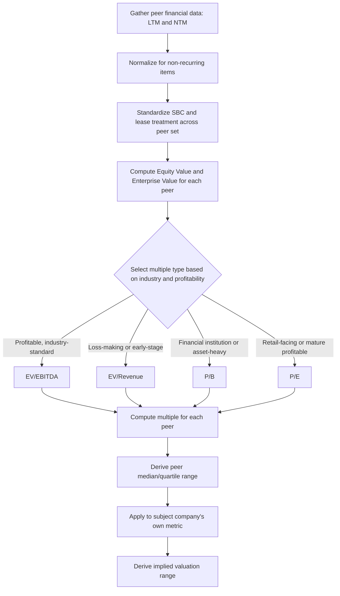

## Core Trading Multiples Including EV/EBITDA and EV/Revenue

### Definition and Purpose

Core trading multiples are the standardized ratios used to translate a company's financial metrics into a market-comparable valuation measure. Each multiple pairs a value measure (equity value or enterprise value) with a financial metric (earnings, EBITDA, revenue, book value), producing a ratio that can be benchmarked against a peer set to derive an implied valuation for a subject company. Selecting and correctly calculating the right multiple — with consistent numerator/denominator treatment and appropriate normalization — is the mechanical core of relative valuation.

**Key Points**

- Every multiple must match its numerator (equity value vs. enterprise value) to a denominator that reflects the same claim base
- EV/EBITDA is the most widely used capital-structure-neutral multiple across industries
- EV/Revenue is the fallback multiple when earnings are negative or highly distorted
- P/E remains dominant for retail-facing and index-level analysis despite its leverage sensitivity
- Consistent time-period basis (LTM vs. NTM) and normalization for one-time items are essential across the entire peer set

### The Two Value Measures: Equity Value vs. Enterprise Value

**Equity Value (Market Capitalization)**

$$Equity\ Value = Share\ Price \times Diluted\ Shares\ Outstanding$$

Represents the value of the claims held by common shareholders only.

**Enterprise Value**

$$EV = Equity\ Value + Total\ Debt + Preferred\ Stock + Minority\ Interest - Cash\ \&\ Equivalents$$

Represents the value of the entire operating business, available to all capital providers (debt and equity) before financing structure is applied. EV is capital-structure-neutral: it does not change simply because a company shifts its debt/equity mix, holding operating value constant.

The critical rule governing multiple construction: **equity value numerators must be paired with equity-level denominators** (net income, book value of equity), and **enterprise value numerators must be paired with firm-level denominators** (EBITDA, EBIT, revenue, unlevered FCF) — metrics available to both debt and equity holders before interest expense.

### EV/EBITDA

**Formula**

$$\frac{EV}{EBITDA} = \frac{Equity\ Value + Debt + Minority\ Interest + Preferred - Cash}{EBITDA}$$

where EBITDA = Earnings Before Interest, Taxes, Depreciation, and Amortization, typically calculated as Operating Income + D&A, or alternatively built up from Net Income by adding back interest, taxes, depreciation, and amortization.

**Why it is the most widely used multiple**

- **Capital-structure neutral**: because both EV and EBITDA sit "above the line" of financing decisions (before interest expense), the multiple is not distorted by differences in leverage across peers.
- **Removes depreciation policy distortions**: D&A methods and useful-life assumptions vary significantly across companies and jurisdictions (straight-line vs. accelerated, differing asset lives); adding D&A back neutralizes this accounting variation.
- **Applicable to unprofitable-at-the-net-income-level companies**: many companies with positive EBITDA report negative net income due to high interest expense, D&A, or non-cash charges, making P/E meaningless while EV/EBITDA remains usable.
- **Standard across most industries**: particularly dominant in capital-intensive sectors (industrials, telecom, energy, healthcare services) where D&A is large and leverage varies meaningfully across the peer set.

**Limitations**

- EBITDA ignores capital expenditure requirements entirely, which can be materially different across companies even within the same industry (capex-light software vs. capex-heavy manufacturing) — two companies with identical EBITDA can generate very different actual free cash flow.
- EBITDA is not a GAAP/IFRS-defined metric, so companies have latitude in what they include or exclude (particularly around stock-based compensation and non-recurring items), requiring careful normalization for true comparability.
- Ignores differences in working capital intensity across companies.

**Worked Example**

Company: Enterprise Value = $3,200,000,000; LTM EBITDA = $355,000,000

$$\frac{EV}{EBITDA} = \frac{3{,}200{,}000{,}000}{355{,}000{,}000} = 9.0x$$

If the peer median EV/EBITDA is 10.5x and the subject company shares comparable growth and margin characteristics, applying the peer multiple to the subject's own EBITDA:

$$Implied\ EV = 355{,}000{,}000 \times 10.5 = 3{,}727{,}500{,}000$$

suggesting the subject may be undervalued relative to peers, pending further investigation of what specifically explains the gap (lower growth, higher risk, or a genuine market inefficiency).

### EV/Revenue (EV/Sales)

**Formula**

$$\frac{EV}{Revenue}$$

**When it is used**

- **Loss-making or pre-profitability companies**: early-stage growth companies, biotech pre-commercialization, and cyclical companies at a trough often have negative or near-zero EBITDA/earnings, making EBITDA- and earnings-based multiples unusable; revenue is rarely negative and provides a workable scaling metric.
- **Cross-border comparisons with inconsistent accounting**: revenue recognition, while not immune to policy differences (especially under differing revenue recognition standards), is generally less distorted by non-cash accounting choices than EBITDA or net income.
- **High-growth technology and SaaS valuation**: particularly for early-stage SaaS companies prioritizing growth over near-term profitability, where revenue growth is a more decision-relevant metric than current-period earnings.

**Limitations**

- Ignores cost structure and margin entirely: a company with a 60% gross margin and a company with a 20% gross margin can show the same EV/Revenue multiple despite fundamentally different unit economics and long-run profitability potential.
- Highly sensitive to revenue recognition policy differences (e.g., gross vs. net revenue reporting for marketplace/platform businesses can produce multiples that differ by an order of magnitude for economically similar businesses).
- Less theoretically grounded in the DCF derivation than EBITDA- or earnings-based multiples, since revenue sits further from the actual cash flow the DCF framework discounts.

**Worked Example**

A pre-profitability SaaS company: Enterprise Value = $1,800,000,000; NTM Revenue = $220,000,000

$$\frac{EV}{Revenue} = \frac{1{,}800{,}000{,}000}{220{,}000{,}000} = 8.2x$$

Because revenue multiples ignore margin, it is standard practice to present EV/Revenue alongside a **Rule of 40 assessment** (Revenue Growth % + EBITDA Margin % ≥ 40%) for SaaS companies specifically, to contextualize whether the multiple is justified by an appropriate combination of growth and profitability rather than growth alone.

### Price/Earnings (P/E)

**Formula**

$$\frac{P}{E} = \frac{Share\ Price}{Diluted\ EPS} = \frac{Equity\ Value}{Net\ Income}$$

**Strengths**

- Widely understood and reported, making it the dominant multiple in retail investor communication, index-level analysis, and general financial media.
- Directly derivable from the dividend discount model, giving it clear theoretical grounding (see Principles of Relative Valuation).

**Limitations**

- **Leverage-sensitive**: net income is measured after interest expense, so two operationally identical companies with different capital structures will show different P/E ratios purely due to financing choices, not operating performance.
- **Distorted by one-time items**: impairments, restructuring charges, and tax adjustments flow through net income, requiring normalization for a "clean" or "adjusted" EPS figure.
- **Tax rate sensitivity**: differing effective tax rates across jurisdictions distort comparability even for operationally similar companies.
- **Meaningless for loss-making companies**: negative or near-zero earnings produce meaningless or explosive P/E ratios.

**Trailing vs. Forward P/E**

- **Trailing (LTM) P/E**: uses the last twelve months of actual reported earnings — backward-looking but based on confirmed results.
- **Forward (NTM) P/E**: uses consensus analyst estimates for the next twelve months — more relevant for growth-oriented valuation but dependent on estimate accuracy and available analyst coverage.

### Price/Book (P/B)

**Formula**

$$\frac{P}{B} = \frac{Equity\ Value}{Book\ Value\ of\ Equity}$$

**Primary use cases**

- **Financial institutions (banks, insurers)**: where regulatory capital requirements are themselves based on book value, and where balance sheet assets (loans, securities) often approximate fair value more closely than for non-financial companies.
- **Asset-heavy businesses (REITs, holding companies)**: where book value serves as a reasonable proxy for the replacement or liquidation value of tangible assets.
- **Distressed or liquidation scenarios**: where going-concern earnings-based multiples are less relevant than asset-based value.

**Limitations**

- Book value reflects historical cost accounting (net of accumulated depreciation) rather than current fair value or replacement cost, particularly distorting comparability for older assets carried at historical cost versus recently acquired assets marked at fair value through purchase accounting.
- Largely irrelevant for asset-light businesses (software, services) where the majority of economic value resides in intangible assets not fully captured on the balance sheet.

### EV/EBIT

**Formula**

$$\frac{EV}{EBIT}$$

Similar rationale to EV/EBITDA (capital-structure-neutral) but does not add back depreciation and amortization, making it more relevant when D&A represents a genuine ongoing economic cost (e.g., capital-intensive industries where equipment must be regularly replaced) rather than a purely non-cash accounting artifact. EV/EBIT is generally considered a closer proxy to unlevered free cash flow than EV/EBITDA precisely because it retains the depreciation charge.

### Comparison Table of Core Multiples

| Multiple | Numerator | Denominator | Capital-Structure Neutral | Best Suited For | Key Limitation |
| --- | --- | --- | --- | --- | --- |
| EV/EBITDA | Enterprise Value | EBITDA | Yes | Cross-leverage comparisons, capital-intensive industries | Ignores capex requirements |
| EV/EBIT | Enterprise Value | EBIT | Yes | When D&A is a real economic cost | Still ignores capex timing |
| EV/Revenue | Enterprise Value | Revenue | Yes | Loss-making, early-stage, high-growth companies | Ignores margin entirely |
| P/E | Equity Value | Net Income | No | Retail communication, profitable mature companies | Leverage and tax-rate sensitive |
| P/B | Equity Value | Book Value of Equity | No | Financials, asset-heavy, distressed situations | Historical cost distortion |

### Normalization Requirements Across All Multiples

Regardless of which multiple is used, consistent normalization across the peer set is required for the comparison to be valid:

- **Non-recurring items**: restructuring charges, litigation settlements, asset impairments, and gains/losses on divestitures should be added back or removed to reflect ongoing, sustainable earnings power.
- **Stock-based compensation**: treatment varies significantly by analyst convention — some include SBC as a real economic expense (reducing EBITDA), others add it back as non-cash; whichever convention is chosen must be applied consistently across every peer and the subject company.
- **Lease accounting**: under current lease accounting standards (ASC 842 / IFRS 16), operating leases are capitalized on the balance sheet, affecting both EV (via lease liabilities) and EBITDA (via the split between depreciation and interest components of lease expense); comparability requires consistent treatment across peers, particularly when comparing companies that adopted different standards or have different lease-vs-own asset strategies.
- **Time period basis**: multiples must be computed on a consistent basis (all LTM or all NTM) across the entire peer set; mixing trailing and forward multiples produces systematically biased comparisons, particularly for high-growth companies where forward and trailing metrics diverge significantly.
- **Minority interest and equity-method investments**: EBITDA should generally be adjusted to reflect only consolidated operations proportionate to EV, or minority interest must be properly added to EV to match the fully consolidated EBITDA figure.

### Multiple Calculation Workflow

### Industry-Specific Multiples (Brief Overview)

Beyond the core multiples above, many industries rely on sector-specific value drivers where standard financial multiples fail to capture the operative economics:

- **EV/Subscriber or EV/Daily Active User**: telecom, media, digital platforms
- **EV/Proved Reserves or EV/Daily Production**: oil & gas, mining
- **Price/AUM (Assets Under Management)**: asset managers
- **EV/Bed or EV/Admission**: hospitals and healthcare facilities
- **EV/Square Foot**: retail and real estate

These supplement, rather than replace, the core financial multiples and are generally presented alongside EV/EBITDA or EV/Revenue rather than in isolation.

### Common Pitfalls

- **Mismatching numerator and denominator claim bases**: dividing equity value by EBITDA (a firm-level metric) inflates the apparent multiple for highly levered companies and is a fundamental analytical error.
- **Inconsistent normalization across the peer set**: adjusting the subject company's EBITDA for one-time items while leaving peer EBITDA unadjusted (or vice versa) introduces a systematic bias favoring whichever conclusion the adjustment was designed to support.
- **Mixing LTM and NTM multiples within the same comparison table**: particularly distortive for companies with significant expected near-term growth or decline.
- **Ignoring negative or near-zero denominators**: computing P/E or EV/EBITDA for companies with negative earnings or EBITDA produces meaningless (and sometimes sign-flipped) multiples that should be excluded or flagged rather than averaged into peer statistics.
- **Failing to disclose SBC and lease treatment conventions**: without explicit disclosure of these choices, the resulting multiples are not reproducible or fully comparable across different analysts' work.

### Next Steps

- **Principles of Relative Valuation**
- **Selecting a Comparable Company Peer Set**
- **Normalizing Financial Statements for Comparability**
- **Precedent Transaction Analysis vs. Trading Comparables**
- **Industry-Specific Valuation Multiples**
- **Football Field Valuation Charts and Triangulation**
- **Rule of 40 and Growth-Adjusted Multiples in SaaS Valuation**