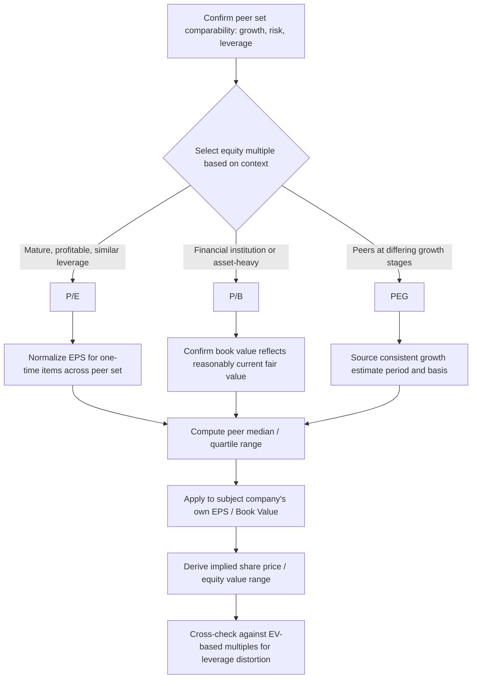

## Equity Multiples Including P/E, P/B, and PEG

### Definition and Purpose

Equity multiples value the claims of common shareholders directly, using equity value (market capitalization or share price) in the numerator paired with a per-share or total equity-level denominator (net income, book value of equity, growth-adjusted earnings). Unlike enterprise value multiples, which are capital-structure-neutral, equity multiples are inherently sensitive to financial leverage, since the earnings and book value available to shareholders are measured *after* debtholders' claims have been satisfied. This makes equity multiples directly relevant to shareholder returns but requires care when comparing companies with different capital structures.

**Key Points**

- Equity multiples pair equity value with equity-level denominators: net income, book value of equity, or growth-adjusted earnings
- P/E is the most widely recognized valuation multiple in financial markets but is distorted by leverage, tax rate, and one-time items
- P/B is most meaningful for financial institutions and asset-heavy businesses where book value approximates economic value
- PEG normalizes P/E for differing growth rates, enabling comparison across companies at different growth stages
- All equity multiples require careful normalization for non-recurring items and consistent treatment of dilutive securities

### Price/Earnings (P/E) Ratio

**Formula**

$$\frac{P}{E} = \frac{Share\ Price}{Diluted\ EPS} = \frac{Equity\ Value}{Net\ Income\ to\ Common}$$

**Theoretical Derivation**

P/E is directly derivable from the Gordon Growth dividend discount model, which is what gives it theoretical grounding rather than treating it as an arbitrary convention:

$$P_0 = \frac{D_1}{r_e - g} = \frac{E_1 \times payout}{r_e - g}$$

$$\frac{P_0}{E_1} = \frac{payout}{r_e - g}$$

This shows the P/E multiple is a function of three drivers: the **payout ratio** (or, equivalently, the reinvestment rate), the **cost of equity** $r_e$ (risk), and the **growth rate** $g$. Holding payout and risk constant, P/E rises with growth; holding growth and payout constant, P/E falls as required return (risk) rises.

**Trailing vs. Forward P/E**

- **Trailing (LTM) P/E**: uses actual reported earnings over the last twelve months — grounded in confirmed results but backward-looking, particularly problematic for companies with rapidly changing fundamentals.
- **Forward (NTM) P/E**: uses consensus analyst estimates for the next twelve months — more forward-relevant for growth valuation but dependent on estimate reliability and analyst coverage availability.

**Worked Example**

A company trades at $85.00 per share with trailing diluted EPS of $4.25:

$$\frac{P}{E} = \frac{85.00}{4.25} = 20.0x$$

If the peer median trailing P/E is 17.5x and this company shares comparable growth, risk, and leverage characteristics, the premium multiple suggests the market is pricing in superior growth expectations, superior margin durability, or lower perceived risk relative to peers — which should be independently verified against the company's actual fundamentals rather than accepted at face value.

**Key Limitations**

- **Leverage sensitivity**: net income sits below interest expense, so two operationally identical companies with different debt levels will show different P/E ratios purely from financing choices, not operating performance — this is the central weakness that EV/EBITDA and EV/EBIT are designed to avoid.
- **Tax rate sensitivity**: differing effective tax rates (due to jurisdiction, tax credits, or one-time items) distort comparability even between operationally similar companies.
- **Distortion from one-time items**: impairments, litigation charges, and discontinued operations flow through net income, requiring analysts to compute an "adjusted" or "normalized" EPS for meaningful comparison.
- **Meaningless for loss-making companies**: negative earnings produce a negative or explosively large P/E that cannot be meaningfully averaged into peer statistics.
- **Share count and dilution treatment**: must consistently use diluted shares (incorporating in-the-money options, convertible securities, and RSUs) across the entire peer set; mixing basic and diluted share counts distorts comparability.

### Price/Book (P/B) Ratio

**Formula**

$$\frac{P}{B} = \frac{Equity\ Value}{Book\ Value\ of\ Common\ Equity}$$

where Book Value of Common Equity = Total Assets − Total Liabilities − Preferred Equity, as reported on the balance sheet.

**Theoretical Grounding**

P/B can be linked to Return on Equity (ROE) and the same growth/risk framework underlying P/E, since:

$$\frac{P}{B} = \frac{ROE - g}{r_e - g}$$

This shows that P/B rises with ROE (holding growth and risk constant) — a company generating returns on equity above its cost of equity should trade at a premium to book value, while a company earning ROE below its cost of equity should theoretically trade at a discount to book value, since it is destroying rather than creating shareholder value on each incremental dollar of equity capital.

**Primary Use Cases**

- **Banks and financial institutions**: loan portfolios and securities holdings are carried closer to fair value than typical industrial company assets, and regulatory capital ratios are themselves computed on a book value basis, making P/B a natural primary multiple in this sector.
- **Insurance companies**: statutory and GAAP book value serves as a standard valuation anchor, often paired with P/E and dividend yield.
- **REITs and asset-heavy holding companies**: where underlying real estate or physical assets approximate the economic value captured on the balance sheet (though Net Asset Value, a more refined fair-value-based measure, is often preferred over historical-cost book value for REITs specifically).
- **Distressed or liquidation analysis**: when going-concern earnings multiples are less relevant than the residual claim on net assets.

**Key Limitations**

- **Historical cost accounting distortion**: book value reflects the depreciated historical cost of assets, not current replacement value or fair market value, meaning older assets are understated relative to recently acquired assets of similar economic value.
- **Irrelevant for asset-light businesses**: software, services, and brand-driven consumer companies generate the majority of their economic value from intangible assets (technology, customer relationships, brand equity) that are often not fully recognized on the balance sheet unless acquired (via purchase accounting goodwill), making P/B largely uninformative for these business models.
- **Share buyback distortion**: aggressive share repurchases reduce book value of equity (and can even produce negative book value in extreme cases) without necessarily reflecting deteriorating fundamental value, since repurchases are a capital allocation choice rather than a value-destroying event.

**Worked Example**

A regional bank trades at $42.00 per share with book value per share of $36.00:

$$\frac{P}{B} = \frac{42.00}{36.00} = 1.17x$$

If the bank's ROE is 11% against a peer-average ROE of 9%, and its cost of equity is comparable to peers, the premium P/B relative to a peer average of perhaps 1.05x is consistent with — and can be partially explained by — its superior return on equity.

### PEG Ratio (Price/Earnings-to-Growth)

**Formula**

$$PEG = \frac{P/E}{Expected\ EPS\ Growth\ Rate\ (\%)}$$

Growth is typically expressed as a whole number matching the P/E convention (e.g., a P/E of 20x with 20% expected growth produces a PEG of 1.0), commonly using a 3–5 year forward consensus EPS growth estimate as the denominator input.

**Purpose and Interpretation**

PEG exists to address the central weakness of raw P/E comparisons: two companies can show very different P/E ratios simply because they have different growth rates, not because one is more richly or cheaply valued on a growth-adjusted basis. PEG normalizes for this by dividing the P/E by the growth rate, producing a ratio that is (in principle) more directly comparable across companies at different growth stages.

**Common interpretive convention** (heuristic, not a rigorous valuation rule):

- PEG < 1.0: potentially undervalued relative to growth (the multiple appears low given the growth rate)
- PEG ≈ 1.0: fairly valued relative to growth, following the "Peter Lynch" heuristic that a fairly priced growth stock's P/E should roughly equal its growth rate
- PEG > 1.0: potentially overvalued relative to growth

[Inference] This 1.0 benchmark is a widely cited market heuristic rather than a rigorously derived equilibrium value; it does not hold precisely across differing risk levels, payout ratios, or growth durations, and should be treated as a rough screening tool rather than a definitive valuation signal.

**Worked Example**

Company A: P/E = 25x, expected 3-year EPS CAGR = 20% → PEG = 25/20 = 1.25

Company B: P/E = 40x, expected 3-year EPS CAGR = 35% → PEG = 40/35 ≈ 1.14

Despite Company B's substantially higher headline P/E (40x vs. 25x), its PEG is actually slightly lower than Company A's, suggesting that on a growth-adjusted basis, Company B may not be as expensive as the raw P/E comparison implies.

**Key Limitations**

- **Assumes a linear relationship between P/E and growth**: the theoretical Gordon Growth relationship between P/E and growth is not linear (P/E depends on $g$ through $r_e - g$ in the denominator, not through direct proportionality), so dividing P/E by a raw growth percentage is a simplification rather than a rigorous transformation.
- **Ignores risk differences**: two companies with identical P/E and identical growth rates but different risk profiles (leverage, business cyclicality, customer concentration) will have the same PEG despite warranting different valuations — PEG does not control for the $r_e$ term in the underlying model.
- **Sensitive to the growth estimate period and source**: using 1-year vs. 3-year vs. 5-year growth estimates, or analyst consensus vs. management guidance vs. historical growth, can produce meaningfully different PEG values for the same company.
- **Breaks down at low or negative growth**: a company with near-zero or negative expected growth produces a PEG that is either meaningless (division by a near-zero number) or sign-flipped, limiting PEG's applicability to genuinely growth-oriented companies.
- **Does not account for growth durability**: PEG treats a company expected to grow 20% for one year the same as a company expected to sustain 20% growth for a decade, despite the latter warranting a materially higher multiple under any proper DCF-based framework.

### Dividend Yield and Dividend-Related Metrics (Supplementary Equity Metric)

Though not a "multiple" in the traditional numerator/denominator sense, dividend yield is frequently presented alongside P/E and P/B for income-oriented equity valuation, particularly in utilities, REITs, and mature dividend-paying sectors:

$$Dividend\ Yield = \frac{Annual\ Dividend\ per\ Share}{Share\ Price}$$

This metric directly reflects the $payout$ term in the P/E derivation above and is most relevant when comparing mature, low-growth companies where returns to shareholders are dominated by current income rather than capital appreciation from reinvested earnings.

### Comparative Summary of Equity Multiples

| Multiple | Formula | Best Suited For | Key Weakness |
| --- | --- | --- | --- |
| P/E (trailing) | Price / LTM EPS | Mature, profitable companies | Leverage and one-time item sensitivity |
| P/E (forward) | Price / NTM EPS | Growth-stage comparisons | Dependent on estimate accuracy |
| P/B | Price / Book Value per Share | Financials, asset-heavy, distressed | Historical cost distortion |
| PEG | P/E ÷ Growth Rate | Cross-growth-stage comparison | Ignores risk; assumes linear P/E-growth link |
| Dividend Yield | Dividend / Price | Income-oriented, mature sectors | Irrelevant for non-dividend payers |

### Workflow for Applying Equity Multiples

### Equity Multiples vs. Enterprise Value Multiples: When Each Applies

Equity multiples are most defensible when the peer set shares a genuinely similar capital structure, since leverage differences are not neutralized the way they are in EV-based multiples. When comparing companies with meaningfully different debt levels, best practice is to lead with EV/EBITDA or EV/EBIT for the primary valuation conclusion and present P/E and P/B as **secondary, corroborating metrics** rather than the primary basis for value, explicitly flagging any leverage-driven distortion observed between the two approaches.

### Common Pitfalls

- **Comparing P/E across companies with materially different leverage without adjustment**: a highly levered company will mechanically show an inflated P/E relative to an unlevered operational twin, purely from financial leverage amplifying the equity return on a smaller equity base — this should not be mistaken for the market pricing superior growth or quality.
- **Using basic (non-diluted) share counts inconsistently**: understates the true share count and overstates EPS, inflating apparent value; diluted shares should be used consistently across the entire peer set.
- **Applying P/B to asset-light businesses**: producing a P/B multiple for a software or services company is rarely meaningful, since the metric says little about the true economic value drivers of the business.
- **Treating PEG's "1.0 = fair value" heuristic as a rigorous valuation rule**: PEG is a useful growth-adjusted screening tool, not a substitute for a full DCF or risk-adjusted relative valuation.
- **Mixing growth estimate horizons within a PEG comparison set**: using 1-year growth for one company and 5-year growth for another within the same comparison table produces an apples-to-oranges result.

### Next Steps

- **Principles of Relative Valuation**
- **Core Trading Multiples Including EV/EBITDA and EV/Revenue**
- **Selecting a Comparable Company Peer Set**
- **Normalizing Financial Statements for Comparability**
- **Return on Equity, Return on Invested Capital, and Value Creation**
- **Dividend Discount Models and Payout-Based Valuation**
- **Football Field Valuation Charts and Triangulation**