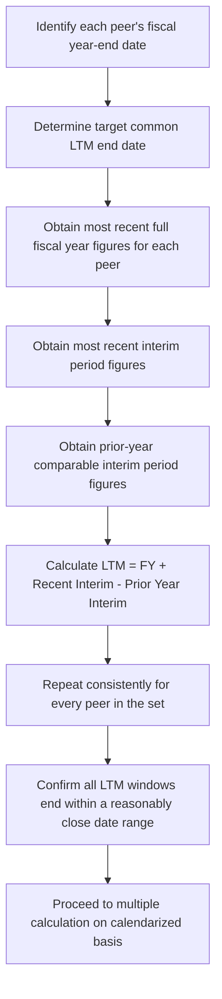
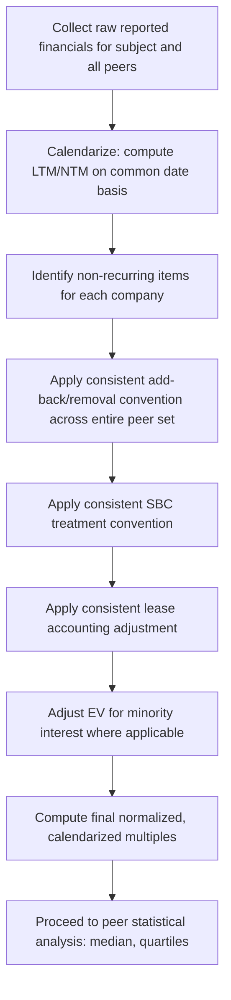

## Calendarization and Multiple Normalization

### Definition and Purpose

Calendarization is the process of adjusting companies' reported financial data — which may follow different fiscal year-end dates — onto a common, uniform time basis so that multiples calculated across a peer set are measuring the same period of economic activity. Multiple normalization is the broader companion process of adjusting the financial metrics themselves (removing distortions from non-recurring items, differing accounting conventions, and timing mismatches) so that the resulting ratios reflect sustainable, comparable operating performance rather than accounting or calendar artifacts.

Both processes address the same underlying risk: a multiple is only as reliable as the comparability of the numbers feeding into it, and even a well-screened peer set (see Selecting a Comparable Company Peer Set) will produce misleading multiples if the underlying financial data is not placed on a consistent time and accounting basis first.

**Key Points**

- Calendarization aligns companies with different fiscal year-ends onto a common period (typically calendar year or a common LTM date)
- Multiple normalization removes non-recurring items, accounting policy differences, and one-time distortions from the numerator and denominator
- Both are prerequisite steps that must occur before multiples are computed, not adjustments applied after the fact
- Failure to calendarize or normalize is one of the most common sources of error in relative valuation, because peer companies rarely share identical fiscal calendars or accounting conventions

### The Fiscal Year-End Problem

Not all companies report on a calendar-year basis (January–December). Fiscal year-ends commonly differ due to industry convention, historical company choice, or tax planning:

| Company Type | Common Fiscal Year-End | Rationale |
| --- | --- | --- |
| Most industrial/consumer companies | December 31 | Aligns with calendar year, most common convention |
| US retailers | Late January / early February | Captures full holiday selling season within one fiscal year |
| Technology companies (e.g., certain enterprise software firms) | June 30 or September 30 | Historical convention, alignment with government fiscal contracting cycles |
| Agricultural / commodity companies | Varies by harvest cycle | Aligns fiscal reporting with the underlying production cycle |

If a subject company (fiscal year ending December 31) is compared against a peer with a fiscal year ending June 30, using each company's most recently reported "fiscal year" figures without adjustment compares two different underlying economic periods — potentially capturing different points in an economic or industry cycle, different periods of raw material pricing, or different macro conditions entirely.

### The LTM (Last Twelve Months) Solution

The standard technique for calendarizing across differing fiscal year-ends is to construct a **Last Twelve Months (LTM)** figure for every company, synthetically aligning all peers to the same trailing twelve-month window ending on (or near) a common date, regardless of each company's individual fiscal year-end.

**Standard LTM Formula**

$$LTM = \text{Most Recent Fiscal Year} + \text{Most Recent Interim Period} - \text{Prior Year Comparable Interim Period}$$

**Worked Example**

A company with a fiscal year ending December 31 reports:

- FY2025 (full year, Jan–Dec 2025) Revenue: $1,200,000,000
- Q1 2026 (Jan–Mar 2026) Revenue: $320,000,000
- Q1 2025 (Jan–Mar 2025, the comparable prior-year quarter) Revenue: $280,000,000

To calendarize to an LTM period ending March 31, 2026:

$$LTM\ Revenue = 1{,}200{,}000{,}000 + 320{,}000{,}000 - 280{,}000{,}000 = 1{,}240{,}000{,}000$$

This produces a trailing twelve-month figure covering April 2025 through March 2026, which can then be compared on a like-for-like basis against any other company's LTM figure calculated to the same or a similarly close ending date — regardless of what each company's own fiscal year convention happens to be.

**Applying LTM Across a Peer Set with Mixed Fiscal Calendars**

### Handling Forward (NTM) Calendarization

The same alignment problem exists for forward-looking multiples. **Next Twelve Months (NTM)** figures must similarly be calendarized using a weighted blend of consensus analyst estimates for the current and next fiscal years, weighted by the proportion of each fiscal year falling within the target NTM window:

$$NTM = (w_1 \times FY_{current\ estimate}) + (w_2 \times FY_{next\ estimate})$$

where $w_1$ and $w_2$ are the fractional weights of each fiscal year overlapping the twelve-month forward window (summing to 1.0).

**Worked Example**

If today's date falls 4 months into a company's current fiscal year (FY2026 estimate = $500,000,000; FY2027 estimate = $560,000,000), the NTM window captures the remaining 8 months of FY2026 and the first 4 months of FY2027:

$$NTM\ Revenue = \left(\frac{8}{12} \times 500{,}000{,}000\right) + \left(\frac{4}{12} \times 560{,}000{,}000\right) = 333{,}333{,}333 + 186{,}666{,}667 = 520{,}000{,}000$$

This weighted-blend approach is standard in equity research and investment banking models where consensus estimates are only available on a full fiscal-year basis, requiring interpolation to produce a genuinely forward-twelve-month figure comparable across peers with different fiscal calendars and different current positions within their respective fiscal years.

### Multiple Normalization: Beyond Calendar Alignment

Even after calendarization solves the timing mismatch, the financial metrics themselves often require adjustment to remove distortions unrelated to sustainable operating performance:

**1. Non-Recurring and One-Time Items**

Items that should typically be added back (or removed, if income-boosting) to normalize earnings/EBITDA include:

- Restructuring and severance charges
- Asset impairments and write-downs
- Litigation settlements and legal judgments
- Gains/losses on divestitures or asset sales
- Natural disaster or force majeure-related costs
- Acquisition-related transaction costs (legal, advisory fees)

**2. Stock-Based Compensation (SBC) Treatment**

SBC normalization is one of the more contested areas of multiple construction, as conventions vary by analyst and by era of market practice:

- **Include as an expense** (reduces EBITDA): treats SBC as a real economic cost representing dilution to existing shareholders, consistent with GAAP treatment.
- **Add back as non-cash** (increases EBITDA): treats SBC as a non-cash item similar to D&A, following the convention many technology companies themselves use in "adjusted EBITDA" disclosures.

Whichever convention is selected, it must be applied **identically** across every peer and the subject company; inconsistent SBC treatment across a peer set is one of the most common sources of distorted multiple comparisons, particularly in technology sector analysis where SBC as a percentage of revenue can vary dramatically between companies.

**3. Lease Accounting Normalization**

Under current lease accounting standards (ASC 842 in the US, IFRS 16 internationally), operating leases are capitalized on the balance sheet as right-of-use assets and lease liabilities, with the associated expense split between a depreciation-like component and an interest-like component. This affects:

- **Enterprise Value**: lease liabilities are typically included in the EV bridge similarly to debt
- **EBITDA**: the interest component of lease expense is added back under EBITDA (since EBITDA excludes interest), while the depreciation-like component was already excluded from operating income before D&A add-back

Companies with different mixes of owned versus leased assets, or that adopted differing transition approaches to these standards, can show distorted comparability if this treatment is not applied uniformly.

**4. Minority Interest and Non-Controlling Interests**

When a company consolidates a subsidiary it does not wholly own, the subsidiary's full EBITDA typically flows into consolidated EBITDA, but only the parent's proportionate equity claim is reflected in market capitalization. To maintain a consistent EV/EBITDA multiple, minority interest must be added to the EV bridge, ensuring the value measure (EV) reflects the same proportion of the business as the earnings measure (consolidated EBITDA).

**5. Currency and Foreign Exchange Normalization**

For multinational peer sets, translating foreign-currency-denominated financials at a consistent exchange rate convention (typically average rate for income statement items, period-end spot rate for balance sheet items) avoids introducing FX volatility as an artificial source of multiple divergence unrelated to underlying operating performance.

### Worked Example: Full Normalization Walkthrough

A subject company reports the following for its most recent LTM period:

| Line Item | As Reported |
| --- | --- |
| Revenue | $680,000,000 |
| Operating Income | $95,000,000 |
| D&A | $42,000,000 |
| Restructuring charge (one-time) | $18,000,000 |
| Litigation settlement (one-time gain) | ($6,000,000) |
| SBC (included in Operating Income) | $14,000,000 |

**Step 1 — Reported EBITDA**

$$95{,}000{,}000 + 42{,}000{,}000 = 137{,}000{,}000$$

**Step 2 — Add back restructuring, remove one-time gain**

$$137{,}000{,}000 + 18{,}000{,}000 - 6{,}000{,}000 = 149{,}000{,}000$$

**Step 3 — Apply chosen SBC convention (assume peer-consistent convention: add back)**

$$149{,}000{,}000 + 14{,}000{,}000 = 163{,}000{,}000\ \text{(Adjusted EBITDA)}$$

If the peer set's multiples were all computed on an identically normalized (add-back SBC, exclude one-time items) basis, this $163,000,000 Adjusted EBITDA — not the raw $137,000,000 reported EBITDA — is the figure that should be paired with the peer median EV/EBITDA multiple to derive implied enterprise value. Using the unadjusted figure against a peer multiple that was itself computed on an adjusted basis for the peer companies would understate the subject's implied value.

### Common Sources of Miscalendarization and Non-Normalization Errors

| Error Type | Consequence |
| --- | --- |
| Comparing full fiscal years across peers with different year-ends without LTM adjustment | Compares different underlying economic periods, especially distortive around cyclical or seasonal businesses |
| Mixing trailing (LTM) and forward (NTM) multiples in the same table | Systematically biases comparison, especially for high-growth or declining companies |
| Inconsistent SBC treatment across peer set | Understates or overstates relative valuation depending on each peer's SBC intensity |
| Failing to add back one-time items for only some peers | Introduces an artificial and indefensible skew into the peer multiple range |
| Ignoring lease accounting differences between owned-asset and leased-asset peers | Distorts EV and EBITDA comparability for companies with different lease-vs-own strategies |
| Not adjusting for minority interest in consolidated subsidiaries | Creates a mismatch between the value measure (EV) and earnings measure (EBITDA) proportion of the business represented |

### Practical Workflow Summary

### Common Pitfalls

- **Treating calendarization as optional for "close enough" fiscal year-ends**: even a one-quarter mismatch can materially distort comparability for cyclical or seasonal businesses (retail, agriculture, energy).
- **Normalizing the subject company but not the peer set (or vice versa)**: applying add-backs only where convenient for the desired conclusion undermines the objectivity of the entire analysis.
- **Failing to disclose normalization conventions**: without transparency about SBC treatment, one-time item definitions, and lease adjustments, the resulting multiples are not reproducible or auditable by a third party reviewing the analysis.
- **Using stale LTM/NTM windows**: failing to roll forward LTM calculations as new quarterly data becomes available, resulting in a peer set calendarized to inconsistent or outdated end dates.
- **Assuming all "one-time" items truly are one-time**: some companies report recurring charges (e.g., "restructuring") in every period; treating genuinely recurring costs as non-recurring artificially inflates normalized earnings.

### Next Steps

- **Principles of Relative Valuation**
- **Selecting a Comparable Company Peer Set**
- **Core Trading Multiples Including EV/EBITDA and EV/Revenue**
- **Equity Multiples Including P/E, P/B, and PEG**
- **Adjusted EBITDA: Conventions and Controversies**
- **Lease Accounting Impacts on Enterprise Value (ASC 842 / IFRS 16)**
- **Football Field Valuation Charts and Triangulation**