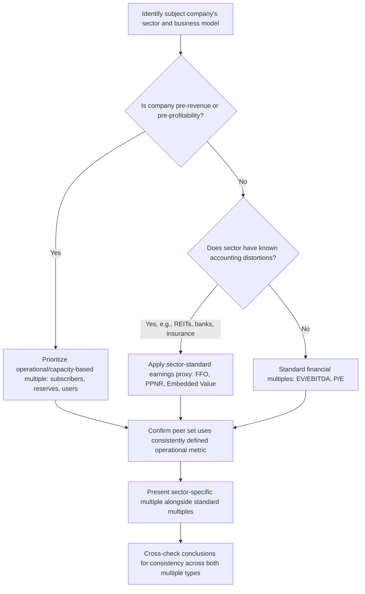

## Industry-Specific and Sector-Specific Multiples

### Definition and Purpose

Industry-specific multiples supplement or replace standard financial multiples (EV/EBITDA, P/E, EV/Revenue) with ratios built around the operating metric that most directly drives value creation in a particular sector. They exist because standard financial multiples can obscure or fail to capture the specific unit economics that investors actually use to underwrite value in certain industries — particularly where companies are pre-revenue, pre-profitability, or where physical/operational capacity is a more reliable value driver than reported accounting earnings at a given point in the business cycle.

**Key Points**

- Industry-specific multiples pair enterprise or equity value with an operational metric unique to that sector's value-creation model
- They are used to supplement, not replace, standard financial multiples — best practice presents both together
- Particularly essential when companies are pre-revenue, pre-profitability, or subject to accounting distortions specific to the sector
- Comparability rules still apply: growth, risk, and quality of the underlying operational metric must be controlled for across peers

### Why Standard Multiples Fail in Certain Sectors

Standard multiples assume that reported financial metrics (revenue, EBITDA, earnings) reliably capture the economic substance of the business. This assumption breaks down when:

- The company is pre-revenue or pre-profitability (early-stage biotech, exploration-stage mining, pre-launch platforms)
- Reported earnings are dominated by non-operational or highly volatile items (insurance underwriting cycles, commodity price swings, mark-to-market accounting)
- The relevant unit of value creation is a physical or operational asset not directly reflected in a single income statement line (subscriber base, reserves, occupied beds, loan book quality)
- Regulatory or contractual structures decouple current period revenue from the true underlying economic capacity of the business (long-term contracted reserves, regulated rate bases)

### Technology, Media, and Telecom (TMT)

**EV/Subscriber (or EV/User)**

$$\frac{EV}{Subscriber\ Count}$$

Used for subscription-based telecom, cable, streaming, and SaaS businesses where the subscriber base is the fundamental unit of recurring revenue generation. Often segmented by subscriber tier or geography, since not all subscribers carry equal revenue potential (e.g., premium vs. basic tier subscribers).

**EV/Daily Active User (DAU) or EV/Monthly Active User (MAU)**

Used for digital platforms and social media companies pre-monetization or in early monetization stages, where user engagement is considered a leading indicator of eventual revenue capacity. Distinguishing DAU from MAU (and the ratio between them, "stickiness") is itself a quality signal often analyzed alongside the multiple.

**EV/Homes Passed**

Used specifically in cable and fiber broadband infrastructure, measuring value per household within the network's addressable footprint, regardless of current subscriber penetration — relevant for assessing the value of infrastructure build-out independent of current monetization.

**Rule of 40 (Growth-Adjusted Framework, not a pure multiple)**

$$Rule\ of\ 40 = Revenue\ Growth\ \% + EBITDA\ (or\ FCF)\ Margin\ \%$$

Widely used in SaaS valuation to contextualize EV/Revenue multiples: companies scoring above 40 are generally considered to have an efficient balance of growth and profitability, providing a qualitative screen for whether a given revenue multiple is "earned" through genuine efficiency versus growth alone.

### Energy and Natural Resources

**EV/Proved Reserves (EV per BOE — Barrel of Oil Equivalent)**

$$\frac{EV}{Proved\ Reserves\ (BOE)}$$

Used for upstream oil & gas companies, capturing the value of the resource base itself, independent of current-period production or revenue, which can be highly volatile due to commodity price swings unrelated to the underlying asset quality.

**EV/Daily Production**

$$\frac{EV}{Barrels\ (or\ BOE)\ Produced\ per\ Day}$$

Captures current operating cash-generating capacity rather than the total resource base, often used alongside EV/Reserves to distinguish "value in the ground" from "value being currently monetized."

**EV/Mineral Resource (Mining)**

Analogous reserve-based metric for metals and mining companies, typically expressed per ounce (gold, silver) or per ton (base metals), reflecting the market's valuation of the in-ground resource independent of current extraction rate.

**Reserve Replacement Ratio (supplementary, not a multiple)**

Tracks whether a company is replenishing reserves as fast as it depletes them through production — a quality signal often presented alongside reserve-based multiples to assess sustainability of the asset base.

### Financial Institutions

**Price/Book (P/B) and Price/Tangible Book Value (P/TBV)**

$$\frac{Price}{Tangible\ Book\ Value\ per\ Share}$$

P/TBV excludes goodwill and other intangible assets from book value, providing a more conservative measure of the hard capital base supporting a bank's balance sheet — particularly relevant post-financial-crisis, when regulators and investors increasingly scrutinize tangible capital adequacy over reported (goodwill-inclusive) book value.

**Price/Pre-Provision Net Revenue (P/PPNR)**

Used for banks specifically to normalize for varying loan loss provisioning policies across the credit cycle — since provisioning is highly discretionary and cyclical, PPNR (revenue minus operating expenses, before credit provisions) provides a cleaner view of core earnings power.

**Price/Embedded Value (Insurance)**

Used specifically for life insurance companies, where Embedded Value represents the present value of future profits from in-force policies plus adjusted net asset value — a specialized actuarial valuation metric that better captures the long-duration nature of insurance liabilities than standard book value or near-term earnings.

### Real Estate and REITs

**Price/FFO (Funds From Operations) and Price/AFFO (Adjusted FFO)**

$$FFO = Net\ Income + Depreciation \& Amortization - Gains\ on\ Property\ Sales$$

Used because standard net income for REITs is heavily distorted by large non-cash depreciation charges on real property (which, unlike depreciation of equipment, often does not reflect genuine economic value decline for well-maintained real estate assets). FFO and AFFO (which further adjusts for recurring capital expenditures) are the standard REIT industry earnings proxies, published by companies themselves following NAREIT-defined conventions.

**EV/Square Foot or Price/Square Foot**

Used for retail real estate and select operating retail companies, capturing value relative to physical selling or leasable space, particularly useful when comparing portfolios of varying quality and geography.

**Net Asset Value (NAV) Premium/Discount**

$$NAV\ Premium/Discount = \frac{Market\ Cap - NAV}{NAV}$$

Rather than a multiple in the traditional sense, this compares REIT market capitalization to an independently appraised net asset value of the underlying real estate portfolio (marked to current fair value rather than historical cost book value), providing a sector-specific alternative to standard P/B given real estate's tendency to appreciate above depreciated book value.

### Healthcare

**EV/Bed (Hospitals) or EV/Admission**

Used for hospital operators and healthcare facility companies, capturing value relative to physical capacity or patient volume, particularly relevant given the capital-intensive and regulated nature of healthcare facility operations.

**EV/Prescription or Price/Pipeline (Pharmaceuticals and Biotech)**

For pre-revenue or early-commercial-stage biotech and pharmaceutical companies, standard financial multiples are frequently unusable; valuation instead often relies on **risk-adjusted NPV (rNPV)** of the drug pipeline — a specialized DCF variant that probability-weights cash flows by clinical trial success rates at each development phase — rather than a simple market-multiple approach. [Inference] Given the highly binary, event-driven nature of clinical trial outcomes, market multiples in biotech are generally treated as a secondary cross-check rather than a primary valuation method, with rNPV-based intrinsic valuation carrying more analytical weight.

### Asset Management and Financial Services

**Price/Assets Under Management (P/AUM)**

$$\frac{Price}{AUM}$$

Used for asset managers, where AUM is the primary driver of fee revenue; often segmented by asset class mix (equity, fixed income, alternatives) since fee rates vary significantly by product type, meaning two managers with identical AUM but different asset class composition warrant different multiples.

**EV/Revenue Adjusted for Fee Rate**

Because AUM alone does not capture differing fee structures, a supplementary metric normalizing for the effective fee rate (Revenue/AUM) is often presented alongside P/AUM to control for this driver of comparability.

### Airlines and Transportation

**EV/Available Seat Mile (EV/ASM)**

Used for airlines, capturing value relative to total production capacity (available seating capacity multiplied by miles flown), independent of load factor or ticket pricing fluctuations, which can be highly cyclical and volatile.

**EV/Fleet or EV/Aircraft**

A cruder but sometimes-used metric for capital-intensive transportation businesses, capturing value relative to the physical capital base.

### Retail

**EV/Store or Same-Store Sales Growth-Adjusted Multiples**

Used to normalize for differing store count and store maturity across retail peers; **same-store sales growth** (a same-location, organic growth measure excluding the effect of new store openings) is a standard supplementary metric presented alongside standard revenue and EBITDA multiples to isolate organic performance from footprint expansion.

### Summary Table of Sector-Specific Multiples

| Sector | Primary Sector-Specific Multiple | Rationale |
| --- | --- | --- |
| Telecom / Cable | EV/Subscriber, EV/Homes Passed | Captures recurring-revenue customer base value |
| Social Media / Platforms | EV/DAU, EV/MAU | Values engagement pre- or early-monetization |
| SaaS | EV/Revenue + Rule of 40 | Growth-adjusted context for revenue multiple |
| Oil & Gas (Upstream) | EV/Proved Reserves, EV/Daily Production | Separates resource value from production cash flow |
| Mining | EV/Resource (per oz/ton) | Values in-ground resource base |
| Banks | P/TBV, P/PPNR | Normalizes for provisioning cyclicality, tangible capital |
| Insurance | Price/Embedded Value | Captures long-duration policy economics |
| REITs | P/FFO, P/AFFO, NAV Premium/Discount | Corrects for real estate depreciation distortion |
| Hospitals | EV/Bed, EV/Admission | Captures regulated physical capacity |
| Biotech (pre-revenue) | rNPV (intrinsic, not a multiple) | Standard multiples inapplicable pre-commercialization |
| Asset Managers | Price/AUM | Fee revenue driver |
| Airlines | EV/ASM | Normalizes for capacity independent of pricing/load factor |
| Retail | EV/Store, Same-Store Sales | Isolates organic performance from footprint growth |

### Workflow for Selecting Sector-Specific Multiples

### Common Pitfalls

- **Relying exclusively on a sector-specific multiple without a standard financial cross-check**: even where a sector convention like EV/Subscriber is dominant, presenting it in isolation without EV/Revenue or EV/EBITDA context can obscure whether the underlying business is actually monetizing its operational base effectively.
- **Inconsistent definition of the operational metric across peers**: subscriber counting methodologies (e.g., including free trial users vs. paying only), reserve classification standards (proved vs. proved-plus-probable), or AUM reporting conventions can vary by company, undermining comparability if not explicitly reconciled.
- **Ignoring quality differences within the operational metric**: not all subscribers, reserves, or beds are equally valuable (premium vs. basic subscriber ARPU, reserve quality/extraction cost, hospital case mix complexity) — a raw per-unit multiple can mask significant underlying quality disparities across peers.
- **Applying a sector-specific multiple outside its appropriate use case**: using EV/Subscriber for a company whose subscriber base is not the primary revenue driver (e.g., a diversified telecom conglomerate with substantial non-subscription revenue) can produce a misleading valuation signal.
- **Failure to disclose which specific reserve category, AUM segment, or subscriber definition underlies the reported figure**: reduces transparency and reproducibility of the resulting analysis for any third-party reviewer.

### Next Steps

- **Principles of Relative Valuation**
- **Core Trading Multiples Including EV/EBITDA and EV/Revenue**
- **Equity Multiples Including P/E, P/B, and PEG**
- **Calendarization and Multiple Normalization**
- **REIT Valuation: FFO, AFFO, and Net Asset Value**
- **Risk-Adjusted NPV (rNPV) for Biotech and Pharmaceutical Valuation**
- **Rule of 40 and Growth-Adjusted Multiples in SaaS Valuation**