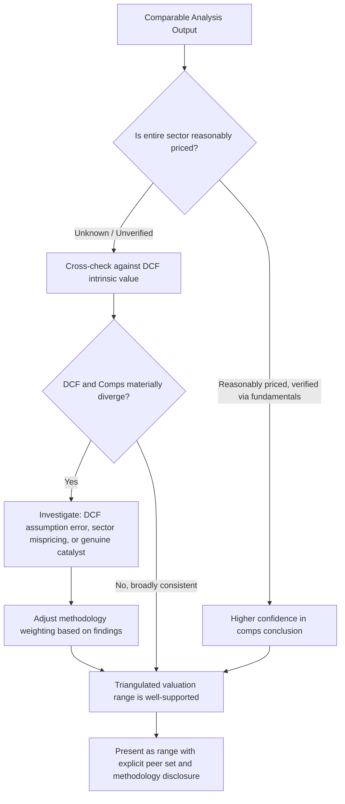

## Strengths, Weaknesses, and Misuses of Comparable Analysis

### Definition and Purpose

Comparable company analysis (trading comps) is one of the three core valuation methodologies, alongside DCF and precedent transactions, and is distinguished by its reliance on current market pricing rather than intrinsic cash flow projection. Understanding its strengths, structural weaknesses, and common misuses is essential not because the methodology is flawed in principle, but because its outputs are frequently over-relied upon, misapplied, or presented with false precision in practice. A rigorous practitioner uses comparable analysis as one input within a triangulated valuation framework, fully aware of what it can and cannot tell you.

**Key Points**

- Comparable analysis is fast, transparent, and market-grounded — but entirely dependent on the market correctly pricing the peer set
- Its core structural weakness is that it measures relative, not absolute, value
- Most practical failures stem from misuse (poor peer selection, inconsistent normalization) rather than a flaw in the underlying logic
- Best practice treats comps as one leg of a triangulated valuation, never a standalone conclusion

### Strengths of Comparable Analysis

**1. Speed and Practicality**

Comparable analysis requires far fewer explicit forward assumptions than a full DCF — no explicit forecast of revenue growth, margin trajectory, capex, working capital, or terminal value is required beyond what is embedded in current market pricing. This makes it the fastest of the three core valuation methods to construct and update, and the natural first-pass tool in time-constrained situations (initial screening, quick sanity checks, preliminary pitch materials).

**2. Market-Grounded and Objective in Appearance**

Because the inputs (share prices, financial statements) are observable rather than projected, comparable analysis carries an appearance of objectivity that a DCF — built on numerous subjective forward assumptions — does not. This makes it easier to communicate and defend to stakeholders who may be skeptical of long-dated cash flow projections and terminal value assumptions that can dominate a DCF's output.

**3. Reflects Current Market Sentiment and Risk Appetite**

A DCF's discount rate and growth assumptions, once set, do not automatically adjust for shifts in market risk appetite, sector rotation, or macro sentiment. Comparable analysis, by construction, captures whatever the market is currently willing to pay for similar risk and growth profiles — useful when the immediate transaction or decision context requires understanding *current* achievable pricing rather than long-run intrinsic value.

**4. Difficult to Manipulate at the Aggregate (Peer Median) Level**

While a single DCF can be steered toward nearly any desired value through assumption selection (a small change in terminal growth or WACC can swing value substantially), a well-constructed peer median is comparatively harder to manipulate without an obviously indefensible peer set, since the underlying inputs are independently observable market data rather than subjective forecasts.

**5. Essential Cross-Check Function**

Even when DCF is the primary valuation method, comparable analysis output serves as a critical sanity check on DCF assumptions — if a DCF implies a valuation dramatically above or below what the market is paying for genuinely similar businesses, this divergence should prompt scrutiny of the DCF's growth, margin, or terminal value assumptions (see Reverse DCF and Market-Implied Expectations Analysis) rather than automatic acceptance of either output.

### Weaknesses of Comparable Analysis

**1. Measures Relative Value, Not Intrinsic Value**

This is the central structural limitation: comparable analysis can only tell you whether a company is cheap or expensive *relative to its peers*, not whether the entire peer group itself is fairly priced. If an entire sector is systematically overvalued (a bubble) or undervalued (a trough or panic), comparable analysis will propagate that mispricing into the subject company's derived valuation rather than identifying it — a company can appear "reasonably priced" using comps while being significantly overvalued in absolute, fundamental terms.

**2. Circularity and Reflexivity Risk**

Because comparable analysis derives value from current market prices, and those market prices are themselves partly informed by analysts' own comparable analyses of the same peer set, the methodology carries an inherent risk of reflexive, self-reinforcing pricing that drifts from fundamental value over time without any single participant's individual analysis appearing unreasonable in isolation.

**3. Point-in-Time Volatility**

Multiples reflect market conditions at a specific moment and can shift materially around earnings releases, macro data surprises, sector rotations, or broad market volatility — a comparable analysis conducted during a period of unusual market stress or euphoria may not represent a durable or representative valuation reference point.

**4. Imperfect Comparability is Unavoidable**

No two companies are identical across growth, risk, margin structure, and capital intensity simultaneously (see Selecting a Comparable Company Peer Set). Every peer set involves judgment calls about "close enough" comparability, and this judgment is an unavoidable source of subjectivity even in an otherwise "objective" methodology.

**5. Ignores Company-Specific Catalysts and Idiosyncratic Factors**

A DCF can explicitly model company-specific events — a planned facility expansion, a pending litigation outcome, a management transition, an announced strategic pivot — within its own cash flow projections. Comparable analysis implicitly assumes the subject company behaves like an "average" member of its peer group unless the analyst manually layers in a premium or discount adjustment, which reintroduces the same subjectivity comps are often praised for avoiding.

**6. Accounting and Disclosure Inconsistencies**

Differences in accounting policy — revenue recognition, lease treatment, R&D capitalization versus expensing, stock-based compensation treatment, and jurisdictional GAAP/IFRS differences — can distort multiples across an ostensibly comparable peer set if not carefully normalized (see Calendarization and Multiple Normalization).

### Common Misuses in Practice

**Misuse 1: Cherry-Picking the Peer Set to Fit a Predetermined Conclusion**

Perhaps the most consequential misuse: selectively including only high-multiple peers to support a higher valuation (e.g., in a sell-side fairness opinion or fundraising context) or only low-multiple peers to support a lower valuation (e.g., in an acquisition negotiation or litigation context). This reverses the proper analytical sequence — the peer set should be determined by objective comparability criteria first, with the resulting valuation range accepted as an output, not selected to hit a target valuation and reverse-engineered from there.

**Misuse 2: Presenting a Single-Point Multiple Instead of a Range**

Comparable analysis inherently produces a distribution (median, quartiles, mean) across a peer set, not a single precise number. Presenting "the multiple is 9.2x" without acknowledging the underlying dispersion (e.g., a range from 7.1x to 12.4x across the peer set) creates false precision and obscures the genuine uncertainty in the analysis.

**Misuse 3: Ignoring Capital Structure Mismatches**

Applying equity-level multiples (P/E) across peers with materially different leverage without controlling for or acknowledging the distortion, or mismatching equity-value numerators against firm-level denominators entirely (see Core Trading Multiples), remains a persistent error even among experienced practitioners under time pressure.

**Misuse 4: Treating Comps as a Standalone Valuation Rather Than One Input**

Presenting a comparable analysis output as *the* valuation conclusion, without triangulating against DCF and precedent transactions (typically visualized together in a football field chart), overweights a single methodology that is, by its own structural nature, only capable of measuring relative rather than absolute value.

**Misuse 5: Inconsistent Time-Period and Normalization Basis**

Mixing LTM and NTM multiples within the same comparison, or applying non-recurring item adjustments to some peers but not others (including inconsistent treatment of the subject company itself relative to the peer set), introduces a systematic and often self-serving bias into the resulting range.

**Misuse 6: Using Comps from a Different Market Cycle Without Adjustment**

Applying multiples observed during a different phase of the economic or industry cycle (e.g., peak-cycle multiples applied to a trough-cycle subject company, or vice versa) without normalizing for where each company sits in its respective cycle can produce a materially misleading valuation, particularly in cyclical industries (commodities, industrials, financials).

**Misuse 7: Overreliance on a Thin or Statistically Unreliable Peer Set**

Presenting a 2–3 company peer set with the same apparent statistical confidence as a robust 10+ company set, without flagging the reduced reliability, overstates the precision genuinely available from the underlying data.

### Comparable Analysis Reliability Framework

### Comparable Analysis vs. DCF: Complementary Weaknesses

The structural weaknesses of comparable analysis and DCF are largely mirror images of each other, which is precisely why the two methods are most powerful when used together rather than in isolation:

| Dimension | Comparable Analysis Weakness | DCF Weakness | Combined Mitigation |
| --- | --- | --- | --- |
| Market mispricing | Propagates sector-wide bubbles/troughs | Immune to market sentiment (in theory) | DCF provides an independent absolute-value anchor |
| Assumption risk | Fewer explicit assumptions, less transparency into embedded views | Highly sensitive to growth/WACC/terminal value choices | Reverse DCF makes comps-implied assumptions explicit |
| Company-specific factors | Ignores idiosyncratic catalysts unless manually adjusted | Can explicitly model company-specific events | DCF captures what comps cannot |
| Precision vs. accuracy | Appears precise (observable data) but measures only relative value | Appears less precise (many assumptions) but targets absolute value | Triangulation balances false precision against assumption risk |

### When Comparable Analysis Should Carry More or Less Weight

**Comps should carry more analytical weight when:**

- A liquid, genuinely comparable peer set exists with consistent business models and capital structures
- The valuation purpose is inherently market-relative (e.g., IPO pricing, secondary market trading recommendations)
- Near-term transaction or trading decisions are the objective, where current achievable market pricing is more relevant than long-run intrinsic value

**Comps should carry less analytical weight when:**

- The peer set is thin, geographically mismatched, or business-model-divergent
- The sector shows signs of systematic mispricing (unusually high dispersion, disconnect from historical multiple ranges, macro-driven distortion)
- The subject company has company-specific catalysts, restructuring potential, or growth inflection points not reflected in "steady-state" peer trading levels
- A long-term fundamental investment decision (versus a near-term trading or transaction decision) is the objective

### Common Pitfalls (Meta-Level)

- **Confusing "market-derived" with "objectively correct"**: comparable analysis inputs are observable, but observable does not mean fundamentally accurate — the entire market can be collectively wrong for extended periods.
- **Using comps to launder a predetermined valuation conclusion**: the reverse-engineered peer set is among the most common forms of analytical bias in valuation practice, precisely because comps' apparent objectivity makes manipulated conclusions harder for a reviewer to detect than an obviously aggressive DCF assumption.
- **Neglecting to disclose methodology and normalization choices**: undermines the reproducibility that is supposed to be one of comps' core advantages over DCF's assumption-heavy opacity.
- **Treating triangulation as a formality rather than a genuine cross-check**: presenting DCF, comps, and precedent transactions side by side without genuinely reconciling material divergences between them defeats the purpose of triangulation.

### Next Steps

- **Principles of Relative Valuation**
- **Selecting a Comparable Company Peer Set**
- **Calendarization and Multiple Normalization**
- **Reverse DCF and Market-Implied Expectations Analysis**
- **Precedent Transaction Analysis vs. Trading Comparables**
- **Football Field Valuation Charts and Triangulation**
- **Break-Even and Threshold Analysis**