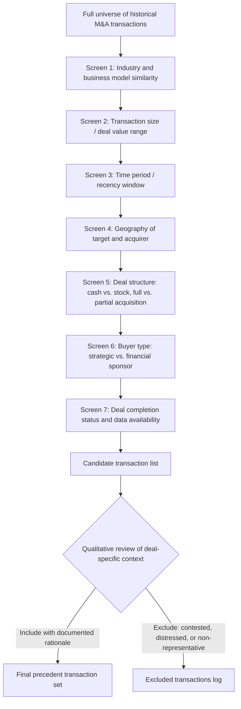

## Selecting Comparable Precedent Transactions

### Definition and Purpose

Precedent transaction analysis (also called "transaction comps" or "M&A comps") values a company by reference to the multiples paid in prior acquisitions of similar companies. Selecting the precedent transaction set is the foundational step in this methodology, analogous to peer set selection in trading comparables, but with an additional layer of complexity: transaction multiples embed not just operating comparability, but deal-specific factors — control premiums, synergy expectations, competitive bidding dynamics, and financing conditions at the time of the deal — that must be understood and controlled for separately from the underlying business comparability itself.

**Key Points**

- Precedent transactions capture "change of control" pricing, which is inherently higher than standalone trading multiples due to the control premium
- Screening criteria mirror trading comps (industry, size, geography) but add deal-specific dimensions: transaction date, deal structure, buyer type, and competitive dynamics
- Transaction multiples are backward-looking and time-sensitive — market conditions, financing availability, and strategic appetite shift meaningfully over even a few years
- A smaller, more recent, more truly comparable transaction set is generally preferred over a larger set diluted by stale or poorly-matched deals

### Precedent Transactions vs. Trading Comparables: Key Distinction

| Dimension | Trading Comparables | Precedent Transactions |
| --- | --- | --- |
| What is being priced | Minority, freely-tradable shares | 100% control of the business |
| Premium embedded | None (or negative, illiquidity discount) | Control premium (typically 20–40% over unaffected trading price) |
| Data source | Continuous daily market pricing | Discrete historical deal announcements |
| Time relevance | Current, real-time | Historical — sensitive to deal-date market conditions |
| Synergy inclusion | None (standalone value only) | Often embeds buyer-specific synergy expectations in the price paid |
| Typical use | Establishes standalone public market value | Establishes what a strategic or financial buyer would actually pay to acquire control |

Because precedent transactions embed a control premium and often synergy value, they generally produce **higher implied multiples** than trading comparables for economically similar businesses — this is expected and appropriate given the different nature of what is being valued (control vs. minority stake), not evidence of inconsistency between the two methods.

### The Screening Funnel for Precedent Transactions

### Screen 1: Industry and Business Model Similarity

As with trading comps, industry classification (GICS/SIC) provides the starting universe, but business model similarity — revenue model, customer base, value chain position, asset intensity — must be assessed beyond the classification code alone (see Principles of Relative Valuation and Selecting a Comparable Company Peer Set for the underlying comparability logic, which applies equally here).

### Screen 2: Transaction Size

Deal value should fall within a reasonable range relative to the subject company's expected transaction size, since multiples paid can systematically differ by deal size:

- **Large-cap transactions**: often command premium multiples due to strategic scarcity value, greater competitive bidding intensity, and typically stronger, more diversified target businesses
- **Middle-market transactions**: may show more variable multiples due to less efficient price discovery and fewer competing bidders
- **Small/micro-cap transactions**: frequently show wider multiple dispersion and less reliable public disclosure of deal terms

Mixing deal sizes without adjustment (e.g., applying a mega-deal multiple to a middle-market subject company) can produce a systematically biased valuation.

### Screen 3: Time Period / Recency Window

This is the dimension with no direct analog in trading comps and is arguably the most important screening criterion specific to precedent transactions, because M&A multiples are highly sensitive to conditions prevailing **at the time of each deal**:

- **Credit market conditions**: multiples paid in periods of cheap, abundant acquisition financing (low rates, loose credit spreads) are typically higher than multiples paid during tight credit conditions, independent of any change in the target businesses' fundamental quality
- **M&A market cyclicality**: deal volume and competitive intensity (number of bidders per target) vary with the broader M&A cycle, directly affecting multiples paid
- **Sector-specific sentiment shifts**: a sector experiencing a wave of strategic consolidation or private equity interest at a point in time will show inflated multiples relative to a quieter period for the same industry

**Standard practice**: limit the transaction set to a defined recency window — commonly the trailing 3–5 years — while explicitly flagging (or excluding) any transactions that closed during unusual market conditions (e.g., 2020–2021 pandemic-era liquidity surge, 2008–2009 financial crisis, periods of unusually restrictive credit availability) unless the current valuation context shares similar conditions.

**Worked Illustration**

A precedent transaction set spanning 2019–2026 might show:

| Period | Median EV/EBITDA Paid | Context |
| --- | --- | --- |
| 2019 (pre-pandemic) | 9.5x | Normal credit conditions |
| 2020–2021 | 12.8x | Historically low rates, abundant leveraged finance |
| 2022–2023 | 8.2x | Rapid rate increases, tightened credit availability |
| 2024–2026 | 9.8x | Normalizing conditions |

Applying the 2020–2021 multiple to a valuation being conducted in a 2024–2026 market context, without adjustment or explicit acknowledgment of the differing rate and credit environment, would likely overstate current achievable value.

### Screen 4: Geography of Target and Acquirer

Cross-border transactions introduce additional complexity: currency effects, differing regulatory approval regimes, differing typical control premium norms by market, and differing strategic buyer universes by region. Best practice generally favors matching both target *and* acquirer geography to the subject company's likely buyer universe and jurisdiction, since regulatory review regimes (antitrust, foreign investment restrictions) and typical deal structures can vary meaningfully by market.

### Screen 5: Deal Structure

- **Cash vs. stock vs. mixed consideration**: all-cash deals provide the cleanest, most directly comparable valuation signal since consideration value is unambiguous at announcement; stock-for-stock deals require valuing the acquirer's stock at the time of announcement, introducing an additional layer of estimation and potential distortion if the acquirer's own stock was mispriced at announcement.
- **Full acquisition vs. partial/minority stake purchase**: partial stake transactions may not carry a full control premium and require separate treatment; mixing majority-control deals with minority-stake purchases in the same transaction set without adjustment understates the effective control premium embedded in full-acquisition multiples.
- **Tender offer vs. negotiated merger**: generally does not require separate treatment for multiple-derivation purposes, though tender offers can sometimes reflect more time-pressured or contested dynamics worth noting qualitatively.

### Screen 6: Buyer Type — Strategic vs. Financial Sponsor

- **Strategic acquirers** (operating companies in the same or adjacent industry) often pay higher multiples reflecting expected revenue and cost synergies unique to combining the two specific businesses — synergy value that is generally not replicable or relevant to a different potential buyer or to a standalone valuation.
- **Financial sponsors** (private equity firms) typically price acquisitions based on a standalone leveraged buyout return framework (see LBO methodology), generally without embedding the same operational synergy assumptions as a strategic buyer, though sponsors increasingly pursue "buy-and-build" platform strategies that can introduce their own synergy-like assumptions across an add-on acquisition.

Mixing strategic and financial sponsor transactions in the same precedent set without noting this distinction can obscure whether the resulting multiple range reflects synergy-inflated strategic pricing, standalone financial pricing, or some blend — and the appropriate multiple to apply to a subject company depends on which type of buyer universe is actually relevant to the current valuation context.

### Screen 7: Deal Completion Status and Data Availability

- **Completed vs. announced-but-pending vs. terminated deals**: completed transactions provide confirmed final terms; pending deals carry execution risk that the announced terms may still change (renegotiation, competing bid, regulatory blockage); terminated deals should generally be excluded from multiple calculation but may be separately noted as relevant context (e.g., regulatory risk in the sector).
- **Public disclosure quality**: transactions involving public targets (with SEC/regulatory filing requirements) typically provide much richer, more reliable deal term and target financial disclosure than private-target transactions, where terms are often only partially disclosed or estimated from press reports.

### Constructing the Multiple from Precedent Transactions

Once the peer transaction set is finalized, the standard multiple construction follows the same numerator/denominator matching logic as trading comps (see Core Trading Multiples), but computed using the **target's financials as of the last reporting period prior to the transaction announcement**, paired with the **implied enterprise or equity value from the deal's announced terms**:

$$\frac{EV_{deal}}{EBITDA_{target,\ LTM\ pre-announcement}}$$

**Worked Example**

A precedent transaction set (industry-screened, 3-year recency window, all-cash strategic acquisitions of similarly sized targets) shows the following EV/EBITDA multiples paid:

| Transaction | EV/EBITDA Paid |
| --- | --- |
| Deal A | 11.2x |
| Deal B | 9.8x |
| Deal C | 12.5x |
| Deal D | 10.4x |
| Deal E | 13.1x |

Median = 11.2x; range spans 9.8x–13.1x. Applied to a subject company's LTM EBITDA of $180,000,000:

$$Implied\ EV = 180{,}000{,}000 \times 11.2 = 2{,}016{,}000{,}000$$

This implied EV would typically be presented as a range (using the quartile or full range of the transaction set) rather than a single point estimate, and would be compared against the trading comps and DCF outputs for the same subject company — with the expectation that the precedent transaction range sits above the trading comps range, reflecting the embedded control premium.

### Peer Set Size Trade-Offs Specific to Precedent Transactions

Precedent transaction sets are frequently smaller than trading comparable sets, because the universe of historical, truly comparable, recently-completed M&A deals in any given sub-industry is often genuinely limited — unlike trading comps, where the entire universe of currently-listed peers is available at any time.

| Situation | Approach |
| --- | --- |
| Deep, active M&A sub-sector with many recent deals | Apply full screening funnel rigorously; 8–12+ transaction set achievable |
| Niche or infrequently-consolidated sub-sector | Relax recency window (extend to 5–7 years with explicit market-condition flagging) or broaden industry definition slightly |
| Genuinely thin precedent universe (fewer than 3–4 defensible transactions) | Reduce reliance on precedent transactions in the overall valuation triangulation; increase weight on trading comps and DCF |

### Common Pitfalls

- **Failing to account for the control premium when comparing to trading comps**: expecting precedent transaction multiples to match trading comparable multiples ignores the fundamental difference in what is being priced (control vs. minority stake).
- **Ignoring market-condition timing effects**: applying multiples from a credit-abundant or M&A-frenzied period to a valuation being conducted in a very different market environment, without adjustment or explicit caveat.
- **Mixing strategic and financial sponsor deals without distinction**: obscures whether the resulting multiple reflects synergy-inflated strategic pricing or standalone financial sponsor pricing.
- **Relying on incomplete or estimated deal terms for private-target transactions**: press-reported deal values for private targets are sometimes imprecise or based on incomplete information, and should be flagged with lower confidence than fully disclosed public-target transactions.
- **Overweighting a thin transaction set**: presenting 2–3 precedent transactions with the same statistical confidence as a robust set, without acknowledging the reduced reliability inherent in a small sample.
- **Excluding inconvenient outlier transactions without disclosed rationale**: selectively removing transactions that don't support a predetermined valuation conclusion undermines the same objectivity concerns present in trading comps peer selection.

### Next Steps

- **Precedent Transaction Analysis vs. Trading Comparables**
- **Control Premiums and Synergy Valuation in M&A**
- **Selecting a Comparable Company Peer Set**
- **Core Trading Multiples Including EV/EBITDA and EV/Revenue**
- **Calendarization and Multiple Normalization**
- **Strengths, Weaknesses, and Misuses of Comparable Analysis**
- **Football Field Valuation Charts and Triangulation**