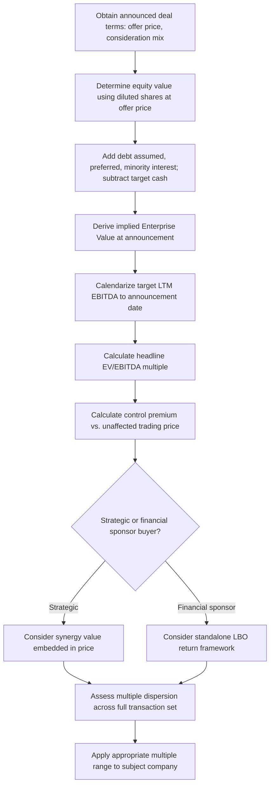

## Calculating and Interpreting Deal Multiples

### Definition and Purpose

Calculating deal multiples is the mechanical process of converting the announced terms of a historical M&A transaction into a standardized valuation ratio that can be applied to a subject company. While the underlying formula structure mirrors trading comparables (value measure divided by a financial metric), precedent transaction multiples require additional care in construction because the "price" side of the ratio must be reconstructed from deal-specific announcement terms — often involving contingent consideration, assumed debt, and multiple payment components — rather than read directly off a continuously quoted market price.

**Key Points**

- Deal multiples require reconstructing implied enterprise value from announced transaction terms, which is more complex than reading market cap off a trading screen
- The target's financials must be taken as of the period immediately preceding announcement, not at deal closing
- Multiples must be interpreted in light of what they include: control premium, synergies, and deal-specific financing conditions
- A single "headline" multiple often obscures important structural features of the deal (earnouts, contingent payments, assumed liabilities) that affect true economic pricing

### Step 1: Determining Implied Transaction Value

**Equity Purchase Price**

For an all-cash transaction, the equity value paid is straightforward:

$$Equity\ Value_{deal} = Offer\ Price\ per\ Share \times Diluted\ Shares\ Outstanding$$

Diluted shares must incorporate the treasury stock method for in-the-money options and the impact of convertible securities, consistent with standard equity value construction, using the **deal offer price** (not the pre-announcement trading price) as the relevant price for calculating dilutive security value.

**Stock and Mixed Consideration Deals**

For stock-for-stock or mixed cash-and-stock deals, the acquirer's stock component must be valued using the acquirer's share price as of the **announcement date** (or a specified pricing period, often a short trailing average around announcement, per the merger agreement's own pricing mechanism):

$$Equity\ Value_{deal} = (Cash\ per\ Share \times Shares) + (Exchange\ Ratio \times Acquirer\ Price \times Shares)$$

This introduces a timing dependency: if the acquirer's stock price moves materially between announcement and close, the *originally announced* implied value (used for multiple calculation purposes) will differ from the *final realized* value at closing — precedent transaction multiples are conventionally calculated using announcement-date values, since this reflects the terms the market and parties agreed to at the point of deal certainty, not subsequent market drift.

**Contingent Consideration (Earnouts)**

Many deals, particularly in biotech, technology, and other high-uncertainty sectors, include earnout provisions — additional payments contingent on the target achieving specified future milestones. Two conventions exist:

- **Upfront-only basis**: multiple calculated using only the guaranteed upfront consideration, excluding contingent payments
- **Maximum potential basis**: multiple calculated including the full potential earnout value if all milestones are achieved

Best practice discloses both, since the upfront-only multiple understates the deal's full potential value while the maximum-potential basis overstates the value actually likely to be realized; some practitioners apply a probability-weighted estimate of earnout achievement as a middle-ground approach, though this reintroduces subjective judgment into what is otherwise an observable deal term.

### Step 2: Converting Equity Value to Enterprise Value

$$EV_{deal} = Equity\ Value_{deal} + Total\ Debt\ Assumed + Preferred\ Stock + Minority\ Interest - Target's\ Cash\ \&\ Equivalents$$

**Key considerations specific to transaction analysis:**

- **Debt refinancing vs. assumption**: some transactions require the target's existing debt to be refinanced at close (common in leveraged buyouts) rather than assumed as-is; the EV calculation should reflect the debt actually outstanding immediately prior to the transaction, since this is what the enterprise value bridge is meant to capture regardless of what happens to that debt post-closing.
- **Cash used as consideration**: if the target's own balance sheet cash is used to help fund the transaction (common in sponsor-led buyouts), care must be taken to avoid double-counting — the standard EV bridge already nets out target cash, so this should not be separately adjusted for.
- **Transaction fees and expenses**: generally excluded from the EV calculation itself, as these represent transaction costs rather than value paid to target shareholders, though they are relevant to the acquirer's own return analysis (see LBO methodology) separately from the multiple paid to sellers.

### Step 3: Determining the Target's Financial Metric

The denominator must reflect the target's financial performance **as of the period immediately prior to the transaction announcement**, calendarized consistently with the same LTM methodology used in trading comparables (see Calendarization and Multiple Normalization):

$$LTM\ EBITDA_{target} = \text{Last reported FY EBITDA} + \text{Most recent interim EBITDA} - \text{Prior-year comparable interim EBITDA}$$

**Important distinction from trading comps**: because the transaction is a discrete historical event, the LTM window is fixed at the announcement date and does not roll forward over time — a precedent transaction's multiple, once calculated, remains a static historical data point representing conditions at that specific announcement date, unlike a trading comparable's LTM figure which updates continuously as new quarters are reported.

### Worked Example: Full Multiple Reconstruction

**Deal terms (illustrative)**:

- All-cash acquisition, offer price: $68.00 per share
- Diluted shares outstanding (using treasury stock method at $68.00 offer price): 145,000,000
- Target total debt at announcement: $1,200,000,000
- Target cash and equivalents at announcement: $310,000,000
- Target LTM EBITDA (calendarized to announcement date): $920,000,000

**Step 1 — Equity Value**

$$68.00 \times 145{,}000{,}000 = 9{,}860{,}000{,}000$$

**Step 2 — Enterprise Value**

$$9{,}860{,}000{,}000 + 1{,}200{,}000{,}000 - 310{,}000{,}000 = 10{,}750{,}000{,}000$$

**Step 3 — Multiple**

$$\frac{EV}{EBITDA} = \frac{10{,}750{,}000{,}000}{920{,}000{,}000} = 11.7x$$

This 11.7x figure is the "headline" multiple that would be reported in transaction comp summaries and league tables.

### Interpreting the Control Premium Embedded in the Multiple

A precedent transaction multiple can be decomposed to isolate the control premium paid over the target's unaffected (pre-announcement) trading level:

$$Control\ Premium\ \% = \frac{Offer\ Price - Unaffected\ Share\ Price}{Unaffected\ Share\ Price}$$

**Worked Example (continued)**

If the target traded at $54.00 per share immediately prior to any deal speculation or leak (the "unaffected" price):

$$Control\ Premium = \frac{68.00 - 54.00}{54.00} = 25.9\%$$

This premium reflects the value the acquirer is willing to pay above the standalone public market value, driven by expected synergies, strategic value unique to the acquirer, and the elimination of minority shareholder liquidity/governance discounts. [Inference] Reported control premiums in the range of roughly 20–40% are commonly cited as typical in general M&A market commentary, though the appropriate premium for any specific deal depends heavily on synergy potential, competitive bidding dynamics, and sector-specific norms, and can fall meaningfully outside this range in either direction.

### Interpreting Synergy Value Embedded in Strategic Deals

For strategic acquisitions specifically, the multiple paid often reflects not just the standalone value of the target but the acquirer's expected synergies from combining operations:

$$EV_{deal} = EV_{standalone} + PV(Synergies) - PV(Integration\ Costs)$$

This means a strategic acquirer's multiple paid is not directly comparable to what a purely financial buyer (private equity sponsor, with no operational synergies) would rationally pay for the same target — a key reason precedent transaction sets should distinguish strategic from financial sponsor deals (see Selecting Comparable Precedent Transactions) when interpreting which multiple range is relevant to a given subject company's likely buyer universe.

### Multiple Dispersion and What It Signals

When examining a precedent transaction set, the **dispersion** of multiples paid (not just the median) carries interpretive information:

| Pattern Observed | Possible Interpretation |
| --- | --- |
| Tight clustering of multiples across many deals | Efficient, well-understood market pricing for this asset type |
| Wide dispersion with a few high outliers | Possible competitive bidding wars, unique strategic assets, or unusually large synergy realizations in specific deals |
| Multiples trending upward over the sample period | Increasing sector consolidation appetite, improving credit conditions, or asset scarcity |
| Multiples trending downward over the sample period | Tightening financing conditions, declining sector sentiment, or increasing regulatory scrutiny |

A single median multiple applied without examining this underlying pattern can mask meaningful information about *why* certain deals commanded premium pricing — information directly relevant to assessing whether the subject company shares the characteristics that drove those premium outcomes.

### Deal Multiple Calculation and Interpretation Workflow

### Presenting Deal Multiples: Best Practice Format

A well-constructed precedent transaction summary table discloses more than just the headline multiple:

| Deal | Announce Date | Buyer Type | Consideration | EV/EBITDA | Control Premium |
| --- | --- | --- | --- | --- | --- |
| Target A | Mar 2025 | Strategic | Cash | 12.1x | 31% |
| Target B | Sep 2024 | Financial Sponsor | Cash | 9.4x | 22% |
| Target C | Jun 2024 | Strategic | Cash + Stock | 13.8x | 38% |
| Target D | Jan 2024 | Financial Sponsor | Cash | 8.9x | 19% |

Presenting buyer type and control premium alongside the raw multiple allows a reviewer to assess whether the median multiple is being driven by strategic-synergy-inflated deals, financial sponsor standalone pricing, or some blend — critical context for selecting which multiple is actually applicable to the subject company's likely transaction scenario.

### Common Pitfalls

- **Using the unaffected pre-announcement price instead of the offer price to calculate equity value**: understates the actual value paid and produces an artificially low multiple.
- **Failing to recalculate diluted shares at the deal offer price**: using diluted share counts calculated at the pre-deal trading price understates dilution from in-the-money options, since higher offer prices bring more options into the money under the treasury stock method.
- **Inconsistent earnout treatment across the transaction set**: mixing deals reported on an upfront-only basis with deals reported on a maximum-potential basis without disclosure produces a non-comparable blended set.
- **Using stale or post-closing financial data for the target**: the LTM EBITDA denominator must reflect the target's performance as of announcement, not as of deal closing (which can be many months later and reflect materially different performance).
- **Treating the headline multiple as the complete picture**: ignoring control premium, buyer type, and consideration structure when interpreting why a particular multiple was paid, and applying it mechanically to a subject company without considering whether the same drivers apply.
- **Failing to distinguish announcement-date vs. closing-date valuation for stock deals**: using the acquirer's stock price at closing rather than announcement to calculate deal value produces a multiple that reflects post-announcement market movement rather than the terms actually agreed by the parties.

### Next Steps

- **Selecting Comparable Precedent Transactions**
- **Control Premiums and Synergy Valuation in M&A**
- **Precedent Transaction Analysis vs. Trading Comparables**
- **Calendarization and Multiple Normalization**
- **Core Trading Multiples Including EV/EBITDA and EV/Revenue**
- **Football Field Valuation Charts and Triangulation**
- **LBO Modeling and Financial Sponsor Return Analysis**