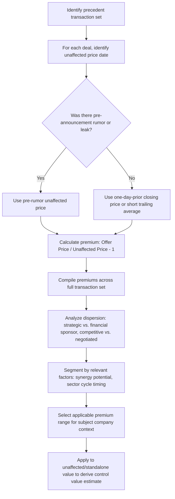

## Control Premium Estimation

### Definition and Purpose

A control premium is the incremental amount an acquirer pays over a target company's standalone, unaffected market value in order to obtain control of the business — the right to direct management, strategy, capital allocation, and operations. Control premium estimation is the process of measuring this increment from historical transaction data and determining an appropriate premium to apply when converting between minority (freely-tradable) value and control value in valuation work. It is the analytical bridge connecting trading comparables (which price minority stakes) to precedent transactions (which price control), and is central to fairness opinions, M&A negotiation preparation, and any valuation exercise that must translate between these two distinct value bases.

**Key Points**

- Control premium measures the value of control rights — the ability to direct the business — separate from the value of the underlying cash flows themselves
- It is calculated relative to the target's "unaffected" price, not the price immediately before deal close (which may already reflect deal speculation)
- Premiums vary systematically with synergy potential, competitive bidding intensity, buyer type, and sector-specific M&A activity levels
- Control premium and minority/illiquidity discount are conceptually related but not perfectly symmetric or interchangeable in application

### Conceptual Basis for the Control Premium

The theoretical justification for control premiums rests on the idea that control confers rights and potential value not available to a passive minority shareholder:

- **Access to and redirection of cash flows**: control allows the acquirer to change capital allocation policy (dividends, reinvestment, buybacks) according to its own preferences rather than existing management's
- **Operational and strategic control**: ability to replace management, redirect strategy, or integrate operations with the acquirer's existing business
- **Synergy realization**: only an acquirer with control can actually implement cost synergies (headcount reduction, facility consolidation) or revenue synergies (cross-selling, combined distribution) — a minority shareholder cannot unilaterally force these changes
- **Elimination of minority discount factors**: removes the liquidity constraints, governance limitations, and information asymmetry that minority shareholders in a widely-held public company typically bear

### The Standard Formula

$$Control\ Premium\ \% = \frac{Offer\ Price\ per\ Share - Unaffected\ Share\ Price}{Unaffected\ Share\ Price}$$

The critical input requiring careful selection is the **unaffected share price** — the target's trading price before the market had any information suggesting a transaction was likely, since a price that has already begun to reflect deal speculation will understate the true premium being paid.

### Selecting the Unaffected Price Reference Point

Because rumors, leaks, and speculative trading frequently move a target's share price before formal announcement, several conventions exist for identifying the appropriate "unaffected" baseline:

| Convention | Method | Best Used When |
| --- | --- | --- |
| One-day prior | Closing price on the trading day immediately before announcement | No prior rumor or speculation detected; clean announcement |
| Unaffected date (pre-rumor) | Closing price on the last trading day before the first credible market rumor or leak | Known rumor/leak occurred before formal announcement |
| Trailing average (e.g., 30-day, 60-day, 90-day VWAP) | Volume-weighted average price over a specified trailing window | Reducing the influence of short-term price volatility or thin trading around any single date |
| 52-week high reference | Comparison against the stock's 52-week high | Assessing premium relative to a recent peak, sometimes used in negotiation contexts rather than premium calculation itself |

**Worked Example — Rumor Contamination Effect**

A target's stock closed at $52.00 the day before formal deal announcement, but a credible acquisition rumor had circulated three weeks earlier, at which point the stock traded at $47.00 (its last "unaffected" close before the rumor). The deal is announced at an offer price of $65.00.

Using the one-day-prior price:

$$Premium = \frac{65.00 - 52.00}{52.00} = 25.0\%$$

Using the pre-rumor unaffected price:

$$Premium = \frac{65.00 - 47.00}{47.00} = 38.3\%$$

The pre-rumor calculation reveals a substantially higher true premium (38.3% vs. 25.0%), since the one-day-prior price already partially reflects the market's anticipation of a deal. Fairness opinions and regulatory filings typically require careful identification and disclosure of which unaffected date convention was used, precisely because this choice can materially affect the reported premium.

### Sources of Control Premium Data

- **Databases of historical M&A transactions**: commercial data providers compile control premium statistics across large samples of historical public company acquisitions, typically segmented by industry, deal size, and time period
- **Direct calculation from individual precedent transactions**: within a specific precedent transaction set assembled for a given valuation (see Selecting Comparable Precedent Transactions), computing the premium for each deal individually
- **Academic and industry studies**: longer-run historical studies of average control premiums across market cycles, useful for establishing broad benchmarks though generally less precise than a current, industry-specific precedent set

[Inference] Historical average control premiums are commonly cited in general M&A commentary as falling in a broad range of roughly 20–40%, but this range should be treated as a loose benchmark rather than a precise expectation — actual premiums for any specific transaction depend heavily on deal-specific factors and can fall well outside this range.

### Factors Driving Variation in Control Premiums

**1. Synergy Potential**

Higher expected synergies (cost savings, revenue enhancement, tax benefits) support a higher premium, since the acquirer can rationally pay up to (but ideally not exceeding) the present value of synergies it expects to realize, split in some proportion between the acquirer's shareholders and the seller depending on negotiating leverage:

$$Maximum\ Rational\ Premium \approx PV(Synergies) - PV(Integration\ Costs)$$

**2. Competitive Bidding Dynamics**

A single-bidder negotiated transaction typically results in a lower premium than a competitive auction process with multiple interested strategic and financial parties, since competitive tension forces bidders to share more of the expected synergy or strategic value with target shareholders to win the deal.

**3. Buyer Type**

- **Strategic buyers**: often willing to pay higher premiums reflecting operational synergies unique to their specific combination with the target
- **Financial sponsors**: typically constrained by standalone LBO return requirements (target IRR thresholds), generally resulting in somewhat lower premiums absent unusual leverage availability or add-on/platform synergy considerations (see LBO Modeling)

**4. Target's Governance and Ownership Structure**

- **Widely-held public companies**: more susceptible to premium-driven acquisition, as no single blocking shareholder can resist a well-priced offer
- **Controlled companies (founder or family control, dual-class share structures)**: control premiums may be less relevant or structured differently, since the controlling shareholder's consent is required regardless of the premium offered to minority holders
- **Companies with existing large strategic shareholders**: may command different premium dynamics depending on that shareholder's own incentives

**5. Sector M&A Cycle Position**

Premiums tend to rise during periods of active sector consolidation, abundant acquisition financing, and high strategic buyer confidence, and compress during periods of tight credit, economic uncertainty, or regulatory scrutiny of M&A activity — mirroring the same market-timing sensitivity discussed for headline transaction multiples (see Calculating and Interpreting Deal Multiples).

**6. Target Financial Distress or Strategic Vulnerability**

Distressed or strategically vulnerable targets (facing activist pressure, weak standalone prospects, or urgent liquidity needs) may command lower premiums, as the seller's negotiating leverage is diminished relative to a healthy, non-distressed target with genuine standalone alternatives.

### Control Premium Estimation Workflow

### Applying Control Premiums in Valuation Practice

**1. Bridging Trading Comps to Control Value**

When trading comparable multiples (which reflect minority, freely-tradable value) are used as a cross-check against a control-value conclusion (such as a DCF value intended to represent control value, or a precedent transaction-based range), an appropriate control premium may be added to the trading comps-derived value to make it comparable on a control basis:

$$Implied\ Control\ Value = Trading\ Comps\ Value \times (1 + Control\ Premium\ \%)$$

**2. Fairness Opinions**

Fairness opinions frequently present a control premium analysis explicitly, benchmarking the specific transaction's premium against historical precedent premiums for similar deals, to support an opinion on whether the price offered to shareholders is fair from a financial point of view.

**3. Negotiation Preparation**

Sell-side advisors use historical control premium data to establish a target range for negotiation, while buy-side advisors use the same data to calibrate an opening offer and assess how much premium can rationally be justified by expected synergies without overpaying relative to precedent.

### Control Premium vs. Minority/Marketability Discount: Related but Distinct Concepts

| Concept | Direction of Adjustment | Typical Context |
| --- | --- | --- |
| Control Premium | Value added moving from minority to control basis | M&A, acquisition pricing |
| Minority (Discount for Lack of Control, DLOC) | Value subtracted moving from control to minority basis | Private company minority stake valuation |
| Marketability Discount (DLOM) | Value subtracted for lack of a ready market to sell shares | Private/illiquid stock valuation, estate and gift tax valuations |

While control premium and DLOC are sometimes treated as mathematical inverses of each other, this relationship is not perfectly symmetric in practice: $DLOC \neq \frac{Premium}{1+Premium}$ does hold algebraically as an identity, but the empirical premiums observed in completed M&A transactions (which reflect actual synergy realization and competitive dynamics) are not necessarily the correct discount to apply when valuing a passive, non-controlling minority interest in a private company with no pending transaction — a common and consequential distinction in private company and estate/gift tax valuation contexts. [Inference] This distinction is a recurring point of technical debate in valuation practice, particularly in tax and litigation contexts where the specific facts of a private minority interest (voting rights, transfer restrictions, distribution history) may warrant a discount that diverges from the observed M&A control premium average.

### Common Pitfalls

- **Using the day-before-announcement price when a prior rumor or leak exists**: understates the true premium by measuring against an already-inflated baseline.
- **Applying a single "market average" control premium without adjusting for deal-specific factors**: ignoring synergy potential, buyer type, and competitive dynamics specific to the subject company's likely transaction scenario produces a generic, potentially misleading premium estimate.
- **Treating control premium and minority discount as simple mathematical inverses in all contexts**: particularly problematic in private company and tax valuation settings, where the empirical M&A premium may not be the theoretically correct discount for a specific minority interest's actual rights and restrictions.
- **Ignoring premiums paid in periods of unusual market conditions**: including control premiums from unusually frothy or unusually distressed M&A periods without flagging the context, similar to the market-timing distortion risk in raw transaction multiples.
- **Failing to disclose the unaffected price methodology used**: undermines the reproducibility and credibility of the control premium analysis, particularly in contexts (fairness opinions, litigation) subject to external scrutiny.

### Next Steps

- **Selecting Comparable Precedent Transactions**
- **Calculating and Interpreting Deal Multiples**
- **Precedent Transaction Analysis vs. Trading Comparables**
- **Synergy Valuation: Revenue and Cost Synergies in M&A**
- **Discount for Lack of Control (DLOC) and Discount for Lack of Marketability (DLOM)**
- **LBO Modeling and Financial Sponsor Return Analysis**
- **Football Field Valuation Charts and Triangulation**