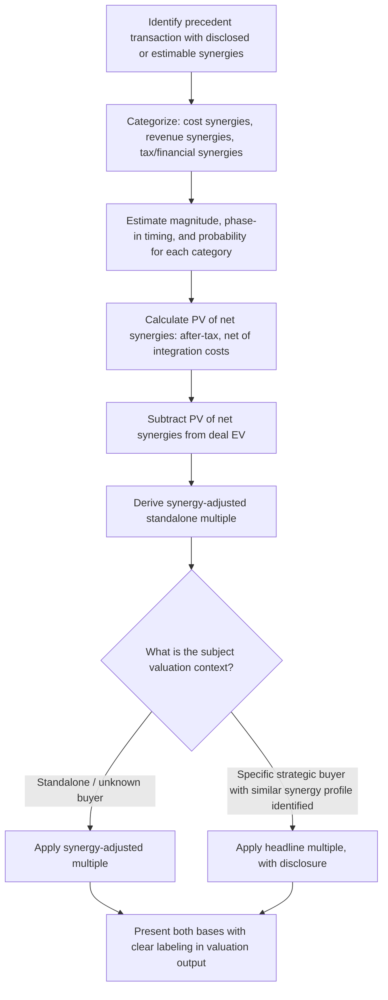

## Synergy Adjustments in Transaction Multiples

### Definition and Purpose

Synergy adjustment is the process of identifying, quantifying, and appropriately treating the incremental value that an acquirer expects to create by combining a target with its existing operations — value that is embedded within observed transaction multiples but does not represent the target's standalone worth. Because precedent transaction multiples reflect what a *specific* acquirer was willing to pay given *its own* unique synergy potential, failing to adjust for synergies when applying those multiples to a different subject company (with a different, unknown, or absent set of prospective acquirers) can produce a systematically inflated valuation.

**Key Points**

- Synergies are acquirer-specific and buyer-specific; they are not part of a target's standalone intrinsic or trading value
- Transaction multiples paid by strategic acquirers typically embed some portion of expected synergy value, while financial sponsor multiples generally do not
- Synergies are conventionally split into cost synergies (more certain, easier to quantify) and revenue synergies (less certain, harder to quantify and realize)
- Adjusting for synergies allows an analyst to separate "standalone value paid" from "combination value paid," which is essential when precedent multiples are applied to a different valuation context than the original deal's specific buyer-target combination

### Why Synergies Distort Multiple Comparability

A precedent transaction multiple reflects the price a specific buyer paid for a specific target, given that specific buyer's ability to extract value through combination. This creates two distinct comparability problems when using that multiple elsewhere:

**Problem 1 — Applying strategic-inflated multiples to a standalone or different-buyer context**: if the subject company's likely acquirer (or the valuation's purpose, such as a fairness opinion for a specific pending deal) does not share the same synergy potential as the acquirer in the precedent transaction, applying that multiple directly overstates the appropriate value.

**Problem 2 — Mixing strategic and financial sponsor deals without adjustment**: since financial sponsors generally do not capture the same operational synergies as strategic buyers (see Selecting Comparable Precedent Transactions), blending these transaction types into a single average multiple conflates two economically distinct pricing bases.

### Categorizing Synergies

**Cost Synergies**

Savings generated by eliminating duplicated functions, consolidating facilities, achieving procurement scale, or reducing headcount redundancy. Generally considered more reliable and easier to quantify than revenue synergies because:

- They are largely within the acquirer's direct control to implement (management can execute a headcount reduction or facility closure unilaterally)
- They do not depend on external customer behavior or market response
- Historical realization rates for announced cost synergies tend to be higher than for announced revenue synergies

Common cost synergy categories:

- Headcount reduction (overlapping corporate functions: finance, HR, legal, IT)
- Facility consolidation (redundant offices, manufacturing plants, distribution centers)
- Procurement scale benefits (combined purchasing volume improving supplier terms)
- Technology and systems consolidation (eliminating duplicate software licenses, IT infrastructure)
- Public company cost elimination (if taking a target private: reduced audit, listing, and compliance costs)

**Revenue Synergies**

Incremental revenue generated by combining the two businesses' customer bases, distribution channels, or product lines. Generally considered less reliable and harder to quantify because:

- They depend on customer response and market acceptance, which is outside the acquirer's unilateral control
- Cross-selling and channel integration often take longer to materialize than cost reduction and face execution risk from sales force integration challenges
- Competitive response (rivals reacting to the merged entity) can erode expected revenue synergy benefits

Common revenue synergy categories:

- Cross-selling (acquirer's products sold through target's customer relationships, or vice versa)
- Geographic expansion (leveraging target's distribution network to sell acquirer's products in new regions)
- Combined product bundling or platform effects
- Pricing power from increased market share or reduced competitive intensity

**Financial/Tax Synergies**

A third, sometimes separately categorized class:

- Net operating loss (NOL) utilization (acquirer using target's tax attributes, or vice versa, subject to relevant tax limitation rules)
- Improved cost of debt from combined credit profile or scale
- Working capital optimization from combined treasury and cash management

### Quantifying Synergy Value

**Basic Framework**

$$PV(Net\ Synergies) = PV(Cost\ Synergies) + PV(Revenue\ Synergies) - PV(Integration\ Costs) - PV(Dis-synergies)$$

Each component requires its own forecast of magnitude, timing (synergies are rarely realized immediately — a phase-in period is standard), and probability of achievement:

$$PV(Synergy\ Stream) = \sum_{t=1}^{n} \frac{Synergy_t \times (1-T) \times Probability_t}{(1+r)^t}$$

**Worked Example — Cost Synergy Quantification**

An acquirer identifies the following annual run-rate cost synergies from combining two companies, phased in over three years:

| Category | Full Run-Rate (Year 3+) | Year 1 (33%) | Year 2 (67%) | Year 3+ (100%) |
| --- | --- | --- | --- | --- |
| Headcount reduction | $45,000,000 | $14,850,000 | $30,150,000 | $45,000,000 |
| Facility consolidation | $18,000,000 | $5,940,000 | $12,060,000 | $18,000,000 |
| Procurement savings | $22,000,000 | $7,260,000 | $14,740,000 | $22,000,000 |
| **Total** | **$85,000,000** | **$28,050,000** | **$56,950,000** | **$85,000,000** |

Applying a 25% tax rate and discounting at a WACC of 9%, with terminal value on the Year 3+ run-rate synergy assumed to continue in perpetuity:

$$PV(Synergies) = \sum_{t=1}^{2} \frac{Synergy_t \times 0.75}{(1.09)^t} + \frac{(85{,}000{,}000 \times 0.75)/0.09}{(1.09)^2}$$

This produces a present value of the cost synergy stream that can be compared against the premium the acquirer is contemplating paying, to assess whether the deal economics are supportable — a standard sanity check performed by acquirers before finalizing an offer.

**Integration Costs and Dis-synergies**

Synergy quantification must net out the costs required to achieve the projected benefits:

- One-time integration costs: severance payments, systems migration, facility exit costs, advisory and legal fees specific to integration planning
- Potential dis-synergies: customer or key employee attrition triggered by the transaction itself, cultural integration friction, loss of acquirer or target brand equity

[Inference] Announced synergy estimates in M&A transactions are commonly criticized in general market commentary as being optimistically biased at announcement, with actual realized synergies (particularly revenue synergies) often falling short of initial projections — though the degree of shortfall varies significantly by deal and is difficult to generalize precisely across transaction types.

### Deriving a Synergy-Adjusted ("Standalone") Multiple

To isolate the standalone component of a strategic transaction multiple — useful when the multiple will be applied to a different valuation context without an assumed strategic acquirer — the synergy value can be backed out of the total deal value:

$$EV_{standalone} = EV_{deal} - PV(Net\ Synergies)$$

$$\frac{EV_{standalone}}{EBITDA_{target}} = Synergy-Adjusted\ Multiple$$

**Worked Example**

Using the deal from Calculating and Interpreting Deal Multiples (EV = $10,750,000,000; LTM EBITDA = $920,000,000; headline multiple = 11.7x), assume the acquirer disclosed expected run-rate synergies with an estimated present value of $650,000,000 (net of integration costs and tax effects):

$$EV_{standalone} = 10{,}750{,}000{,}000 - 650{,}000{,}000 = 10{,}100{,}000{,}000$$

$$Synergy-Adjusted\ Multiple = \frac{10{,}100{,}000{,}000}{920{,}000{,}000} = 11.0x$$

The gap between the 11.7x headline multiple and the 11.0x synergy-adjusted multiple (0.7x, or roughly $650,000,000 of enterprise value) represents the portion of the price attributable specifically to this acquirer's expected combination benefits — value that would not necessarily transfer to a different subject company being valued without an assumed strategic combination.

### When to Apply Synergy-Adjusted vs. Headline Multiples

| Valuation Context | Appropriate Multiple Basis |
| --- | --- |
| Valuing a subject company for a standalone sale process with unknown/no strategic buyer identified | Synergy-adjusted (standalone) multiple, or financial sponsor transaction multiples |
| Valuing a subject company where a specific strategic acquirer with known, similar synergy potential has been identified | Headline multiple from comparable strategic transactions may be more directly applicable |
| Fairness opinion for a specific pending strategic transaction | Both: headline multiples from comparable deals, with explicit synergy disclosure for the specific transaction being opined upon |
| Cross-checking a DCF that already includes acquirer-specific synergies in its own projections | Headline multiple, since both methods would then reflect combination value on a consistent basis |

### Synergy Disclosure and Regulatory Considerations

Publicly disclosed synergy estimates (common in merger proxy statements and investor presentations announcing large strategic transactions) provide a valuable, though imperfect, data source for synergy quantification benchmarking:

- **Disclosed synergies are typically presented as run-rate, pre-tax figures** without full disclosure of the phase-in schedule, discount rate, or probability weighting used by the acquirer internally
- **Merger proxy statements** (in jurisdictions requiring shareholder votes on larger transactions) often include the financial advisor's own synergy assumptions used in the fairness opinion analysis, providing more granular disclosure than press release-level announcements
- **Post-closing synergy tracking** is rarely disclosed with the same rigor as pre-deal projections, making retrospective validation of synergy realization rates against original announcements genuinely difficult for external analysts

### Synergy Adjustment Workflow

### Interaction with Control Premium Analysis

Synergy value and control premium are related but analytically distinct components of the total premium paid over unaffected trading value (see Control Premium Estimation):

$$Total\ Premium\ Paid = Pure\ Control\ Value + Synergy\ Value\ Shared\ with\ Seller$$

In competitive bidding situations, sellers often succeed in negotiating a larger share of expected synergy value into the purchase price, meaning the observed premium reflects both the acquirer's willingness to pay for control itself and the portion of synergy value the seller was able to capture through negotiation leverage — disentangling these two components with precision from public deal data alone is often not fully possible, since acquirers rarely disclose the complete internal analysis supporting their offer price.

### Common Pitfalls

- **Applying headline strategic transaction multiples to a standalone valuation without synergy adjustment**: systematically overstates value when no comparable strategic combination is assumed for the subject company.
- **Treating disclosed synergy estimates as unbiased or certain to be realized**: announced synergy figures are the acquirer's own projections at deal announcement, subject to the same optimism bias risk as any forward-looking management projection, and should be treated with appropriate skepticism.
- **Ignoring integration costs and dis-synergies when quantifying net synergy value**: overstates the true net economic benefit of the combination and, by extension, overstates the amount that should be backed out of the headline multiple.
- **Failing to distinguish cost from revenue synergies in reliability assessment**: applying the same confidence level to a revenue synergy projection as to a cost synergy projection ignores the materially different execution risk profiles between the two categories.
- **Assuming synergies are transferable to a different buyer-target combination**: synergies are specific to the particular operational overlap and strategic fit between a given acquirer and target; a different acquirer for the subject company may have a completely different (higher, lower, or different-composition) synergy potential.

### Next Steps

- **Selecting Comparable Precedent Transactions**
- **Calculating and Interpreting Deal Multiples**
- **Control Premium Estimation**
- **Precedent Transaction Analysis vs. Trading Comparables**
- **LBO Modeling and Financial Sponsor Return Analysis**
- **Merger Model Construction and Accretion/Dilution Analysis**
- **Football Field Valuation Charts and Triangulation**