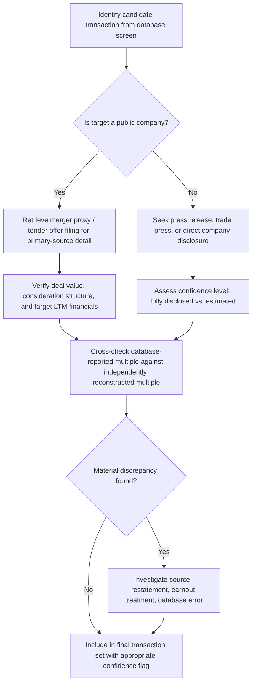

## Data Sources and Limitations of Transaction Comparables

### Definition and Purpose

Precedent transaction analysis is only as reliable as the underlying data used to construct it. Because transaction comparables rely on historical, discrete deal events rather than continuously observable market prices, the quality, completeness, and consistency of available data sources directly shapes both the achievable rigor of the analysis and the caveats that must accompany any resulting valuation conclusion. Understanding where transaction data comes from — and precisely what each source does and does not reliably capture — is essential to using precedent transactions responsibly rather than treating a database output as an unquestioned input.

**Key Points**

- Data quality and completeness vary enormously between public-target and private-target transactions
- Commercial M&A databases are the primary practitioner source but require independent verification for material deals
- Regulatory filings provide the highest-quality data for public company transactions but are largely unavailable for private deals
- Every transaction data source carries structural limitations that must be explicitly acknowledged, not just mechanically applied

### Primary Data Sources for Precedent Transactions

**1. Commercial M&A Databases**

Subscription-based financial data platforms aggregate historical transaction data, typically including deal value, multiples, parties involved, and basic deal terms, searchable and filterable by industry, size, date range, and geography. These are the standard first-line research tool in investment banking, private equity, and corporate development practice due to their searchability and breadth of historical coverage.

[Unverified — specific current platform names, features, and pricing are subject to frequent change and are not confirmed as of this writing; practitioners should consult current market resources for the specific commercial database landscape.]

**2. SEC and Regulatory Filings (Public Target Transactions)**

For transactions involving US public company targets, several filing types provide primary-source, legally-attested deal information:

- **Merger proxy statements (DEFM14A)**: filed when shareholder approval is required, these typically contain the most granular disclosure available — the financial advisor's fairness opinion analysis, management's financial projections used in the valuation, detailed deal timeline, and background of the negotiation process
- **Tender offer documents (Schedule TO, Schedule 14D-9)**: filed in tender offer transactions, providing similar substantive disclosure to merger proxies
- **8-K filings**: current reports disclosing material events, including merger agreement signings, often the first public disclosure of definitive deal terms
- **Definitive merger agreements** (typically filed as exhibits to 8-K or proxy filings): the actual legal contract, providing the most precise and authoritative source for deal structure, consideration mechanics, and contingent payment terms

Analogous regulatory filing regimes exist in other major jurisdictions (e.g., UK Takeover Code documents, EU merger notification filings), though disclosure requirements, timing, and the depth of financial detail required vary by jurisdiction.

**3. Press Releases and Investor Presentations**

Company and acquirer press releases announcing transactions typically provide headline deal terms (offer price, consideration structure, expected synergies, anticipated closing timeline) more quickly than formal regulatory filings become available, making them a useful initial source, though they generally lack the granular financial detail (target's precise LTM financials, complete diluted share count) needed for precise multiple calculation without supplementation from subsequent filings.

**4. Financial News and Trade Press**

General financial media and industry-specific trade publications often report on private-target transactions (where no regulatory filing disclosure requirement exists) based on sources close to the deal, company statements, or industry contacts — providing valuable coverage of an otherwise dark corner of the M&A market, but with correspondingly lower reliability and completeness than regulatory filings.

**5. Direct Company Disclosure**

Annual reports, investor day presentations, and earnings call commentary sometimes provide retrospective detail on completed acquisitions (including realized synergies, purchase price allocation detail in financial statement footnotes) that supplements the original deal announcement data.

### Public vs. Private Target Data Quality: A Structural Divide

| Dimension | Public Target Transactions | Private Target Transactions |
| --- | --- | --- |
| Deal value disclosure | Precise, legally required | Often estimated, partial, or entirely undisclosed |
| Target financial detail | Available via SEC filings (10-K, 10-Q) prior to deal | Frequently unavailable or only partially disclosed |
| Consideration structure | Fully disclosed (cash/stock mix, exchange ratios) | Often simplified or undisclosed in press coverage |
| Multiple calculation precision | High — all components of the EV bridge are typically available | Low to moderate — often requires estimation or reliance on secondhand reporting |
| Regulatory oversight of disclosure accuracy | Significant (SEC review, litigation risk for misstatement) | Minimal to none |

This structural divide means that a precedent transaction set will often show a mix of high-confidence public-target data points and lower-confidence private-target data points — best practice explicitly flags this confidence distinction rather than presenting all transactions with uniform apparent precision (see Selecting Comparable Precedent Transactions).

### Purchase Price Allocation (PPA) as a Supplementary Data Source

For completed acquisitions, the acquirer's subsequent financial statements include purchase price allocation footnote disclosure, breaking down the total consideration paid across identifiable tangible assets, identifiable intangible assets (customer relationships, technology, trademarks), and residual goodwill. This disclosure, while filed after deal closing rather than at announcement, provides retrospective insight into how the market (via the acquirer's own accounting) ultimately characterized the components of value paid — useful context for understanding what portion of a given transaction multiple was attributable to identifiable assets versus goodwill (which often implicitly captures synergy and strategic premium value).

### Key Limitations of Transaction Comparable Data

**1. Backward-Looking and Time-Sensitive**

Every data point in a precedent transaction set reflects market, credit, and competitive conditions prevailing at that specific historical announcement date — conditions that may differ meaningfully from the current valuation context (see Calculating and Interpreting Deal Multiples for the market-timing distortion this can introduce).

**2. Incomplete Disclosure, Especially for Private Targets and Cross-Border Deals**

Many transactions — particularly private-to-private and cross-border deals in jurisdictions with less stringent disclosure requirements — never have complete financial details publicly disclosed, forcing reliance on estimated or secondhand figures with inherently lower reliability.

**3. Survivorship and Selection Bias in Available Data**

Only *completed* (and, to a lesser extent, publicly announced but subsequently terminated) transactions are observable. Deals that were contemplated but never announced, or negotiations that broke down before reaching a definitive agreement, are generally invisible to transaction comparable analysis — meaning the observable data may not represent the full population of potential transaction outcomes for similarly situated companies.

**4. Small Sample Sizes in Niche Sectors**

As discussed in peer set selection, many specific sub-industries or transaction size bands simply do not generate a statistically robust number of comparable historical transactions within a reasonable recency window, forcing a trade-off between sample size and true comparability.

**5. Synergy and Buyer-Specific Contamination**

As detailed in Synergy Adjustments in Transaction Multiples, headline multiples embed acquirer-specific synergy expectations that are not directly transferable to a different valuation context without adjustment.

**6. Earnout and Contingent Consideration Ambiguity**

Deals with significant contingent consideration components introduce genuine ambiguity into "the" transaction value — different reasonable analysts could construct different headline multiples from the same deal depending on how contingent payments are treated (see Calculating and Interpreting Deal Multiples).

**7. Restatement and Data Revision Risk**

Target financial data used to calculate the LTM denominator at the time of original announcement may later be restated (accounting corrections, reclassifications) — commercial databases do not always reflect such restatements retroactively, introducing potential inconsistency between the originally reported multiple and a multiple recalculated using since-restated financials.

**8. Currency and Cross-Border Complexity**

For international transactions, currency conversion timing (spot rate at announcement vs. average rate over a period) and jurisdiction-specific accounting standard differences (GAAP vs. IFRS vs. local GAAP) introduce additional sources of potential inconsistency across a cross-border precedent transaction set.

### Data Verification Workflow

### Best Practices for Using Transaction Comparable Data Responsibly

- **Independently verify database-sourced multiples for any transaction material to the final valuation conclusion**, cross-referencing against primary source filings where available, rather than relying solely on a database's pre-calculated multiple field.
- **Explicitly flag confidence levels** across the transaction set — distinguishing fully-disclosed public-target deals from estimated private-target deals — rather than presenting the full set with uniform apparent precision.
- **Disclose the data source and calculation methodology** used for each transaction, particularly for any deal involving earnout structures, stock consideration, or cross-border currency conversion.
- **Cross-check database figures against multiple sources** when a transaction is central to the valuation conclusion, since even reputable commercial databases can contain input errors, outdated figures, or inconsistent treatment conventions across their historical coverage.
- **Acknowledge sample size limitations explicitly** rather than presenting a thin transaction set with the same statistical confidence implied by a robust sample.

### Common Pitfalls

- **Relying exclusively on a single commercial database's pre-calculated multiple without independent verification**: database calculation conventions (LTM methodology, earnout treatment, share count basis) may not match the analyst's own intended methodology, and errors do occur in large historical datasets.
- **Treating private-target transaction data with the same confidence as public-target data**: the structural disclosure gap between these two categories is substantial and should be reflected in how heavily each data point is weighted.
- **Ignoring survivorship bias**: assuming the observable universe of completed transactions represents the full range of what similarly situated companies could achieve, when unobserved failed negotiations and unannounced discussions are systematically excluded from the visible dataset.
- **Failing to reconcile database figures against primary source filings for material transactions**: particularly important in fairness opinions and litigation contexts where the underlying data may face external scrutiny or challenge.
- **Overlooking currency and accounting standard inconsistencies in cross-border transaction sets**: can introduce meaningful, easily overlooked distortions into an otherwise carefully screened precedent set.

### Next Steps

- **Selecting Comparable Precedent Transactions**
- **Calculating and Interpreting Deal Multiples**
- **Control Premium Estimation**
- **Synergy Adjustments in Transaction Multiples**
- **Precedent Transaction Analysis vs. Trading Comparables**
- **Strengths, Weaknesses, and Misuses of Comparable Analysis**
- **Football Field Valuation Charts and Triangulation**