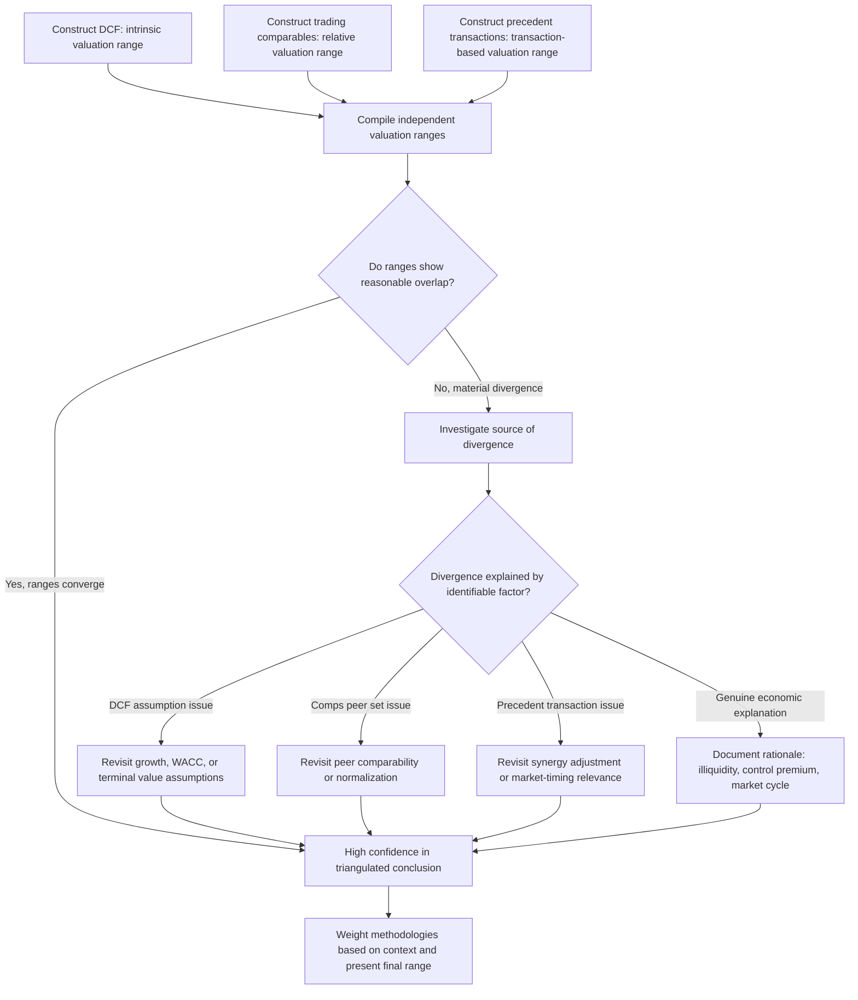

## Triangulating Value Across Methodologies

### Definition and Purpose

Triangulation is the practice of deriving a final valuation conclusion by synthesizing outputs from multiple independent methodologies — typically DCF (intrinsic valuation), trading comparables (relative valuation), and precedent transactions (transaction-based valuation) — rather than relying on any single method in isolation. Because each methodology carries distinct assumptions, data sources, and structural weaknesses, triangulation exploits the fact that their weaknesses rarely overlap: a DCF's sensitivity to terminal value assumptions is not shared by trading comps, and trading comps' vulnerability to sector-wide mispricing is not shared by a fundamentals-driven DCF. Where the methods converge, confidence in the resulting valuation range increases; where they diverge, the divergence itself becomes a diagnostic signal requiring investigation.

**Key Points**

- Triangulation combines DCF, trading comps, and precedent transactions to produce a defensible valuation range, not a single point estimate
- Each methodology's blind spots are largely uncorrelated with the others', which is the entire rationale for using multiple methods together
- Convergence across methods increases confidence; divergence should be investigated and explained, not averaged away without understanding
- The standard visual output of triangulation is the football field chart, but the underlying analytical process — reconciling *why* methods agree or disagree — is more important than the chart itself

### Why No Single Methodology Is Sufficient

| Methodology | Core Strength | Core Structural Weakness |
| --- | --- | --- |
| DCF (Intrinsic) | Independent of current market sentiment; captures company-specific fundamentals and catalysts explicitly | Highly sensitive to terminal value, growth, and WACC assumptions; "garbage in, garbage out" risk |
| Trading Comparables | Market-grounded, fast, reflects current sentiment and risk appetite | Only measures relative value; propagates sector-wide mispricing; ignores company-specific catalysts |
| Precedent Transactions | Reflects actual prices paid for control in real transactions | Backward-looking and time-sensitive; embeds acquirer-specific synergies and control premiums not always transferable |

Each method essentially answers a different underlying question: DCF asks what the business is fundamentally worth based on its own cash flows; trading comps asks what the market is currently paying for similar minority stakes; precedent transactions asks what acquirers have actually paid for control of similar businesses. A single "correct" valuation answer, in principle, would show reasonable consistency across all three lenses — genuine divergence is either a sign that one or more methods contains a flawed assumption, or that a real economic difference (illiquidity, absence of an synergy-capable buyer, temporary market mispricing) explains the gap.

### The Triangulation Process

### Weighting Methodologies by Context

Triangulation does not necessarily mean averaging the three methods with equal weight — the appropriate weighting depends on the purpose of the valuation and which methodology's underlying assumptions are most reliable in the specific context:

| Context | Methodology Likely to Carry More Weight | Rationale |
| --- | --- | --- |
| Long-term fundamental investment decision | DCF | Captures company-specific long-run cash flow generation independent of near-term sentiment |
| M&A negotiation or fairness opinion | Precedent transactions and DCF | Precedents reflect actual control-transfer pricing; DCF provides independent anchor |
| IPO pricing or near-term trading recommendation | Trading comparables | Market-relative pricing is directly what near-term trading value depends on |
| Litigation or tax valuation (minority interest) | DCF, with careful comps calibration | Comps must be adjusted for control/minority distinctions (see Control Premium Estimation) |
| Mature, stable, low-growth company with thick peer set | Trading comparables | DCF terminal value dominates and adds limited incremental information over a well-supported multiple |
| Early-stage or high-growth company with thin peer set | DCF, cross-checked with reverse DCF | Comparables may be poorly matched or embed unsustainable growth assumptions themselves |

[Inference] There is no universally prescribed weighting formula across these methods; practitioner convention generally favors an explicit, reasoned weighting disclosed alongside the final range rather than a purely mechanical average, since the appropriate emphasis genuinely depends on the specific valuation purpose and data quality available in each case.

### Investigating Divergence: A Diagnostic Framework

When methodologies produce materially different valuation ranges, the divergence itself carries information. Systematic investigation should consider:

**1. Is the DCF's terminal value assumption reasonable?**

A reverse DCF exercise (see Reverse DCF and Market-Implied Expectations Analysis) can reveal whether the DCF's terminal growth or margin assumptions are more aggressive or conservative than what trading comps imply the market is currently pricing for similar companies.

**2. Is the trading comps peer set genuinely comparable?**

Revisit whether growth, margin, risk, and capital structure differences between the subject and its peer set (see Selecting a Comparable Company Peer Set) are being adequately controlled for, or whether the peer median is being distorted by a poor-fit outlier.

**3. Are precedent transactions properly synergy-adjusted and time-relevant?**

Confirm whether headline precedent multiples have been adjusted for acquirer-specific synergies (see Synergy Adjustments in Transaction Multiples) and whether the transaction set reflects market conditions relevant to the current valuation context, not a materially different credit or M&A cycle period.

**4. Is there a genuine, explainable economic reason for divergence?**

Some divergence is not an error but a real feature of the situation:

- **Illiquidity**: a private or thinly-traded company may genuinely warrant a discount to public trading comps that has nothing to do with flawed methodology
- **Absence of a synergy-capable buyer**: if no plausible strategic acquirer exists for the subject company, precedent transaction multiples (which embed strategic synergy value) may simply not be achievable or relevant, and trading comps or DCF should be weighted more heavily
- **Temporary sector mispricing**: if strong evidence suggests the peer sector is currently in a bubble or trough, DCF and precedent transactions (if from a different period) may reasonably diverge from current trading comps, and this divergence should be explained rather than mechanically resolved

### Worked Example: Triangulation with Divergence Investigation

A subject company shows the following valuation ranges (enterprise value, in millions):

| Methodology | Low | Midpoint | High |
| --- | --- | --- | --- |
| DCF | $2,100 | $2,450 | $2,800 |
| Trading Comparables | $1,750 | $1,950 | $2,150 |
| Precedent Transactions | $2,600 | $2,950 | $3,300 |

**Observation**: DCF and trading comps show moderate overlap (roughly $2,100–$2,150 shared range), but precedent transactions sit meaningfully above both.

**Investigation**: Reviewing the precedent transaction set reveals that 3 of 5 included deals were strategic acquisitions with substantial disclosed cost and revenue synergies, while the subject company's realistic near-term sale scenario (per management and industry context) would most likely involve a financial sponsor buyer with limited synergy capture. Applying a synergy adjustment (see Synergy Adjustments in Transaction Multiples) to the strategic deals in the precedent set brings the adjusted precedent transaction range down to approximately $2,200–$2,750 — now showing meaningful overlap with both DCF and the upper end of trading comps.

**Resolution**: The triangulated conclusion would reasonably center around $2,200–$2,500, reflecting the overlap zone across all three synergy-adjusted methods, with the original unadjusted precedent transaction range disclosed separately as context for what a strategic buyer might hypothetically pay.

### The Football Field Chart as Triangulation's Standard Output

The **football field chart** (a horizontal bar chart displaying overlapping valuation ranges from each methodology, resembling the yard markers on an American football field) is the conventional visual synthesis of triangulation, typically constructed as:

- Each methodology represented as a horizontal bar spanning its low-to-high range
- Bars typically stacked vertically for visual comparison (DCF, trading comps, precedent transactions, sometimes supplemented by 52-week trading range, analyst price targets, or LBO-implied value as additional reference bars)
- A vertical reference line often overlaid to show the current trading price or an offer price under consideration, for immediate visual context
- The overlap zone across methodologies visually highlighting the most defensible valuation range

While the football field chart is the standard *presentation* format, the underlying triangulation work — understanding *why* each range sits where it does and reconciling divergence — is the substantive analytical contribution; the chart itself is a communication tool, not a substitute for that underlying reconciliation work.

### Sensitivity and Scenario Analysis Within Triangulation

Triangulation is most robust when each individual methodology's range itself reflects a reasonable sensitivity analysis (see Break-Even and Threshold Analysis and related sensitivity techniques) rather than a single fragile point estimate:

- **DCF range**: typically driven by a WACC/terminal growth sensitivity table, or bear/base/bull operating scenarios
- **Trading comps range**: typically driven by the peer set's quartile range (25th to 75th percentile) rather than a single median point
- **Precedent transactions range**: typically driven by the full observed multiple range across the screened transaction set, sometimes segmented by strategic vs. financial sponsor sub-ranges

Constructing each methodology's range this way, rather than as a single number, makes the overall triangulation more informative — a wide DCF range overlapping narrowly with a tight trading comps range communicates different information than two equally wide, fully-overlapping ranges.

### Common Pitfalls

- **Mechanically averaging methodology outputs without investigating divergence**: treating a wide gap between DCF and comps as noise to be smoothed over by averaging, rather than as a signal requiring explanation, discards valuable diagnostic information.
- **Presenting a single point estimate from each method rather than a range**: undermines the ability to identify genuine overlap zones and overstates the precision achievable from any single methodology.
- **Failing to disclose the weighting rationale when methods are not weighted equally**: reduces the transparency and reproducibility of the final conclusion, particularly problematic in contexts subject to external review (fairness opinions, litigation).
- **Using stale or inconsistent time periods across methodologies**: e.g., a DCF using current market WACC assumptions triangulated against precedent transactions from a materially different credit cycle period without adjustment.
- **Treating football field chart construction as the analytical endpoint**: the chart visualizes the conclusion; it does not substitute for the underlying reconciliation of why each method landed where it did.
- **Ignoring genuine economic explanations for divergence in favor of forcing convergence**: sometimes methods should reasonably diverge (illiquidity discounts, absence of synergy-capable buyers), and forcing artificial convergence misrepresents the actual valuation uncertainty.

### Next Steps

- **Football Field Valuation Charts and Triangulation**
- **Strengths, Weaknesses, and Misuses of Comparable Analysis**
- **Reverse DCF and Market-Implied Expectations Analysis**
- **Synergy Adjustments in Transaction Multiples**
- **Break-Even and Threshold Analysis**
- **Presenting Valuation Conclusions to Stakeholders**
- **Scenario Analysis and Case-Based Modeling**