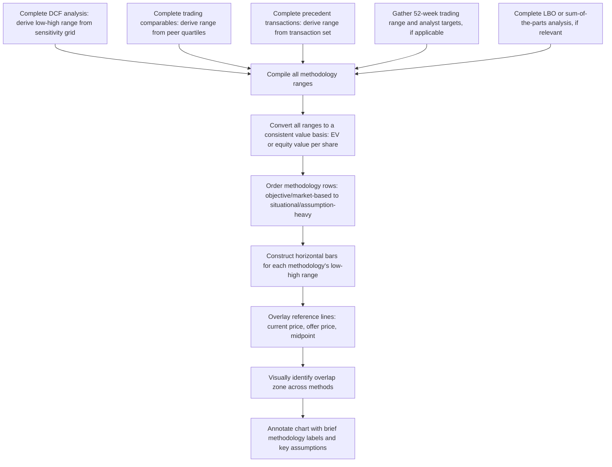

## Building a Football Field Valuation Chart

### Definition and Purpose

A football field chart is a horizontal bar chart that displays overlapping valuation ranges from multiple methodologies side by side, allowing a viewer to quickly assess where independent valuation approaches converge and where they diverge. Named for its visual resemblance to the yard-line markers on an American football field, it is the standard communication tool for presenting a triangulated valuation conclusion (see Triangulating Value Across Methodologies) to stakeholders — boards, deal committees, clients, and counterparties — in a single, immediately interpretable visual.

**Key Points**

- Each methodology is represented as a horizontal bar spanning its low-to-high valuation range, not a single point
- Bars are typically stacked vertically, ordered to build a visual narrative from most standard/objective to most situational
- Reference lines (current trading price, 52-week range, offer price) provide essential context for interpreting the ranges
- The chart is a communication tool summarizing prior analytical work — it does not substitute for the underlying reconciliation of why each range sits where it does

### Standard Components of a Football Field Chart

**1. Horizontal Axis**

Represents value — typically enterprise value or equity value per share, depending on the audience and purpose (per-share equity value is more intuitive for public company boards and shareholders; enterprise value is often preferred for M&A and capital structure-focused audiences).

**2. Vertical Axis (Categorical)**

Lists each valuation methodology or reference point as a separate row, typically ordered from top to bottom as:

- 52-week trading range (if a public company)
- Analyst price targets (if applicable)
- Trading comparables (by multiple type, e.g., EV/EBITDA-implied, EV/Revenue-implied)
- Precedent transactions (by multiple type)
- DCF (often shown with a sensitivity range from a WACC/growth grid)
- LBO-implied value (if relevant, representing a financial sponsor's maximum supportable price)
- Sum-of-the-parts (if applicable for diversified businesses)

**3. Bars**

Each methodology's row contains a horizontal bar spanning from the low end to the high end of that methodology's derived range, typically color-coded by methodology type for visual distinction.

**4. Reference Lines**

Vertical lines overlaid across all bars, commonly showing:

- Current unaffected trading price (for public companies)
- A specific offer price under consideration (in M&A contexts)
- The midpoint of the overall triangulated range

### Standard Construction Workflow

### Converting to a Consistent Value Basis

Before constructing the chart, every methodology's output must be converted to the same value basis — most commonly moving from enterprise value to equity value per share, since this is the most intuitive unit for most stakeholder audiences:

$$Equity\ Value = Enterprise\ Value - Total\ Debt - Preferred\ Stock - Minority\ Interest + Cash\ \&\ Equivalents$$

$$Equity\ Value\ per\ Share = \frac{Equity\ Value}{Diluted\ Shares\ Outstanding}$$

This conversion must be applied consistently across every methodology's range (both the low and high ends), using the same net debt, share count, and dilution assumptions throughout — inconsistent capital structure adjustments across different methodology rows is a common and easily overlooked source of error.

### Worked Example: Constructing the Underlying Data

**Step 1 — DCF Range**

A DCF sensitivity grid (WACC 8.5%–9.5%, terminal growth 2.5%–3.5%) produces enterprise values ranging from $3,100,000,000 to $3,650,000,000.

**Step 2 — Trading Comparables Range**

Applying the peer set's 25th percentile (8.8x) to 75th percentile (10.4x) EV/EBITDA multiples against the subject's LTM EBITDA of $380,000,000:

$$Low: 380{,}000{,}000 \times 8.8 = 3{,}344{,}000{,}000$$

$$High: 380{,}000{,}000 \times 10.4 = 3{,}952{,}000{,}000$$

**Step 3 — Precedent Transactions Range**

Applying the synergy-adjusted transaction multiple range (9.5x–11.8x) to the same LTM EBITDA:

$$Low: 380{,}000{,}000 \times 9.5 = 3{,}610{,}000{,}000$$

$$High: 380{,}000{,}000 \times 11.8 = 4{,}484{,}000{,}000$$

**Step 4 — Convert to Equity Value per Share**

Assuming net debt of $450,000,000 and diluted shares outstanding of 62,000,000:

| Methodology | EV Low | EV High | Equity Value Low | Equity Value High | Per Share Low | Per Share High |
| --- | --- | --- | --- | --- | --- | --- |
| DCF | $3,100M | $3,650M | $2,650M | $3,200M | $42.74 | $51.61 |
| Trading Comps | $3,344M | $3,952M | $2,894M | $3,502M | $46.68 | $56.48 |
| Precedent Transactions | $3,610M | $4,484M | $3,160M | $4,034M | $50.97 | $65.06 |

### Visual Layout Conventions

**Ordering of rows (top to bottom)**, following common practitioner convention:

1. Market-based reference points first (52-week range, current price, analyst targets) — establishing the "starting context"
2. Relative valuation methods next (trading comps, precedent transactions) — market-derived but requiring more analytical judgment
3. Intrinsic valuation last (DCF, sum-of-the-parts) — most assumption-dependent, often shown with the widest range reflecting sensitivity analysis

**Color coding**: distinct colors per methodology category aid quick visual scanning, particularly when multiple sub-ranges are shown within a single methodology (e.g., separate bars for EV/EBITDA-implied vs. EV/Revenue-implied trading comps).

**Bar width and overlap emphasis**: some presentations shade or highlight the specific price/value zone where the majority of methodology bars overlap, visually directing the viewer's attention to the most defensible range without requiring them to mentally compute the intersection themselves.

**Annotations**: each bar should be labeled with enough methodology detail (e.g., "Trading Comps — EV/EBITDA 8.8x–10.4x") that a viewer can trace the visual back to the underlying analysis without needing to consult a separate appendix, though full assumption detail is typically reserved for supporting analysis pages rather than the chart itself.

### Interpreting the Completed Chart

**Strong convergence** (most bars overlapping in a narrow band): supports high confidence in the resulting valuation range and suggests the various methodologies are consistently pointing to a similar underlying value — a favorable outcome for a decision-maker seeking a defensible conclusion.

**Wide dispersion with minimal overlap**: signals either a genuine source of economic divergence (see Triangulating Value Across Methodologies for the diagnostic framework) or a methodological error requiring investigation before finalizing a conclusion — the chart itself does not resolve which explanation applies, but it makes the divergence visually undeniable in a way that a table of numbers might not.

**Position of the current trading price or offer price relative to the ranges**: in an M&A context, an offer price falling within or near the low end of the DCF and trading comps ranges but below the precedent transactions range might support an argument that the offer, while reasonable relative to standalone value, does not fully reflect achievable change-of-control value — precisely the kind of argument a football field chart is designed to make visually explicit.

### Common Variations

**Sum-of-the-Parts Football Field**: for diversified or multi-segment businesses, an additional row (or a fully separate chart) presents the aggregated implied value of valuing each business segment against its own dedicated peer set and methodology, then summing — often shown alongside the consolidated-entity valuation methods for comparison.

**LBO-Implied Value Row**: particularly relevant in private equity and leveraged buyout contexts, showing the maximum price a financial sponsor could rationally pay while still achieving a target IRR (typically derived from a leveraged buyout return model) — this row often anchors the lower end of the overall range, since sponsor bids are usually more return-constrained than strategic bids.

**Time-Series Football Field**: some presentations show how the ranges have evolved over several recent time periods (e.g., quarterly snapshots over the past year), illustrating how market conditions or company performance have shifted the valuation conclusion over time rather than presenting only a single current snapshot.

### Common Pitfalls

- **Inconsistent capital structure adjustments across methodology rows**: using different net debt or share count assumptions when converting EV-based methods to equity value per share distorts the visual comparability the chart is meant to provide.
- **Presenting single-point bars instead of true ranges**: collapsing each methodology to a single value defeats the purpose of the football field format, which exists specifically to show range and overlap.
- **Omitting methodology labels or key assumption detail**: a chart with unlabeled or vaguely labeled bars forces the viewer to trust the conclusion without being able to trace it back to the underlying analysis.
- **Cherry-picking which methodologies to include or exclude from the chart**: selectively omitting a methodology that produces an inconvenient range for the desired conclusion undermines the same objectivity concerns present in peer or precedent transaction selection.
- **Failing to reconcile visually apparent divergence in the accompanying narrative**: presenting a chart with clearly non-overlapping bars without explaining why, leaving the viewer to draw their own (possibly incorrect) conclusions about which method to trust.
- **Using stale reference data**: an outdated 52-week trading range or superseded analyst price targets undermines the currency and credibility of the overall chart.

### Next Steps

- **Triangulating Value Across Methodologies**
- **Strengths, Weaknesses, and Misuses of Comparable Analysis**
- **Selecting Comparable Precedent Transactions**
- **LBO Modeling and Financial Sponsor Return Analysis**
- **Sum-of-the-Parts Valuation for Diversified Businesses**
- **Presenting Valuation Conclusions to Stakeholders**
- **Break-Even and Threshold Analysis**