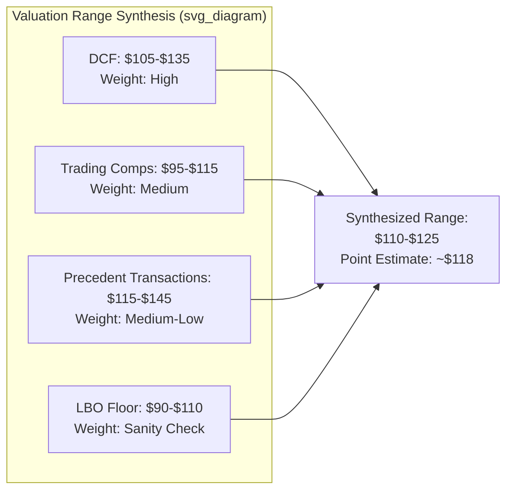

## Weighting Valuation Methods by Context

### Overview

Weighting valuation methods refers to the analytical process of assigning relative importance or credibility to different valuation approaches (DCF, comparable companies, precedent transactions, LBO, sum-of-the-parts, asset-based) when synthesizing a final valuation conclusion or range. Rather than mechanically averaging outputs, a rigorous analyst adjusts weights based on the reliability, relevance, and appropriateness of each method given the specific company, industry, transaction context, and data quality available.

### Why Weighting Matters

No single valuation method is universally superior. Each embeds different assumptions and is sensitive to different inputs:

- **DCF** relies on long-term cash flow forecasts, discount rates, and terminal value assumptions — powerful but highly sensitive to inputs that are themselves uncertain.
- **Comparable Companies (Trading Comps)** reflect current market sentiment and relative pricing but assume the market is efficient and that suitable comparables exist.
- **Precedent Transactions** capture control premiums and strategic value but are backward-looking and affected by deal-specific circumstances (synergies, competitive bidding dynamics).
- **LBO Analysis** establishes a floor value based on financial sponsor return requirements, useful primarily for companies with stable cash flows suited to leverage.
- **Asset-Based/NAV** is most relevant for asset-heavy or distressed businesses where going-concern earnings are unreliable.

A defensible valuation conclusion typically triangulates across methods rather than relying on one, and the weighting scheme should be explicit and justified, not arbitrary.

### Key Factors Driving Weight Allocation

**1. Industry and Business Model**

- Mature, stable cash-flow businesses (utilities, consumer staples) → higher weight on DCF, since long-term forecasts are more reliable.
- High-growth or pre-profitability businesses (early-stage tech, biotech) → lower weight on DCF (terminal value dominates and is speculative), higher weight on revenue-multiple comps or precedent transactions.
- Cyclical businesses (commodities, industrials) → DCF requires normalized mid-cycle assumptions; comps can be misleading if the whole sector is mispriced at a cycle extreme, so cross-cycle averaging or precedent transactions may deserve more weight.
- Asset-heavy or liquidation scenarios (real estate, distressed companies) → higher weight on NAV/asset-based approaches.

**2. Data Availability and Quality**

- Thin or no comparable set (unique business model, monopoly-like position) → reduce weight on trading comps; increase reliance on DCF and precedent transactions.
- Few or stale precedent transactions (illiquid M&A market, long time since last deal) → discount precedent transaction weight or adjust for market conditions at the time of those deals.
- High confidence in management's forecast granularity and historical accuracy → increase DCF weight.

**3. Purpose of the Valuation**

- **M&A / Sale process**: Precedent transactions and DCF (with synergies) often weighted heavily, since a buyer's willingness to pay reflects both market comparables and control premium.
- **Public market investment (equity research)**: Trading comps and DCF are typically primary, since public market pricing is the relevant benchmark, not the price a strategic acquirer might pay.
- **LBO/sponsor consideration**: LBO analysis is central because it directly answers "can this deal be financed and does it clear return hurdles," while DCF and comps serve as sanity checks.
- **Fairness opinions / litigation**: Regulatory and legal norms often require presenting all methods with an even-handed rationale for any deviation from an average, since courts scrutinize unweighted or arbitrarily weighted conclusions (e.g., Delaware appraisal case law).

**4. Market Conditions**

- Overheated or distorted equity markets → trading comps may reflect a valuation bubble; DCF (which is more anchored to fundamentals) may deserve more relative weight.
- Illiquid or dislocated credit markets → LBO analysis may understate value since leverage capacity is temporarily impaired.

**5. Company Life-Cycle Stage**

| Stage | Preferred Methods | Rationale |
| --- | --- | --- |
| Early-stage / pre-revenue | Precedent transactions, VC method, comps on revenue multiples | DCF terminal value dominates and forecasts are unreliable |
| Growth stage | Blend of DCF and forward revenue/EBITDA comps | Cash flows are improving but not yet stable enough for pure DCF confidence |
| Mature | DCF (heavier weight), trading comps | Stable, forecastable cash flows make DCF more robust |
| Decline / distress | Asset-based, liquidation value, precedent distressed transactions | Going-concern assumptions in DCF may not hold |

### Approaches to Formal Weighting

**1. Qualitative Judgment (Most Common in Practice)**

Analysts present a **football field chart** showing the valuation range from each method, then use judgment — informed by the factors above — to identify where within (or across) the overlapping ranges the "most defensible" value or range lies. This is often presented as a narrative rather than a numerically weighted average.

**2. Explicit Numerical Weighting**

Some contexts (e.g., fairness opinions, academic exercises) apply explicit percentage weights to a fixed set of methods:

$$V_{final} = \sum_{i=1}^{n} w_i \times V_i \quad \text{where} \quad \sum_{i=1}^{n} w_i = 1$$

**Example:**

| Method | Value Estimate | Weight | Weighted Contribution |
| --- | --- | --- | --- |
| DCF | $120/share | 50% | $60.00 |
| Trading Comps | $105/share | 30% | $31.50 |
| Precedent Transactions | $135/share | 20% | $27.00 |
| **Weighted Value** |  | **100%** | **$118.50** |

This approach lends an appearance of rigor but should be used cautiously — the weights themselves are subjective, and presenting false precision (e.g., "52.3% DCF") can obscure rather than clarify the judgment involved. [Inference: many practitioners consider precise numerical weighting schemes to be more common in academic or illustrative contexts than in live deal work, where football-field ranges with narrative rationale are more typical, though practice varies by firm and situation.]

**3. Sensitivity-Weighted / Confidence-Interval Approach**

Rather than a single weight, some analysts express each method's output as a range with an implied confidence level, then favor the intersection or overlap of ranges as the most credible zone, with outlier methods flagged for exclusion or reduced weight if the underlying assumptions are weak (e.g., a comp set with only one dissimilar company).

### Football Field Visualization

### Common Pitfalls

- **Mechanical averaging**: Treating all methods as equally credible regardless of data quality or fit — e.g., averaging DCF and comps for a pre-revenue biotech where DCF is essentially guesswork.
- **Cherry-picking weights to reach a target price**: Reverse-engineering weights to justify a predetermined valuation (a recurring criticism in fairness opinion litigation).
- **Ignoring control premium context**: Comparing an equity-value-per-share DCF output directly against trading comps (minority basis) without adjusting for the control premium embedded in precedent transactions.
- **Overreliance on thin comp sets**: Weighting trading comps heavily when only two or three marginally comparable companies exist.
- **Static weighting across market cycles**: Failing to revisit weights as market conditions shift (e.g., maintaining high trading-comp weight during a speculative bubble).

### Practical Framework for Presenting Weighted Conclusions

1. Calculate value ranges independently for each applicable method.
2. Assess each method's reliability given industry, data quality, and valuation purpose.
3. Assign either explicit or implied (narrative) weights, documenting the rationale.
4. Identify the overlap zone or weighted point estimate.
5. Stress-test the conclusion against key sensitivities (discount rate, exit multiple, comp set changes) to confirm the range is robust, not fragile to a single assumption.
6. Present the football field alongside a written rationale for why certain methods were weighted more heavily — this transparency is often more valuable to stakeholders than the numerical output itself.

**Related Topics**

- Football Field Charts and Valuation Range Presentation
- Selecting and Screening Comparable Companies
- Precedent Transaction Analysis and Control Premiums
- Terminal Value Sensitivity in DCF
- Fairness Opinions and Valuation Litigation Standards
- Sum-of-the-Parts Valuation for Diversified Businesses
- Cross-Cycle Normalization for Cyclical Industries