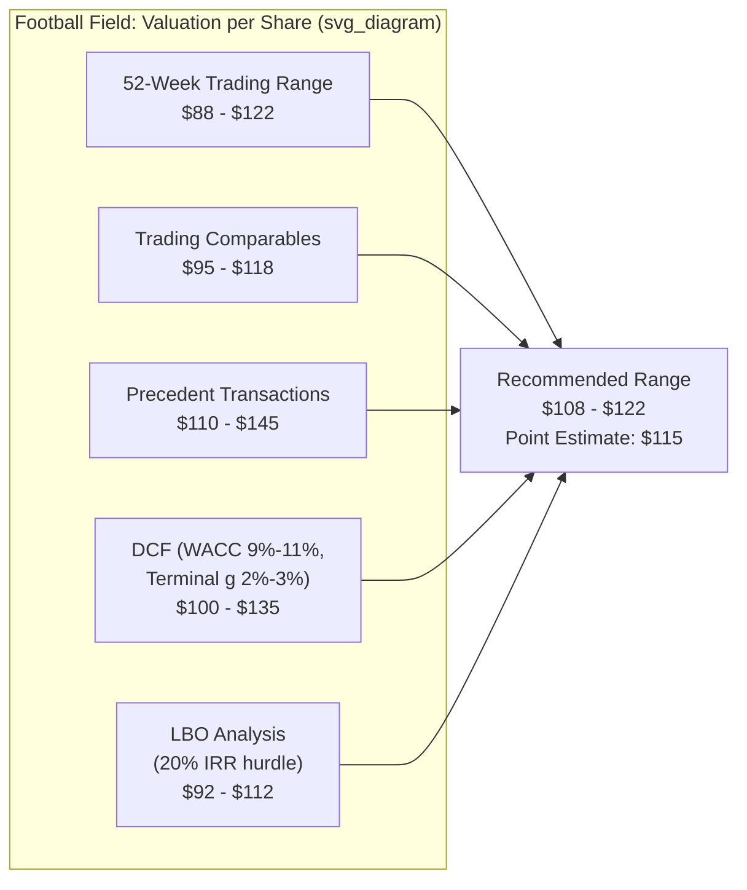

## Presenting a Valuation Range to Stakeholders

### Overview

Presenting a valuation range to stakeholders is the communication discipline of translating quantitative analysis (DCF, comps, precedent transactions, LBO) into a clear, defensible narrative for decision-makers — boards, management teams, investors, acquirers, or courts. The output is rarely a single point estimate; it is a range accompanied by context that explains why the range exists, what drives its width, and where within it the analyst's judgment falls.

### Why a Range, Not a Point Estimate

Valuation is inherently an exercise in estimating an unknowable future under uncertainty. A single number implies false precision and invites two failure modes: stakeholders anchor on it as if it were fact, or they dismiss the entire analysis when the number proves wrong in hindsight. A well-constructed range:

- Reflects genuine uncertainty in inputs (growth rates, margins, discount rate, exit multiples).
- Signals the analyst's confidence level implicitly through range width.
- Provides negotiating room in a transaction context.
- Withstands scrutiny better than a single figure, since it acknowledges the assumptions driving variability.

### Core Components of a Valuation Presentation

**1. The Football Field Chart**

The standard visual for presenting multiple methods' output ranges side by side as horizontal bars, typically ordered from most market-based (trading comps) to most intrinsic (DCF) or vice versa, depending on house convention.

**2. Sensitivity Tables**

Accompanying the football field, sensitivity (data) tables show how the DCF output range moves with key variable pairs, most commonly WACC vs. terminal growth rate, or WACC vs. exit multiple.

| WACC \ Terminal Growth | 2.0% | 2.5% | 3.0% |
| --- | --- | --- | --- |
| 9.0% | $128 | $135 | $143 |
| 10.0% | $115 | $120 | $126 |
| 11.0% | $104 | $108 | $113 |

This demonstrates to stakeholders precisely which assumptions the conclusion is most sensitive to, rather than presenting the DCF as a black box.

**3. Bridge from Enterprise Value to Equity Value**

Any range presented per-share must transparently walk through:

$$\text{Equity Value} = \text{Enterprise Value} - \text{Total Debt} - \text{Minority Interest} - \text{Preferred Equity} + \text{Cash \& Equivalents}$$

Stakeholders frequently misinterpret enterprise value multiples as directly comparable to share price; explicitly showing this bridge avoids confusion and builds credibility.

**4. Narrative Rationale**

Numbers alone do not persuade; the accompanying narrative should address:

- Which methods were weighted more heavily and why (see the related topic on weighting valuation methods).
- Key assumptions driving the high and low ends of the range.
- What would need to be true for the actual outcome to land at the top or bottom of the range.
- How the range compares to current trading price (if public) or last transaction price, and what that gap implies.

### Structuring the Presentation for Different Audiences

**Boards and Management**

- Emphasize strategic implications: is the business undervalued/overvalued relative to intrinsic worth, and what actions follow?
- Include peer benchmarking so the board can contextualize performance versus competitors.
- Typically fewer technical mechanics, more emphasis on conclusions and recommended next steps.

**Investment Committees / Sponsors (LBO context)**

- Center the presentation on returns: IRR and MOIC (multiple on invested capital) sensitivity tables across entry multiple, leverage, and exit multiple assumptions, since this audience cares primarily about whether the deal clears the required hurdle rate.
- DCF and comps serve as supporting sanity checks rather than the primary lens.

**Public Market Investors / Equity Research Clients**

- Present the range relative to current market price with an explicit rating implication (undervalued/fairly valued/overvalued).
- Include peer trading multiples table (EV/EBITDA, P/E, EV/Revenue) with the subject company highlighted for quick visual comparison.

**Fairness Opinions / Legal and Regulatory Contexts**

- Require the most rigorous documentation: every method considered (even those given zero or minimal weight) must be disclosed along with the rationale for exclusion or reduced weighting, since courts (e.g., Delaware Chancery precedent in appraisal litigation) scrutinize the completeness and even-handedness of the analysis.
- Avoid any appearance of working backward from a target price.

### Key Presentation Principles

- **Lead with the range, not the methodology**: Stakeholders generally want the conclusion first, with supporting detail available for those who want to go deeper (an "executive summary first" structure).
- **Use consistent scaling across bars**: All football field bars should share the same x-axis scale to avoid visual distortion.
- **Disclose the "as of" date**: Valuations are time-sensitive; market-based inputs (share prices, multiples) should be dated explicitly.
- **Avoid excessive precision**: Presenting a DCF output to the cent (e.g., "$118.47") implies false precision; rounding to sensible increments (e.g., nearest dollar or half-dollar) better reflects genuine uncertainty.
- **Show the walk from unaffected to affected value (in M&A contexts)**: When presenting to a target board, separately show the standalone (unaffected) valuation versus value inclusive of synergies, so the board can distinguish what is being paid for control versus intrinsic worth.

### Common Pitfalls

- **Overloading slides with every sensitivity table produced**: Curate to the two or three that materially affect the decision; excess detail buries the conclusion.
- **Failing to reconcile conflicting method outputs**: If precedent transactions imply $140 and DCF implies $110, stakeholders need an explicit explanation (e.g., control premium, synergies, market timing of past deals) rather than silence on the gap.
- **Static ranges presented without update cadence**: In live deal processes, market inputs shift; failing to refresh comps or trading multiples close to the presentation date undermines credibility.
- **Treating the midpoint as the "answer"**: The midpoint of a range is not inherently more correct than other points within it; the narrative should justify where within the range the analyst's judgment actually falls, which may not be the arithmetic center.
- **Ignoring the audience's decision context**: A sponsor deciding whether to bid needs return-focused framing; a board evaluating a hostile approach needs defensibility-focused framing. The same underlying analysis should be reframed, not just repackaged with different logos.

### Illustrative Slide Flow for a Sell-Side or Fairness Opinion Presentation

1. Executive summary: recommended range and headline conclusion.
2. Company overview and key value drivers.
3. Valuation methodology overview (brief, one slide).
4. Football field chart.
5. DCF detail with sensitivity table.
6. Trading comparables detail.
7. Precedent transactions detail.
8. Bridge from enterprise value to equity value / per-share value.
9. Conclusion and recommended range, restated with rationale for weighting.

[Inference: the specific slide ordering above reflects common practice in sell-side and fairness opinion decks, but firms vary in sequencing — some place the sensitivity tables before the football field, or integrate methodology and conclusion into a single opening slide.]

**Related Topics**

- Weighting Valuation Methods by Context
- Football Field Chart Construction and Design Standards
- Enterprise Value to Equity Value Bridge Mechanics
- DCF Sensitivity Analysis (WACC and Terminal Growth)
- IRR and MOIC Sensitivity Tables in LBO Analysis
- Fairness Opinions and Valuation Litigation Standards
- Synergy Valuation and Unaffected vs. Affected Share Price