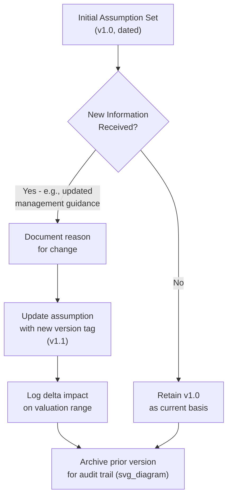

## Documenting Key Assumptions and Judgment Calls

### Overview

Documenting key assumptions and judgment calls is the practice of explicitly recording the inputs, methodological choices, and subjective decisions embedded in a valuation, along with the rationale behind them. Every valuation model is a chain of assumptions — growth rates, margins, discount rates, comparable selection, terminal value method — and undocumented assumptions become invisible risk: they cannot be challenged, updated, or defended when scrutinized later by colleagues, clients, auditors, or courts.

### Why Documentation Is Structurally Necessary

A DCF or comparable company analysis is not a single calculation; it is a nested set of decisions, each of which could reasonably have been made differently. Documentation serves several distinct functions:

- **Reproducibility**: Another analyst (or the same analyst, months later) should be able to understand why a number is what it is without reverse-engineering the spreadsheet.
- **Accountability**: When outcomes diverge from forecasts, documented assumptions allow a post-mortem that distinguishes forecasting error from analytical error.
- **Defensibility**: In fairness opinions, litigation (e.g., Delaware appraisal proceedings), or regulatory review, undocumented judgment calls are treated far more skeptically than documented ones with clear rationale.
- **Internal consistency checks**: Explicit documentation surfaces contradictions (e.g., assuming margin expansion while also assuming market share loss) that might otherwise go unnoticed.

### Categories of Assumptions Requiring Documentation

**1. Forecast Assumptions**

- Revenue growth rate trajectory and its basis (historical trend, management guidance, industry analyst consensus, top-down market sizing).
- Margin assumptions (gross, EBITDA, EBIT) and whether they assume expansion, stability, or contraction, with the operational rationale (e.g., economies of scale, pricing power, cost inflation).
- Capital expenditure and working capital assumptions, particularly whether they scale with revenue or follow a step-function tied to specific capacity expansions.
- Tax rate assumptions — statutory vs. effective, and whether normalization adjustments were applied (e.g., excluding one-time tax benefits or NOL carryforward effects).

**2. Discount Rate Inputs**

- Risk-free rate source and date (e.g., 10-year Treasury yield as of a specific date).
- Equity risk premium source (e.g., Damodaran's implied ERP, historical average, survey-based).
- Beta selection: raw vs. adjusted (Blume-adjusted), and whether a peer-group unlevered/relevered beta was used instead of the company's own regression beta, with rationale (e.g., thin trading history, recent capital structure change).
- Cost of debt basis (current yield to maturity on outstanding debt, credit rating-implied spread, or marginal borrowing rate).
- Target capital structure used for WACC weighting — current market-value mix vs. a normalized/target mix, and why.

**3. Terminal Value Method and Inputs**

- Perpetuity growth method vs. exit multiple method, and the rationale for the choice.
- Terminal growth rate assumption and its relationship to long-run GDP growth or inflation expectations.
- Exit multiple selection and the peer set or precedent basis used to derive it.
- Cross-check: whether the implied exit multiple from the perpetuity growth method was reconciled against observed trading or transaction multiples (a standard sanity check).

**4. Comparable Company and Precedent Transaction Selection**

- Explicit inclusion/exclusion criteria (industry classification, size range, growth profile, geography, business model similarity).
- Companies or deals considered but excluded, and why (e.g., excluded due to pending M&A distorting its multiple, excluded due to a one-time impairment distorting EBITDA).
- Date of data used and any normalization adjustments applied to reported financials (e.g., add-backs for non-recurring items).

**5. Structural and Judgmental Adjustments**

- Control premium assumptions applied (or not applied) and the basis (empirical control premium studies, deal-specific strategic rationale).
- Minority discount or lack-of-marketability discount, where applicable, and the basis for the percentage used.
- Synergy assumptions in an M&A context: revenue synergies vs. cost synergies, phase-in timeline, and the probability-weighting or haircut applied to reflect execution risk.
- Any qualitative override of a quantitative output (e.g., "DCF suggests $95 but we conclude $105 based on strategic scarcity value") — these overrides carry the highest scrutiny risk if undocumented.

### Documentation Structure and Format

**1. Assumptions Log / Appendix**

A structured table appended to the valuation model or presentation, typically organized by category:

| Assumption | Value Used | Source/Basis | Alternative Considered | Sensitivity Impact |
| --- | --- | --- | --- | --- |
| Terminal growth rate | 2.5% | Long-run US GDP growth estimate | 2.0% - 3.0% range tested | ±$15/share across range |
| WACC | 10.0% | CAPM with peer-group unlevered beta, relevered to target D/E of 30% | Company-specific regression beta (rejected due to 18-month trading history) | ±$20/share across 9%-11% range |
| Revenue CAGR (Years 1-5) | 8% declining to 4% | Blend of management guidance (Years 1-2) and analyst consensus fade curve (Years 3-5) | Pure historical 3-year CAGR of 12% (rejected as unsustainable) | Not separately sensitized; embedded in base case |

**2. Inline Model Documentation**

Within the spreadsheet or model itself, cell comments or a dedicated "Assumptions" tab should capture the same information at the point of use, so the audit trail exists independent of any accompanying deck.

**3. Memo-Style Narrative**

For higher-stakes valuations (fairness opinions, litigation support, large M&A), a standalone assumptions memo often accompanies the model, written in prose rather than table form, explicitly walking through:

- The purpose and standard of value being applied (fair market value, fair value, investment value).
- Each major judgment call, the alternatives considered, and why the chosen approach was preferred.
- Known limitations of the analysis (e.g., "management did not provide a forecast beyond Year 3; Years 4-5 were extrapolated by the analyst using a linear fade to terminal growth").

### Handling Version Control and Changes Over Time

Maintaining dated versions of the assumption set — rather than overwriting the model in place — allows a clear record of what was known and assumed at each point in time, which is particularly important in deal contexts where valuations evolve across multiple rounds of diligence.

### Distinguishing Fact-Based Inputs from Judgment Calls

Good documentation explicitly separates:

- **Observable/factual inputs**: current share price, risk-free rate, historical financials as reported — low judgment content, mainly requiring a source citation and date.
- **Model-derived/calculated outputs**: WACC as calculated from stated component inputs — judgment resides in the component choices, not the arithmetic.
- **Genuine judgment calls**: terminal growth rate, comparable company inclusion, synergy realization probability — these carry the highest documentation burden because reasonable analysts could disagree, and the rationale (not just the number) is what should be recorded.

### Common Pitfalls

- **Documenting the "what" without the "why"**: Recording that WACC = 10% without recording the component build-up and rationale for each input leaves the number unchallengeable and unreproducible.
- **Treating consensus estimates as objective fact**: Analyst consensus growth rates are themselves a judgment call (which analysts, what date, mean vs. median) and should be documented as such rather than treated as a neutral anchor.
- **Failing to document rejected alternatives**: Recording only the chosen assumption, without noting what else was considered and why it was rejected, weakens defensibility — especially in litigation, where the absence of considered alternatives can suggest the analysis was not rigorous.
- **Static documentation that isn't updated**: An assumptions log created at the start of an engagement but never revisited as the model evolves becomes misleading rather than helpful.
- **Burying critical judgment calls in footnotes**: Material assumptions (e.g., a significant synergy haircut or an unusual terminal multiple) should be visible in the main narrative, not relegated to fine print where reviewers are unlikely to engage with them.

### Practical Checklist for Documentation Completeness

1. Is the source and date of every market-based input (risk-free rate, beta, comps pricing) recorded?
2. Is the rationale for each forecast assumption tied to a specific basis (historical data, management guidance, industry research) rather than left as an unexplained number?
3. Are alternative approaches considered and rejected explicitly noted, particularly for terminal value method and discount rate build-up?
4. Is every qualitative override of a quantitative model output flagged and justified?
5. Is there a clear "as of" date for the entire valuation, given that market inputs are time-sensitive?
6. Would a reviewer unfamiliar with the engagement be able to reconstruct the logic chain from assumption to conclusion using the documentation alone?

**Related Topics**

- Weighting Valuation Methods by Context
- Presenting a Valuation Range to Stakeholders
- WACC Build-Up and Component Sourcing
- Terminal Value Methodology (Perpetuity Growth vs. Exit Multiple)
- Synergy Valuation and Probability-Weighting in M&A
- Fairness Opinions and Valuation Litigation Standards
- Model Audit and Version Control Best Practices