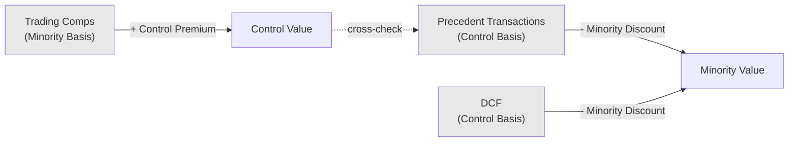

## Control Premium versus Minority Discount

### Overview

Control premium and minority discount are two sides of the same valuation adjustment: the difference in per-share value between a controlling equity stake and a non-controlling (minority) equity stake in the same company. A control premium is added to a minority-basis value to reflect the value of control; a minority discount (also called a discount for lack of control, DLOC) is subtracted from a control-basis value to reflect the absence of control. They are mathematically inverse expressions of the same underlying concept, not two independent adjustments to be applied together.

### Conceptual Foundation

Ownership of equity carries a bundle of rights. A controlling shareholder can typically:

- Appoint or replace management and set compensation.
- Set strategic direction, including M&A activity, capital allocation, and dividend policy.
- Access and redeploy the company's cash flows and assets.
- Compel a sale, merger, liquidation, or recapitalization.
- Amend governing documents (subject to legal limits).

A minority shareholder generally cannot compel any of these actions and is instead subject to decisions made by the controlling holder(s). Because control confers the ability to direct the enterprise's economic benefits, a controlling stake is generally worth more per share than a minority stake, all else equal.

### The Relationship Between the Two Adjustments

$$V_{control} = V_{minority} \times (1 + P_{control})$$

$$V_{minority} = V_{control} \times (1 - D_{minority})$$

Where $P_{control}$ is the control premium (expressed as a percentage) and $D_{minority}$ is the minority discount. These are related but **not symmetrical** in percentage terms — a common error is to assume a 25% control premium implies exactly a 25% minority discount. The correct algebraic conversion is:

$$D_{minority} = 1 - \frac{1}{1 + P_{control}}$$

**Example:** A 25% control premium implies:

$$D_{minority} = 1 - \frac{1}{1.25} = 1 - 0.80 = 20\%$$

| Control Premium | Implied Minority Discount |
| --- | --- |
| 10% | 9.1% |
| 20% | 16.7% |
| 25% | 20.0% |
| 30% | 23.1% |
| 40% | 28.6% |

### Which Valuation Methods Produce Which Basis of Value

Understanding which basis (control or minority) a given valuation method produces by default is the single most important practical skill in this area, since applying a premium or discount incorrectly to the wrong starting basis is the most common analytical error.

| Method | Default Value Basis | Adjustment Typically Needed |
| --- | --- | --- |
| Trading Comparables (public company multiples) | Minority (market prices reflect trades of small blocks by non-controlling investors) | Add control premium if valuing a controlling interest |
| Precedent Transactions (M&A deals) | Control (acquirer typically buys 100% or a controlling stake) | Subtract implied discount if valuing a minority interest |
| DCF (unlevered, using the company's own projected cash flows without third-party constraint) | Control (assumes full access to and redeployment of cash flows as the analyst/owner sees fit) | Subtract discount if valuing a minority interest; note that if the DCF uses management's own operating plan without synergies, some practitioners treat it as a "as-is" or "status quo" control basis |
| LBO Analysis | Control (sponsor acquires controlling stake to implement its own operating and capital plan) | Subtract discount if valuing a minority interest |

*(svg_diagram — Mermaid diagram rendered as unrendered plaintext per formatting requirements)*

### Sources for Empirical Control Premium Data

- **Mergerstat Control Premium Study**: Historical database of announced M&A transactions comparing the offer price to the target's unaffected trading price prior to announcement, widely used as a benchmark source.
- **FactSet Mergerstat/BVR Control Premium Study**: A continuation/successor dataset used similarly in valuation practice.
- Premiums are typically measured relative to the target's share price at a specified period before announcement (e.g., 1 day, 1 week, 4 weeks prior) to avoid contamination from rumor-driven price movement ("run-up").
- [Unverified: exact historical average control premium ranges cited in practice (commonly discussed as falling roughly in the 20%-40% range across market cycles) vary meaningfully by industry, deal era, and the specific study/dataset used; any single average figure should be treated as a rough benchmark rather than a precise universal constant, and should be checked against current data for the relevant sector and period.]

### Components Embedded Within an Observed Control Premium

An empirically observed M&A premium is not pure "control value" — it is a composite that typically includes:

1. **Pure control value**: the value of being able to direct strategy, cash flows, and capital allocation.
2. **Synergy value**: cost and revenue synergies specific to the acquirer, which are deal-specific and not part of generic control value.
3. **Competitive dynamics premium**: value paid due to a competitive bidding process rather than the intrinsic value of control itself.
4. **Strategic/scarcity premium**: value an acquirer assigns due to unique strategic fit (e.g., last remaining target in a consolidating industry).

[Inference: because observed transaction premiums blend these components, using a raw average "control premium" from a transaction database as a pure discount-for-lack-of-control proxy is a simplification; more rigorous approaches attempt to strip out synergy and deal-specific effects, though in practice this decomposition is difficult to do with precision and analysts commonly rely on the blended empirical premium as a practical proxy.]

### Practical Application Framework

**Step 1 — Identify the required basis of value.**

Determine what interest is actually being valued: a 100% controlling interest, a majority but non-100% stake, or a minority (non-controlling) stake.

**Step 2 — Identify the native basis of each valuation method used.**

As shown in the table above.

**Step 3 — Apply the appropriate adjustment.**

- If methods produce a minority-basis value and a control-basis value is needed → add a control premium to the minority-basis outputs (typically only to trading comps; DCF and precedent transactions may already be control-basis).
- If methods produce a control-basis value and a minority-basis value is needed → apply a discount for lack of control to the control-basis outputs (typically DCF, precedent transactions, LBO).

**Step 4 — Avoid double-counting.**

A common error is applying a control premium to trading comps and then averaging the result with an unadjusted precedent transactions output (already control-basis) as if both were on the same basis, or applying both a control premium AND treating DCF as needing an additional premium when it already reflects control assumptions.

### Illustrative Example

A company's trading comps analysis yields $100/share (minority basis, since it reflects public market trading of individual shares). The valuation is being prepared for an acquirer purchasing 100% control.

$$V_{control} = \$100 \times (1 + 25\%) = \$125 \text{ per share}$$

Separately, a precedent transactions analysis (already control-basis, since precedent deals involved acquisitions of control) yields $130/share — no further adjustment needed since it is already on a control basis. The two control-basis estimates ($125 and $130) can now be reasonably compared or blended, whereas comparing the unadjusted $100 trading comps figure to the $130 precedent transaction figure without adjustment would understate the trading-comps-implied control value.

### Minority Discount Interacting with Discount for Lack of Marketability (DLOM)

Minority discount and DLOM are distinct and often applied sequentially, not interchangeably:

- **DLOC (Discount for Lack of Control)**: addresses the absence of control rights.
- **DLOM (Discount for Lack of Marketability)**: addresses the absence of a ready market to sell the interest (relevant for private company minority interests, restricted stock, or closely held businesses).

$$V_{final} = V_{control} \times (1 - DLOC) \times (1 - DLOM)$$

A minority, non-marketable interest in a private company can carry a substantially larger combined discount than either adjustment alone, since the two are typically applied multiplicatively rather than additively.

### Common Pitfalls

- **Applying a control premium to an already control-basis value**: Double-counts control value (e.g., adding a premium on top of a precedent-transaction-derived figure).
- **Treating the control premium/minority discount conversion as symmetric percentages**: A 30% premium is not the algebraic equivalent of a 30% discount; the correct conversion formula must be used.
- **Using a blended average control premium without industry or deal-era context**: Premiums vary meaningfully by sector, deal size, and market conditions; a generic historical average may not fit the specific situation.
- **Ignoring synergy contamination**: Using raw observed M&A premiums (which include synergy value) as a proxy for pure control value can overstate the discount/premium appropriate for a non-synergistic minority stake adjustment.
- **Confusing DLOC with DLOM**: Applying only one when both may be relevant (e.g., a minority stake in a private, illiquid company requires both adjustments, not just one).
- **Applying premiums/discounts inconsistently across a football field**: Some method outputs adjusted, others left on their native basis, without disclosure, undermines comparability of the final range.

**Related Topics**

- Discount for Lack of Marketability (DLOM)
- Weighting Valuation Methods by Context
- Precedent Transaction Analysis and Synergy Decomposition
- Documenting Key Assumptions and Judgment Calls
- Fairness Opinions and Valuation Litigation Standards
- Minority Shareholder Rights and Appraisal Rights Litigation
- Trading Comparables: Selection and Adjustment Methodology