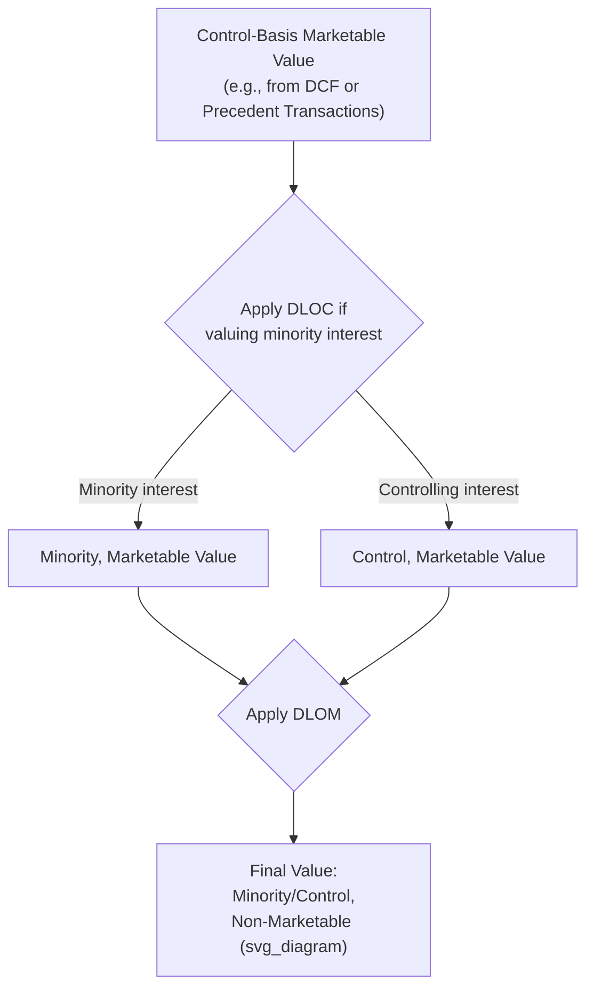

## Discount for Lack of Marketability (DLOM)

### Overview

The Discount for Lack of Marketability (DLOM) is a valuation adjustment applied to reduce the value of an equity interest to reflect the fact that it cannot be quickly and inexpensively converted into cash, unlike a freely tradable public security. Marketability refers to the relative ease, speed, and certainty of selling an interest at fair value; an interest that lacks a ready market — most commonly a private company equity stake, restricted stock, or a non-controlling interest with no active buyer — is worth less than an otherwise-identical interest that could be sold immediately at minimal transaction cost.

### Conceptual Foundation

The core economic logic rests on the time value of money and transaction cost/risk during an illiquid holding period:

- A public stock can typically be sold within seconds during market hours at a known, quoted price, with minimal transaction cost (brokerage commission).
- A private company interest may take months to years to sell, requires finding a willing buyer, involves negotiation and due diligence, and carries execution risk (the sale may fall through or occur at an unfavorable price).
- This delay and uncertainty impose an economic cost on the holder, which rational buyers demand compensation for via a lower purchase price — hence a discount relative to an otherwise identical, freely marketable interest.

$$V_{marketable} \times (1 - DLOM) = V_{nonmarketable}$$

### DLOM Is Distinct From Discount for Lack of Control (DLOC)

These two discounts address different attributes of an equity interest and should not be conflated:

| Attribute | DLOC (Minority Discount) | DLOM |
| --- | --- | --- |
| Addresses | Absence of control rights (voting power, ability to direct the company) | Absence of a ready market to convert the interest to cash |
| Can apply to | Any non-controlling interest, public or private | Any interest lacking an active market, whether controlling or minority |
| Example scenario without the other | A minority stake in a publicly traded company has DLOC but effectively no DLOM (shares are freely tradable) | A 100% controlling interest in a private company has no DLOC (it is control) but still has DLOM (no ready buyer for the whole company) |

Both discounts can apply simultaneously and are typically combined multiplicatively:

$$V_{final} = V_{control} \times (1 - DLOC) \times (1 - DLOM)$$

### Primary Methods for Estimating DLOM

**1. Restricted Stock Studies**

Compare the trading price of a public company's unrestricted (freely tradable) shares to simultaneous private placements of restricted shares of the same company (shares subject to a holding period under securities law, historically under SEC Rule 144). The percentage difference in price is used as an empirical proxy for a marketability discount.

- Historical studies (e.g., various academic and practitioner studies conducted from the 1970s through the 1990s and beyond) have found discounts commonly [Unverified: cited ranges vary by study, time period, and holding-period rules in effect at the time — commonly discussed in valuation literature as falling roughly in a 20%-35% range, though this should be verified against the specific study being relied upon, as later studies conducted after SEC holding-period rules were shortened (e.g., under amendments to Rule 144) tend to show materially different, often lower, discounts].
- Limitation: restricted stock discounts reflect a *known, finite* holding period restriction, which differs from the potentially indefinite illiquidity of a private company interest with no defined exit event.

**2. Pre-IPO Studies**

Compare private transaction prices in a company's stock prior to its IPO against the eventual IPO price, with the percentage difference used as a marketability discount proxy.

- Notable historical series include studies by John Emory and others tracking pre-IPO transactions.
- Limitation: pre-IPO discounts may capture not just illiquidity but also the resolution of business risk and uncertainty between the pre-IPO transaction and the successful IPO (i.e., some of the "discount" reflects that IPO-track companies had risk that later resolved favorably, which is not purely a marketability effect) — a frequently cited criticism of this methodology.

**3. Option-Pricing Models (Protective Put Approach)**

Treat DLOM conceptually as the cost of a hypothetical put option that would allow the holder to sell the illiquid interest at today's value at the end of the expected holding period. The cost of this hypothetical protective put, expressed as a percentage of the underlying value, is used as the DLOM estimate.

Common models include:

- **Chaffe Model**: Applies the Black-Scholes option pricing framework to estimate the cost of a put option protecting against value decline over the illiquidity period.
- **Finnerty Model**: An average-strike put option model, arguing that a more theoretically appropriate hedge is a put based on the average price over the holding period rather than a fixed strike.
- **Longstaff Model**: Based on the theoretical maximum value of a lookback option, often cited as producing higher-end DLOM estimates.

The general Black-Scholes-derived put value used in these frameworks:

$$P = K e^{-rt} N(-d_2) - S_0 N(-d_1)$$

$$d_1 = \frac{\ln(S_0/K) + (r + \sigma^2/2)t}{\sigma\sqrt{t}}, \quad d_2 = d_1 - \sigma\sqrt{t}$$

Where $S_0$ is the current value, $K$ is the strike (typically set equal to $S_0$ for an at-the-money protective put), $r$ is the risk-free rate, $\sigma$ is the volatility assumption, and $t$ is the expected holding period.

[Inference: option-pricing models require subjective inputs — particularly the expected holding period and volatility assumption for a private, non-traded interest — so while they provide an analytically grounded framework, the output is highly sensitive to these judgment-based inputs and different models (Chaffe, Finnerty, Longstaff) can produce materially different results for the same underlying facts.]

**4. Quantitative Marketability Discount Model (QMDM)**

Developed by Z. Christopher Mercer, this approach discounts expected future cash flows to the holder (dividends/distributions plus an assumed terminal value at an assumed future exit) at a required holding period return, deriving DLOM as the implied difference from a marketable-equivalent value. It is more explicitly a discounted cash flow approach to the specific illiquid interest rather than an empirical or option-based proxy.

### Key Factors Influencing the Magnitude of DLOM

| Factor | Effect on DLOM |
| --- | --- |
| Expected holding period until liquidity event | Longer expected holding period → higher DLOM |
| Dividend/distribution policy | Interests paying regular cash distributions → lower DLOM (holder receives interim value) |
| Size and marketability of the underlying company | Larger, more established private companies with clearer paths to sale/IPO → lower DLOM |
| Restrictions in governing documents (buy-sell agreements, transfer restrictions, rights of first refusal) | More restrictive transfer provisions → higher DLOM |
| Put rights or redemption features | Presence of a contractual right to require redemption at a defined price/time → lower DLOM |
| Financial condition and prospects of the company | Distressed or highly uncertain prospects → higher DLOM (fewer willing buyers, harder to value) |
| Concentration of ownership / block size | Very large block relative to any likely buyer's capacity → can increase DLOM (fewer buyers able to absorb the position) |

### Illustrative Example

A DCF produces a control-basis, marketable-equivalent value of $50 million for a private company. The interest being valued is a 20% non-controlling stake with no near-term liquidity prospects.

1. **Apply DLOC** (estimated at 20%, based on the earlier conversion from an assumed 25% control premium): $50M \times (1 - 0.20) = \$40M$ implied minority, marketable-equivalent value for the relevant proportional interest.
2. **Apply DLOM** (estimated at 30%, based on restricted stock study benchmarks and an option-pricing cross-check reflecting an expected 3-5 year holding period): $\$40M \times (1 - 0.30) = \$28M$.
3. The 20% stake's proportional share: $\$28M \times 20\% = \$5.6M$, compared to a naive pro-rata slice of the unadjusted $50M control value ($\$10M$) — illustrating how materially DLOC and DLOM combined can affect a minority private-company interest's value.

### Application Contexts

- **Estate and gift tax valuation**: DLOM is a central and heavily litigated issue in valuing closely held business interests for estate and gift tax purposes, since taxpayers have an incentive to argue for higher discounts (lower taxable value) while tax authorities scrutinize the magnitude applied.
- **Shareholder disputes and buy-sell agreements**: Valuing a departing minority shareholder's interest in a private company often requires an explicit DLOM determination, sometimes constrained or overridden by the specific terms of a buy-sell agreement.
- **ESOP (Employee Stock Ownership Plan) valuations**: Regulatory guidance (Department of Labor scrutiny) requires careful, well-documented DLOM analysis given fiduciary obligations to plan participants.
- **Financial reporting (fair value measurement)**: Under fair value accounting frameworks, DLOM may factor into fair value estimates for illiquid investments held by funds or reported under purchase price allocation exercises, subject to the specific standard's definition of the relevant market participant assumptions.

### Common Pitfalls

- **Applying a single "rule of thumb" percentage without case-specific analysis**: Regulatory and judicial scrutiny (particularly in tax valuation disputes) increasingly penalizes generic discounts (e.g., a flat 30% applied regardless of facts) without support tied to the specific company's holding period, dividend policy, and transfer restrictions.
- **Double-counting illiquidity already reflected elsewhere**: If the discount rate used in a DCF already reflects an illiquidity premium (common in some private company cost of capital build-ups, such as certain build-up method approaches), applying a full separate DLOM on top may double-count the same risk.
- **Conflating DLOM with DLOC**: Applying only one when the fact pattern calls for both, or applying DLOM to an interest that in fact has good marketability (e.g., a private company with an active buy-sell market or imminent, contracted sale).
- **Relying on outdated restricted stock study data**: Studies conducted before regulatory holding-period changes (e.g., pre- and post-amendments to SEC Rule 144) can show different discount magnitudes for reasons unrelated to the subject company, so the study period's regulatory context matters.
- **Ignoring company-specific mitigating factors**: Failing to adjust the discount downward for factors like a strong dividend history, a clear and credible path to sale, or contractual put rights that meaningfully shorten the practical holding period.
- **Treating option-pricing model outputs as precise rather than assumption-sensitive**: Presenting a Chaffe or Finnerty model output to a high level of precision without disclosing sensitivity to the volatility and holding-period assumptions overstates the model's actual reliability.

**Related Topics**

- Control Premium versus Minority Discount
- Weighting Valuation Methods by Context
- Documenting Key Assumptions and Judgment Calls
- Private Company Valuation and Cost of Capital Build-Up
- Fairness Opinions and Valuation Litigation Standards
- Estate and Gift Tax Valuation of Closely Held Businesses
- ESOP Valuation and Fiduciary Standards