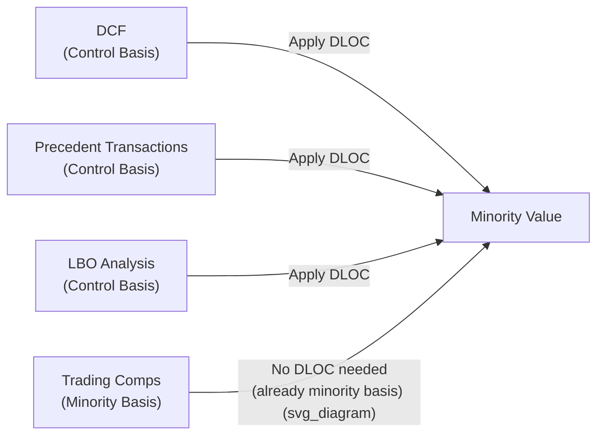

## Discount for Lack of Control (DLOC)

### Overview

The Discount for Lack of Control (DLOC) is a valuation adjustment applied to reduce a control-basis equity value to reflect the absence of control rights held by a non-controlling (minority) interest holder. It is the discount-form expression of the same underlying economic concept as the control premium: because a controlling shareholder can direct the strategy, management, and cash flows of a business while a minority shareholder cannot, a minority interest is generally worth less per share than its pro-rata share of a controlling interest's value, all else equal.

### Conceptual Foundation

Control confers a bundle of specific rights and powers over an enterprise. The absence of these rights is what DLOC quantifies. A minority holder is subject to the decisions of whoever controls the entity and cannot unilaterally:

- Elect or remove directors and officers, or set executive compensation.
- Set corporate strategy, including entry into or exit from lines of business.
- Decide on acquisitions, divestitures, or capital structure changes (debt issuance, recapitalization).
- Determine dividend or distribution policy — a controlling holder can choose to retain cash rather than distribute it, leaving a minority holder without access to their proportional economic value except through eventual sale.
- Compel a sale, merger, or liquidation of the company.
- Amend the entity's governing documents (articles, bylaws, operating agreement), subject to statutory minority protections.

Because a minority holder's economic realization is dependent on and subordinate to the controlling holder's decisions, buyers of minority interests demand compensation for this constrained position, expressed as DLOC.

### Mathematical Relationship to Control Premium

DLOC and the control premium are algebraically inverse expressions of the same adjustment, not independent figures to be applied together:

$$V_{minority} = V_{control} \times (1 - DLOC)$$

$$DLOC = 1 - \frac{1}{1 + P_{control}}$$

**Example conversion table:**

| Control Premium | Implied DLOC |
| --- | --- |
| 15% | 13.0% |
| 20% | 16.7% |
| 25% | 20.0% |
| 33% | 24.8% |
| 50% | 33.3% |

A frequent analytical error is treating these as symmetric (assuming a 25% premium implies a 25% discount); the correct conversion must go through the reciprocal relationship shown above.

### Which Valuation Methods Produce a Control-Basis Value Requiring DLOC Adjustment

| Method | Native Basis | DLOC Adjustment Needed for Minority Valuation? |
| --- | --- | --- |
| DCF (using management's own operating/capital plan without third-party constraint) | Control | Yes — subtract DLOC if valuing a minority stake |
| Precedent Transactions (control acquisitions) | Control | Yes — subtract DLOC (or an appropriate discount derived from the premium data) if valuing a minority stake |
| LBO Analysis | Control | Yes — a financial sponsor's return-based valuation assumes control over operations and capital structure |
| Asset-Based/NAV | Control (assumes ability to access and potentially redeploy or liquidate underlying assets) | Yes — a minority holder cannot compel asset sale or redeployment |
| Trading Comparables (public market multiples) | Minority | No — already reflects minority-basis trading; would instead require adding a control premium if a control value is needed |

### Empirical Sources and Estimation Approaches

**1. Derivation from Control Premium Studies**

The most common practical approach: obtain an empirical control premium from transaction databases (e.g., Mergerstat/BVR-type control premium studies comparing announced M&A offer prices to the target's unaffected pre-announcement trading price), then algebraically convert to an implied DLOC using the formula above.

**2. Direct Minority Interest Transaction Data**

Where available, comparing actual minority-interest transaction prices (e.g., minority stakes in private companies, or public "stub" trading situations) directly against a control-basis benchmark, though such direct data is considerably less abundant than control premium data derived from full-company M&A transactions.

**3. Adjusting for Deal-Specific Contamination**

Because observed control premiums (and therefore any DLOC derived from them) embed synergy value, competitive bidding dynamics, and strategic/scarcity value in addition to pure control value, more rigorous analyses attempt to isolate the pure control component before deriving a DLOC intended to reflect the absence of control alone, rather than the absence of control plus deal-specific value that a minority holder would never have realized in any scenario.

[Inference: in practice, cleanly separating pure control value from synergy and strategic premium within an observed transaction is difficult, and many practitioners use the blended empirical premium as a workable proxy while acknowledging this limitation in their documentation.]

### Distinguishing DLOC From Other Adjustments

| Adjustment | Addresses | Applies When |
| --- | --- | --- |
| DLOC | Absence of control rights (voting power, strategic direction) | Valuing any non-controlling interest, regardless of marketability |
| DLOM (Discount for Lack of Marketability) | Absence of a ready market to convert the interest to cash | Valuing any illiquid interest, regardless of control status |
| Blockage discount | Difficulty selling an unusually large block of otherwise-marketable (often publicly traded) shares without depressing the market price | Large blocks of public securities that would move the market if sold at once |
| Key person discount | Dependence of the business on a specific individual whose departure would impair value | Businesses where a key employee/owner's departure creates material risk, independent of control structure |

DLOC and DLOM are frequently combined multiplicatively when valuing a private-company minority interest:

$$V_{final} = V_{control} \times (1 - DLOC) \times (1 - DLOM)$$

### Factors Affecting the Magnitude of DLOC in a Specific Fact Pattern

| Factor | Effect on DLOC |
| --- | --- |
| State law and minority shareholder protections | Stronger statutory minority protections (e.g., appraisal rights, fiduciary duty enforcement, mandatory information rights) → potentially lower DLOC |
| Governing document provisions | Supermajority voting requirements, veto rights, or contractual minority protections built into the operating agreement/shareholder agreement → lower DLOC |
| Historical dividend/distribution policy | Consistent history of pro-rata distributions to all holders → lower DLOC (minority holder still receives economic benefit despite lacking control) |
| Presence of other large minority holders who could coalesce | Ability to form blocking coalitions with other holders → potentially lower DLOC |
| Degree of actual control exercised by the majority historically | Evidence of oppressive or self-dealing conduct by the controlling holder → can support a higher DLOC (or separately, minority oppression claims) |
| Size of the block relative to full control (e.g., 49% vs. 5%) | A large minority block closer to control thresholds (e.g., blocking minority positions requiring supermajority votes) may warrant a lower DLOC than a small, powerless stake |

### Illustrative Example

A DCF produces a control-basis equity value of $80 million for a private operating company. An analyst is valuing a 15% non-controlling membership interest with no special governance rights and no history of pro-rata distributions.

1. Convert an appropriate empirical control premium (e.g., 22%, drawn from a relevant industry-specific control premium study) to an implied DLOC:

$$DLOC = 1 - \frac{1}{1.22} = 18.0\%$$

2. Apply to the control-basis value: $\$80M \times (1 - 0.18) = \$65.6M$ implied minority, marketable-equivalent enterprise value on a 100% minority basis.
3. Take the pro-rata 15% share: $\$65.6M \times 15\% = \$9.84M$, compared to a naive pro-rata slice of the unadjusted control value ($\$12.0M$) — the DLOC alone reduces the indicated value by roughly 18% before any further DLOM adjustment for illiquidity.

### Application Contexts

- **Estate and gift tax valuation**: DLOC is a central issue in valuing minority interests in closely held businesses and family limited partnerships (FLPs) for transfer tax purposes; historically a significant driver of valuation discounts used in estate planning, though subject to considerable IRS and judicial scrutiny regarding the magnitude applied and whether the entity structure itself will be respected.
- **Shareholder oppression and dissenting shareholder litigation**: Courts determining "fair value" in dissenting shareholder or oppression cases must decide whether DLOC is appropriate to apply at all — many states, applying statutory appraisal frameworks, disallow DLOC (and sometimes DLOM) specifically to prevent majority shareholders from being unfairly enriched at a dissenting minority holder's expense, an area where the applicable legal standard (rather than pure finance theory) governs the outcome.
- **Family limited partnership and LLC interest valuations**: A recurring context where DLOC (often combined with DLOM) is applied to non-controlling limited partner or member interests transferred for estate planning purposes.
- **Fairness opinions involving minority squeeze-outs**: When a controlling shareholder seeks to acquire the remaining minority interest (a going-private or squeeze-out transaction), the fairness analysis must carefully consider whether the minority is receiving fair value inclusive of appropriate consideration for control dynamics.

### Common Pitfalls

- **Applying DLOC to an already minority-basis value**: Double-discounts a value that was never on a control basis to begin with (e.g., applying DLOC to trading comps, which are already minority-basis).
- **Ignoring jurisdiction-specific legal constraints**: Applying a DLOC in a statutory appraisal or dissenter's rights context without first confirming whether the relevant jurisdiction's case law permits it — some jurisdictions explicitly prohibit DLOC in these specific proceedings regardless of general finance theory.
- **Using a generic DLOC percentage without fact-specific support**: Applying a "standard" 20% DLOC without considering governing document provisions, historical distribution policy, or other fact-specific mitigating or aggravating factors.
- **Conflating DLOC with DLOM**: Applying only one when the interest in question genuinely lacks both control and marketability, understating the appropriate combined adjustment.
- **Failing to adjust for entity-specific control-mitigating provisions**: Overlooking contractual protections (e.g., supermajority requirements for major decisions, guaranteed distribution rights) that would justify a materially lower DLOC than a "plain vanilla" minority interest with no such protections.

**Related Topics**

- Control Premium versus Minority Discount
- Discount for Lack of Marketability (DLOM)
- Weighting Valuation Methods by Context
- Documenting Key Assumptions and Judgment Calls
- Family Limited Partnership and Estate Planning Valuation
- Dissenting Shareholder Appraisal Rights and Fair Value Standards
- Fairness Opinions in Minority Squeeze-Out Transactions