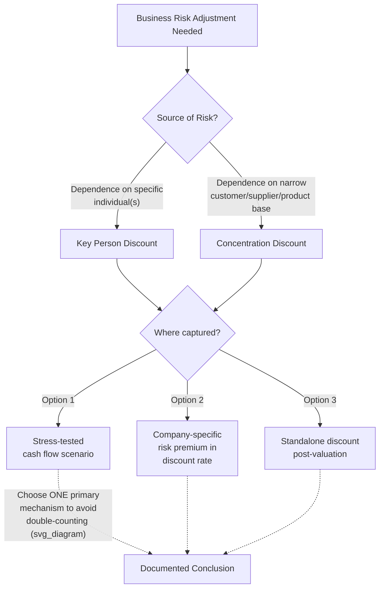

## Key Person and Concentration Discounts

### Overview

Key person and concentration discounts are valuation adjustments applied to reflect elevated risk arising from a business's dependence on a specific individual (key person discount) or its dependence on a narrow base of customers, suppliers, products, or revenue sources (concentration discount). Unlike control-based discounts (DLOC) or marketability-based discounts (DLOM), which address structural attributes of the interest being valued, key person and concentration discounts address fundamental business risk — the vulnerability of future cash flows themselves to a single point of failure — and can in principle apply to a 100% controlling, fully marketable interest.

### Key Person Discount

**Conceptual Foundation**

A key person discount reflects the risk that a business's value is disproportionately dependent on one or a small number of specific individuals — commonly a founder, a rainmaking executive, a technical innovator, or a professional with unique client relationships (e.g., in professional services, medicine, or creative industries) — such that the loss of that person (through death, disability, departure, or retirement) would materially impair the company's future cash flows, customer relationships, institutional knowledge, or strategic direction.

**Where the Risk Should Be Reflected**

Key person risk can theoretically be captured in a valuation in one of several places, and a critical documentation issue is avoiding double-counting across these:

1. **Within the cash flow projections themselves**: Explicitly modeling reduced or more volatile cash flows in scenarios reflecting the key person's departure (e.g., a probability-weighted scenario analysis).
2. **Within the discount rate**: Adding a company-specific risk premium to the WACC or cost of equity to reflect elevated risk from key person dependence (a common approach in small/closely-held business valuation, sometimes as a component of a build-up method).
3. **As a separate, explicit discount applied after the base valuation**: A flat or judgmentally-derived percentage reduction applied to an otherwise-completed valuation conclusion.

[Inference: applying a key person adjustment in more than one of these three places for the same underlying risk — e.g., both stressing cash flows in the DCF for key-person departure scenarios AND adding a separate company-specific risk premium to the discount rate AND then applying an additional standalone key person discount — is a common documentation and methodology error that can compound the risk adjustment beyond what the actual fact pattern supports; a defensible approach isolates the risk in one primary location and documents why the others were not additionally adjusted.]

**Factors Affecting Magnitude**

| Factor | Effect on Key Person Discount |
| --- | --- |
| Depth of management bench / succession planning | Strong succession plan and depth → lower discount |
| Nature of the key person's contribution (relationships vs. replaceable skill) | Irreplaceable personal relationships (e.g., sole rainmaker with client loyalty tied to the individual) → higher discount |
| Existence and adequacy of key person life/disability insurance | Adequate insurance proceeds to fund transition or buyout → can partially offset value impairment, lowering the discount |
| Contractual protections (employment agreements, non-competes, earn-outs tied to retention) | Binding retention agreements or transition periods → lower discount |
| Industry norms | Professional services, entertainment, and founder-led technology businesses → typically higher susceptibility; capital-intensive, process-driven businesses → typically lower susceptibility |
| Age and health of the key person (where relevant and appropriately documented) | Higher perceived risk of near-term departure → higher discount, though this must be handled with care and appropriate sensitivity in any written analysis |

**Estimation Approaches**

- **Scenario/probability-weighted DCF**: Model a "key person departs" scenario with reduced growth, margin compression, or customer attrition, weight it by an estimated probability, and blend with a "key person remains" base case — the value differential is the implicit key person discount.
- **Empirical/survey-based percentage discounts**: Some valuation literature and court cases reference discount ranges for specific fact patterns (e.g., a professional practice heavily dependent on one practitioner), though [Unverified: any specific numerical range attributed generally to "key person discounts" in practitioner literature varies considerably by industry, case, and source, and should not be treated as a universal benchmark without verification against the specific context and any authoritative source cited].
- **Cost-to-replace approach**: Estimating the cost and time required to recruit, hire, and train a replacement, plus the value of business disrupted during the transition period, as a basis for quantifying the discount.

### Concentration Discount

**Conceptual Foundation**

A concentration discount (sometimes discussed as part of a broader "company-specific risk premium") reflects elevated risk when a business's revenue, profit, or operations are heavily dependent on a narrow base — a small number of customers, a single supplier, one product line, one geographic market, or one major contract — such that the loss or disruption of that single element would have an outsized impact on the business relative to a more diversified peer.

**Common Forms of Concentration**

| Type | Example Risk |
| --- | --- |
| Customer concentration | A single customer representing a large share of revenue (e.g., government contractor with one primary agency client) |
| Supplier concentration | Dependence on a sole-source supplier for a critical input, with limited substitution options |
| Product concentration | Reliance on a single product or product line, exposed to obsolescence, patent expiration, or regulatory change |
| Geographic concentration | Revenue concentrated in a single region or country, exposed to localized economic, regulatory, or political risk |
| Contract concentration | Dependence on a single long-term contract (e.g., a government or anchor-tenant agreement) nearing expiration or renewal |

**Where the Risk Should Be Reflected**

As with key person risk, concentration risk can be captured through:

1. Explicit cash flow modeling (e.g., a stress-tested projection reflecting loss of the concentrated customer/supplier/contract at a modeled point in time).
2. A company-specific risk premium added to the discount rate.
3. A standalone discount applied to the base valuation conclusion.

The same double-counting caution applies: analysts should document clearly which single mechanism is being used to capture the concentration risk, rather than layering multiple adjustments for the same underlying exposure.

**Factors Affecting Magnitude**

- Percentage of revenue or profit attributable to the concentrated element, and the trend over time (increasing vs. decreasing concentration).
- Contractual protections — length of remaining contract term, renewal history, switching costs faced by the customer, exclusivity provisions.
- Substitutability — how readily the company could replace the concentrated customer, supplier, or product with alternatives.
- Industry-typical concentration levels — some industries (e.g., certain government contracting, single-tenant real estate, licensing-dependent businesses) have structurally higher typical concentration than others, which can moderate how much a given company's concentration should be discounted relative to its specific peer set.

### Comparative Summary

### Illustrative Example — Key Person Discount

A professional services firm generates $10 million in annual EBITDA, with the founder personally responsible for an estimated 40% of client relationships and new business generation. A base DCF (assuming continuity of current management) yields an enterprise value of $60 million.

An analyst models a probability-weighted scenario: a 15% probability of the founder's departure within the projection period, with a modeled 25% reduction in EBITDA in that scenario due to client attrition and business development disruption, phased in over two years and partially mitigated by an existing non-compete and a two-year transition consulting agreement.

$$V_{adjusted} = (0.85 \times \$60M) + (0.15 \times \$48M) = \$51.0M + \$7.2M = \$58.2M$$

This produces an implicit key person discount of approximately 3% ($(\$60M - \$58.2M)/\$60M$) — notably modest here because of the relatively low departure probability and mitigating contractual protections, illustrating that key person discounts are highly fact-specific rather than a fixed percentage.

### Illustrative Example — Concentration Discount

A manufacturing company derives 45% of revenue from a single customer under a contract with two years remaining and no automatic renewal. A base DCF assuming contract renewal at current terms yields $40 million in enterprise value.

A scenario analysis models a 30% probability of non-renewal at contract expiration, with a resulting 40% revenue decline and associated margin compression in that scenario, versus continuation at current levels in the renewal scenario.

$$V_{adjusted} = (0.70 \times \$40M) + (0.30 \times \$27M) = \$28.0M + \$8.1M = \$36.1M$$

Implicit concentration discount of approximately 9.75% ($(\$40M - \$36.1M)/\$40M$).

### Application Contexts

- **Small and closely held business valuation**: Both discounts are especially common in small business and professional practice valuations, where dependence on a founder-owner and a limited customer base is structurally more likely than in large, diversified enterprises.
- **Buy-sell agreements and shareholder disputes**: Key person and concentration risk often factor into negotiated or litigated valuations where the departing or disputing party's own role in the business is directly at issue.
- **M&A due diligence and purchase price negotiation**: Buyers frequently negotiate purchase price reductions, earn-outs, or escrow holdbacks specifically tied to key person retention or customer concentration risk, effectively implementing a version of these discounts through deal structure rather than a pure valuation percentage.
- **Estate and gift tax valuation**: Where the key person is also the business owner whose estate is being valued, careful analysis is required to avoid conflating normal succession-related value impairment with an inappropriately aggressive standalone discount.

### Common Pitfalls

- **Double or triple-counting the same risk**: Applying a company-specific risk premium in the discount rate, a stress-tested cash flow scenario, and a standalone discount simultaneously for the identical underlying risk factor.
- **Applying a discount without quantitative support**: Asserting "a 15% key person discount is appropriate" without a documented scenario analysis, probability basis, or comparable reference point.
- **Ignoring mitigating factors already in place**: Failing to account for existing key person insurance, employment agreements, non-competes, or transition provisions that would reduce the economic impact of departure.
- **Treating concentration as inherently negative without industry context**: Some industries have structurally high concentration as a normal feature (e.g., anchor tenant retail, prime government contractors with long relationship histories); benchmarking against industry-typical concentration levels, not an idealized fully-diversified peer, produces a more defensible discount.
- **Failing to model the time dimension**: Concentration and key person risks often have a specific trigger point (contract expiration date, founder's stated retirement timeline); a static discount that ignores this timing can misstate both the magnitude and the appropriate present-value impact of the risk.
- **Insufficiently distinguishing business risk discounts from DLOC/DLOM**: Key person and concentration discounts address risk in the underlying cash flows themselves and can apply even to a fully controlling, fully marketable interest; they are conceptually distinct from control- and marketability-based adjustments and should be documented and applied separately, not commingled into a single unexplained blended discount.

**Related Topics**

- Control Premium versus Minority Discount
- Discount for Lack of Control (DLOC)
- Discount for Lack of Marketability (DLOM)
- Company-Specific Risk Premium in the Build-Up Method
- Documenting Key Assumptions and Judgment Calls
- Small Business and Professional Practice Valuation
- Scenario and Probability-Weighted DCF Analysis