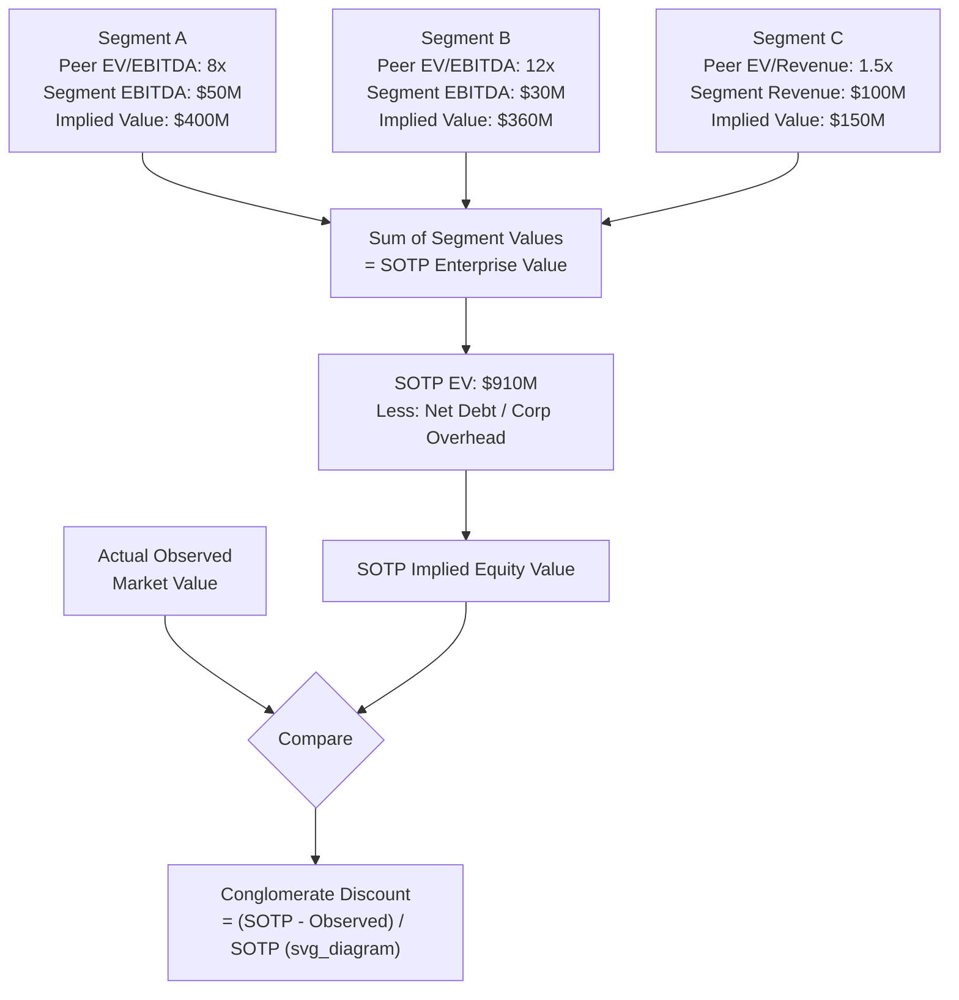

## Conglomerate and Complexity Discounts

### Overview

Conglomerate and complexity discounts refer to the empirically observed and theoretically debated phenomenon in which the market values a multi-segment or structurally complex company at less than the sum of what its individual parts would be worth if valued separately as focused, standalone businesses. This gap between an implied sum-of-the-parts (SOTP) value and the observed or applied consolidated valuation is often termed the "conglomerate discount," while "complexity discount" more broadly captures value impairment from organizational, financial, or disclosure complexity that makes a business harder for outside investors to analyze and value with confidence.

### Conceptual Foundation

**Why a Discount Might Exist (Proposed Explanations)**

1. **Diversification is not valued by shareholders the way it is by managers**: Public market investors can diversify their own portfolios directly and cheaply; a conglomerate diversifying on their behalf via unrelated business segments does not provide unique value and may instead be seen as suboptimal capital allocation, especially if cross-subsidization moves capital from high-return to low-return segments.
2. **Internal capital market inefficiency**: Academic literature (notably work associated with researchers such as Lang and Stulz, and Berger and Ofek in the 1990s) has argued that internal capital allocation within diversified firms can be less efficient than external capital markets, as internal cross-subsidies may support underperforming segments at the expense of the firm's best-performing units.
3. **Agency costs and reduced managerial focus**: Diversified firms may suffer from managers pursuing empire-building (growing the scope of assets under their control, which may correlate with compensation) rather than shareholder value maximization, and from divisional managers competing internally for capital in ways that create rent-seeking rather than optimal allocation.
4. **Analyst coverage and information asymmetry**: Complex, multi-segment companies are often covered by fewer specialized analysts, or by generalist analysts less able to accurately model each segment, leading to a higher information/discount rate premium demanded by investors due to greater perceived uncertainty.
5. **Comparable company mismatch**: Multi-segment companies often lack a clean, single peer group; when investors apply a "lowest common denominator" valuation approach or default to the multiple of the segment they understand best (often ignoring or heavily discounting the value of less-understood segments), the blended result can undervalue the whole relative to a true sum-of-the-parts calculation.

**Counter-Arguments (Conglomerate Premium Literature)**

[Inference: the existence and magnitude of a persistent "conglomerate discount" has been academically debated rather than settled — some later studies have questioned whether the discount reflects genuine value destruction from diversification itself, or instead reflects selection effects (weaker-performing firms being more likely to diversify in the first place) or measurement issues in constructing the imputed standalone segment values used in SOTP comparisons; this remains an area of ongoing academic and practitioner discussion rather than a single settled conclusion, and any specific discount percentage cited in the literature should be treated as time-period- and dataset-specific rather than a stable universal constant.]

### Sum-of-the-Parts (SOTP) Methodology as the Baseline for Measuring the Discount

The conglomerate discount is typically measured as the percentage difference between an SOTP valuation and the company's actual observed market value (for public companies) or the value ascribed in a transaction/valuation exercise:

$$\text{Conglomerate Discount} = \frac{V_{SOTP} - V_{observed}}{V_{SOTP}}$$

**SOTP Construction Steps:**

1. Segment the company into distinct operating divisions based on available disclosure (segment reporting under applicable accounting standards).
2. Identify a relevant peer group of focused, standalone companies for each segment.
3. Apply appropriate valuation multiples (EV/EBITDA, EV/Revenue, P/E as relevant) derived from each segment's peer group to that segment's financial metrics.
4. Sum the segment values to arrive at an implied total enterprise value.
5. Subtract net debt and other non-operating items (allocated at the consolidated level, since debt is typically not segment-specific) to arrive at implied equity value.
6. Compare the SOTP-implied value to the company's actual market capitalization or enterprise value.

### Complexity Discount: Broader Than Pure Diversification

Complexity discounts extend beyond multi-segment conglomerates to any structural feature that raises the cost or difficulty of external analysis, including:

- **Complex corporate structures**: Multiple layers of holding companies, minority stakes in other public or private entities, joint ventures with non-consolidated accounting treatment, or complicated intercompany arrangements.
- **Opaque or non-standard disclosure**: Limited segment-level reporting, non-GAAP metrics that obscure comparability, or frequent one-time/non-recurring adjustments that complicate normalization.
- **Complex capital structures**: Multiple classes of equity with differing voting rights, extensive convertible securities, or complex derivative/hedging positions that are difficult for outside analysts to model.
- **Frequent M&A activity / integration risk**: Serial acquirers with numerous recent acquisitions may carry a discount reflecting integration execution risk and the difficulty of assessing organic versus acquired growth.
- **Cross-border complexity**: Operations spanning many jurisdictions with differing regulatory, tax, and currency regimes, increasing the analytical burden and perceived risk for investors unfamiliar with certain markets.

### Where the Discount Should Be Reflected in a Valuation

As with key person and concentration discounts, complexity/conglomerate discounts can theoretically be incorporated in different places, and documentation should be explicit about which mechanism is used to avoid double-counting:

1. **Directly in the SOTP-to-observed comparison**: Presenting the SOTP value alongside the market-implied discount as an analytical output, useful in an activist investor or breakup-value context, without necessarily "applying" a discount to a DCF.
2. **Via a company-specific risk premium in the discount rate**: Adding a premium to WACC to reflect elevated perceived risk or reduced analyst confidence in a complex, multi-segment entity.
3. **As an explicit percentage discount applied to an SOTP-derived value**: Common in M&A and strategic contexts where an acquirer or activist is evaluating potential breakup value versus current trading value.

### Practical Applications

**1. Activist Investment Thesis Construction**

Activist investors frequently build SOTP analyses to argue that a company's current stock price reflects an unwarranted conglomerate discount, and that a spin-off, divestiture, or breakup would unlock value by allowing each segment to trade at its focused-peer multiple rather than a blended, discounted multiple.

**2. M&A and Divestiture Decision-Making**

Corporate development teams use SOTP analysis to evaluate whether divesting a non-core segment would increase overall shareholder value, weighing the segment's standalone value (potentially at a premium if a strategic buyer would pay more than the public market's implied multiple) against dis-synergies (lost shared services, overhead absorption issues) from separation.

**3. Holding Company Discount (A Related, Overlapping Concept)**

A holding company discount specifically refers to a discount applied when a company's primary value consists of stakes in other publicly traded or private entities — the holding company's own market value often trades below the sum of the market values of its underlying stakes, reflecting some of the same drivers (governance concerns, tax leakage upon monetization, illiquidity of certain stakes, and investor preference for direct exposure to the underlying businesses rather than indirect exposure through a holding structure).

$$\text{Holding Company Discount} = \frac{\text{Sum of Underlying Stake Values} - \text{Holding Company Market Value}}{\text{Sum of Underlying Stake Values}}$$

### Factors Affecting the Magnitude of the Discount

| Factor | Effect on Discount |
| --- | --- |
| Degree of segment relatedness | Segments with genuine operational synergies (shared customers, technology, distribution) → typically smaller observed discount than truly unrelated businesses |
| Quality of segment-level disclosure | Rich, detailed segment reporting → smaller discount (less information asymmetry) |
| Management's capital allocation track record | Strong, disciplined capital allocation history → smaller discount; history of value-destructive acquisitions or cross-subsidization → larger discount |
| Presence of a credible breakup/activist catalyst | Active pressure for restructuring can compress the discount as the market prices in probability of unlock |
| Tax and structural friction to separation | High embedded tax cost or structural complexity in executing a spin-off/divestiture → can sustain a larger persistent discount, since the market may not credit theoretical SOTP value if realizing it is impractical |
| Overall market environment | Discounts often widen during periods when investors favor "pure play" simplicity and narrow during periods of favor for diversified stability, though this relationship is not fixed across all cycles |

### Illustrative Example

A diversified industrial company has three segments:

| Segment | EBITDA | Peer EV/EBITDA Multiple | Implied Segment EV |
| --- | --- | --- | --- |
| Industrial Equipment | $120M | 9.0x | $1,080M |
| Specialty Chemicals | $80M | 11.0x | $880M |
| Consumer Products | $60M | 13.0x | $780M |
| **Total SOTP Enterprise Value** |  |  | **$2,740M** |

Less net debt of $400M and an estimated $50M present value of unallocated corporate overhead drag: implied SOTP equity value of approximately $2,290M.

The company's actual observed market capitalization plus net debt (enterprise value) is $2,100M (after adjusting appropriately for the same net debt figure, actual observed equity value of roughly $1,700M).

$$\text{Discount} = \frac{\$2,740M - \$2,100M}{\$2,740M} \approx 23.4\%$$

This SOTP analysis would form the basis of an activist or corporate development argument that segment separation could unlock meaningful value, subject to execution feasibility and separation costs.

### Common Pitfalls

- **Using inappropriate or too-narrow peer sets for individual segments**: If a true focused peer doesn't exist for a segment, applying a proxy peer group's multiple can introduce significant error into the SOTP calculation, overstating or understating the "true" discount.
- **Ignoring corporate overhead and dis-synergy costs**: A pure sum of segment values without deducting unallocated corporate costs, or without reflecting the dis-synergies (lost shared services, standalone public company costs) that a genuine separation would create, overstates the achievable SOTP value.
- **Treating the full theoretical discount as immediately realizable**: Tax leakage, regulatory approval requirements, and execution risk mean the "unlockable" portion of a conglomerate discount is often meaningfully less than the full calculated gap.
- **Failing to account for genuine operational synergies**: Assuming segments are entirely independent when in fact meaningful cost or revenue synergies exist between them overstates the SOTP value and therefore the implied discount.
- **Static, one-time analysis without tracking discount persistence**: A discount observed at a single point in time may reflect transient market sentiment rather than a structural feature; tracking the discount over multiple periods provides a more reliable signal.
- **Conflating conglomerate discount with other discounts**: Layering a conglomerate/complexity discount on top of DLOC, DLOM, and company-specific risk premiums without clear documentation of which risk each adjustment is meant to capture risks double-counting overlapping concerns (e.g., complexity-driven information asymmetry might already be partly reflected in a higher discount rate).

**Related Topics**

- Sum-of-the-Parts Valuation for Diversified Businesses
- Weighting Valuation Methods by Context
- Key Person and Concentration Discounts
- Company-Specific Risk Premium in the Build-Up Method
- Spin-Off and Divestiture Valuation Analysis
- Holding Company Structures and Discount Dynamics
- Documenting Key Assumptions and Judgment Calls