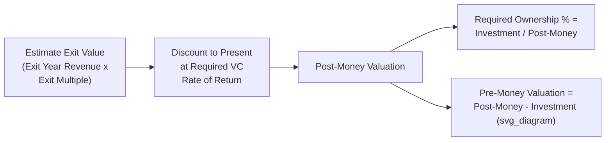

## Venture Capital Method for Startups

### Overview

The Venture Capital (VC) Method is a valuation approach designed specifically for early-stage, pre-revenue or pre-profit companies where traditional DCF and comparable company analysis are unreliable due to the absence of meaningful current cash flows or a clean peer set. Rather than valuing the business based on its current financial state, the method works backward from an estimated future exit value, discounts that value back to the present using a required rate of return that reflects venture-stage risk, and then determines the ownership percentage an investor must receive today to justify the investment.

### Conceptual Foundation

Early-stage startups present valuation challenges that most standard methods cannot handle well:

- No meaningful historical financial track record, and often no revenue or negative operating cash flow for years.
- Extremely high uncertainty in long-term projections, with a wide range of potential outcomes including outright failure.
- Standard DCF terminal value calculations become dominant and speculative when applied to a company with no current earnings base.
- Comparable company analysis is difficult since public comparables are typically much larger and more mature, and private funding round "comparables" reflect negotiated terms rather than pure market pricing.

The VC Method sidesteps these issues by focusing on a single core question that mirrors how venture investors actually think about a deal: "If this company succeeds and is eventually sold or goes public at some estimated future value, what ownership percentage do I need today to earn my required return on this investment?"

### Core Formula and Mechanics

**Step 1 — Estimate Exit (Terminal) Value**

Project the company's value at a future exit event (acquisition or IPO), typically using a revenue or earnings multiple applied to projected financials in the exit year:

$$\text{Exit Value} = \text{Projected Exit Year Revenue (or EBITDA)} \times \text{Assumed Exit Multiple}$$

**Step 2 — Discount Exit Value to Present Value Using a Required Rate of Return**

Unlike a standard WACC-based DCF, venture capital investors apply a much higher required rate of return to compensate for the elevated risk of early-stage failure, illiquidity, and the long expected holding period:

$$\text{Post-Money Valuation (Present)} = \frac{\text{Exit Value}}{(1 + r)^n}$$

Where $r$ is the required annual rate of return (commonly ranging in venture practice from roughly 30% to 70%+ depending on stage, with earlier-stage and higher-risk investments warranting rates toward the higher end) and $n$ is the number of years to the expected exit.

**Step 3 — Determine Required Ownership Percentage**

$$\text{Required Ownership \%} = \frac{\text{Investment Amount}}{\text{Post-Money Valuation}}$$

**Step 4 — Derive Pre-Money Valuation**

$$\text{Pre-Money Valuation} = \text{Post-Money Valuation} - \text{Investment Amount}$$

### Required Rate of Return Benchmarks by Stage

| Investment Stage | Typical Required Rate of Return Range | Rationale |
| --- | --- | --- |
| Seed / Pre-Seed | ~50%-70%+ | Highest risk of complete failure; minimal or no product-market fit validation |
| Series A | ~40%-60% | Product exists, early traction, but scaling and market risk remain high |
| Series B | ~30%-50% | Revenue growth established, but execution and competitive risk remain |
| Series C and later / Growth | ~20%-35% | Business model validated, focus shifts to scaling efficiently |

[Unverified: specific required-return benchmarks by stage vary considerably across practitioner sources, market cycles (venture return expectations compress during periods of abundant capital and expand during downturns), and individual investor/fund return targets; the ranges above reflect commonly discussed practitioner heuristics rather than a fixed, universally agreed standard, and should be cross-checked against current market conditions and the specific fund's stated target returns when used in practice.]

### Illustrative Example

A seed-stage SaaS startup is raising a $2 million investment. The investor's analysis:

- **Exit assumption**: Company is expected to be acquired in Year 5 at $15 million in projected annual revenue.
- **Exit multiple**: 6.0x revenue (based on recent comparable SaaS acquisitions in the sector).
- **Required rate of return**: 50% (seed-stage risk).

**Step 1 — Exit Value:**

$$\text{Exit Value} = \$15M \times 6.0 = \$90M$$

**Step 2 — Present Value (Post-Money Valuation):**

$$\text{Post-Money Valuation} = \frac{\$90M}{(1.50)^5} = \frac{\$90M}{7.59} \approx \$11.86M$$

**Step 3 — Required Ownership Percentage:**

$$\text{Required Ownership \%} = \frac{\$2M}{\$11.86M} \approx 16.9\%$$

**Step 4 — Pre-Money Valuation:**

$$\text{Pre-Money Valuation} = \$11.86M - \$2M = \$9.86M$$

The investor would need approximately 16.9% ownership at a pre-money valuation of roughly $9.86 million to achieve a 50% annualized return, assuming the exit scenario plays out exactly as projected.

### Adjusting for Dilution From Future Financing Rounds

A critical refinement to the basic VC Method accounts for the fact that most startups will raise additional financing rounds before exit, which will dilute the current investor's ownership percentage. Without this adjustment, the method understates the ownership percentage actually required today to achieve the target return net of expected future dilution.

$$\text{Retention Ratio} = \prod_{i=1}^{k} (1 - \text{Dilution}_i)$$

$$\text{Required Ownership \% (Today, Dilution-Adjusted)} = \frac{\text{Required Ownership \% (Undiluted)}}{\text{Retention Ratio}}$$

**Example continued:** If the company is expected to raise two additional rounds before exit, each diluting existing shareholders by approximately 20%:

$$\text{Retention Ratio} = (1 - 0.20) \times (1 - 0.20) = 0.80 \times 0.80 = 0.64$$

$$\text{Dilution-Adjusted Required Ownership \%} = \frac{16.9\%}{0.64} \approx 26.4\%$$

This dilution-adjusted figure reflects the ownership percentage the investor must negotiate for today to still hold approximately 16.9% at exit after subsequent rounds dilute their stake, which in turn implies a lower pre-money valuation than the undiluted calculation would suggest.

### Incorporating Failure/Probability-Weighted Scenarios (Extended VC Method)

A more sophisticated variant explicitly models multiple exit scenarios (including failure/total loss) with assigned probabilities, rather than relying on a single deterministic exit value combined with a very high discount rate to implicitly capture failure risk:

| Scenario | Probability | Exit Value | Probability-Weighted Value |
| --- | --- | --- | --- |
| Total failure (shutdown) | 40% | $0 | $0 |
| Modest exit (acqui-hire or small sale) | 30% | $5M | $1.5M |
| Successful exit (as modeled above) | 25% | $90M | $22.5M |
| Exceptional outcome (breakout success) | 5% | $300M | $15M |
| **Expected Exit Value** | 100% |  | **$39.0M** |

This expected exit value can then be discounted at a *lower*, more standard risk-adjusted rate (since failure risk is now explicitly modeled in the probability weighting rather than embedded in an inflated discount rate), avoiding the conceptual issue of using a single required-return rate to simultaneously compensate for both time value of money and binary failure risk. [Inference: this scenario-based approach is generally considered more analytically rigorous than the single-point deterministic VC Method, since it separates the "risk of complete loss" (captured via probability weighting) from the "cost of capital for a successful outcome" (captured via the discount rate), though it requires the analyst to construct credible scenario probabilities and exit values, which themselves carry substantial estimation uncertainty at the early stage where this method is most commonly applied.]

### Relationship to Cap Table Mechanics and Option Pool Considerations

**Option Pool Shuffle**

Venture investors frequently require an option pool (for future employee equity grants) to be created or expanded *before* the new investment, with the dilution from the pool expansion borne entirely by existing shareholders (founders and prior investors) rather than the new investor. This effectively lowers the true founder-effective pre-money valuation relative to the headline pre-money figure quoted in a term sheet.

$$\text{Effective Pre-Money (Founder Perspective)} = \text{Headline Pre-Money} - \text{Value of Option Pool Created}$$

**Post-Money Ownership Table Construction**

A full cap table analysis following a VC Method-derived valuation should explicitly show: founder ownership before the round, option pool size and timing of creation, new investor ownership, and any conversion of prior convertible notes or SAFEs (Simple Agreements for Future Equity) into the new round, since SAFEs and notes with valuation caps or discounts can materially affect the actual ownership percentages that result from a given pre-money valuation.

### Application Contexts

- **Seed and early-stage venture capital investment decisions**: The primary and originating use case for the method.
- **Angel investor valuation negotiations**: Used in simplified form by individual angel investors, often with less rigorous scenario modeling than institutional VC funds.
- **Convertible note and SAFE valuation cap setting**: Founders and investors use VC Method logic to inform the valuation cap set in convertible instruments, even though the instrument itself defers setting a fixed valuation until a future priced round.
- **Down-round and bridge financing analysis**: Used to assess whether a company's diminished prospects justify a lower valuation in a subsequent financing round relative to the exit assumptions underlying the prior round's VC Method analysis.

### Common Pitfalls

- **Ignoring future dilution**: Calculating required ownership today without adjusting for dilution from future financing rounds systematically understates the ownership percentage (and overstates the achievable pre-money valuation) needed to hit the target return.
- **Using an unrealistically high exit multiple or exit value without comparable support**: Exit assumptions should be grounded in observed acquisition or IPO multiples for genuinely comparable companies at a similar scale and growth profile, not aspirational figures.
- **Double-counting risk in both the discount rate and the exit assumption**: If the exit value projection already reflects a conservative, risk-adjusted revenue and multiple assumption, applying an extremely high discount rate on top may excessively compound the risk adjustment; the scenario-based/probability-weighted variant is designed to address exactly this tension more transparently.
- **Treating the required rate of return as a fixed, universal number**: Required returns vary by fund strategy, vintage, market conditions, and specific deal risk; applying a generic "VCs want 10x" heuristic without stage- and context-specific calibration produces unreliable results.
- **Overlooking the option pool shuffle's effect on true founder dilution**: Failing to account for pre-round option pool expansion can lead founders to significantly misunderstand their actual post-financing ownership percentage relative to the headline pre-money valuation.
- **Applying the method to companies with meaningful current cash flows**: Once a company has reached a stage with reasonably predictable near-term cash flows, standard DCF and comparable company methods generally become more appropriate and reliable than the VC Method's exit-multiple-driven approach.

**Related Topics**

- Adjustments for Private Company Valuation
- SAFE and Convertible Note Valuation Mechanics
- Cap Table Modeling and Liquidation Preference Waterfalls
- Sum-of-the-Parts Valuation for Diversified Businesses
- Scenario and Probability-Weighted DCF Analysis
- Discount for Lack of Marketability (DLOM)
- Exit Multiple Selection and Precedent Transaction Benchmarking