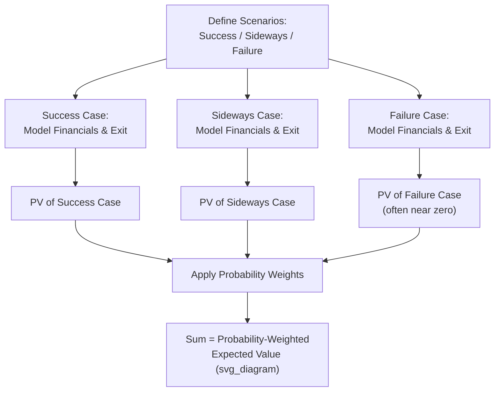

## First Chicago Scenario-Weighted Method

### Overview

The First Chicago Method (also called the First Chicago Approach or Scenario-Weighted Valuation Method) is a venture capital and private equity valuation technique that explicitly models multiple discrete future outcome scenarios — typically a success case, a moderate/sideways case, and a failure case — assigns a probability to each, values the company under each scenario separately (often using a DCF or exit-multiple approach within each scenario), and combines the scenario values into a single probability-weighted expected value. It was developed at First Chicago Corporation's venture capital division and is widely used as a more analytically explicit alternative or complement to the single-point Venture Capital Method for valuing early-stage and high-uncertainty companies.

### Conceptual Foundation

The method directly addresses a core limitation of both standard DCF (which produces a single deterministic value based on one set of assumptions) and the basic Venture Capital Method (which compresses failure risk and time-value-of-money into a single, often very high, discount rate). Instead of forcing all uncertainty into one blended assumption set or one inflated discount rate, the First Chicago Method makes the uncertainty explicit by constructing genuinely distinct scenarios with different operational and financial trajectories, each valued on its own terms, and then combining them with probability weights that reflect the analyst's or investor's judgment about likelihood.

This approach is particularly suited to companies with genuinely bimodal or multi-modal outcome distributions — a common feature of early-stage ventures, where the realistic range of outcomes spans from complete failure to a modest acquisition to a breakout success, rather than a smooth, continuous distribution around a single expected trajectory.

### Standard Scenario Structure

While the number of scenarios can vary, the method is most commonly implemented with three:

| Scenario | Description | Typical Characteristics |
| --- | --- | --- |
| **Success Case** | The company executes its business plan effectively, achieves strong growth, and reaches a favorable exit | Highest revenue/earnings trajectory, most favorable exit multiple, often modeled closest to management's own projections |
| **Sideways/Survival Case** | The company survives but underperforms its original plan — slower growth, margin pressure, or a smaller/less favorable exit | Moderate revenue trajectory, lower exit multiple, may include additional dilutive financing rounds |
| **Failure Case** | The company fails to achieve viability and is liquidated, sold for minimal value, or shut down entirely | Near-zero or zero terminal value, reflecting loss of most or all invested capital |

Some practitioners extend this to four or five scenarios (e.g., separating a "modest success" from a "breakout success" case) for additional granularity, particularly for companies where the upside case itself has wide variance.

### Core Calculation Framework

**Step 1 — Define Distinct Scenarios**

For each scenario, construct an internally consistent set of operating assumptions: revenue growth trajectory, margin profile, capital requirements, and expected exit timing and method (IPO, strategic acquisition, secondary sale, liquidation).

**Step 2 — Value Each Scenario Independently**

Each scenario's terminal/exit value is typically derived using an appropriate method for that scenario's characteristics (e.g., a revenue or EBITDA multiple applied to the scenario's exit-year financials, or a full DCF within the scenario for a more mature success case), then discounted to present value.

$$PV_i = \frac{\text{Exit Value}_i}{(1 + r)^{n_i}}$$

Where $r$ is a discount rate appropriate to the risk of achieving that specific scenario (which can, and often should, differ across scenarios — a success case that has already de-risked key milestones may warrant a lower discount rate than the same company's failure-path timeline) and $n_i$ is the number of years to that scenario's exit event.

**Step 3 — Assign Probabilities to Each Scenario**

Probabilities should sum to 100% and reflect the analyst's or investor's genuine judgment about likelihood, ideally informed by comparable company outcome data, the specific company's execution risk profile, and the stage of development.

**Step 4 — Calculate Probability-Weighted Expected Value**

$$V_{expected} = \sum_{i=1}^{n} P_i \times PV_i$$

### Illustrative Example

A Series A software company is being valued by an investor considering a $4 million investment.

**Scenario 1 — Success Case (Probability: 25%)**

- Exit in Year 6 at $40 million in revenue, 7.0x revenue multiple → Exit Value = $280 million.
- Discount rate: 35% (still elevated but lower than an undifferentiated blended VC rate, since this scenario assumes successful execution).

$$PV_{success} = \frac{\$280M}{(1.35)^6} = \frac{\$280M}{6.05} \approx \$46.3M$$

**Scenario 2 — Sideways Case (Probability: 45%)**

- Modest growth, acquired in Year 5 at $8 million in revenue, 3.0x revenue multiple → Exit Value = $24 million.
- Discount rate: 40%.

$$PV_{sideways} = \frac{\$24M}{(1.40)^5} = \frac{\$24M}{5.38} \approx \$4.46M$$

**Scenario 3 — Failure Case (Probability: 30%)**

- Company fails to reach product-market fit and shuts down in Year 3, returning minimal liquidation value.
- Exit Value ≈ $0.5 million (residual asset value); discount rate: 40%.

$$PV_{failure} = \frac{\$0.5M}{(1.40)^3} \approx \$0.18M$$

**Probability-Weighted Expected Value:**

| Scenario | Probability | PV of Exit Value | Weighted Contribution |
| --- | --- | --- | --- |
| Success | 25% | $46.3M | $11.58M |
| Sideways | 45% | $4.46M | $2.01M |
| Failure | 30% | $0.18M | $0.05M |
| **Total Expected Value** | 100% |  | **$13.64M** |

This $13.64 million represents the post-money valuation basis under the First Chicago approach. Required ownership for the $4 million investment:

$$\text{Required Ownership \%} = \frac{\$4M}{\$13.64M} \approx 29.3\%$$

### Key Advantages Over the Basic Venture Capital Method

- **Separates failure risk from time-value discounting**: Rather than compressing binary failure risk into an inflated single discount rate, failure is modeled as its own explicit scenario with its own (typically low or near-zero) value and assigned probability, allowing the discount rate applied to the surviving scenarios to more reasonably reflect only the risk and time value relevant to those paths.
- **Forces explicit articulation of the range of outcomes**: Requires the analyst and management to genuinely think through what a "bad but not catastrophic" outcome looks like, not just best-case and worst-case extremes, which often surfaces important business risks and assumptions that a single-point projection would obscure.
- **More transparent and easier to stress-test**: Because each scenario's assumptions and probability are explicit and separately visible, sensitivity analysis (e.g., "what if the success probability is 15% rather than 25%?") is more direct than adjusting a single blended discount rate in the basic VC Method.
- **Facilitates more productive investor-management dialogue**: Presenting explicit scenarios can help align investor and founder expectations by making disagreements about probability or scenario definition explicit and discussable, rather than buried in a single contested discount rate assumption.

### Selecting Discount Rates Across Scenarios

A frequently debated methodological question is whether to use the same discount rate across all scenarios or to vary it by scenario:

- **Uniform discount rate approach**: Simpler to implement and communicate; applies one required-return rate (reflecting general venture-stage risk and illiquidity) across all scenario present value calculations, letting the probability weighting alone capture differential scenario risk.
- **Scenario-specific discount rate approach**: More theoretically precise but harder to defend with precision; argues that different scenarios carry different residual risk even after conditioning on that scenario occurring (e.g., a failure scenario's near-term, more certain liquidation value might reasonably use a lower discount rate than a success scenario's more distant, still-uncertain exit).

[Inference: there is no single universally agreed convention on this point in practitioner literature; the choice often depends on the specific valuation's purpose and the level of analytical rigor the audience expects, with many practical applications defaulting to a uniform or near-uniform discount rate for simplicity and ease of explanation, while more rigorous institutional analyses may vary rates by scenario.]

### Incorporating Multiple Financing Rounds Within Scenarios

Each scenario can and often should model a distinct financing path — a success-case company may raise fewer, larger rounds at increasing valuations, while a sideways-case company may require additional bridge financing at flat or down valuations — with corresponding dilution effects on the current investor's ultimate ownership percentage at exit, analogous to the dilution adjustment discussed in the basic Venture Capital Method but applied separately within each scenario's specific financing trajectory.

### Application Contexts

- **Venture capital and growth equity investment valuation**: The primary use case, particularly for later-seed through growth-stage rounds where enough operating history exists to construct credible differentiated scenarios (as opposed to the earliest pre-seed stage, where the basic VC Method's simplicity may be more practical given limited information to differentiate scenarios meaningfully).
- **Fairness opinions for early-stage or high-uncertainty companies**: Provides a more defensible, transparent analytical framework than a single-point DCF when a company's outcome genuinely depends on discrete, identifiable contingencies (e.g., regulatory approval, a binary clinical trial result in biotech, a major contract award).
- **Contingent value rights (CVR) and earn-out structuring in M&A**: The scenario-weighting logic underlies the valuation of contingent consideration structures, where payment depends on achieving specific future milestones.
- **Biotech and pharmaceutical valuation**: Particularly well-suited to industries with genuinely binary technical/regulatory outcomes (e.g., FDA approval success/failure), where scenario probabilities can sometimes be informed by historical clinical trial phase-transition success rate data.

### Common Pitfalls

- **Insufficient differentiation between scenarios**: Constructing scenarios that differ only modestly in growth rate assumptions, rather than genuinely distinct operational and strategic paths, undermines the method's core purpose and can produce a result not meaningfully different from a single-point DCF with a blended growth rate.
- **Unsupported or arbitrary probability assignments**: Assigning probabilities without a documented basis (comparable company outcome base rates, specific company milestones, expert/industry judgment) invites the same scrutiny as any undocumented assumption.
- **Failing to include a genuine failure/downside scenario**: Omitting or under-weighting a realistic failure case (common when management-provided projections are used as the sole "success case" basis) systematically overstates the expected value.
- **Double-counting risk between discount rate and probability weighting**: If scenario-specific discount rates already embed significant risk premiums, and probabilities are also conservatively assigned to reflect the same risks, the combined effect can overstate the total risk adjustment applied.
- **Static, one-time scenario construction**: Scenarios and probabilities should be revisited as new information emerges (e.g., after a key product milestone or regulatory decision), since the method's value lies partly in its ability to be updated transparently as uncertainty resolves.
- **Overcomplicating with too many scenarios**: Adding numerous scenarios without materially distinct assumptions or without sufficient basis to differentiate their probabilities can create false precision and analytical complexity without corresponding insight.

**Related Topics**

- Venture Capital Method for Startups
- Scenario and Probability-Weighted DCF Analysis
- Adjustments for Private Company Valuation
- Contingent Value Rights and Earn-Out Structuring
- SAFE and Convertible Note Valuation Mechanics
- Biotech and Pharmaceutical Valuation Methodologies
- Documenting Key Assumptions and Judgment Calls