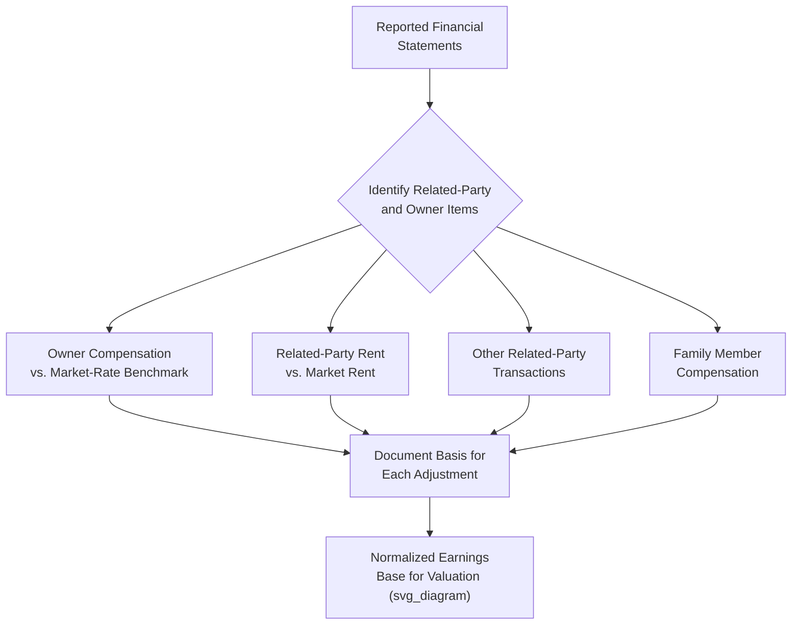

## Normalizing Owner Compensation and Related-Party Items

### Overview

Normalizing owner compensation and related-party items is the process of adjusting a private company's reported financial statements to reflect what its earnings would be under arm's-length, market-based terms, removing distortions introduced by an owner's discretionary control over their own pay and over transactions with entities they also control. Because private company owners set their own compensation and often engage in transactions with affiliated entities without the arm's-length discipline imposed by public company governance, reported EBITDA or net income frequently overstates or understates the company's true, sustainable economic earning power. This normalization is a foundational step in nearly every private company valuation, since downstream multiples, discount rate applications, and comparability to peer benchmarks all depend on starting from an economically accurate earnings base.

### Why Normalization Is Necessary

Public companies set executive compensation through independent boards and compensation committees, subject to disclosure requirements and shareholder oversight (say-on-pay votes, proxy disclosure). Private companies, particularly owner-operated businesses, lack this discipline:

- An owner may pay themselves significantly above market rate to extract value in a tax-efficient form (compensation is deductible to the business, unlike dividends).
- Conversely, an owner may pay themselves below market rate, reinvesting the difference in the business or simply not needing to draw a full market salary, which understates the true cost of replacing that role with a market-rate hire.
- Family members may be employed at above-market salaries, or may hold nominal positions with little actual working responsibility.
- The business may lease real estate, equipment, or other assets from an entity the owner also controls, at rates that do not reflect independent market pricing.
- The business may buy from or sell to other owner-controlled entities at non-arm's-length prices for tax planning, cash management, or estate planning purposes.

A valuation that fails to correct for these distortions will misstate the earnings base to which multiples are applied, or misstate the cash flows discounted in a DCF — an error that compounds directly into the final valuation conclusion.

### Owner Compensation Normalization

**Core Methodology**

$$\text{Normalized EBITDA} = \text{Reported EBITDA} + \text{Owner Compensation (Reported)} - \text{Market-Rate Compensation for the Role}$$

**Determining Market-Rate Compensation**

The critical, judgment-intensive step is establishing what a market-rate, arm's-length replacement would actually cost. Common approaches include:

- **Compensation survey data**: Industry- and role-specific compensation surveys (e.g., data from sources tracking executive and management compensation by industry, company size, and geography) provide a benchmark range for the specific role(s) the owner performs.
- **Multiple-role decomposition**: Owners of small businesses frequently perform several distinct functions simultaneously (CEO, sales lead, head of operations); market-rate compensation should reflect the aggregate cost of replacing all these functions, which may require more than one hire, or a combination of a general manager plus specific specialized roles.
- **Comparable company disclosed compensation**: Where available, disclosed executive compensation from comparable public companies (adjusted for scale) can serve as a cross-check, though scale differences typically require significant downward adjustment for a much smaller private company.

**Handling Multiple Owner-Employees**

Where more than one owner draws compensation from the business, each individual's role and market-rate replacement cost should be assessed separately rather than treating aggregate owner compensation as a single blended figure, since roles, time commitment, and market-rate value can differ substantially between owners.

**Documentation Standard**

Because owner compensation add-backs are among the most frequently disputed and scrutinized adjustments in both transaction and litigation contexts, documentation should specify:

- The owner's actual duties and approximate time allocation across those duties.
- The specific market compensation benchmark source and rationale for the figure selected.
- Whether the adjustment also requires accounting for associated payroll taxes, benefits, and other employment costs that would be incurred to replace the owner (often overlooked, understating the true cost of replacement).

### Related-Party Real Estate and Lease Adjustments

**Common Structure**

A frequent private business structure involves the operating company leasing its facility from a separate real estate holding entity owned by the same individual(s) — often for legitimate tax, liability-isolation, and estate planning reasons, but one that requires careful normalization for valuation purposes.

**Normalization Approach**

$$\text{Adjusted EBITDA} = \text{Reported EBITDA} + (\text{Actual Rent Paid} - \text{Market Rent})$$

If the operating company pays above-market rent to the affiliated real estate entity, EBITDA should be increased by the excess (since a new owner would not need to pay above-market rates, or the real estate could be independently negotiated or acquired at market terms). Conversely, if below-market rent is paid, EBITDA should be decreased to reflect the true, sustainable occupancy cost a new owner or a going-concern independent operator would actually incur.

**Establishing Market Rent**

- Independent real estate appraisal or broker opinion of market lease rates for comparable space in the same market.
- Comparable lease rate data for similar property type, size, location, and lease terms (triple-net vs. gross lease structure affects comparability).

**Valuation Treatment of the Real Estate Itself**

A related consideration: if the valuation is intended to capture the total value available to the owner (operating business plus real estate), the real estate holding entity may need to be separately valued and added to the adjusted operating business value, rather than simply normalizing the rent expense and ignoring the real estate asset's own value — the correct treatment depends on the specific scope and purpose of the valuation engagement (e.g., whether the real estate is included in the transaction or valuation subject).

### Other Related-Party Transaction Adjustments

**1. Intercompany Sales and Purchases**

Where the operating business buys from or sells to another entity under common ownership (e.g., a supplier or distributor also owned by the same family), pricing should be tested against arm's-length market comparables, with adjustments made to normalize gross margin to what would be achieved in a genuinely independent transaction.

**2. Shared Services and Overhead Allocation**

Where administrative, accounting, or management services are shared across multiple commonly-owned entities, costs should be allocated on a reasonable, documented basis reflecting actual usage, rather than arbitrarily assigned in a way that shifts costs to minimize the apparent profitability of the entity being valued (or, conversely, to inflate it).

**3. Intercompany Loans and Guarantees**

- Loans between the subject company and affiliated entities should be evaluated for arm's-length interest rates; below-market or interest-free related-party loans can distort both the income statement (interest expense/income) and the balance sheet (whether the loan should be treated as a genuine liability/asset or reclassified as a capital contribution/distribution).
- Guarantees provided by the subject company for affiliated entity debt represent contingent liabilities that may require separate disclosure and, in some cases, valuation consideration even though they may not appear directly on the balance sheet.

**4. Family Member Employment**

Salaries paid to family members who are not actively working, or who are compensated above what an unrelated employee performing the same role would receive, should be normalized similarly to owner compensation — added back to the extent they exceed market rate for actual work performed, with the reasonable market-rate portion (for those genuinely working) retained as a legitimate operating expense.

### Distinguishing Legitimate Add-Backs From Aggressive Reclassification

A central discipline in this area is maintaining a clear, defensible line between genuine normalization and inappropriate earnings inflation:

| Legitimate Add-Back | Questionable/Aggressive Add-Back |
| --- | --- |
| Owner compensation clearly and demonstrably above documented market-rate benchmarks for the specific role | Vague assertions that "the owner is overpaid" without a specific market benchmark or role analysis |
| Above-market related-party rent supported by an independent appraisal or comparable lease data | Rent adjustments based solely on the owner's own assertion of what market rent "should" be |
| Clearly one-time, non-recurring items with a specific identifiable cause (e.g., a single lawsuit settlement) | Recurring costs mischaracterized as "one-time" because they happen to vary year to year (e.g., ongoing warranty claims in a business where this is a normal, recurring cost of operations) |
| Personal expenses clearly unrelated to business operations, documented with supporting detail | Broad, unsupported "discretionary expense" add-backs applied as a blanket percentage of revenue without item-level support |

### Illustrative Consolidated Example

| Item | Reported | Adjustment | Basis for Adjustment | Normalized |
| --- | --- | --- | --- | --- |
| EBITDA | $2,800,000 |  |  |  |
| Owner salary/bonus | (included above) | +$350,000 | Owner draws $450K; market-rate GM benchmark for this size/industry is $100K, based on industry compensation survey data |  |
| Related-party rent | (included above) | +$90,000 | Company pays $240K/year to owner's real estate LLC; independent broker opinion indicates market rent of $150K/year for comparable space |  |
| Spouse salary (non-working) | (included above) | +$65,000 | Spouse listed as "marketing consultant" with no documented work product or time records |  |
| One-time legal settlement | (included above) | +$120,000 | Single, non-recurring litigation matter unrelated to ongoing operations, confirmed via legal counsel correspondence |  |
| **Normalized EBITDA** |  |  |  | **$3,425,000** |

This normalized figure, not the reported $2,800,000, is the appropriate base to which market-derived multiples should be applied, and represents an approximate 22% increase in the earnings base used for valuation purposes — illustrating how material these adjustments can be to the final conclusion.

### Application Contexts

- **M&A transactions**: Buyers and sellers routinely negotiate over the legitimacy and magnitude of proposed add-backs in a Quality of Earnings (QoE) analysis, making this one of the most commercially consequential normalization exercises in a deal process.
- **Estate and gift tax valuation**: Tax authorities scrutinize owner compensation normalization closely, since aggressive add-backs that inflate value could be seen as inconsistent with a taxpayer's simultaneous position (in a different context) that compensation was reasonable and not disguised profit distribution.
- **Shareholder disputes and divorce proceedings**: Disputes over a business's value for marital property division or minority shareholder buyout frequently turn substantially on disagreements about appropriate owner compensation normalization, given the direct and often adversarial financial stakes for the parties involved.
- **Bank and SBA lending underwriting**: Lenders normalize owner compensation and related-party items when assessing a business's debt service capacity, using a similar (though sometimes more conservative) normalization methodology to the one used in valuation.

### Common Pitfalls

- **Applying a blanket percentage add-back without item-level documentation**: Undermines credibility and invites rejection of the adjustment entirely in a negotiated or litigated context.
- **Failing to account for payroll taxes and benefits in the market-rate replacement cost**: Understates the true cost of replacing an owner, since a market-rate hire also incurs employer payroll tax, benefits, and other employment costs beyond base salary.
- **Ignoring the time-commitment dimension**: Assuming a full-time market-rate salary is the correct benchmark when an owner in fact works part-time, or conversely failing to capture the full value of multiple roles an owner performs simultaneously.
- **One-sided normalization**: Normalizing owner compensation upward (add-back) when overpaid, but failing to apply the equivalent downward normalization in the less common but real scenario where an owner is underpaid relative to market.
- **Overlooking related-party items beyond compensation and rent**: Failing to examine intercompany pricing, shared service allocations, and intercompany loans can leave material distortions in the earnings base unaddressed.
- **Treating all related-party rent as automatically requiring adjustment**: If the related-party lease is already at a documented, defensible market rate, no adjustment is needed — assuming an adjustment is required simply because a related-party relationship exists, without actually testing the rate against the market, is itself an analytical error.

**Related Topics**

- Adjustments for Private Company Valuation
- Key Person and Concentration Discounts
- Quality of Earnings Analysis in M&A Due Diligence
- Company-Specific Risk Premium in the Build-Up Method
- Buy-Sell Agreement Valuation Mechanisms
- Small Business and Professional Practice Valuation
- Documenting Key Assumptions and Judgment Calls