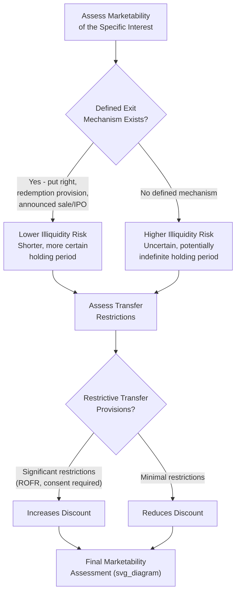

## Illiquidity and Marketability Considerations

### Overview

Illiquidity and marketability considerations encompass the broader set of analytical issues surrounding how the inability to quickly and cheaply convert an equity interest into cash affects its value, extending beyond the specific numerical Discount for Lack of Marketability (DLOM) calculation into the underlying drivers, contextual factors, and practical valuation implications of illiquidity across private companies, early-stage ventures, and restricted or non-tradable interests generally. While DLOM is the quantification mechanism, illiquidity and marketability considerations address the full analytical framework: what makes an interest illiquid, how illiquidity risk should be identified and assessed, and how it interacts with the many other adjustments already present in a private or early-stage company valuation.

### Conceptual Foundation: Marketability as a Spectrum, Not a Binary

Marketability exists on a continuum rather than as a simple public/private binary:

| Position on Spectrum | Example | Relative Marketability |
| --- | --- | --- |
| Highest | Actively traded large-cap public stock | Can be sold within seconds at a known, quoted price |
| High | Actively traded small-cap public stock | Tradable but potentially subject to wider bid-ask spreads and price impact for larger trades |
| Moderate | Restricted public stock (subject to a defined holding period) | Tradable after a known, finite restriction period |
| Low | Private company minority interest with an active buy-sell market or right of first refusal mechanism | Some pathway to liquidity exists but is slower, less certain, and less transparent than public markets |
| Very Low | Private company minority interest with no defined exit mechanism or buyer pool | No clear pathway to liquidity absent a triggering event (company sale, IPO, negotiated buyout) |
| Lowest | Illiquid interest in a distressed or wind-down entity | Effectively no functioning market; realization depends entirely on liquidation proceedings |

Recognizing where a specific interest falls on this spectrum — rather than applying a generic private-company discount — is central to a defensible marketability analysis.

### Key Drivers of Illiquidity Risk

**1. Absence of a Ready Market**

The most fundamental driver: no continuous, transparent market exists where the interest can be sold at a known price without extended search and negotiation costs. This is the baseline condition distinguishing any private interest from a public security.

**2. Uncertain and Potentially Long Holding Period**

Unlike a restricted public stock with a defined, finite holding period after which trading becomes possible, many private company interests have no defined liquidity event timeline at all — the holder may need to wait for a company sale, IPO, or negotiated buyback that could occur in one year or might never occur, and this uncertainty itself compounds the illiquidity risk beyond what a purely time-based discount would capture.

**3. Transfer Restrictions in Governing Documents**

Shareholder agreements, operating agreements, and buy-sell agreements frequently impose explicit transfer restrictions: rights of first refusal (requiring the holder to first offer the interest to other owners or the company before selling to a third party), consent requirements (requiring board or majority approval for any transfer), or outright prohibitions on transfer to non-family members or non-employees in closely held or family businesses.

**4. Limited Pool of Potential Buyers**

Private company interests, particularly minority stakes, have a structurally smaller potential buyer universe than public securities — most rational buyers for a minority, non-controlling stake in a private company are limited to existing shareholders, the company itself (via redemption), or specialized secondary market participants, none of which provide the broad, competitive buyer pool of a public exchange.

**5. Information Asymmetry and Due Diligence Burden**

Private companies typically lack the standardized, audited, publicly available disclosure of public companies; a prospective buyer of a private interest must undertake costly, time-consuming due diligence, which itself extends the realistic timeline to sale and adds transaction friction that a public market participant does not face.

**6. Absence of Price Discovery Mechanisms**

Public markets provide continuous price discovery through the interaction of many buyers and sellers; private interests lack this mechanism, meaning any transaction price must be independently negotiated or appraised, adding both cost and uncertainty to any liquidity event.

### Company-Specific Factors Mitigating or Aggravating Illiquidity Risk

| Factor | Effect on Illiquidity Risk |
| --- | --- |
| Regular dividend/distribution policy | Reduces effective illiquidity impact, since the holder receives interim economic benefit even without a sale |
| Contractual put rights or mandatory redemption provisions | Materially reduces illiquidity risk by providing a defined, enforceable exit mechanism |
| Active internal market (e.g., regular company-sponsored tender offers, common in some employee-owned companies) | Reduces illiquidity risk relative to a company with no such mechanism |
| Clear, credible path to a near-term liquidity event (announced sale process, filed IPO registration) | Reduces illiquidity risk and the associated discount as the timeline to realization shortens and becomes more certain |
| Highly restrictive transfer provisions with no defined buyout mechanism | Increases illiquidity risk |
| Company in financial distress or facing going-concern uncertainty | Increases illiquidity risk, since even a willing buyer pool shrinks further when the underlying business's viability is in question |
| Large block size relative to the realistic buyer pool's capacity | Can increase illiquidity risk/discount, since even interested buyers may be unable or unwilling to absorb an unusually large position |

### Interaction With Early-Stage and Venture-Backed Company Valuation

Illiquidity considerations take on particular importance in early-stage and venture-backed contexts, distinct from more general private company marketability analysis:

- **Extended and highly uncertain time-to-liquidity**: Startups may take many years longer than initially projected to reach an exit event, or may never reach one, making the holding period assumption underlying any option-pricing-based DLOM estimate especially speculative.
- **Layered illiquidity across financing rounds**: Earlier-round investors (seed, Series A) often face longer expected holding periods than later-round investors (Series C, D) investing closer to an anticipated exit, suggesting that a uniform marketability discount across all round participants may not appropriately reflect each cohort's actual illiquidity exposure.
- **Secondary market development**: The emergence of private secondary marketplaces for venture-backed company shares (allowing existing shareholders, particularly employees, to sell some portion of their holdings before a formal exit) has, in certain well-known, highly sought-after private companies, meaningfully reduced effective illiquidity relative to a company with no such secondary activity — though [Unverified: the breadth, pricing efficiency, and general availability of such secondary markets vary enormously by company profile and are generally far more limited than public market liquidity even for prominent private companies with active secondary interest; this should not be assumed to exist or to be efficient for a given company without specific evidence].
- **Interaction with liquidation preferences**: For venture-backed companies with preferred stock carrying liquidation preferences, the effective marketability and value of common stock or lower-preference securities can be further impaired, since a sale of those instruments requires a buyer to underwrite not just general illiquidity but also the risk of receiving little or nothing after preferred claims are satisfied in a downside outcome.

### Illiquidity Considerations Beyond DLOM: Broader Valuation Implications

**1. Impact on Required Rate of Return / Discount Rate**

Rather than (or sometimes in addition to, if carefully coordinated to avoid double-counting) applying a standalone post-valuation DLOM, illiquidity risk can be embedded directly into the discount rate used in a DCF — particularly common in venture capital and early-stage private company valuation, where elevated required rates of return implicitly compensate investors for illiquidity alongside business and execution risk.

**2. Impact on Portfolio Construction and Diversification Assumptions**

From an investor's perspective, illiquid private holdings cannot be easily rebalanced or exited in response to changing views, which affects the appropriate position sizing and diversification assumptions investors bring to bear — a consideration more relevant to overall portfolio-level investment decision-making than to a single company's intrinsic valuation, but often cited as part of the broader rationale for why investors demand a return premium for illiquid private investments generally (sometimes referred to as an "illiquidity premium" at the asset-class level, distinct from a company-specific DLOM).

**3. Impact on Timing of Valuation Events**

Because private company values are not continuously observable, illiquidity considerations also affect *when* and *how frequently* a private interest should be revalued — annual or event-driven valuations (financing rounds, 409A valuations for stock option pricing purposes, financial reporting fair value measurements) are the norm rather than continuous market pricing, which itself is a consequence of the underlying illiquidity and creates practical challenges around using potentially stale valuation marks for decision-making.

### Illustrative Example: Comparing Illiquidity Profiles

Two minority equity interests, each nominally similar in size and underlying business quality, may warrant different illiquidity treatment based on their specific facts:

| Feature | Interest A | Interest B |
| --- | --- | --- |
| Underlying business | Private manufacturing company, stable cash flows | Private manufacturing company, stable cash flows (same industry/size) |
| Transfer restrictions | Right of first refusal only | Right of first refusal plus board consent requirement plus no transfers to competitors |
| Distribution history | Consistent annual distributions of ~40% of net income | No distributions in past 5 years; all earnings reinvested |
| Defined exit mechanism | Contractual put right exercisable after year 7 | No put right or defined exit mechanism |
| **Resulting Illiquidity Assessment** | Lower relative illiquidity risk | Higher relative illiquidity risk |

Despite similar underlying business fundamentals, Interest B would generally warrant a meaningfully higher marketability discount than Interest A, illustrating why generic industry-based DLOM benchmarks should be adjusted for these specific structural features rather than applied uniformly.

### Application Contexts

- **409A valuations for private company stock option pricing**: U.S. tax-driven valuations of common stock for option grant purposes must explicitly consider marketability, often via option-pricing DLOM models, given regulatory scrutiny of these valuations.
- **Fair value financial reporting**: Under applicable fair value accounting frameworks, illiquid investments held by funds, portfolio companies, or as purchase price allocation intangibles require explicit marketability consideration consistent with the specific standard's market participant assumptions.
- **Estate and gift tax valuation**: As with DLOM broadly, illiquidity is a central and heavily scrutinized issue in valuing closely held business interests and family limited partnership interests for transfer tax purposes.
- **Employee equity compensation valuation**: Valuing restricted stock units, stock options, or other equity compensation in private companies requires explicit marketability consideration, since employees typically cannot sell these interests on any active market prior to a liquidity event.
- **Secondary market and tender offer pricing**: Investors and companies structuring private secondary transactions or tender offers must assess appropriate pricing relative to the most recent priced round, incorporating marketability considerations specific to the transaction structure and timing.

### Common Pitfalls

- **Treating all private interests as having uniform illiquidity**: Applying a generic industry-average or "rule of thumb" discount without assessing the specific interest's transfer restrictions, distribution history, and defined (or absent) exit mechanisms.
- **Ignoring the interaction between illiquidity and control**: Failing to recognize that a controlling interest in a private company, while free of DLOC, still typically carries substantial DLOM since selling an entire private business also takes time, faces a limited buyer pool, and involves significant transaction costs and uncertainty.
- **Overlooking secondary market developments without verifying their actual applicability**: Assuming a private secondary market exists or is efficient for a specific company without confirming actual trading activity, pricing transparency, and volume for that particular company.
- **Double-counting illiquidity in both the discount rate and a standalone DLOM**: As discussed in the DLOM-specific analysis, embedding illiquidity risk in an elevated discount rate while also applying a full separate marketability discount to the resulting value can overstate the combined risk adjustment.
- **Failing to reassess marketability as circumstances change**: A company approaching a credible, announced exit event (filed IPO registration, signed but unclosed acquisition agreement) has a fundamentally different, generally more favorable marketability profile than the same company at an earlier stage with no defined exit in sight, and valuations should be updated to reflect this evolution.
- **Conflating asset-class-level illiquidity premium with company-specific DLOM**: The general return premium investors demand for allocating capital to illiquid asset classes as a portfolio matter is a related but analytically distinct concept from the specific DLOM appropriate to a particular company's specific facts and circumstances.

**Related Topics**

- Discount for Lack of Marketability (DLOM)
- Discount for Lack of Control (DLOC)
- Adjustments for Private Company Valuation
- Venture Capital Method for Startups
- First Chicago Scenario-Weighted Method
- Cap Table Modeling and Liquidation Preference Waterfalls
- 409A Valuations and Stock Option Pricing Standards