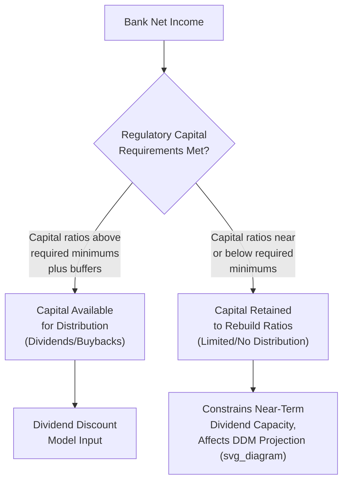

## Valuing Banks and Financial Institutions

### Overview

Valuing banks and financial institutions requires a fundamentally different analytical framework than valuing non-financial corporations, because the conventional tools of corporate valuation — unlevered free cash flow DCF, EV/EBITDA multiples, and enterprise value bridges — do not translate meaningfully to institutions whose core business is the origination, management, and monetization of financial assets and liabilities. For a bank, debt (deposits, borrowings) is a raw material of the operating business rather than a financing choice layered on top of operations, which breaks the standard separation between operating and financing activities that underpins conventional DCF and enterprise value analysis.

### Why Standard Valuation Methods Break Down for Banks

**1. Debt Is Operating, Not Financing**

In a non-financial company, debt is a discretionary financing decision, and enterprise value (which excludes the effect of capital structure) is calculated precisely to normalize across companies with different leverage choices. For a bank, deposits and other interest-bearing liabilities are the fundamental raw material the institution uses to generate revenue (through lending and investing), analogous to inventory or raw materials for a manufacturer — they are not a discretionary financing choice sitting "below the line."

**2. Capital Expenditure and Working Capital Concepts Do Not Apply Meaningfully**

Standard unlevered free cash flow calculations subtract capital expenditures and working capital changes from EBIT-based operating cash flow. For a bank, the analogous concepts — growth in loans, investment securities, and deposits — are themselves the core operating activity, not incidental capital investment, making a conventional unlevered FCF build largely uninformative.

**3. Regulatory Capital Requirements Constrain Cash Flow Availability**

Banks are subject to minimum regulatory capital ratios (e.g., Common Equity Tier 1, Tier 1 Capital, Total Capital ratios under frameworks such as Basel III) that constrain how much capital can be distributed to shareholders versus retained to support balance sheet growth — cash flow available to equity holders is a function of regulatory capital constraints in a way that has no direct analog in most non-financial industries.

### Primary Valuation Approaches for Banks

**1. Dividend Discount Model (DDM)**

Given the difficulty of defining unlevered free cash flow for a bank, the Dividend Discount Model — valuing equity directly as the present value of expected future dividends — is a standard and widely used primary approach, since dividends represent the actual cash flow available to and distributable to equity holders after meeting regulatory capital requirements.

$$V_{equity} = \sum_{t=1}^{n} \frac{D_t}{(1 + k_e)^t} + \frac{TV_n}{(1 + k_e)^n}$$

Where $D_t$ is the projected dividend in period $t$, $k_e$ is the cost of equity, and $TV_n$ is the terminal value (often calculated using a Gordon Growth perpetuity on the terminal-year dividend, or via a terminal price-to-book or price-to-earnings multiple applied to terminal-year book value or earnings).

**2. Excess Return Model / Residual Income Model**

An alternative and closely related approach values equity as the sum of current book value plus the present value of expected future "excess returns" — the amount by which return on equity (ROE) exceeds the cost of equity, applied to the equity base:

$$V_{equity} = BV_0 + \sum_{t=1}^{n} \frac{(ROE_t - k_e) \times BV_{t-1}}{(1 + k_e)^t}$$

This approach is particularly useful for banks because it directly incorporates book value (a meaningful and regulatorily-relevant figure for financial institutions) and explicitly ties value creation to the spread between the bank's actual profitability (ROE) and its cost of capital, rather than requiring a separate unlevered cash flow build.

**3. Price-to-Book (P/B) and Price-to-Tangible-Book Multiples**

Because bank balance sheets consist largely of financial assets and liabilities carried at or near fair value (loans, securities, deposits), book value is a more economically meaningful denominator for banks than for non-financial companies, where book value often diverges significantly from economic value due to unrecorded intangibles, historical cost accounting for fixed assets, and other distortions.

$$P/B = \frac{\text{Market Capitalization}}{\text{Total Common Shareholders' Equity}}$$

$$P/TBV = \frac{\text{Market Capitalization}}{\text{Tangible Common Equity (Equity less Goodwill and Intangibles)}}$$

Price-to-tangible-book is particularly common in bank M&A analysis, since it strips out goodwill and intangibles (often substantial for banks that have grown through acquisition) to focus on the tangible capital base supporting the balance sheet.

**4. Price-to-Earnings (P/E) Multiples**

Standard P/E analysis remains applicable to banks, though care must be taken to normalize earnings for items such as loan loss provisioning volatility, one-time securities gains/losses, and merger-related or restructuring charges that can distort a single period's reported earnings relative to a normalized run-rate.

**5. Precedent Bank M&A Transactions**

Bank M&A transaction multiples (commonly expressed as price/tangible book value and, secondarily, price/earnings, along with deposit premium metrics for branch acquisitions) provide relevant benchmarks, with the caveat that regulatory approval requirements, deposit market concentration limits, and capital adequacy considerations specific to bank M&A can affect achievable pricing relative to non-financial industry precedent transactions.

### Key Bank-Specific Financial Metrics and Ratios

| Metric | Definition | Significance |
| --- | --- | --- |
| Return on Equity (ROE) | Net Income / Average Shareholders' Equity | Core profitability measure directly comparable to cost of equity in excess return framework |
| Return on Assets (ROA) | Net Income / Average Total Assets | Measures efficiency of asset base in generating earnings |
| Net Interest Margin (NIM) | (Interest Income - Interest Expense) / Average Earning Assets | Core spread income measure reflecting the bank's fundamental lending/deposit-taking profitability |
| Efficiency Ratio | Non-Interest Expense / (Net Interest Income + Non-Interest Income) | Measures cost control; lower is generally more favorable |
| Net Interest Spread | Yield on Earning Assets - Cost of Interest-Bearing Liabilities | Related to NIM but excludes the benefit of non-interest-bearing funding |
| Non-Performing Loan (NPL) Ratio | Non-Performing Loans / Total Loans | Asset quality indicator |
| Loan Loss Reserve Coverage Ratio | Allowance for Loan Losses / Non-Performing Loans | Measures adequacy of reserves against problem assets |
| Common Equity Tier 1 (CET1) Ratio | CET1 Capital / Risk-Weighted Assets | Core regulatory capital adequacy measure under Basel III-based frameworks |
| Tangible Common Equity (TCE) Ratio | Tangible Common Equity / Tangible Assets | Non-risk-weighted capital adequacy measure, often used as a simpler cross-check to risk-weighted regulatory ratios |

### Regulatory Capital Framework Considerations

Projecting a bank's dividend capacity for DDM purposes requires explicitly modeling projected regulatory capital ratios against required minimums (including any applicable capital conservation buffers, countercyclical buffers, or institution-specific requirements such as a Global Systemically Important Bank surcharge for the largest institutions), since dividend and buyback capacity in practice is constrained by maintaining adequate capital ratios, not simply by available accounting earnings.

[Unverified: specific regulatory capital minimum requirements, buffer levels, and applicable frameworks vary by jurisdiction and have been subject to periodic revision by regulators; any specific current numerical requirement should be verified against the applicable current regulatory framework for the specific jurisdiction and institution type rather than assumed static, since these requirements are set and periodically revised by banking regulators rather than being fixed constants.]

### Credit Risk and Loan Loss Provisioning Considerations

**Current Expected Credit Loss (CECL) and Similar Forward-Looking Provisioning Frameworks**

Modern loan loss accounting frameworks (such as CECL in the U.S. context, and analogous expected credit loss frameworks under IFRS 9 internationally) require banks to provision for expected lifetime credit losses at loan origination, rather than only recognizing losses as they are incurred — this creates earnings volatility tied to macroeconomic forecast changes that must be understood and normalized when assessing a bank's underlying earnings power, since provisioning expense can swing significantly based on updated economic outlook assumptions independent of actual realized credit performance.

**Normalizing Provisioning for Valuation Purposes**

Analysts often normalize reported net income for a "normalized" or "through-the-cycle" provisioning expense (reflecting a reasonable long-run average credit loss rate for the bank's loan portfolio composition) rather than relying solely on a single period's provisioning, which may reflect either unusually benign or unusually stressed credit conditions not representative of sustainable long-term earnings power.

### Interest Rate Risk and Net Interest Margin Sensitivity

A bank's earnings are structurally sensitive to interest rate movements based on the repricing characteristics of its assets (loans, securities) relative to its liabilities (deposits, borrowings):

- **Asset-sensitive banks**: Assets reprice faster than liabilities; benefit from rising rate environments (NIM expands).
- **Liability-sensitive banks**: Liabilities reprice faster than assets; benefit from falling rate environments (NIM expands as funding costs fall faster than asset yields).

Valuation projections should incorporate an explicit view (or a range of scenarios) regarding the interest rate environment and the specific bank's asset/liability sensitivity profile, since NIM — a primary earnings driver — is directly affected by rate movements in a way that is highly bank-specific based on balance sheet composition.

### Illustrative Simplified Excess Return Model Example

A bank has current tangible book value of $500 million, a projected sustainable ROE of 12%, and a cost of equity of 10%, with the excess return spread assumed to persist for 10 years before fading to zero (ROE converging to cost of equity, implying no further excess value creation beyond that point).

$$\text{Annual Excess Return} = (12\% - 10\%) \times BV_{t-1} = 2\% \times BV_{t-1}$$

Assuming book value grows via retained earnings at a rate consistent with the ROE and payout assumptions, the present value of this excess return stream over the 10-year explicit period, added to the current $500 million tangible book value, yields the excess-return-model-implied equity value — with the specific numerical result depending on the detailed year-by-year book value growth and discounting mechanics rather than a simplified single-period approximation.

### Application Contexts

- **Public bank equity research and investment analysis**: DDM, excess return models, and P/B or P/TBV multiples are the standard toolkit for analysts covering publicly traded banks.
- **Bank M&A and precedent transaction analysis**: Price-to-tangible-book multiples and deposit premium analysis are central to evaluating and negotiating bank acquisition transactions, subject to specific regulatory approval considerations (banking regulator approval, potential antitrust/market concentration review) that add complexity relative to non-financial M&A.
- **De novo bank and community bank valuation**: Smaller, closely held community banks require similar core methodology adapted for private company considerations (illiquidity, smaller scale, more limited disclosure) alongside the bank-specific framework.
- **Regulatory and capital planning stress testing**: Banks' own internal capital adequacy assessments and regulatory stress testing exercises (in jurisdictions with such requirements) rely on projected earnings, credit losses, and capital ratios that overlap substantially with the inputs required for a bank valuation exercise.

### Common Pitfalls

- **Applying standard unlevered FCF DCF or EV/EBITDA analysis to banks**: Fundamentally misapplies the enterprise value framework to an institution where debt (deposits) is operating in nature, not financing, producing a conceptually flawed and unreliable result.
- **Ignoring regulatory capital constraints on dividend capacity**: Projecting dividend payouts based purely on net income and a historical payout ratio without checking projected capital ratios against regulatory minimums can overstate sustainable dividend capacity, particularly for a bank experiencing rapid balance sheet growth or credit deterioration.
- **Failing to normalize loan loss provisioning**: Using a single period's reported provisioning expense (which may reflect an unusually benign or stressed point in the credit cycle) as representative of sustainable, through-the-cycle earnings power.
- **Overlooking interest rate sensitivity in NIM projections**: Assuming a static net interest margin across a multi-year projection period without considering the bank's specific asset/liability repricing sensitivity to the assumed rate environment.
- **Comparing price-to-book multiples across banks with different ROE profiles without adjustment**: A bank generating a higher sustainable ROE should, all else equal, trade at a higher P/B multiple than a lower-ROE peer; comparing raw P/B multiples without considering the underlying ROE-to-cost-of-equity spread can lead to inappropriate relative value conclusions.
- **Neglecting asset quality trends in comparable selection**: Selecting "comparable" banks based on size and geography alone, without considering meaningfully different asset quality, loan portfolio composition (e.g., commercial real estate concentration versus diversified consumer lending), or capital adequacy profiles, can produce a poorly matched peer set.

**Related Topics**

- Dividend Discount Model Mechanics and Terminal Value
- Excess Return / Residual Income Valuation Models
- Adjustments for Private Company Valuation
- Precedent Transaction Analysis and Control Premiums
- Weighting Valuation Methods by Context
- Regulatory Capital Frameworks and Basel III Requirements
- Valuing Insurance Companies